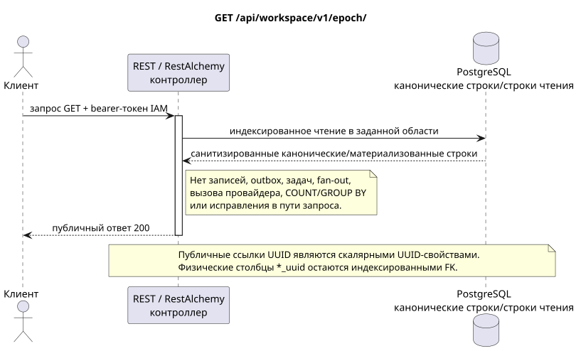

# Получение текущей эпохи событий

[← Главный индекс документации](../../../../index.md) ·
[Индекс диаграмм последовательностей](../../README.md) ·
[Раздел внешней интеграции/runtime](../README.md)

`GET /api/workspace/v1/epoch/`

Вернуть последний видимый курсор и нижнюю сохранённую границу для аутентифицированного пользователя.



[Редактируемый исходник PlantUML](diagrams/get_epoch.puml)

## Запрос

Дополнительных параметров запроса, кроме указанных выше переменных пути, нет.

Тело отсутствует. Не отправляйте выдуманный объект JSON.

## Успешный ответ

HTTP `200`:

```json
{
  "epoch_version": 124,
  "epoch_generation": "781203",
  "current_epoch_version": 124,
  "minimum_epoch_version": 37
}
```

## Ошибки

| HTTP | Публичное поведение |
| --- | --- |
| `400` | Для недопустимых значений пути, параметров запроса или тела используется стандартная ошибка валидации RESTAlchemy. |

Пример тела ошибки валидации:

```json
{
  "type": "ValidationErrorException",
  "code": 400,
  "message": "Validation error occurred."
}
```

## Граница RestAlchemy

Целевое объявление ресурса/контроллера (документация предложения, не производственный код):

```python
class WorkspaceEpoch(models.Model, orm.SQLStorableMixin):
    # Read-only, calculation-free view rooted in one physical event-cursor row.
    __tablename__ = "m_workspace_epoch_view"

    project_id = properties.property(types.UUID(), required=True)
    user_uuid = properties.property(types.UUID(), required=True)
    epoch_generation = properties.property(types.String(min_length=1), read_only=True)
    epoch_version = properties.property(types.Integer(min_value=0), read_only=True)
    current_epoch_version = properties.property(types.Integer(min_value=0), read_only=True)
    minimum_epoch_version = properties.property(types.Integer(min_value=1), read_only=True)

    @classmethod
    def get_id_property(cls) -> dict[str, typing.Any]:
        return {
            "project_id": cls.properties.properties["project_id"],
            "user_uuid": cls.properties.properties["user_uuid"],
        }


class WorkspaceEpochController(controllers.BaseResourceController):
    __resource__ = resources.ResourceByRAModel(
        WorkspaceEpoch,
        hidden_fields=["project_id", "user_uuid"],
    )

    def filter(self, filters, order_by=None):
        del filters, order_by
        return WorkspaceEpoch.objects.get_one(
            filters={
                "project_id": dm_filters.EQ(self.get_context().project_id),
                "user_uuid": dm_filters.EQ(self.get_context().user_uuid),
            }
        )
```

Представление отображает одну индексированную физическую строку курсора событий в одну строку публичного ответа и задаёт алиас `epoch_version <- current_epoch_version`; оно не выполняет агрегирование записей событий. Скрытая составная идентичность `(project_id, user_uuid)` является технической идентичностью строки RestAlchemy, а не публичным JSON. Оба физических столбца UUID — индексированные внешние ключи с `ON DELETE CASCADE`. Публичные объявления RestAlchemy не используют `relationships.relationship` для JSON в форме UUID, потому что отношение (relationship) сериализуется как URI.

## Синхронная транзакция

1. Аутентифицировать запрос и определить область проекта/пользователя IAM.
2. Проверить путь, параметры запроса и необходимое разрешение.
3. Выполнить одно индексированное чтение с сохранением области из канонической строки или заранее материализованной поверхности чтения.
4. Сериализовать только санитизированные публичные поля.

Транзакция чтения не записывает доменную запись outbox, типизированную задачу проекции, команду желаемого состояния или готовое публичное событие. Во время запроса она не выполняет `COUNT`, `GROUP BY`, коррелированный подзапрос, fan-out привязок, вызов провайдера или исправление кеша.

## Фоновая обработка, события и согласованность

Типизированные задачи проекции: отсутствуют.

Для этой операции не создаётся готовое публичное событие Workspace, поэтому отдельному диспетчеру WebSocket нечего доставлять.

Согласованность, видимая клиенту: дополнительной задержки нет; ответ является авторитетным зафиксированным снимком.

## Идемпотентность и параллелизм

`epoch_version` монотонна внутри `epoch_generation`; `(epoch_generation, epoch_version)` является идентичностью воспроизведения/курсора.

Повторы используют устойчивые бизнес-ключи и текущее исходное состояние. Каждое immutable outbox event создаёт отдельную task с уникальным `outbox_event_uuid`; повторная доставка этой task должна быть идемпотентной, coalescing отсутствует. Монопольная обработка темы Messenger от новых записей к старым применяется только тогда, когда затронутое каноническое размещение действительно относится к `(project_id, topic_uuid)`; операции администрирования/чтения провайдера не создают искусственную тему и не входят в эту очередь.

## Источники

- [`workspace_api.md`](../../../../workspace_api.md) — авторитетные публичные маршруты, общий JSON, пагинация, события и контракт WebSocket.
- [`zulip_bridge_v1_product_and_api.md`](../../../../zulip_bridge_v1_product_and_api.md) — санитизированный жизненный цикл внешних ресурсов, разрешения и семантика провайдера.

[← Главный индекс документации](../../../../index.md) ·
[Индекс диаграмм последовательностей](../../README.md) ·
[Раздел внешней интеграции/runtime](../README.md)
