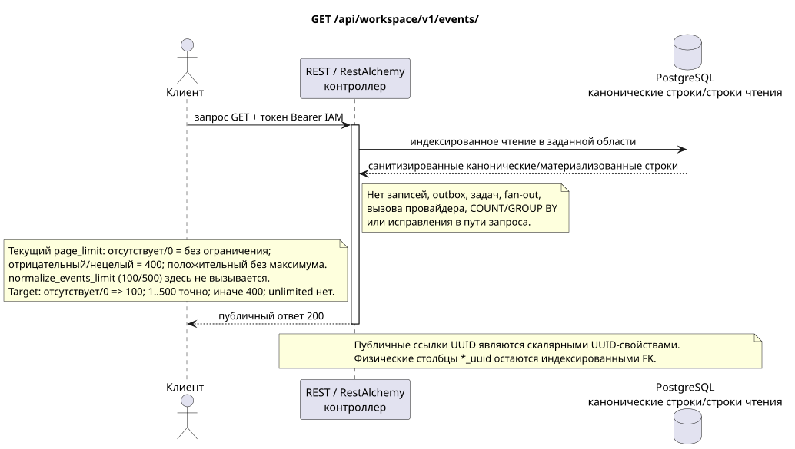

# Список устойчивых событий Workspace

[← Главный индекс документации](../../../../index.md) ·
[Индекс диаграмм последовательностей](../../README.md) ·
[Раздел внешней интеграции и времени исполнения](../README.md)

`GET /api/workspace/v1/events/`

Вернуть видимый текущему пользователю устойчивый суффикс событий в возрастающем порядке эпохи.



[Редактируемый исходник PlantUML](diagrams/get_events.puml)

## Запрос

Контракт параметров запроса:

- `epoch_version>` (кодируется в URL как `epoch_version%3E`) с целочисленным курсором
- `epoch_generation` в паре с каждым ненулевым курсором
- целочисленный `page_limit`; `page_marker` — целочисленная версия эпохи
- Другие документированные типизированные фильтры событий и AIP-160 `q`

Поведение `page_limit` в текущей реализации: отсутствие параметра или `0` означает
неограниченную выборку; отрицательное или нецелое значение даёт HTTP `400`;
любое положительное значение применяется без максимума и без ограничения
сверху. В кодовой базе существует вспомогательная функция
`normalize_events_limit` со значением по умолчанию `100` и максимумом `500`, но
контроллер этой HTTP-операции её не вызывает, поэтому эти числа не являются
фактическими ограничениями конечной точки. Target policy: отсутствие/`0` => `100`; `1..500` принимается точно; отрицательное, нецелое и `>500` => HTTP `400` без clamp. Unbounded mode отсутствует; клиент полного экспорта идёт до отсутствия следующего marker.

Тело отсутствует. Не отправляйте выдуманный объект JSON.

## Успешный ответ

HTTP `200`:

```json
[
  {
    "schema_version": 1,
    "uuid": "5bb95582-b4f3-4de1-bf84-f0244910fc82",
    "epoch_version": 124,
    "project_id": "00000000-0000-4000-8000-000000000001",
    "user_uuid": "3f433fee-b27f-4c67-98bd-31fe4df42cc8",
    "object_type": "external_account",
    "action": "updated",
    "created_at": "2026-07-17T12:12:00Z",
    "updated_at": "2026-07-17T12:12:00Z",
    "payload": {
      "kind": "external_account.updated",
      "uuid": "0d4ae1d0-30ad-4d15-bf26-5789e8406201",
      "snapshot": {
        "uuid": "0d4ae1d0-30ad-4d15-bf26-5789e8406201",
        "settings": {
          "kind": "zulip",
          "server_url": "https://zulip.example.invalid",
          "email": "owner@example.invalid",
          "selection_mode": "explicit",
          "history_depth": "30_days",
          "default_project_id": "00000000-0000-4000-8000-000000000001"
        },
        "credential_present": true,
        "status": "live",
        "live_ready": true,
        "safe_error": null,
        "capabilities": {},
        "desired_generation": 7,
        "applied_generation": 7,
        "last_progress_at": "2026-07-17T12:00:00Z",
        "created_at": "2026-07-17T11:00:00Z",
        "updated_at": "2026-07-17T12:00:00Z",
        "revision": 7
      }
    }
  }
]
```

## Ошибки

| HTTP | Публичное поведение |
| --- | --- |
| `410` | `EventsCursorExpiredError` с `Cache-Control: no-store` при отсутствующем/изменившемся поколении, будущем курсоре или удалённом суффиксе. |
| `400` | Для недопустимых значений пути, параметров запроса или тела используется стандартная ошибка валидации RESTAlchemy. |

Пример тела ошибки валидации:

```json
{
  "type": "ValidationErrorException",
  "code": 400,
  "message": "Validation error occurred."
}
```

Тело ответа при истечении курсора:

```json
{
  "type": "EventsCursorExpiredError",
  "code": 410,
  "error": "epoch_pruned",
  "message": "The event cursor is outside the retained suffix.",
  "reason": "epoch_pruned",
  "epoch_generation": "781203",
  "current_epoch_version": 124,
  "minimum_epoch_version": 37
}
```

## Граница RestAlchemy

Целевое объявление ресурса/контроллера (документация предложения, не производственный код):

```python
class WorkspaceEvent(models.ModelWithUUID, models.ModelWithTimestamp, orm.SQLStorableMixin):
    __tablename__ = "m_workspace_events"

    epoch_version = properties.property(types.Integer(min_value=1), required=True)
    project_id = properties.property(types.UUID(), required=True)
    user_uuid = properties.property(types.AllowNone(types.UUID()), default=None)
    object_type = properties.property(types.String(), required=True)
    action = properties.property(types.String(), required=True)
    payload = properties.property(types.Dict(), required=True)


class WorkspaceEventController(controllers.BaseResourceControllerPaginated):
    __resource__ = resources.ResourceByRAModel(WorkspaceEvent)
    # Scope by project/user or stored compact audience before indexed keyset read.
```

`uuid`, `project_id`, `user_uuid` и UUID внутри снимков полезной нагрузки являются скалярными значениями UUID. Индексированный `project_id` события и допускающий `null` `user_uuid` ссылаются на свои канонические строки области с `ON DELETE CASCADE`; UUID, скопированные в неизменяемый JSON полезной нагрузки, являются данными события, а не столбцами отношений, поэтому не сериализуются как URI и не считаются действующими внешними ключами. Публичные объявления RestAlchemy не используют `relationships.relationship` для JSON в форме UUID, потому что отношение сериализуется как URI. На границе физической схемы каждая каноническая неполиморфная связь `*_uuid` является индексированным внешним ключом с явно выбранным ссылочным действием. Санитайзеры скрывают владельца, учётные данные, сырой ID провайдера, закрытый сертификат, внутренний адрес и сырые поля протокола.

## Синхронная транзакция

1. Аутентифицировать запрос и определить область проекта/пользователя IAM.
2. Проверить путь, параметры запроса и необходимое разрешение.
3. Выполнить одно индексированное чтение с сохранением области из канонической строки или заранее материализованной поверхности чтения.
4. Сериализовать только санитизированные публичные поля.

Транзакция чтения не записывает доменную запись outbox, типизированную задачу проекции, команду желаемого состояния или готовое публичное событие. Во время запроса она не выполняет `COUNT`, `GROUP BY`, коррелированный подзапрос, fan-out привязок, вызов провайдера или исправление кеша.

## Фоновая обработка, события и согласованность

Типизированные задачи проекции: отсутствуют.

Для этой операции не создаётся готовое публичное событие Workspace, поэтому отдельному диспетчеру WebSocket нечего доставлять.

Согласованность, видимая клиенту: дополнительной задержки нет; ответ является авторитетным зафиксированным снимком.

## Идемпотентность и параллелизм

`epoch_version` монотонна внутри `epoch_generation`; `(epoch_generation, epoch_version)` является идентичностью воспроизведения/курсора.

Повторы используют устойчивые бизнес-ключи и текущее исходное состояние. Каждое immutable outbox event создаёт отдельную task с уникальным `outbox_event_uuid`; повторная доставка этой task должна быть идемпотентной, coalescing отсутствует. Монопольная обработка темы Messenger от новых записей к старым применяется только тогда, когда затронутое каноническое размещение действительно относится к `(project_id, topic_uuid)`; операции администрирования/чтения провайдера не создают искусственную тему и не входят в эту очередь.

## Источники

- [`workspace_api.md`](../../../../workspace_api.md) — авторитетные публичные маршруты, общий JSON, пагинация, события и контракт WebSocket.
- [`zulip_bridge_v1_product_and_api.md`](../../../../zulip_bridge_v1_product_and_api.md) — санитизированный жизненный цикл внешних ресурсов, разрешения и семантика провайдера.

[← Главный индекс документации](../../../../index.md) ·
[Индекс диаграмм последовательностей](../../README.md) ·
[Раздел внешней интеграции и времени исполнения](../README.md)
