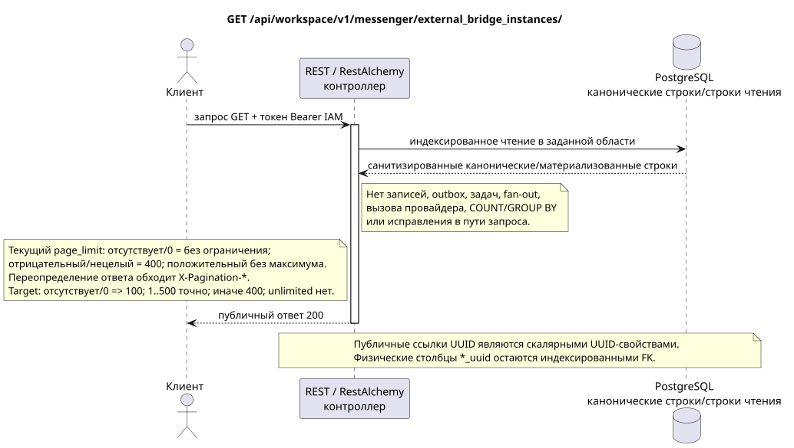

# Список экземпляров внешнего моста

[← Главный индекс документации](../../../../index.md) ·
[Индекс диаграмм последовательностей](../../README.md) ·
[Раздел внешней интеграции и времени исполнения](../README.md)

`GET /api/workspace/v1/messenger/external_bridge_instances/`

Перечислить санитизированные идентичности мостов времени исполнения для всех видов провайдеров.



[Редактируемый исходник PlantUML](diagrams/get_external_bridge_instances.puml)

## Запрос

Контракт параметров запроса:

- Документированные типизированные фильтры/AIP-160 `q`
- `page_limit`
- `page_marker` (UUID последнего экземпляра)

Поведение `page_limit` в текущей реализации: отсутствие параметра или `0` означает
неограниченную выборку; отрицательное или нецелое значение даёт HTTP `400`;
любое положительное значение применяется без максимума и без ограничения
сверху. Переопределение ответа в `ExternalResourceController` обходит
стандартные заголовки `X-Pagination-*`. Target policy: отсутствие/`0` => `100`; `1..500` принимается точно; отрицательное, нецелое и `>500` => HTTP `400` без clamp. Unbounded mode отсутствует; клиент полного экспорта идёт до отсутствия следующего marker.

Тело отсутствует. Не отправляйте выдуманный объект JSON.

## Успешный ответ

HTTP `200`:

```json
[
  {
    "uuid": "6dd6741b-0d90-490a-8e51-749a411be1ad",
    "provider": "zulip",
    "identity_generation": 3,
    "status": "active",
    "capabilities": {},
    "last_heartbeat_at": "2026-07-17T12:11:00Z",
    "certificate_not_after": "2026-10-17T12:00:00Z",
    "safe_error": null,
    "revision": 8,
    "created_at": "2026-07-01T09:00:00Z",
    "updated_at": "2026-07-17T12:11:00Z"
  }
]
```

## Ошибки

| HTTP | Публичное поведение |
| --- | --- |
| `403` | Отсутствует разрешение `workspace.external_bridge_instance.read` или ресурс находится вне авторизованной области. |
| `400` | Для недопустимых значений пути, параметров запроса или тела используется стандартная ошибка валидации RESTAlchemy. |

Пример тела ошибки валидации:

```json
{
  "type": "ValidationErrorException",
  "code": 400,
  "message": "Validation error occurred."
}
```

## Граница RestAlchemy

Целевое объявление ресурса/контроллера (документация предложения, не производственный код):

```python
class ExternalBridgeInstance(models.ModelWithUUID, models.ModelWithTimestamp, orm.SQLStorableMixin):
    __tablename__ = "m_external_bridge_instances_v2"

    provider = properties.property(types.Enum(PROVIDER_KINDS), required=True)
    identity_generation = properties.property(types.Integer(min_value=1), required=True)
    status = properties.property(types.Enum(BRIDGE_STATUSES), read_only=True)
    capabilities = properties.property(types.Dict(), read_only=True)
    revision = properties.property(types.Integer(min_value=1), read_only=True)


class ExternalBridgeInstanceController(controllers.BaseResourceControllerPaginated):
    __resource__ = resources.ResourceByRAModel(ExternalBridgeInstance)
    # Dedicated IAM permission checks wrap standard indexed reads/actions.
```

UUID ресурса является его скалярным первичным ключом; вид провайдера — строковый ключ пути/домена. В этой публичной форме нет межсущностной ссылки UUID, требующей дополнительного внешнего ключа. Публичные объявления RestAlchemy не используют `relationships.relationship` для JSON в форме UUID, потому что отношение сериализуется как URI. На границе физической схемы каждая каноническая неполиморфная связь `*_uuid` является индексированным внешним ключом с явно выбранным ссылочным действием. Санитайзеры скрывают владельца, учётные данные, сырой ID провайдера, закрытый сертификат, внутренний адрес и сырые поля протокола.

## Синхронная транзакция

1. Аутентифицировать запрос и определить область проекта/пользователя IAM.
2. Проверить путь, параметры запроса и необходимое разрешение.
3. Выполнить одно индексированное чтение с сохранением области из канонической строки или заранее материализованной поверхности чтения.
4. Сериализовать только санитизированные публичные поля.

Транзакция чтения не записывает доменную запись outbox, типизированную задачу проекции, команду желаемого состояния или готовое публичное событие. Во время запроса она не выполняет `COUNT`, `GROUP BY`, коррелированный подзапрос, fan-out привязок, вызов провайдера или исправление кеша.

## Фоновая обработка, события и согласованность

Типизированные задачи проекции: отсутствуют.

Для этой операции не создаётся готовое публичное событие Workspace, поэтому отдельному диспетчеру WebSocket нечего доставлять.

Согласованность, видимая клиенту: дополнительной задержки нет; ответ является авторитетным зафиксированным снимком.

## Идемпотентность и параллелизм

UUID моста вместе с поколением идентичности определяет активный центр сертификации. Отзыв идемпотентен и необратим для активного поколения.

Повторы используют устойчивые бизнес-ключи и текущее исходное состояние. Каждое immutable outbox event создаёт отдельную task с уникальным `outbox_event_uuid`; повторная доставка этой task должна быть идемпотентной, coalescing отсутствует. Монопольная обработка темы Messenger от новых записей к старым применяется только тогда, когда затронутое каноническое размещение действительно относится к `(project_id, topic_uuid)`; операции администрирования/чтения провайдера не создают искусственную тему и не входят в эту очередь.

## Источники

- [`workspace_api.md`](../../../../workspace_api.md) — авторитетные публичные маршруты, общий JSON, пагинация, события и контракт WebSocket.
- [`zulip_bridge_v1_product_and_api.md`](../../../../zulip_bridge_v1_product_and_api.md) — санитизированный жизненный цикл внешних ресурсов, разрешения и семантика провайдера.

[← Главный индекс документации](../../../../index.md) ·
[Индекс диаграмм последовательностей](../../README.md) ·
[Раздел внешней интеграции и времени исполнения](../README.md)
