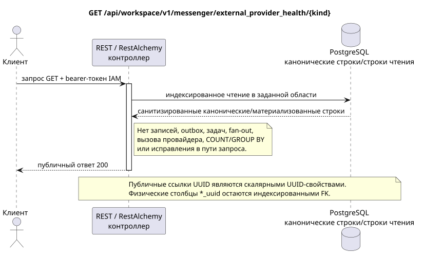

# Получение состояния здоровья внешнего провайдера

[← Главный индекс документации](../../../../index.md) ·
[Индекс диаграмм последовательностей](../../README.md) ·
[Раздел внешней интеграции/runtime](../README.md)

`GET /api/workspace/v1/messenger/external_provider_health/{kind}`

Прочитать санитизированное агрегированное состояние здоровья моста, учётных записей, чатов и операций для одного вида провайдера.



[Редактируемый исходник PlantUML](diagrams/get_external_provider_health.puml)

## Запрос

Дополнительных параметров запроса, кроме указанных выше переменных пути, нет.

Тело отсутствует. Не отправляйте выдуманный объект JSON.

## Успешный ответ

HTTP `200`:

```json
{
  "provider": "zulip",
  "status": "healthy",
  "account_counts": {
    "live": 2
  },
  "chat_counts": {
    "live": 12
  },
  "bridge_counts": {
    "active": 1
  },
  "operation_counts": {
    "queued": 1,
    "failed": 0
  },
  "metrics": {
    "queue_depth": 1,
    "selected_chats": 12,
    "synchronized_messages": 4800,
    "synchronized_users": 93
  },
  "updated_at": "2026-07-17T12:12:30Z"
}
```

## Ошибки

| HTTP | Публичное поведение |
| --- | --- |
| `403` | Отсутствует разрешение `workspace.external_provider_health.read` или ресурс находится вне авторизованной области. |
| `400` | Для недопустимых значений пути, параметров запроса или тела используется стандартная ошибка валидации RESTAlchemy. |

Пример тела ошибки валидации:

```json
{
  "type": "ValidationErrorException",
  "code": 400,
  "message": "Validation error occurred."
}
```

## Граница RestAlchemy

Целевое объявление ресурса/контроллера (документация предложения, не производственный код):

```python
class ExternalProviderHealth(models.Model, orm.SQLStorableMixin):
    # Worker-maintained physical projection; public controller is read-only.
    __tablename__ = "m_external_provider_health_state_v1"

    provider = properties.property(types.Enum(PROVIDER_KINDS), required=True)
    status = properties.property(types.String(), read_only=True)
    account_counts = properties.property(types.Dict(), read_only=True)
    chat_counts = properties.property(types.Dict(), read_only=True)
    bridge_counts = properties.property(types.Dict(), read_only=True)
    operation_counts = properties.property(types.Dict(), read_only=True)
    metrics = properties.property(types.Dict(), read_only=True)
    updated_at = properties.property(types.UTCDateTimeZ(), read_only=True)

    @classmethod
    def get_id_property(cls) -> dict[str, typing.Any]:
        return {"provider": cls.properties.properties["provider"]}


class ExternalProviderHealthController(controllers.BaseResourceController):
    __resource__ = resources.ResourceByRAModel(ExternalProviderHealth)
    # GET by provider kind reads one pre-materialized row; writes are worker-only.
```

Физическая проекция содержит по одной строке на вид провайдера, а `provider` одновременно является её уникальной технической идентичностью и публичным ключом пути. Фоновый воркер идемпотентно заменяет эту строку из зафиксированного исходного состояния. Публичный контроллер никогда не агрегирует учётные записи, чаты, мосты, операции, сообщения или пользователей во время запроса. Карты счётчиков/метрик не содержат отношений ресурсов или внешних ссылок UUID. Публичные объявления RestAlchemy не используют `relationships.relationship` для JSON в форме UUID, потому что отношение (relationship) сериализуется как URI. Санитайзеры скрывают владельца, учётные данные, сырой ID провайдера, закрытый сертификат, внутренний адрес и сырые поля протокола.

## Синхронная транзакция

1. Аутентифицировать запрос и определить область проекта/пользователя IAM.
2. Проверить путь, параметры запроса и необходимое разрешение.
3. Выполнить одно индексированное чтение с сохранением области из канонической строки или заранее материализованной поверхности чтения.
4. Сериализовать только санитизированные публичные поля.

Транзакция чтения не записывает доменную запись outbox, типизированную задачу проекции, команду желаемого состояния или готовое публичное событие. Во время запроса она не выполняет `COUNT`, `GROUP BY`, коррелированный подзапрос, fan-out привязок, вызов провайдера или исправление кеша.

## Фоновая обработка, события и согласованность

Типизированные задачи проекции: отсутствуют.

Для этой операции не создаётся готовое публичное событие Workspace, поэтому отдельному диспетчеру WebSocket нечего доставлять.

Согласованность, видимая клиенту: ответ читает последнюю заранее материализованную проекцию здоровья и намеренно согласуется в конечном счёте с heartbeat и очередями.

## Идемпотентность и параллелизм

Для каждого вида провайдера существует одна материализованная проекция. Обновления идемпотентно заменяют последний агрегированный снимок.

Повторы используют устойчивые бизнес-ключи и текущее исходное состояние. Каждое immutable outbox event создаёт отдельную task с уникальным `outbox_event_uuid`; повторная доставка этой task должна быть идемпотентной, coalescing отсутствует. Монопольная обработка темы Messenger от новых записей к старым применяется только тогда, когда затронутое каноническое размещение действительно относится к `(project_id, topic_uuid)`; операции администрирования/чтения провайдера не создают искусственную тему и не входят в эту очередь.

## Источники

- [`workspace_api.md`](../../../../workspace_api.md) — авторитетные публичные маршруты, общий JSON, пагинация, события и контракт WebSocket.
- [`zulip_bridge_v1_product_and_api.md`](../../../../zulip_bridge_v1_product_and_api.md) — санитизированный жизненный цикл внешних ресурсов, разрешения и семантика провайдера.

[← Главный индекс документации](../../../../index.md) ·
[Индекс диаграмм последовательностей](../../README.md) ·
[Раздел внешней интеграции/runtime](../README.md)
