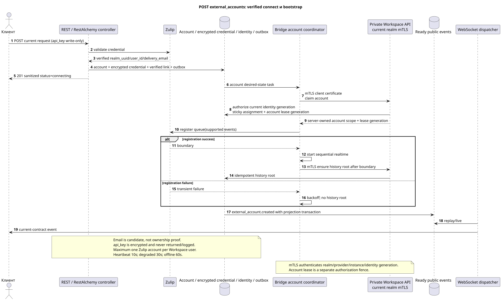

# Создание внешней учётной записи

[← Главный индекс документации](../../../../index.md) ·
[Индекс диаграмм последовательностей](../../README.md) ·
[Раздел внешней интеграции/runtime](../README.md)

`POST /api/workspace/v1/messenger/external_accounts/`

Создать и проверить одну нейтральную к провайдеру учётную запись с созданным клиентом UUID и доступными только для записи учётными данными.



[Редактируемый исходник PlantUML](diagrams/post_external_accounts.puml)

## Запрос

Дополнительных параметров запроса, кроме указанных выше переменных пути, нет.

```json
{
  "uuid": "0d4ae1d0-30ad-4d15-bf26-5789e8406201",
  "settings": {
    "kind": "zulip",
    "server_url": "https://zulip.example.invalid",
    "email": "owner@example.invalid",
    "api_key": "write-only",
    "selection_mode": "explicit",
    "history_depth": "30_days",
    "default_project_id": "00000000-0000-4000-8000-000000000001"
  }
}
```

## Успешный ответ

HTTP `201`:

```json
{
  "uuid": "0d4ae1d0-30ad-4d15-bf26-5789e8406201",
  "settings": {
    "kind": "zulip",
    "server_url": "https://zulip.example.invalid",
    "email": "owner@example.invalid",
    "selection_mode": "explicit",
    "history_depth": "30_days",
    "default_project_id": "00000000-0000-4000-8000-000000000001"
  },
  "credential_present": true,
  "status": "connecting",
  "live_ready": false,
  "safe_error": null,
  "capabilities": {},
  "desired_generation": 1,
  "applied_generation": 0,
  "last_progress_at": null,
  "created_at": "2026-07-17T11:00:00Z",
  "updated_at": "2026-07-17T11:00:00Z",
  "revision": 1
}
```

Ответы ресурсов с ревизией содержат строгий `ETag: "<revision>"`.

## Ошибки

| HTTP | Публичное поведение |
| --- | --- |
| `403` | Отсутствует разрешение `workspace.external_account.create` или ресурс находится вне авторизованной области. |
| `409` | `ExternalAccountConflictError`: у владельца уже есть учётная запись этого вида провайдера. |
| `400` | Для недопустимых значений пути, параметров запроса или тела используется стандартная ошибка валидации RESTAlchemy. |

Пример тела ошибки валидации:

```json
{
  "type": "ValidationErrorException",
  "code": 400,
  "message": "Validation error occurred."
}
```

## Граница RestAlchemy

Целевое объявление ресурса/контроллера (документация предложения, не производственный код):

```python
class ExternalAccount(models.ModelWithUUID, models.ModelWithTimestamp, orm.SQLStorableMixin):
    __tablename__ = "m_external_accounts_v2"

    owner_user_uuid = properties.property(types.UUID(), required=True)
    settings = properties.property(EXTERNAL_ACCOUNT_SETTINGS_TYPE, required=True)
    status = properties.property(types.Enum(ACCOUNT_STATUSES), read_only=True)
    capabilities = properties.property(types.Dict(), read_only=True)
    revision = properties.property(types.Integer(min_value=1), read_only=True)


class ExternalAccountController(controllers.BaseResourceControllerPaginated):
    __resource__ = resources.ResourceByRAModel(
        ExternalAccount, hidden_fields=["owner_user_uuid"]
    )
```

`owner_user_uuid` скрыт; публичное `settings.default_project_id` является скалярным UUID-свойством. В целевом хранилище индексированный `owner_user_uuid` ссылается на пользователя Workspace с `ON DELETE CASCADE`, а извлечённый индексированный `default_project_uuid` — на реестр проектов с `ON DELETE RESTRICT`; при сериализации последний по-прежнему вложен в `settings`. Публичные объявления RestAlchemy не используют `relationships.relationship` для JSON в форме UUID, потому что отношение (relationship) сериализуется как URI. На границе физической схемы каждая каноническая неполиморфная связь `*_uuid` является индексированным внешним ключом с явно выбранным ссылочным действием. Санитайзеры скрывают владельца, учётные данные, сырой ID провайдера, закрытый сертификат, внутренний адрес и сырые поля протокола.

## Синхронная транзакция

1. Аутентифицировать запрос, определить область, проверить разрешение/тело и найти каноническую строку по индексированному ключу.
2. До записи валидировать Zulip credential и получить verified realm UUID,
   provider user ID и `delivery_email`; normalized email остаётся candidate, не
   доказательством ownership.
3. В одной транзакции вставить account, encrypted credential envelope, atomic
   verified identity link, desired-state record и immutable outbox.
4. Вернуть ответ после commit; дальнейший queue bootstrap выполняется вне этой
   транзакции по единому алгоритму connect/reconnect.

## Фоновая обработка, события и согласованность

Типизированная `delivery_snapshot_event` обслуживает exact external-account
scope; topic task отсутствует без placement. Доставка desired state провайдеру
выполняется отдельной устойчивой очередью control plane.

Фоновый handler в одной DB transaction фиксирует материализованное состояние и готовый конверт полного снимка `external_account.created`; оба эффекта commit либо rollback вместе. После commit отдельный диспетчер WebSocket отправляет, повторяет и воспроизводит его; API/воркер не владеет соединениями клиентов.

Согласованность, видимая клиенту: строка учётной записи немедленно фиксируется со статусом `connecting`; проверка моста, обнаружение, применённое поколение, готовность к live-работе и возможности сходятся асинхронно.

После commit Workspace sticky scheduler назначает healthy compatible Bridge с
минимальной normalized load; instance получает whole-account lease, регистрирует
новую Zulip queue только для supported events, запускает sequential realtime и
затем создаёт history root task. History не стартует без registration boundary.
Все Bridge→Workspace вызовы используют действующий private
`workspace-external-bridge-api` с realm-bound mTLS certificate; certificate
identity и current instance generation проверяются до отдельной account
assignment/lease authorization. Enrollment secret или Zulip `api_key` не
используются как постоянный S2S credential.
Подробности: [`zulip_bridge/account_lifecycle_and_identity.md`](../../../../zulip_bridge/account_lifecycle_and_identity.md).

## Идемпотентность и параллелизм

UUID учётной записи создаётся клиентом при создании; бизнес-уникальность допускает одну учётную запись `(owner_user_uuid, provider_kind)`. Шифротекст учётных данных хранится отдельно и никогда не сериализуется.

Повторы используют устойчивые бизнес-ключи и текущее исходное состояние. Каждое immutable outbox event создаёт отдельную task с уникальным `outbox_event_uuid`; повторная доставка этой task должна быть идемпотентной, coalescing отсутствует. Монопольная обработка темы Messenger от новых записей к старым применяется только тогда, когда затронутое каноническое размещение действительно относится к `(project_id, topic_uuid)`; операции администрирования/чтения провайдера не создают искусственную тему и не входят в эту очередь.

## Источники

- [`workspace_api.md`](../../../../workspace_api.md) — авторитетные публичные маршруты, общий JSON, пагинация, события и контракт WebSocket.
- [`zulip_bridge_v1_product_and_api.md`](../../../../zulip_bridge_v1_product_and_api.md) — санитизированный жизненный цикл внешних ресурсов, разрешения и семантика провайдера.

[← Главный индекс документации](../../../../index.md) ·
[Индекс диаграмм последовательностей](../../README.md) ·
[Раздел внешней интеграции/runtime](../README.md)
