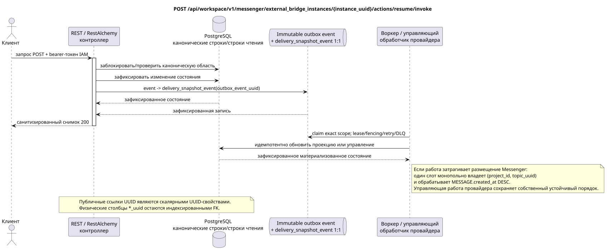

# Возобновление работы экземпляра внешнего моста

[← Главный индекс документации](../../../../index.md) ·
[Индекс диаграмм последовательностей](../../README.md) ·
[Раздел внешней интеграции/runtime](../README.md)

`POST /api/workspace/v1/messenger/external_bridge_instances/{instance_uuid}/actions/resume/invoke`

Возобновить работу приостановленной, но не отозванной идентичности.



[Редактируемый исходник PlantUML](diagrams/post_external_bridge_instance_resume.puml)

> Примечание о контракте: сейчас генерируемый OpenAPI ошибочно обозначает ответ этого действия как `ExternalOperation_Get`. Поведение runtime-контроллера и сопутствующий публичный контракт возвращают обновлённый ресурс этого семейства конечных точек. Эта документация сохраняет публичную runtime-границу; исправление генерируемого OpenAPI выходит за рамки этой задачи только по документации (docs-only).

## Запрос

Дополнительных параметров запроса, кроме указанных выше переменных пути, нет.

Тело отсутствует. Не отправляйте выдуманный объект JSON.

## Успешный ответ

HTTP `200`:

```json
{
  "uuid": "6dd6741b-0d90-490a-8e51-749a411be1ad",
  "provider": "zulip",
  "identity_generation": 3,
  "status": "active",
  "capabilities": {},
  "last_heartbeat_at": "2026-07-17T12:11:00Z",
  "certificate_not_after": "2026-10-17T12:00:00Z",
  "safe_error": null,
  "revision": 9,
  "created_at": "2026-07-01T09:00:00Z",
  "updated_at": "2026-07-17T12:11:00Z"
}
```

## Ошибки

| HTTP | Публичное поведение |
| --- | --- |
| `403` | Отсутствует разрешение `workspace.external_bridge_instance.resume` или ресурс находится вне авторизованной области. |
| `404` | Ресурс в заданной области не существует или не виден. |
| `403` | Отсутствует специальное разрешение или переход запрещён (например, возобновление/приостановка после отзыва). |
| `400` | Для недопустимых значений пути, параметров запроса или тела используется стандартная ошибка валидации RESTAlchemy. |

Пример тела ошибки валидации:

```json
{
  "type": "ValidationErrorException",
  "code": 400,
  "message": "Validation error occurred."
}
```

## Граница RestAlchemy

Целевое объявление ресурса/контроллера (документация предложения, не производственный код):

```python
class ExternalBridgeInstance(models.ModelWithUUID, models.ModelWithTimestamp, orm.SQLStorableMixin):
    __tablename__ = "m_external_bridge_instances_v2"

    provider = properties.property(types.Enum(PROVIDER_KINDS), required=True)
    identity_generation = properties.property(types.Integer(min_value=1), required=True)
    status = properties.property(types.Enum(BRIDGE_STATUSES), read_only=True)
    capabilities = properties.property(types.Dict(), read_only=True)
    revision = properties.property(types.Integer(min_value=1), read_only=True)


class ExternalBridgeInstanceController(controllers.BaseResourceControllerPaginated):
    __resource__ = resources.ResourceByRAModel(ExternalBridgeInstance)
    # Dedicated IAM permission checks wrap standard indexed reads/actions.
```

UUID ресурса является его скалярным первичным ключом; вид провайдера — строковый ключ пути/домена. В этой публичной форме нет межсущностной ссылки UUID, требующей дополнительного внешнего ключа. Публичные объявления RestAlchemy не используют `relationships.relationship` для JSON в форме UUID, потому что отношение (relationship) сериализуется как URI. На границе физической схемы каждая каноническая неполиморфная связь `*_uuid` является индексированным внешним ключом с явно выбранным ссылочным действием. Санитайзеры скрывают владельца, учётные данные, сырой ID провайдера, закрытый сертификат, внутренний адрес и сырые поля протокола.

## Синхронная транзакция

1. Аутентифицировать запрос, определить область, проверить разрешение/тело и найти каноническую строку по индексированному ключу.
2. Заблокировать экземпляр моста; применить переход состояния `resume` и правило ревизии/поколения; записать неизменяемую запись доменного outbox; зафиксировать транзакцию.
3. Вернуть ответ только после фиксации транзакции; сетевая доставка никогда не выполняется внутри неё.

## Фоновая обработка, события и согласованность

Типизированная `delivery_snapshot_event` обслуживает exact bridge-instance
scope; topic task не создаётся без placement. Приватные управляющие соединения
перед каждым запросом снова проверяют зафиксированное состояние идентичности.

Для этой операции не создаётся готовое публичное событие Workspace, поэтому отдельному диспетчеру WebSocket нечего доставлять.

Согласованность, видимая клиенту: административное состояние действует после фиксации. Состояние здоровья/возможности, полученные из heartbeat, могут обновиться позже; публичный вид события экземпляра моста не зарегистрирован.

## Идемпотентность и параллелизм

UUID моста вместе с поколением идентичности определяет активный центр сертификации. Отзыв идемпотентен и необратим для активного поколения.

Повторы используют устойчивые бизнес-ключи и текущее исходное состояние. Каждое immutable outbox event создаёт отдельную task с уникальным `outbox_event_uuid`; повторная доставка этой task должна быть идемпотентной, coalescing отсутствует. Монопольная обработка темы Messenger от новых записей к старым применяется только тогда, когда затронутое каноническое размещение действительно относится к `(project_id, topic_uuid)`; операции администрирования/чтения провайдера не создают искусственную тему и не входят в эту очередь.

## Источники

- [`workspace_api.md`](../../../../workspace_api.md) — авторитетные публичные маршруты, общий JSON, пагинация, события и контракт WebSocket.
- [`zulip_bridge_v1_product_and_api.md`](../../../../zulip_bridge_v1_product_and_api.md) — санитизированный жизненный цикл внешних ресурсов, разрешения и семантика провайдера.

[← Главный индекс документации](../../../../index.md) ·
[Индекс диаграмм последовательностей](../../README.md) ·
[Раздел внешней интеграции/runtime](../README.md)
