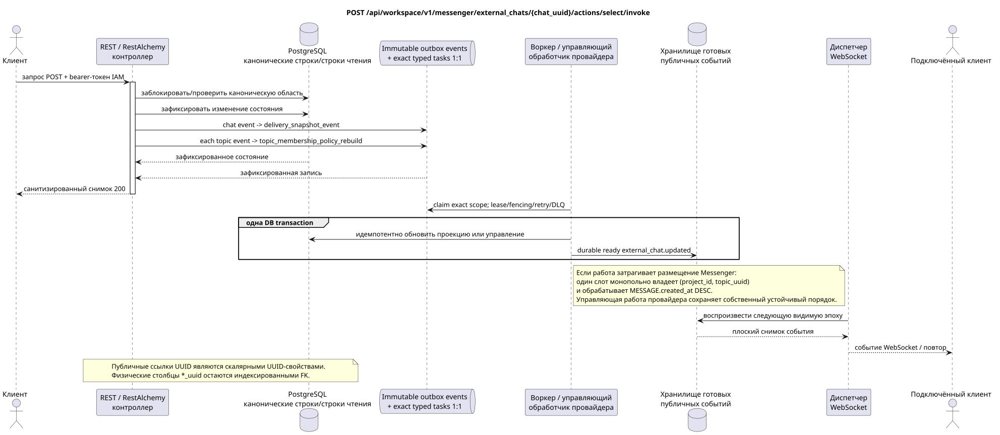

# Выбор внешнего чата

[← Главный индекс документации](../../../../index.md) ·
[Индекс диаграмм последовательностей](../../README.md) ·
[Раздел внешней интеграции/runtime](../README.md)

`POST /api/workspace/v1/messenger/external_chats/{chat_uuid}/actions/select/invoke`

Выбрать чат и назначить его проекцию одному проекту.



[Редактируемый исходник PlantUML](diagrams/post_external_chat_select.puml)

## Запрос

Дополнительных параметров запроса, кроме указанных выше переменных пути, нет.

```json
{
  "project_id": "00000000-0000-4000-8000-000000000001"
}
```

## Успешный ответ

HTTP `200`:

```json
{
  "uuid": "26f4907e-d181-4b7b-bdac-cc9685d37c40",
  "external_account_uuid": "0d4ae1d0-30ad-4d15-bf26-5789e8406201",
  "source": {
    "kind": "zulip",
    "chat_type": "channel",
    "original_url": "https://zulip.example.invalid/#narrow/channel/42"
  },
  "display_name": "Engineering",
  "selected": true,
  "project_id": "00000000-0000-4000-8000-000000000001",
  "history_depth": "30_days",
  "projection_stream_uuid": "8ce8c018-4c4f-4f48-9bb7-9d95ce6d5d91",
  "status": "syncing",
  "capabilities": {},
  "safe_error": null,
  "transition_pending": false,
  "revision": 4,
  "created_at": "2026-07-17T11:05:00Z",
  "updated_at": "2026-07-17T12:05:00Z"
}
```

Ответы ресурсов с ревизией содержат строгий `ETag: "<revision>"`.

## Ошибки

| HTTP | Публичное поведение |
| --- | --- |
| `404` | Ресурс в заданной области не существует или не виден. |
| `400` | Для недопустимых значений пути, параметров запроса или тела используется стандартная ошибка валидации RESTAlchemy. |

Пример тела ошибки валидации:

```json
{
  "type": "ValidationErrorException",
  "code": 400,
  "message": "Validation error occurred."
}
```

## Граница RestAlchemy

Целевое объявление ресурса/контроллера (документация предложения, не производственный код):

```python
class ExternalChat(models.ModelWithUUID, models.ModelWithTimestamp, orm.SQLStorableMixin):
    __tablename__ = "m_external_chats_v2"

    external_account_uuid = properties.property(types.UUID(), required=True)
    source = properties.property(EXTERNAL_CHAT_SOURCE_TYPE, required=True)
    project_id = properties.property(types.AllowNone(types.UUID()), default=None)
    projection_stream_uuid = properties.property(types.AllowNone(types.UUID()), read_only=True)
    selected = properties.property(types.Boolean(), default=False)
    revision = properties.property(types.Integer(min_value=1), read_only=True)


class ExternalChatController(controllers.BaseResourceControllerPaginated):
    __resource__ = resources.ResourceByRAModel(ExternalChat)
    # Owner/account scope and narrow select/deselect/move actions only.
```

`external_account_uuid`, `project_id` и `projection_stream_uuid` являются скалярными UUID-свойствами. Для соответствующих индексированных физических столбцов используются `external_account_uuid -> external_account ON DELETE CASCADE`, `project_id -> project registry ON DELETE RESTRICT` и допускающий `null` `projection_stream_uuid -> STREAM ON DELETE SET NULL`. Публичные объявления RestAlchemy не используют `relationships.relationship` для JSON в форме UUID, потому что отношение (relationship) сериализуется как URI. На границе физической схемы каждая каноническая неполиморфная связь `*_uuid` является индексированным внешним ключом с явно выбранным ссылочным действием. Санитайзеры скрывают владельца, учётные данные, сырой ID провайдера, закрытый сертификат, внутренний адрес и сырые поля протокола.

## Синхронная транзакция

1. Аутентифицировать запрос, определить область, проверить разрешение/тело и найти каноническую строку по индексированному ключу.
2. Заблокировать назначение владельца/учётной записи/чата; проверить целевой проект и лимиты политики; сохранить выбранное назначение вместе с устойчивым желаемым состоянием и неизменяемым outbox; зафиксировать транзакцию.
3. Вернуть ответ только после фиксации транзакции; сетевая доставка никогда не выполняется внутри неё.

## Фоновая обработка, события и согласованность

Типизированные задачи: `delivery_snapshot_event` для external-chat state/event
и отдельная `topic_membership_policy_rebuild` для каждой затронутой темы;
сканирования отсутствующих привязок в request path нет.

Фоновый handler в одной DB transaction фиксирует материализованное состояние и готовый конверт полного снимка `external_chat.updated`; оба эффекта commit либо rollback вместе. После commit отдельный диспетчер WebSocket отправляет, повторяет и воспроизводит его; API/воркер не владеет соединениями клиентов.

Согласованность, видимая клиенту: возвращённый чат может иметь состояние
`syncing`/`transition_pending`. Канонические проекции потока/темы/сообщения и
пользовательские привязки становятся видимыми только после зафиксированной
материализации воркером.

## Идемпотентность и параллелизм

UUID чата стабилен; изменение назначения сериализуется в области чата/учётной записи. Поля UUID проекта/потока являются индексированными внешними ключами, а не публичными URI отношений (relationship).

Повторы используют устойчивые бизнес-ключи и текущее исходное состояние. Каждое immutable outbox event создаёт отдельную task с уникальным `outbox_event_uuid`; повторная доставка этой task должна быть идемпотентной, coalescing отсутствует. Монопольная обработка темы Messenger от новых записей к старым применяется только тогда, когда затронутое каноническое размещение действительно относится к `(project_id, topic_uuid)`; операции администрирования/чтения провайдера не создают искусственную тему и не входят в эту очередь.

## Источники

- [`workspace_api.md`](../../../../workspace_api.md) — авторитетные публичные маршруты, общий JSON, пагинация, события и контракт WebSocket.
- [`zulip_bridge_v1_product_and_api.md`](../../../../zulip_bridge_v1_product_and_api.md) — санитизированный жизненный цикл внешних ресурсов, разрешения и семантика провайдера.

[← Главный индекс документации](../../../../index.md) ·
[Индекс диаграмм последовательностей](../../README.md) ·
[Раздел внешней интеграции/runtime](../README.md)
