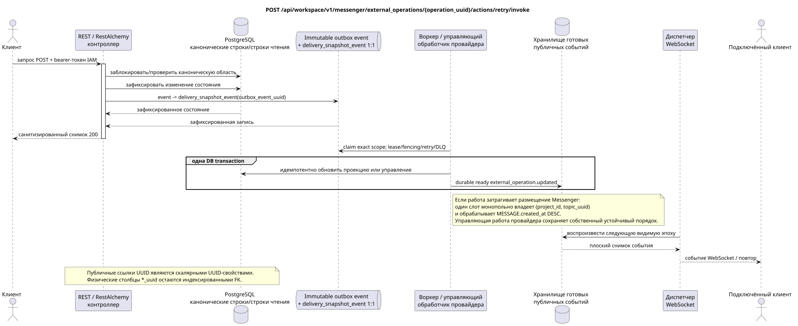

# Повтор внешней операции

[← Главный индекс документации](../../../../index.md) ·
[Индекс диаграмм последовательностей](../../README.md) ·
[Раздел внешней интеграции/runtime](../README.md)

`POST /api/workspace/v1/messenger/external_operations/{operation_uuid}/actions/retry/invoke`

Повторить допускающую это неуспешную операцию.



[Редактируемый исходник PlantUML](diagrams/post_external_operation_retry.puml)

## Запрос

Дополнительных параметров запроса, кроме указанных выше переменных пути, нет.

```json
{
  "confirm_duplicate_risk": false
}
```

## Успешный ответ

HTTP `200`:

```json
{
  "uuid": "42bd324f-45f0-4755-9a59-7b7316b2923c",
  "external_account_uuid": "0d4ae1d0-30ad-4d15-bf26-5789e8406201",
  "action": "message.create",
  "target_type": "message",
  "target_uuid": "a93dca35-3061-4748-bda4-7f6f8c660ea5",
  "details": {
    "kind": "zulip"
  },
  "attempt_history": [],
  "status": "queued",
  "attempt": 1,
  "safe_error": null,
  "can_retry": false,
  "can_discard": true,
  "duplicate_risk": false,
  "retry_requires_confirmation": false,
  "original_url": null,
  "reconciliation_state": "not_required",
  "reconciliation_reason": null,
  "reconciliation_evidence": {},
  "revision": 1,
  "created_at": "2026-07-17T12:10:00Z",
  "updated_at": "2026-07-17T12:10:00Z"
}
```

Ответы ресурсов с ревизией содержат строгий `ETag: "<revision>"`.

## Ошибки

| HTTP | Публичное поведение |
| --- | --- |
| `404` | Ресурс в заданной области не существует или не виден. |
| `400` | Повтор невозможен либо требуется, но отсутствует подтверждение. |
| `400` | Для недопустимых значений пути, параметров запроса или тела используется стандартная ошибка валидации RESTAlchemy. |

Пример тела ошибки валидации:

```json
{
  "type": "ValidationErrorException",
  "code": 400,
  "message": "Validation error occurred."
}
```

## Граница RestAlchemy

Целевое объявление ресурса/контроллера (документация предложения, не производственный код):

```python
class ExternalOperation(models.ModelWithUUID, models.ModelWithTimestamp, orm.SQLStorableMixin):
    __tablename__ = "m_external_operations_v2"

    external_account_uuid = properties.property(types.UUID(), required=True)
    target_uuid = properties.property(types.AllowNone(types.UUID()), default=None)
    action = properties.property(types.String(), required=True)
    status = properties.property(types.Enum(OPERATION_STATUSES), read_only=True)
    details = properties.property(types.Dict(), read_only=True)
    revision = properties.property(types.Integer(min_value=1), read_only=True)


class ExternalOperationController(controllers.BaseResourceControllerPaginated):
    __resource__ = resources.ResourceByRAModel(ExternalOperation)
    # Owner scope; retry, discard and preflight are narrow action overrides.
```

`external_account_uuid` и допускающий `null` `target_uuid` являются скалярными UUID-свойствами. Индексированный физический `external_account_uuid` ссылается на учётную запись с `ON DELETE CASCADE`. Поскольку `target_uuid` полиморфен для потока/темы/сообщения, в текущей форме он не может корректно быть одним внешним ключом SQL; целевое предложение должно выбрать канонический реестр целей или типизированные столбцы FK, сохранив тот же публичный JSON `target_uuid`. Публичные объявления RestAlchemy не используют `relationships.relationship` для JSON в форме UUID, потому что отношение (relationship) сериализуется как URI. На границе физической схемы каждая каноническая неполиморфная связь `*_uuid` является индексированным внешним ключом с явно выбранным ссылочным действием. Санитайзеры скрывают владельца, учётные данные, сырой ID провайдера, закрытый сертификат, внутренний адрес и сырые поля протокола.

## Синхронная транзакция

1. Аутентифицировать запрос, определить область, проверить разрешение/тело и найти каноническую строку по индексированному ключу.
2. Заблокировать операцию; проверить допустимость повтора и подтверждение риска дубликата; добавить ровно одну запись повтора/бизнес-попытку; обновить операцию; записать неизменяемый outbox обновления; зафиксировать транзакцию.
3. Вернуть ответ только после фиксации транзакции; сетевая доставка никогда не выполняется внутри неё.

## Фоновая обработка, события и согласованность

Типизированные задачи проекции: создать отдельную immutable task `delivery_snapshot_event` для source outbox event и цели, когда применимо; доставка провайдеру остаётся устойчивой работой в очереди учётной записи/чата.

Фоновый handler в одной DB transaction фиксирует материализованное состояние и готовый конверт полного снимка `external_operation.updated`; оба эффекта commit либо rollback вместе. После commit отдельный диспетчер WebSocket отправляет, повторяет и воспроизводит его; API/воркер не владеет соединениями клиентов.

Согласованность, видимая клиенту: снимок поставленного в очередь повтора доступен немедленно. Доставка, свидетельства сверки, URL провайдера и целевой снимок доставки обновляются асинхронно.

## Идемпотентность и параллелизм

UUID операции является устойчивым идентификатором идемпотентности/повтора. Увеличение номера попытки и терминальные переходы фиксируются под блокировкой строки.

Повторы используют устойчивые бизнес-ключи и текущее исходное состояние. Каждое immutable outbox event создаёт отдельную task с уникальным `outbox_event_uuid`; повторная доставка этой task должна быть идемпотентной, coalescing отсутствует. Монопольная обработка темы Messenger от новых записей к старым применяется только тогда, когда затронутое каноническое размещение действительно относится к `(project_id, topic_uuid)`; операции администрирования/чтения провайдера не создают искусственную тему и не входят в эту очередь.

## Источники

- [`workspace_api.md`](../../../../workspace_api.md) — авторитетные публичные маршруты, общий JSON, пагинация, события и контракт WebSocket.
- [`zulip_bridge_v1_product_and_api.md`](../../../../zulip_bridge_v1_product_and_api.md) — санитизированный жизненный цикл внешних ресурсов, разрешения и семантика провайдера.

[← Главный индекс документации](../../../../index.md) ·
[Индекс диаграмм последовательностей](../../README.md) ·
[Раздел внешней интеграции/runtime](../README.md)
