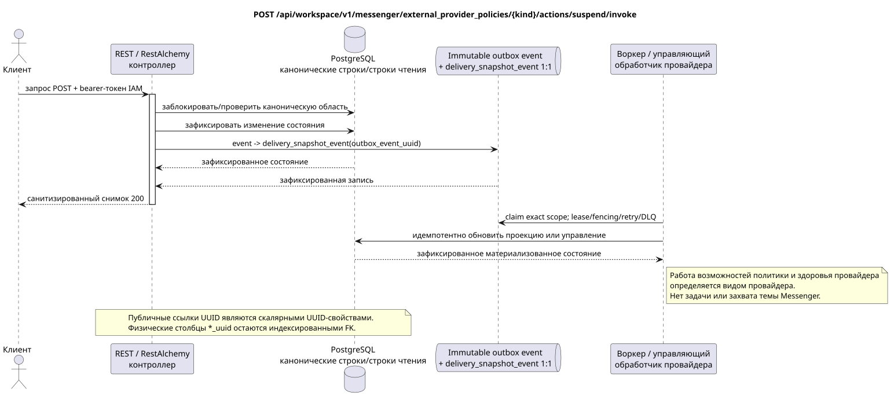

# Приостановка политики внешнего провайдера

[← Главный индекс документации](../../../../index.md) ·
[Индекс диаграмм последовательностей](../../README.md) ·
[Раздел внешней интеграции/runtime](../README.md)

`POST /api/workspace/v1/messenger/external_provider_policies/{kind}/actions/suspend/invoke`

Приостановить вид провайдера во всём realm после проверки политики.



[Редактируемый исходник PlantUML](diagrams/post_external_provider_policy_suspend.puml)

> Примечание о контракте: сейчас генерируемый OpenAPI ошибочно обозначает ответ этого действия как `ExternalOperation_Get`. Поведение runtime-контроллера и сопутствующий публичный контракт возвращают обновлённый ресурс этого семейства конечных точек. Эта документация сохраняет публичную runtime-границу; исправление генерируемого OpenAPI выходит за рамки этой задачи только по документации (docs-only).

## Запрос

Дополнительных параметров запроса, кроме указанных выше переменных пути, нет.

Тело отсутствует. Не отправляйте выдуманный объект JSON.

## Успешный ответ

HTTP `200`:

```json
{
  "uuid": "bbf5398b-7d85-5770-aaf6-827605ca1200",
  "provider": "zulip",
  "enabled": true,
  "emergency_suspended": true,
  "limits": {
    "max_accounts": 100,
    "max_selected_chats_per_account": 1000,
    "max_file_bytes": 5368709120
  },
  "custom_ca_bundle": {
    "uuid": "40a917df-3c67-43a7-b5a3-d0ea38e24666",
    "generation": 4,
    "sha256": "0123456789abcdef0123456789abcdef0123456789abcdef0123456789abcdef",
    "certificate_count": 1
  },
  "revision": 5,
  "created_at": "2026-07-01T09:00:00Z",
  "updated_at": "2026-07-17T12:12:00Z"
}
```

Ответы ресурсов с ревизией содержат строгий `ETag: "<revision>"`.

## Ошибки

| HTTP | Публичное поведение |
| --- | --- |
| `403` | Отсутствует разрешение `workspace.external_provider_policy.suspend` или ресурс находится вне авторизованной области. |
| `400` | Для недопустимых значений пути, параметров запроса или тела используется стандартная ошибка валидации RESTAlchemy. |

Пример тела ошибки валидации:

```json
{
  "type": "ValidationErrorException",
  "code": 400,
  "message": "Validation error occurred."
}
```

## Граница RestAlchemy

Целевое объявление ресурса/контроллера (документация предложения, не производственный код):

```python
class ExternalProviderPolicy(models.ModelWithUUID, models.ModelWithTimestamp, orm.SQLStorableMixin):
    __tablename__ = "m_external_provider_policies_v1"

    provider = properties.property(types.Enum(PROVIDER_KINDS), required=True)
    enabled = properties.property(types.Boolean(), required=True)
    emergency_suspended = properties.property(types.Boolean(), read_only=True)
    limits = properties.property(types.Dict(), required=True)
    custom_ca_bundle = properties.property(types.AllowNone(types.Dict()), read_only=True)
    revision = properties.property(types.Integer(min_value=1), read_only=True)

    @classmethod
    def get_id_property(cls) -> dict[str, typing.Any]:
        return {"provider": cls.properties.properties["provider"]}


class ExternalProviderPolicyController(controllers.BaseResourceController):
    __resource__ = resources.ResourceByRAModel(ExternalProviderPolicy)
    # ResourceByRAModel restores by provider kind, not by the hidden storage UUID.
```

Публичный ресурс адресуется по `kind` провайдера; UUID метаданных остаются скалярными UUID-свойствами. Если пользовательские метаданные CA физически нормализованы, индексированный допускающий `null` `custom_ca_bundle_uuid` ссылается на защищённый пакет CA с `ON DELETE SET NULL`. Публичные объявления RestAlchemy не используют `relationships.relationship` для JSON в форме UUID, потому что отношение (relationship) сериализуется как URI. На границе физической схемы каждая каноническая неполиморфная связь `*_uuid` является индексированным внешним ключом с явно выбранным ссылочным действием. Санитайзеры скрывают владельца, учётные данные, сырой ID провайдера, закрытый сертификат, внутренний адрес и сырые поля протокола.

## Синхронная транзакция

1. Аутентифицировать запрос, определить область, проверить разрешение/тело и найти каноническую строку по индексированному ключу.
2. Заблокировать политику; установить `emergency_suspended=true`; увеличить ревизию; атомарно добавить желаемое состояние и неизменяемый outbox.
3. Вернуть ответ только после фиксации транзакции; сетевая доставка никогда не выполняется внутри неё.

## Фоновая обработка, события и согласованность

Типизированные задачи проекции: отдельная immutable `delivery_snapshot_event`
политики/здоровья для каждого source outbox event и отдельная устойчивая работа
доставки желаемого состояния. Каждая имеет фактический scope провайдера и
unique `outbox_event_uuid`; coalescing отсутствует. Без placement операция не
создаёт topic task/claim.

Для этой операции не создаётся готовое публичное событие Workspace, поэтому отдельному диспетчеру WebSocket нечего доставлять.

Согласованность, видимая клиенту: флаг политики действует немедленно. Эффективные возможности, статус учётной записи/чата и здоровье сходятся асинхронно. Публичный вид события политики провайдера не зарегистрирован.

## Идемпотентность и параллелизм

Для каждого вида провайдера существует одна строка политики. Ревизия/ETag предотвращает потерю обновлений; каждая изменяющая операция выводит собственную неизменяемую задачу, а повтор одной задачи идемпотентен.

Повторы используют устойчивые бизнес-ключи и текущее исходное состояние. Каждое immutable outbox event создаёт отдельную task с уникальным `outbox_event_uuid`; повторная доставка этой task должна быть идемпотентной, coalescing отсутствует. Монопольная обработка темы Messenger от новых записей к старым применяется только тогда, когда затронутое каноническое размещение действительно относится к `(project_id, topic_uuid)`; операции администрирования/чтения провайдера не создают искусственную тему и не входят в эту очередь.

## Источники

- [`workspace_api.md`](../../../../workspace_api.md) — авторитетные публичные маршруты, общий JSON, пагинация, события и контракт WebSocket.
- [`zulip_bridge_v1_product_and_api.md`](../../../../zulip_bridge_v1_product_and_api.md) — санитизированный жизненный цикл внешних ресурсов, разрешения и семантика провайдера.

[← Главный индекс документации](../../../../index.md) ·
[Индекс диаграмм последовательностей](../../README.md) ·
[Раздел внешней интеграции/runtime](../README.md)
