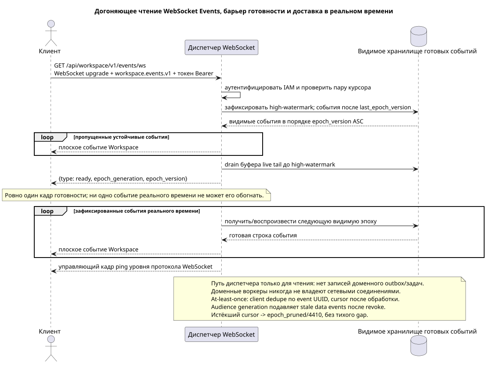

# Соединение WebSocket событий

[← Главный индекс документации](../../../../index.md) ·
[Индекс диаграмм последовательностей](../../README.md) ·
[Раздел внешней интеграции и времени исполнения](../README.md)

Точка входа: `GET /api/workspace/v1/events/ws` с WebSocket upgrade и query
`last_epoch_version=<number>&epoch_generation=<generation>`.

Открыть публичный поток реального времени, воспроизвести видимый устойчивый суффикс, получить ровно один кадр готовности, а затем принимать плоские события Workspace в реальном времени. Это документированная точка входа времени исполнения, а не HTTP-операция OpenAPI.



[Редактируемый исходник PlantUML](diagrams/websocket_events.puml)

## Установка соединения

Параметры запроса:

- `last_epoch_version`: последняя полностью обработанная целочисленная эпоха; `0` — холодный курсор.
- `epoch_generation`: обязательна с ненулевым курсором и должна совпадать с сохранённым поколением.

Значения `Sec-WebSocket-Protocol` по порядку:

```text
workspace.events.v1, bearer.<IAM access token>
```

Тело запроса JSON не отправляется. Клиент не отправляет `ack` или `pong` уровня приложения; проверка активности использует управляющие кадры ping уровня протокола WebSocket.

## Сообщения сервера

Ровно одно управляющее сообщение готовности отправляется после догоняющего чтения и до событий в реальном времени:

```json
{
  "type": "ready",
  "epoch_generation": "781203",
  "epoch_version": 124
}
```

Затем каждое сообщение события имеет точно такую же плоскую форму, как REST `/events/`:

```json
{
  "schema_version": 1,
  "uuid": "5bb95582-b4f3-4de1-bf84-f0244910fc82",
  "epoch_version": 124,
  "project_id": "00000000-0000-4000-8000-000000000001",
  "user_uuid": "3f433fee-b27f-4c67-98bd-31fe4df42cc8",
  "object_type": "external_account",
  "action": "updated",
  "created_at": "2026-07-17T12:12:00Z",
  "updated_at": "2026-07-17T12:12:00Z",
  "payload": {
    "kind": "external_account.updated",
    "uuid": "0d4ae1d0-30ad-4d15-bf26-5789e8406201",
    "snapshot": {
      "uuid": "0d4ae1d0-30ad-4d15-bf26-5789e8406201",
      "settings": {
        "kind": "zulip",
        "server_url": "https://zulip.example.invalid",
        "email": "owner@example.invalid",
        "selection_mode": "explicit",
        "history_depth": "30_days",
        "default_project_id": "00000000-0000-4000-8000-000000000001"
      },
      "credential_present": true,
      "status": "live",
      "live_ready": true,
      "safe_error": null,
      "capabilities": {},
      "desired_generation": 7,
      "applied_generation": 7,
      "last_progress_at": "2026-07-17T12:00:00Z",
      "created_at": "2026-07-17T11:00:00Z",
      "updated_at": "2026-07-17T12:00:00Z",
      "revision": 7
    }
  }
}
```

JSON-сообщений `hello`, `ping`, `pong` или `ack` уровня приложения нет.

## Ошибка курсора

При истёкшем курсоре отправляется следующая типизированная ошибка JSON, после чего соединение закрывается с кодом `4410` и причиной `epoch_pruned`:

```json
{
  "type": "EventsCursorExpiredError",
  "code": 410,
  "error": "epoch_pruned",
  "message": "The event cursor is outside the retained suffix.",
  "reason": "epoch_pruned",
  "epoch_generation": "781203",
  "current_epoch_version": 124,
  "minimum_epoch_version": 37
}
```

## Путь чтения и диспетчеризации

При установке соединения аутентифицируется область IAM, проверяется
`(epoch_generation, last_epoch_version)` и фиксируется high-watermark durable
event store. Dispatcher по возрастанию воспроизводит все видимые events после
cursor, одновременно буферизует появившийся live tail, drain-ит его и только
после этого переключается в live без gap. Строки outbox/задач/business events
он не создаёт. Worker уже атомарно сохранил projection update и ready event row
в одной DB transaction; dispatcher только читает durable store и доставляет.

## Граница RestAlchemy и идентичности

```python
class WorkspaceEvent(models.ModelWithUUID, models.ModelWithTimestamp, orm.SQLStorableMixin):
    __tablename__ = "m_workspace_events"

    epoch_version = properties.property(types.Integer(min_value=1), required=True)
    project_id = properties.property(types.UUID(), required=True)
    user_uuid = properties.property(types.AllowNone(types.UUID()), default=None)
    object_type = properties.property(types.String(), required=True)
    action = properties.property(types.String(), required=True)
    payload = properties.property(types.Dict(), required=True)


class WorkspaceEventController(controllers.BaseResourceControllerPaginated):
    __resource__ = resources.ResourceByRAModel(WorkspaceEvent)
    # Scope by project/user or stored compact audience before indexed keyset read.
```

Публичные UUID событий/сущностей являются скалярными UUID-свойствами, а не URI отношений. Индексированный `project_id` события и допускающий `null` `user_uuid` ссылаются на канонические строки области с `ON DELETE CASCADE`; UUID, скопированные в неизменяемый JSON полезной нагрузки, являются данными события, а не действующими столбцами отношений. Идентичность/воспроизведение события использует `(epoch_generation, epoch_version)`, а не только UUID сущности.

## Параллелизм, время и восстановление

Догоняющее чтение и drain live buffer завершаются до барьера готовности.
Доставка в реальном времени не может обогнать готовность. Доставка
at-least-once: клиент дедуплицирует по event UUID и продвигает cursor только
после полной обработки. Audience row несёт membership generation; dispatcher
и replay не доставляют data events при inactive membership или несовпадающем
generation после revoke. Ответ 4410/`epoch_pruned` требует очистить
производные кеши, загрузить авторитетные снимки и начать с возвращённых
поколения/нижней границы. Численное retention window остаётся operational
policy, но тихая потеря событий запрещена.

## Источники

- [`workspace_api.md`](../../../../workspace_api.md), разделы `Runtime Entry Points`, `Events And Epoch` и `WebSocket Realtime Summary`.

[← Главный индекс документации](../../../../index.md) ·
[Индекс диаграмм последовательностей](../../README.md) ·
[Раздел внешней интеграции и времени исполнения](../README.md)
