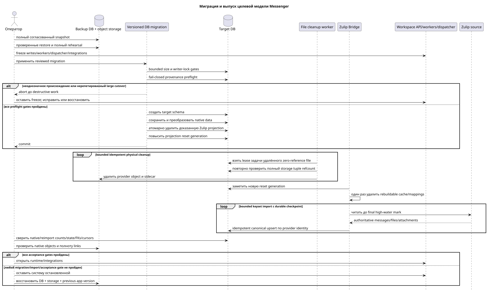

[← Главный индекс документации](../../../index.md) · [Индекс диаграмм последовательностей](../README.md) · [Раздел потоков воркера](README.md)

# Runbook миграции и выпуска целевой модели Messenger

Статус: **реализовано для Workspace Server v2; обязательная операторская процедура**.

Этот runbook закрывает Critic risk #11. Он не разрешает запуск миграции,
удаление данных или изменение production-схемы. Действующий публичный контракт
определён в [`workspace_api.md`](../../../workspace_api.md).

Редактируемый исходник:
[`migration_release_runbook.puml`](diagrams/migration_release_runbook.puml).

## Граница ответственности

| Средство | Ответственность | Запуск |
| --- | --- | --- |
| versioned DB migrations | создать target schema, перенести authoritative native data, удалить доказанную Zulip message/file projection и повысить reset generation | штатный release pipeline после backup, rehearsal, size и freeze gates |
| Messenger worker | bounded/idempotent physical cleanup только уже удалённых zero-reference Zulip file rows | автоматически после commit migration |
| Zulip Bridge | по новому reset generation удалить rebuildable local cache и автоматически выполнить fresh complete reimport | автоматически, с durable backfill checkpoint/retry |
| операторские проверки | backup/restore, freeze, pre/post counts, reconciliation и acceptance gates | `check-only` до migration и после завершения reimport |

Каждый ручной скрипт обязан иметь режимы `check-only`/`dry-run` и `apply`,
явный scope по project/range/provider/account, bounded batches, checkpoint для
restart, идемпотентное повторное выполнение, progress/audit log и итоговый
manifest. Неуспешная проверка запрещает следующий шаг.

## Подготовка и freeze

1. Снять согласованный полный backup/snapshot базы и объектного хранилища.
2. Проверить restore на отдельном экземпляре и записать исходные application
   revision, schema/migration revision и outbox/task/event/provider cursors.
3. Полностью отрепетировать процедуру на восстановленной production-like копии,
   измерить длительность и место, проверить rollback.
4. Для несовместимого преобразования закрыть API writes, worker slots,
   WebSocket dispatcher и provider integrations; дождаться завершения активных
   транзакций/задач и записать финальные high-watermarks.
5. Между финальным watermark/backup, преобразованием и повторным открытием
   writes не допускается окно, в котором producer может создать потерянные
   данные.

## Разделение данных по происхождению

### Native Workspace

Native messages и загруженные в native-chat файлы являются authoritative local
data и не удаляются/не импортируются повторно. Versioned DB migrations
детерминированно преобразуют их в целевые `MESSAGE`, `MESSAGE_PLACEMENT`,
`USER_MESSAGE_BINDING` и `USER_MESSAGE_STATE`, сохраняя содержимое и
пользовательское состояние. Native file rows, blob objects, references,
checksums и UUID сохраняются и проверяются до и после выпуска.

### Zulip: намеренный reset производной Workspace identity

Zulip-imported messages, files/attachments и их производные проекции считаются
перестраиваемыми. После проверенного backup versioned migration удаляет их в
frozen scope `provider=zulip`, повышает account/chat desired generations и
публикует `projection_reset_generation`. Bridge автоматически забывает старую
rebuildable дедупликацию и выполняет полный fresh reimport из authoritative
Zulip source. Selected account/chat configuration и identity/catalog остаются.

Это **намеренная разрушительная граница идентичности** только для Zulip-derived
Workspace data:

- старые canonical `MESSAGE.uuid`, публичные `MESSAGE_PLACEMENT.uuid`, deep
  links и иные ссылки на импортированные Zulip messages не сохраняются;
- старые Workspace-local bindings/states (`read`, `starred`, `hidden`),
  reactions и manual placements, привязанные к прежним Zulip UUID, не обязаны
  сохраняться и могут быть потеряны, если authoritative Zulip payload не умеет
  их восстановить;
- Zulip-derived file UUID, attachment/link identity и blob identity также не
  сохраняются; reimport может создать новые строки, UUID и storage objects;
- никакой external-id → old Workspace UUID mapping не создаётся и не
  восстанавливается;
- эта граница не распространяется на native messages, native state или
  native-owned files.

## Fail-closed классификация происхождения

Cleanup не принимает решение по одному nullable полю. Historical migrations не
гарантировали корректный `source_name` для каждого импортированного сообщения,
а native outbound message может получить provider/account identifiers после
echo reconciliation. Поэтому migration выполняет детерминированный preflight
под тем же writer freeze и принимает только такие комбинации:

- inbound message: согласованные `source_name` и `source.kind`, provider message
  identity из `source.message_id` или legacy `provider_external_id` (если есть
  оба значения, они должны совпадать), полная historical identity Bridge
  `UUIDv5(legacy_namespace, "zulip:<account_uuid>:message:<provider_id>")`,
  а также matching Zulip account, Zulip-owned stream или дополнительное legacy
  entity evidence;
- native outbound message: durable строка `m_external_operations_v2` с
  `action=message.create`, совпадающим `target_uuid`, локальным
  `owner_user_uuid` и тем же account, если он уже записан в message;
- legacy native/outbound message, созданный до появления этой operation queue:
  согласованная пара `source_name=native` и `source.kind=native`; provider
  identifiers, добавленные поздней echo reconciliation, не отменяют эту пару;
- external file: Zulip account, специальный external-content storage namespace
  и отсутствие ссылки из любого retained message. Любая surviving ссылка
  `urn:file|image|video:<uuid>` имеет приоритет и сохраняет row и physical object.

Любая строка с частичными или противоречивыми source или Zulip signals
останавливает migration до destructive work. Если полностью reconciled
historical echo одновременно содержит inbound fields и точную durable
`message.create` operation, operation имеет приоритет, а native/outbound row
сохраняется. Любой UUID Zulip-source row, включая произвольный UUIDv5, который
не совпадает с полной legacy identity и не имеет такой operation, считается
неоднозначным Workspace send до появления operation queue и останавливает
migration вместо reset. `m_zulip_processed_entities` никогда не является достаточным
доказательством само по себе и используется только как дополнительный сигнал
при согласованных source fields.

Provider-origin reactions удаляются по Zulip account provenance, включая
reactions на сохраняемых native/outbound messages. Native reactions остаются.
Compact read/topic state и dependent events очищаются только для доказанных
reset candidates.

DB reset выполняется как одна атомарная set-based transaction в frozen writer
scope. Unattended cutover ограничен одним миллионом legacy messages, ждёт writer
locks не более 30 секунд и имеет statement deadline 30 минут. Большая legacy DB
отклоняется до destructive work, если оператор явно не разрешил large cutover
после успешной production-sized rehearsal и проверенного backup. Целевой профиль
50 миллионов сообщений описывает steady state после fresh import, а не разрешает
нерепетированный automatic legacy conversion.

DB rows удаляются атомарно, поэтому failure возвращает полное pre-migration
состояние. Physical file objects намеренно обрабатываются после commit durable
bounded worker queue. Перед удалением shared/deduplicated object worker повторно
проверяет нулевой refcount по полному tuple
`(storage_type,storage_id,storage_object_id)` и отсутствие retained native
reference. Metadata sidecar удаляется отдельно, retry идемпотентен.

В current schema нет нормализованной таблицы message↔attachment: ссылки
`urn:file|image|video:<uuid>` находятся внутри Markdown. Migration сканирует все
surviving payloads до выбора file candidate, поэтому не создаёт dangling link и
не полагается на выдуманный FK.

## Fresh complete Zulip reimport

Fresh import назначает новый canonical `MESSAGE.uuid`; публичный placement UUID
снова вычисляется по принятому правилу
`UUIDv5(namespace=TOPIC.uuid, name=MESSAGE.uuid)`. Новый file UUID также может
быть назначен заново. Старую Workspace identity import не ищет.

Идемпотентность обязательна **внутри нового импорта**. Для сообщений target
использует физический unique provider key как минимум
`(project_id, external_account_uuid, provider_external_id)`. Current runtime
также несёт `source.message_id`, однозначно отображаемый в нормализованный
`provider_external_id`. Первый fresh import создаёт новую canonical row, а
retry/resume этого же импорта по тому же provider key повторно использует/upsert
эту новую row и не создаёт дубль.

Для файлов и attachment links используется соответствующий стабильный Zulip
file/message identity в scope account/project. Конкретное current provider file
ID должно быть подтверждено по private provider payload до реализации; если его
нет, это блокер cleanup/reimport script, а не повод дедуплицировать по имени или
checksum. Повторный batch создаёт те же новые file/attachment rows, не дублирует
blob и восстанавливает ссылки на уже импортированное новое canonical message.

Import автоматически работает bounded batches с keyset/checkpoint,
retry/backoff, progress logs и reconciliation. Provider integration остаётся frozen до фиксации
финального source cursor/high-watermark, чтобы сообщения и файлы на границе
freeze не потерялись и не задублировались.

## Rebuild и acceptance gates

После migration/reimport ручные versioned scripts перестраивают placements,
bindings/states, reaction snapshots, folder items/snapshots, unread/mention
counts и другие materialized projections. Rebuild идемпотентен и не заменяет
проверку исходных данных.

Writes остаются закрытыми до прохождения всех gates:

- native message/content/state totals и детерминированное native placement
  mapping;
- `UNIQUE(project_id, uuid)`, composite tenant FK, topic→stream/project
  integrity и membership generations;
- native file row/blob/reference counts, checksums и sizes не изменились;
- после Zulip cleanup нет pending history/provider/file-transfer producers,
  orphan rows/objects, dangling `urn:file|image|video` references или удаления
  retained native objects;
- после reimport source high-watermark/count/ranges совпадают, provider identity
  не имеет duplicates/gaps, sampled/full content reconciliation пройдена;
- Zulip file/blob/attachment totals, checksums/sizes и links полны, не имеют
  дублей или broken references;
- reactions, folders, folder item snapshots, unread counts,
  outbox/task/event/provider cursors согласованы;
- обязательные manual scripts завершены, checkpoints закрыты, DLQ/stuck work
  отсутствует либо явно принят release owner.

Control-plane scale gate содержит не менее 15 000 больших assignments. Он
должен доказать, что snapshot creation записывает normalized ordered rows без
построения in-process collection, page reads выбирают только bounded rows,
backend RSS остаётся ограниченным, а Bridge устанавливает каждый resource ровно
один раз до продвижения anchor cursor.

## Failure и rollback

Любой failure migration, cleanup, reimport или acceptance gate останавливает
процедуру. Production не ремонтируется ad hoc вместо восстановления. Оператор
возвращает проверенный pre-migration DB/storage backup и предыдущую application
version, повторно проверяет recorded cursors и только затем решает о новом
окне. Backup и manifests сохраняются до явного acceptance и установленного
retention срока.

Risk #11 считается закрытым этим runbook: native data мигрируют без потери, а
Zulip-derived message/file identity имеет явно принятую destructive reset
boundary с backup, provenance manifest, bounded cleanup, fresh reimport и
проверяемым rollback.

[← Главный индекс документации](../../../index.md) · [Индекс диаграмм последовательностей](../README.md) · [Раздел потоков воркера](README.md)
