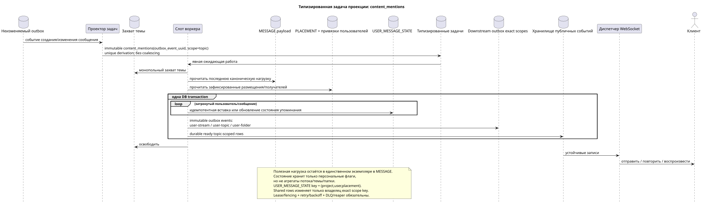

# Типизированная задача: `content_mentions`

[← Главный индекс документации](../../../index.md) · [Индекс диаграмм последовательностей](../README.md) · [Раздел потоков воркера](README.md)

Статус: **предлагаемый фоновый поток; не конечная точка HTTP**.

Редактируемый исходник:
[`task_content_mentions.puml`](diagrams/task_content_mentions.puml).

## Назначение и источник истины

Задача актуализирует материализованное состояние содержимого и упоминаний после
создания/изменения канонического сообщения и после появления привязок
получателей. Источник истины — последнее состояние `MESSAGE.payload`, явное
`MESSAGE_PLACEMENT`, готовый доступ получателей и канонические идентификаторы
пользователей. Публичная полезная нагрузка остаётся частью единственной
`MESSAGE`; персональный флаг упоминания хранится в уникальной записи
`USER_MESSAGE_STATE (project,user,placement)`.

## Поток

1. Изменяющая состояние транзакция API записывает каноническое изменение и
   неизменяемое событие outbox; `GET` и списочные операции задач не создают.
2. Проектор выводит отдельную immutable `content_mentions` task для каждого
   source outbox event; `outbox_event_uuid` уникально связывает событие и задачу.
3. Монопольный слот темы выбирает работу по `MESSAGE.created_at DESC`.
4. Воркер читает последнюю полезную нагрузку и зафиксированные привязки
   получателей.
5. Воркер идемпотентно создаёт или обновляет только персональные флаги/состояния
   упоминаний и все соответствующие durable ready `message.updated` rows в
   одной DB transaction; он не копирует полезную нагрузку и не меняет публичный
   UUID или временные метки сообщения.
6. Если изменилась классификация упоминаний/непрочитанных сообщений, создаются
   отдельные задачи точной области: `user-stream`, `user-topic` и/или
   `user-folder`. Topic-worker не изменяет эти общие строки.
7. После commit диспетчер доставляет, повторяет и воспроизводит готовые events;
   event rows контейнеров создают их exact-scope tasks атомарно со своими
   проекциями, а topic worker не записывает shared rows.

## Повторы, гонки и согласованность

- каждая задача соответствует одному событию; handler читает последнюю
  каноническую нагрузку и применяет событие идемпотентно;
- ключ состояния `(project_id,user_uuid,placement_uuid)` исключает дубликат
  состояния внутри размещения, не смешивая разные placements;
- захват темы исключает одновременную обработку порядка одной темы;
- lease expiry/fencing, retry/backoff, DLQ и reaper восстанавливают работу после
  сбоя; initial design не выполняет coalescing;
- повторная операция вставки или обновления (upsert) сходится к тому же результату из последнего источника;
- до фиксации воркером клиент может кратко видеть прежнее состояние
  упоминаний/счётчиков; ответ на изменение канонического содержимого уже
  отражает зафиксированную `MESSAGE`.

[← Главный индекс документации](../../../index.md) · [Индекс диаграмм последовательностей](../README.md) · [Раздел потоков воркера](README.md)
