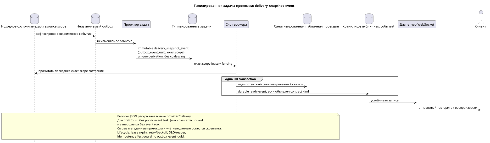

# Типизированная задача: `delivery_snapshot_event`

[← Главный индекс документации](../../../index.md) · [Индекс диаграмм последовательностей](../README.md) · [Раздел потоков воркера](README.md)

Статус: **предлагаемый фоновый поток; не конечная точка HTTP**.

Редактируемый исходник:
[`task_delivery_snapshot_event.puml`](diagrams/task_delivery_snapshot_event.puml).

## Назначение и источник истины

Задача преобразует последнее зафиксированное исходное состояние exact resource
scope в готовую санитизированную проекцию и/или устойчивое публичное событие.
Она обслуживает provider/delivery, file/user и прочие простые resource-event
flows. Для contract families без публичного события (например draft/push
registration) тот же handler фиксирует уникальный effect guard и завершает task
без создания public event row. Публичный API сохраняет текущий JSON; сырые
метаданные протокола, учётные данные и внутренние поля доставки не становятся
публичными.

## Поток

1. Доменный переход атомарно обновляет исходную строку и неизменяемое событие
   outbox.
2. Проектор выводит отдельную immutable task для source outbox event с
   уникальным `outbox_event_uuid` и явно объявленным scope ресурса; coalescing
   отсутствует.
3. Воркер читает последнее exact-scope состояние и в **одной DB transaction**
   материализует санитизированную проекцию вместе со всеми соответствующими
   durable ready public event rows; оба эффекта commit либо rollback вместе.
   Если текущий контракт не имеет public event для этого resource kind,
   транзакция сохраняет только effect guard/task completion и не изобретает
   event kind.
4. После commit отдельный диспетчер отправляет, повторяет и воспроизводит
   готовую запись; воркер не
   владеет соединением WebSocket/сетью.

## Повторы, гонки и согласованность

- ни одно промежуточное событие не пропускается: одному immutable outbox event
  соответствует одна immutable task;
- повторная материализация читает последнее состояние и является идемпотентной;
- exact scope lease/fencing, retry/backoff, max attempts/DLQ и reaper защищают
  lifecycle; reconciliation восстанавливает отсутствующую derivation;
- устаревшее завершение провайдера не должно перезаписать более новое
  авторитетное состояние; конкретный механизм сравнения/версий остаётся деталью
  реализации текущего домена провайдера;
- подтверждение изменения API и окончательная проекция доставки могут быть
  разделены интервалом согласованности в конечном счёте;
- повтор диспетчера не повторяет изменение провайдера/домена.

[← Главный индекс документации](../../../index.md) · [Индекс диаграмм последовательностей](../README.md) · [Раздел потоков воркера](README.md)
