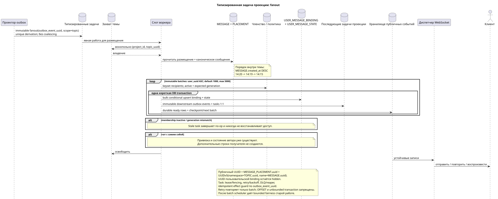

# Типизированная задача: `fanout`

[← Главный индекс документации](../../../index.md) · [Индекс диаграмм последовательностей](../README.md) · [Раздел потоков воркера](README.md)

Статус: **предлагаемый фоновый поток; не конечная точка HTTP**.

Редактируемый исходник:
[`task_fanout.puml`](diagrams/task_fanout.puml).

## Назначение и источник истины

Задача строит недостающую пару `USER_MESSAGE_BINDING` +
`USER_MESSAGE_STATE` для каждого допущенного получателя одного явного
`MESSAGE_PLACEMENT`. Размещение уже однозначно содержит канонические
`message_uuid`, `stream_uuid` и обязательный `topic_uuid`; воркер не выводит
контекст из привязок получателей. Каноническая `MESSAGE` физически одна, а
публичным UUID/параметром `{message_uuid}` является
`MESSAGE_PLACEMENT.uuid = UUIDv5(namespace=TOPIC.uuid, name=MESSAGE.uuid)`.

## Поток

1. Синхронная транзакция отправки создаёт `MESSAGE`, `MESSAGE_PLACEMENT`,
   авторские `USER_MESSAGE_BINDING` и `USER_MESSAGE_STATE`, а также
   неизменяемое событие outbox. Поэтому автор видит сообщение сразу.
2. Проектор идемпотентно выводит одну immutable `fanout` root task на одно событие
   outbox; уникальный derivation key содержит `outbox_event_uuid`, coalescing
   отсутствует.
3. Слот получает монопольный захват `(project_id,topic_uuid)`.
4. Ожидающие размещения выбираются по каноническому
   `MESSAGE.created_at DESC`: `14:20`, `14:19`, `14:15`.
5. Воркер читает последнее исходное состояние членства/политики. Задача несёт
   ожидаемый `membership_generation`; получатель допускается только при
   `USER_STREAM_BINDING.active = true` и точном совпадении generation.
6. Root создаёт immutable batches с default `1000`, maximum `5000`. Получатели
   выбираются keyset-запросом `USER_STREAM_BINDING.user_uuid ASC` без `OFFSET`;
   значение config вне `1..5000` блокирует startup.
7. Каждый короткий batch повторно проверяет membership generation и bulk
   insert/upsert создаёт `USER_MESSAGE_BINDING`, уникальную по
   `(project_id,placement_uuid,user_uuid)`, с snapshot поколения, и
   `USER_MESSAGE_STATE`, уникальное по
   `(project_id,user_uuid,placement_uuid)`. Stale task делает no-op и не может
   воскресить доступ; новое поколение членства получает свежие binding/state.
8. В той же batch transaction создаются отдельные immutable downstream outbox
   events и соответствующие им tasks 1:1: placement/topic-scoped работа
   остаётся в scope `topic`, агрегаты создаются в
   `user-stream`/`user-folder`/`user-topic`; одна задача соответствует одному
   собственному source event.
9. Binding/state, downstream outbox/tasks и ready event rows commit/rollback
   вместе. Checkpoint cursor/count/status и следующий immutable batch
   фиксируются только после успешного batch. Dispatcher лишь доставляет.

Чат с самим собой уже имеет авторские `USER_MESSAGE_BINDING` и
`USER_MESSAGE_STATE` для единственного видимого участника. После исключения
автора множество получателей пусто, поэтому fan-out успешно завершается без
новых строк получателя и без дубликата строки сообщения в UI.

## Повторы, гонки и согласованность

- задача допускает повторы: уникальные ключи привязки и состояния предотвращают
  дубликаты;
- retry повторяет только текущий batch; root+start cursor — unique derivation
  key, уже зафиксированные batches не переигрываются;
- параллельного fan-out одной темы нет благодаря монопольному захвату;
- разные темы могут обрабатываться параллельно в пределах настроенного лимита;
- воркер читает последнее исходное состояние и сверяет ожидаемое поколение;
- задача проходит `pending -> leased/running -> completed/failed`, использует
  lease expiry/fencing, retry/backoff, DLQ и reaper; `outbox_event_uuid`
  обеспечивает идемпотентный effect guard;
- topic-worker не изменяет shared stream/folder/message rows: для них создаются
  задачи фактической области;
- временные метки привязок не меняют публичные дату/порядок сообщения;
- получатель видит сообщение после атомарной фиксации binding/state/event с
  задержкой; около секунды и `<=1s p95` batch transaction — SLO intent для
  измерений, не hard guarantee;
- после каждого batch topic claim может перейти старой работе; newest-first не
  отменяет bounded fairness;
- metrics: batch latency/rows/WAL, recipients remaining, fanout lag, oldest
  batch, retries/DLQ. Unbounded recipient transaction запрещена.

[← Главный индекс документации](../../../index.md) · [Индекс диаграмм последовательностей](../README.md) · [Раздел потоков воркера](README.md)
