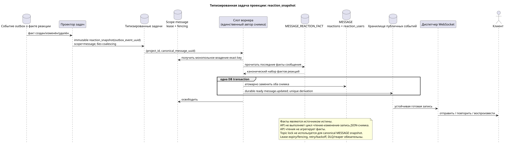

# Типизированная задача: `reaction_snapshot`

[← Главный индекс документации](../../../index.md) · [Индекс диаграмм последовательностей](../README.md) · [Раздел потоков воркера](README.md)

Статус: **предлагаемый фоновый поток; не конечная точка HTTP**.

Редактируемый исходник:
[`task_reaction_snapshot.puml`](diagrams/task_reaction_snapshot.puml).

## Назначение и источник истины

Сырые строки `WorkspaceMessageReactionFact` являются единственным источником
истины. Бизнес-ключ `(project_id,canonical_message_uuid,user_uuid,emoji_name)` запрещает
дубликат одной реакции одного участника на каноническое сообщение. Привязка
размещения нужна только для проверки доступа API; реакция не относится к
конкретному размещению.

## Поток

1. Создание/изменение/удаление реакции изменяет ровно одну принадлежащую
   пользователю строку факта и добавляет неизменяемое событие outbox в короткой
   транзакции.
2. Проектор выводит одну immutable `reaction_snapshot` task для source event;
   `outbox_event_uuid` является уникальным derivation/effect ключом.
3. Задача направляется в scope `message` с ключом
   `(project_id, canonical_message_uuid)`. Один lease/fencing token разрешает
   запись снимков только одному владельцу; topic lock не используется.
4. Воркер читает последние сырые факты и в одной DB transaction целиком
   заменяет `MESSAGE.reactions`/`MESSAGE.reaction_users` **вместе** со всеми
   соответствующими durable ready `message.updated` rows; оба эффекта commit
   либо rollback вместе.
5. После commit диспетчер доставляет, повторяет и воспроизводит готовые rows.

## Повторы, гонки и согласованность

- параллельные участники безопасно вставляют/удаляют независимые строки фактов;
- дубликат бизнес-ключа обрабатывается текущим контрактом конфликта;
- API никогда не выполняет цикл «чтение-изменение-запись» общего JSON-снимка;
- повтор задачи перестраивает тот же снимок последнего состояния;
- task lifecycle включает lease expiry, retry/backoff, DLQ и reaper; initial
  design не выполняет coalescing;
- API чтения/списка не агрегирует факты и может кратко вернуть предыдущий
  снимок;
- публичная проекция `provider`/`delivery` сохраняется, сырые
  `provider_metadata`/`delivery_metadata` не публикуются.

[← Главный индекс документации](../../../index.md) · [Индекс диаграмм последовательностей](../README.md) · [Раздел потоков воркера](README.md)
