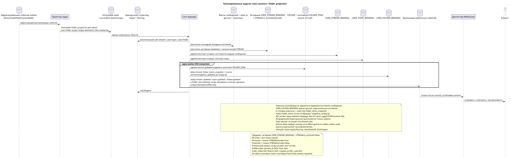

# Типизированные задачи: `read_counters` и `folder_projection`

[← Главный индекс документации](../../../index.md) · [Индекс диаграмм последовательностей](../README.md) · [Раздел потоков воркера](README.md)

Статус: **предлагаемый фоновый поток; не конечная точка HTTP**.

Редактируемый исходник:
[`task_read_counters.puml`](diagrams/task_read_counters.puml).

## Назначение и источник истины

Исходное состояние отдельного сообщения содержит сохранённое `read_at`
(публичное `read = read_at IS NOT NULL`) и персональные флаги. Агрегаты
контейнеров не дублируются в `USER_MESSAGE_BINDING`/`USER_MESSAGE_STATE`.
Готовые счётчики хранятся в уникальных `USER_STREAM_BINDING
(project,user,stream)`, `USER_TOPIC_BINDING (project,user,topic)` и
`USER_FOLDER_BINDING (project,user,folder)`.

Каноническая `FOLDER` хранится один раз; `FOLDER_ITEM` связывает её с
каноническим поддерживаемым объектом, например со `STREAM`, согласно текущему
контракту. `USER_FOLDER_BINDING` определяет пользовательский доступ и
персональное состояние папки и содержит готовые агрегаты непрочитанных сообщений
и упоминаний.
Нормализованные `FOLDER_ITEM` — source of truth состава, а read-only
JSONB `USER_FOLDER_BINDING.folder_items_snapshot` — готовая публичная
форма. Пустой массив равен `[]`; строки сериализуются
детерминированно и с готовыми счётчиками из `USER_STREAM_BINDING`.
Точный порядок: pinned items сначала по `pinned_at DESC`, затем
остальные; внутри группы — `order_index ASC NULLS LAST`, `created_at ASC`,
`uuid ASC`. Версия/время snapshot внутренние и не подменяют публичные
временные метки. Снимок не обрезается молча; до реализации нужно выбрать
числовые hard limits count/bytes и совместимую политику для необрезаемой
системной `All chats`.
Системные привязки папок имеют фиксированные внутренние правило и тип, а их
автоматические `FOLDER_ITEM` являются перестраиваемой проекцией. Её точный
исходный предикат — активная `USER_STREAM_BINDING`, соединённая с канонической
`STREAM`, для которой `STREAM.is_archived = false`. `All chats` включает все
такие строки, `Personal` — только строки с `STREAM.private = true`, `Channels`
— только с `STREAM.private = false`.

## Триггеры и поток {#триггеры-и-поток}

Отдельная задача возникает после fan-out, чтения сообщения/темы/потока,
чтения до указанного сообщения, скрытия, перемещения размещения, удаления сообщения/размещения,
изменения членства/политики, создания/обновления/удаления `USER_STREAM_BINDING`, архивации
или изменения `STREAM.private` и других операций, меняющих эффективную
классификацию непрочитанных сообщений.

1. Исходная транзакция или предшествующий worker пишет отдельное immutable
   outbox event с новым UUID для каждой затронутой фактической области; проектор
   выводит из каждого события ровно одну task по
   `UNIQUE(project_id,outbox_event_uuid)`. Для папки exact kind —
   `folder_projection`, exact scope —
   `user-folder:(project_id,user_uuid,folder_uuid)`; coalescing отсутствует.
2. Владелец exact scope получает аренду с fencing token: `user-stream`,
   `user-topic` или `user-folder`. Topic-worker не записывает эти shared rows.
   Владелец читает последние факты, доступ и политику уведомлений своей области.
3. Воркер идемпотентно записывает готовые счётчики `raw`/`active`/`passive` и
   `last_message_uuid` в привязку пользователя к потоку, счётчики темы — в привязку
   пользователя к теме, а готовые `unread_count` и агрегаты упоминаний папки —
   в привязку пользователя к папке.
4. Для системных папок он читает актуальную активную `USER_STREAM_BINDING` и
   каноническую `STREAM`, оставляет только `STREAM.is_archived = false`, затем
   идемпотентно приводит автоматические `FOLDER_ITEM` к правилам: все оставшиеся
   строки для `All chats`, `STREAM.private = true` для `Personal` и
   `STREAM.private = false` для `Channels`.
5. В **одной worker DB transaction** владелец exact scope приводит
   automatic `FOLDER_ITEM` к source of truth, заменяет готовую проекцию и все её
   state/snapshot/version/timestamp, а также все ready
   `topic.updated`, `stream.updated`, `folder.updated` или
   `folder_item.deleted` event rows для действительно изменившихся ресурсов.
   Сбой откатывает и проекцию, и ready event rows.
6. Только после commit диспетчер отправляет, повторяет и воспроизводит
   устойчивые записи; он не создаёт business event.

Представления API для потока/темы/папки только присоединяют одну готовую
строку привязки; для папки `folder_items` уже лежит в этой строке как
готовый JSONB snapshot. Они не
выполняют `COUNT`, `GROUP BY`, оконные, lateral или коррелированные запросы и не
обходят привязки сообщений. Полный пересчёт разрешён только как явная фоновая
задача исправления/перестроения.

## Повторы, гонки и согласованность

- задача читает последние источники и детерминированно заменяет проекцию;
- уникальные пользовательские ключи контейнеров исключают конкурирующие строки
  агрегатов;
- одновременно действует один lease на exact scope key; разные области могут
  обновляться параллельно и становиться видимыми eventual-consistently;
- атомарная дельта счётчика допускается только с exactly-once effect guard по
  `outbox_event_uuid`; иначе scope worker детерминированно пересчитывает и
  заменяет строку;
- task lifecycle, lease expiry/fencing, retry/backoff, max attempts/DLQ и reaper
  соответствуют общей архитектуре; initial design не выполняет coalescing;
- повторная доставка безопасна; готовое событие появляется только после
  фиксации состояния;
- ответ на запись клиента может примерно на секунду опередить обновление
  счётчиков; это запланированная согласованность в конечном счёте.

[← Главный индекс документации](../../../index.md) · [Индекс диаграмм последовательностей](../README.md) · [Раздел потоков воркера](README.md)
