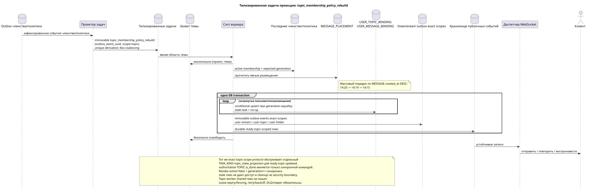

# Типизированная задача: `topic_membership_policy_rebuild`

[← Главный индекс документации](../../../index.md) · [Индекс диаграмм последовательностей](../README.md) · [Раздел потоков воркера](README.md)

Статус: **предлагаемый фоновый поток; не конечная точка HTTP**.

Редактируемый исходник:
[`task_topic_membership_policy_rebuild.puml`](diagrams/task_topic_membership_policy_rebuild.puml).

## Назначение и источник истины

Задача актуализирует видимость пользователя в теме, разрешения и затронутые готовые
проекции после изменений членства/политики. Каноническая `TOPIC` хранится один
раз; доступ, уведомления и счётчики пользователя принадлежат уникальной
`USER_TOPIC_BINDING (project,user,topic)`. Предусмотренный контекст сообщения
приходит только из явного `MESSAGE_PLACEMENT`, а не выводится из привязок.

## Поток

1. Команда членства/политики фиксирует авторитетное изменение и неизменяемое
   событие outbox.
2. Проектор выводит отдельную immutable task для source outbox event в scope
   `topic`; `outbox_event_uuid` уникален, coalescing отсутствует.
3. Один слот получает монопольное владение темой; разные темы могут
   обрабатываться параллельно до настроенного лимита.
4. Воркер читает последнее состояние членства/политики и явные размещения;
   membership-dependent task несёт ожидаемый `membership_generation`.
5. Воркер conditional-upsert создаёт/обновляет access rows и соответствующие
   durable ready topic-scoped event rows в одной DB transaction только при active
   `USER_STREAM_BINDING` и совпадении generation; stale task делает no-op.
   Revoke уже синхронно запрещён read path, а cleanup старых rows не является
   security boundary.
6. Воркер порождает отдельные tasks `user-stream`/`user-topic`/`user-folder`
   для shared rows; topic worker не изменяет их сам и не выполняет тяжёлый
   агрегат в запросе API.
7. После commit отдельный диспетчер доставляет ready topic-scoped events.
   Проекции/ready events потока, папки и других shared rows создаются их
   отдельными exact-scope tasks и тоже атомарно попарно в своих транзакциях.

## `topic_state_projection` {#topic_state_projection}

Тот же topic-owned flow документирует отдельный точный TASK_KIND
`topic_state_projection`: после синхронного commit канонического
`TOPIC.is_done`/version он в scope `(project_id,topic_uuid)` атомарно фиксирует
готовое `topic.updated` и, если оно физически нужно, rebuildable read-only copy.
Эта task не меняет authoritative `TOPIC.is_done` и имеет собственное source
outbox event/`outbox_event_uuid`.

## Повторы, порядок и согласованность

- воркер получает явную задачу; сканирование таблицы в поисках отсутствующих
  привязок не используется;
- массовое построение привязок сообщений внутри темы соблюдает
  `MESSAGE.created_at DESC` (`14:20`, `14:19`, `14:15`) и гарантирует конечный
  прогресс;
- уникальный ключ привязки пользователя к теме исключает дубликат строки доступа/состояния;
- задача читает последнюю политику и проверяет generation; повтор идемпотентен
  по `outbox_event_uuid`;
- lease expiry/fencing, retry/backoff, max attempts/DLQ и reaper обязательны;
- перестроение/исправление никогда не запускается `GET` или списочной операцией;
- пользователь может кратко видеть прежние доступ/счётчики до фиксации
  проекции; после готового события состояния REST и WebSocket согласованы.

[← Главный индекс документации](../../../index.md) · [Индекс диаграмм последовательностей](../README.md) · [Раздел потоков воркера](README.md)
