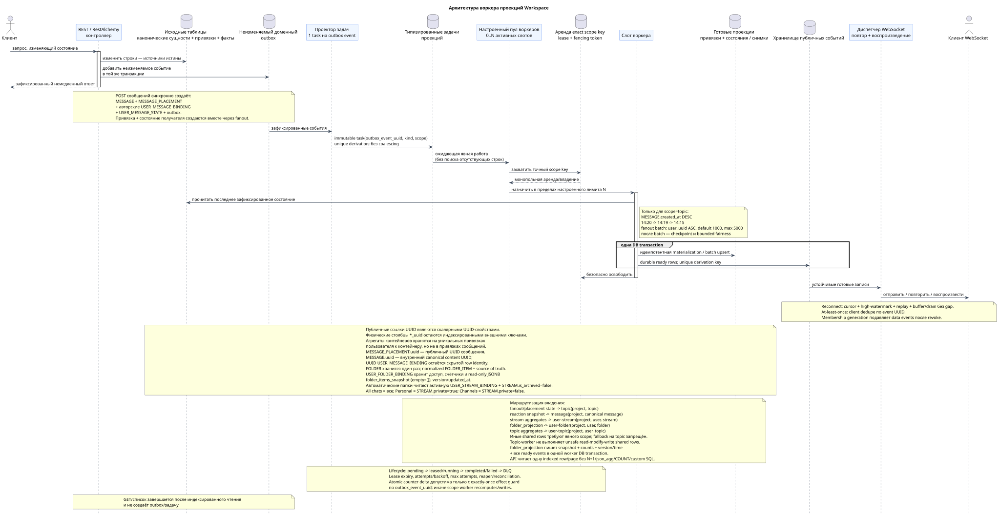

# Архитектура воркера

[← Главный индекс документации](../../../index.md) · [Индекс диаграмм последовательностей](../README.md) · [Раздел потоков воркера](README.md)

Статус: **предложение, начатое с документации; публичный API Workspace не меняется**.

Этот документ описывает общий фоновый путь, на который ссылаются спецификации
отдельных операций. Здесь не выбираются производственная реализация, параметр
конфигурации, технология очереди/аренды и SQL.

Редактируемый исходник:
[`worker_architecture.puml`](diagrams/worker_architecture.puml).

## Граница API и фоновой обработки

Каждая изменяющая состояние транзакция API атомарно изменяет строки — источники
истины — и добавляет неизменяемое доменное событие в транзакционный журнал
(transactional outbox). `GET` и списочные операции не создают события или
задачи. В начальном дизайне **нет coalescing**: каждому событию outbox
соответствует одна отдельная неизменяемая типизированная задача с уникальным
`outbox_event_uuid`/ключом derivation. Повторное выведение задачи для того же
события является идемпотентным и не создаёт дубль. Полезная нагрузка задачи не
заменяет источник истины: воркер (worker) при каждом выполнении читает последние
зафиксированные строки.

Синхронная отправка сообщения ограничена набором `MESSAGE` +
`MESSAGE_PLACEMENT` + авторская `USER_MESSAGE_BINDING` + авторский
`USER_MESSAGE_STATE` + transactional outbox. Привязка (binding) и состояние
каждого получателя создаются вместе через веерную рассылку
(fan-out) bounded batches; агрегаты контейнеров и публичные события появляются позже. Для чата
с самим собой уже существуют авторские привязка и состояние; fan-out не создаёт
дополнительных строк получателя.

## Параллелизм и порядок

- максимальное число одновременно активных слотов воркера задаётся
  конфигурацией; имя параметра и исполнительный механизм остаются открытыми;
- для topic-scoped работы единица монопольного владения —
  `(project_id, topic_uuid)`, а не поток;
- одна тема одновременно принадлежит не более чем одному слоту; разные темы
  обрабатываются параллельно в пределах `N`;
- основной порядок внутри темы — `MESSAGE.created_at DESC`: `14:20`, затем
  `14:19`, затем `14:15`;
- временные метки заданий и привязок не меняют порядок или публичные временные
  метки сообщений;
- стабильный курсор при одинаковом времени, реализация захвата и ограниченная
  справедливость остаются узкими открытыми решениями реализации;
- обработка от новых записей к старым не может бесконечно блокировать старую
  работу.

Fan-out root сканирует active `USER_STREAM_BINDING` keyset по `user_uuid ASC`,
не `OFFSET`. Default batch — `1000`, hard maximum — `5000`; конфигурация вне
`1..5000` не проходит startup validation. После каждого короткого batch commit
фиксируются cursor/count/status и только затем появляется следующий immutable
batch. Scheduler после batch даёт bounded fairness старым roots/history; одна
большая аудитория не занимает unbounded transaction.

## Владение проекциями

`TOPIC` не является универсальной блокировкой. Каждая задача содержит
`scope_kind` и точный `scope_key`; одновременно действует не более одной аренды
с fencing token для одного точного ключа. Разные ключи и разные виды областей
обрабатываются параллельно в пределах лимита пула:

| Вид задачи | Область владения | Гарантия записи |
| --- | --- | --- |
| `fanout`, placement-scoped `content_mentions`, history/backfill | `topic`: `(project_id, topic_uuid)` | последовательная работа с placements/bindings одной темы по `MESSAGE.created_at DESC` |
| `reaction_snapshot` и другие снимки канонического сообщения | `message`: `(project_id, canonical_message_uuid)` | один автор `MESSAGE.reactions`/`reaction_users` |
| агрегаты потока | `user-stream`: `(project_id, user_uuid, stream_uuid)` | один автор готовой строки `USER_STREAM_BINDING` |
| `folder_projection` | `user-folder`: `(project_id, user_uuid, folder_uuid)` | один автор normalized `FOLDER_ITEM`, `folder_items_snapshot`, готовых счётчиков и ready event |
| агрегаты темы | `user-topic`: `(project_id, user_uuid, topic_uuid)` | один автор готовой строки `USER_TOPIC_BINDING` |
| доставка и иные общие строки | явно объявленная область, соответствующая физической строке | запрещён неявный fallback на `topic` |

Topic-worker не выполняет небезопасный read-modify-write общих строк. Простой
дельта-счётчик разрешён только атомарным increment/decrement с exactly-once
effect guard, уникальным по `outbox_event_uuid`; иначе владелец соответствующей
области перечитывает источники и заменяет готовую проекцию. Между разными
областями нет синхронной глобальной транзакции: их результаты и публичные
события могут стать видимыми в разное время в рамках принятой eventual
consistency.

`MESSAGE`, `STREAM`, `TOPIC` и `FOLDER` — канонические сущности в единственном
экземпляре. Размещения (placement) явно задают контекст сообщения. Публичный
UUID сообщения — `MESSAGE_PLACEMENT.uuid`; канонический `MESSAGE.uuid` остаётся
внутренним UUID контента, а UUID пользовательской привязки остаётся скрытой
технической identity строки.
Пользовательские агрегаты контейнеров хранятся на уникальных
`USER_STREAM_BINDING`, `USER_TOPIC_BINDING` и `USER_FOLDER_BINDING`.
`USER_MESSAGE_BINDING`/`USER_MESSAGE_STATE` хранят только доступ и состояние
одного сообщения (`read_at`, `mentioned`/`starred`/`pinned` и аналогичные флаги), но
никогда не содержат счётчики контейнера.

Каноническая `FOLDER` хранится один раз. `USER_FOLDER_BINDING` определяет
доступ пользователя, его персональное состояние и готовые агрегаты непрочитанных
сообщений и упоминаний. `FOLDER_ITEM` связывает папку с каноническим
поддерживаемым объектом, например со `STREAM`, согласно текущему публичному
контракту. Автоматический состав системных папок строится только из активной
`USER_STREAM_BINDING`, соединённой с канонической `STREAM`, для которой
`STREAM.is_archived = false`: `All chats` включает все такие потоки,
`Personal` — только `STREAM.private = true`, `Channels` — только
`STREAM.private = false`. Публичные конечные точки, JSON и пользовательская
семантика папок и элементов папок (`folders`/`folder_items`) остаются без
изменений.

Нормализованные `FOLDER_ITEM` — source of truth. `USER_FOLDER_BINDING`
также хранит read-only JSONB `folder_items_snapshot` с точной
публичной формой (`[]` для пустой папки), внутренние версию и время
обновления. `folder_projection` сериализует items в стабильном порядке и
атомарно фиксирует snapshot + counts + version/timestamp + все ready event
rows. Только после commit диспетчер может доставлять эти события. API
читает одну готовую строку/страницу без N+1, `json_agg`, `COUNT` и custom SQL.

Типизированные задачи идемпотентно обновляют готовые проекции (projection).
Восстановление из исходных фактов или привязок разрешено только как фоновое
исправление. Представления API выполняют только простые индексированные
соединения один-к-одному или многие-к-одному и не содержат выполняемых при
запросе `COUNT`, `GROUP BY`, оконных, lateral или коррелированных запросов.

Факты реакций являются источником истины. Один владелец области `message`
материализует канонические `MESSAGE.reactions` и `MESSAGE.reaction_users`; API
не выполняет общий цикл «чтение-изменение-запись» (read-modify-write) JSON.

## Публичные события и доставка

Handler фиксирует materialized state и все соответствующие durable ready event
rows в одной DB transaction: оба эффекта commit либо rollback вместе. Unique
event derivation key по `outbox_event_uuid` предотвращает дубль при retry.
Отдельный WebSocket dispatcher не создаёт business event: он читает durable
store, отправляет/повторяет/воспроизводит, а network send не влияет на
долговечность.

Reconnect передаёт последний обработанный cursor. Dispatcher фиксирует
high-watermark, replay всех более новых видимых rows, буферизует live tail и
drain-ит его без gap. Доставка at-least-once; client dedupe по event UUID и
cursor advance только после обработки. Слишком старый cursor даёт явный
`epoch_pruned`/`410`; retention window остаётся operational policy. Data event
audience хранит membership generation, поэтому inactive/new generation
подавляет stale delivery/replay после revoke.

## Гарантии при сбоях

- изменение источника и добавление в outbox атомарны;
- derivation использует уникальный `(project_id, outbox_event_uuid)`, поэтому
  повтор не создаёт вторую задачу, а reconciliation восстанавливает задачу для
  события outbox, потерянную между фиксацией события и derivation;
- жизненный цикл задачи: `pending -> leased/running -> completed` либо
  `failed -> pending` с `attempts`, `next_retry_at` и backoff; после
  `max_attempts` задача попадает в DLQ;
- аренда хранит owner, expiry и fencing token; reaper возвращает истёкшую
  `running` задачу в работу, а устаревший владелец не может зафиксировать запись;
- повторная доставка безопасна благодаря уникальным бизнес-ключам,
  `outbox_event_uuid` effect guard и идемпотентным записям проекций;
- сбой worker transaction откатывает и проекцию, и ready events; retry
  идемпотентно повторяет оба эффекта;
- повтор диспетчера не повторяет доменное изменение и использует устойчивый
  идентификатор/курсор события;
- метрики покрывают lag, pending/running age, retries, expired leases, stuck
  tasks и DLQ; отсутствие coalescing означает одну задачу на каждое событие,
  поэтому capacity/backpressure являются обязательной частью эксплуатации.

## Каталог типизированных задач

| Вид задачи | Scope kind/key | Готовый результат |
| --- | --- | --- |
| `fanout` | `topic`: `(project_id, topic_uuid)` | пары `USER_MESSAGE_BINDING` + `USER_MESSAGE_STATE` получателей |
| `content_mentions` | `topic`: `(project_id, topic_uuid)` для placement state; отдельные downstream-задачи для общих строк | флаги упоминаний размещения |
| `reaction_snapshot` | `message`: `(project_id, canonical_message_uuid)` | снимки `reactions` + `reaction_users` |
| `read_counters` | `user-stream`: `(project_id, user_uuid, stream_uuid)` | готовые агрегаты `USER_STREAM_BINDING` |
| `folder_projection` | `user-folder`: `(project_id, user_uuid, folder_uuid)` | normalized items + `folder_items_snapshot` + счётчики + version/timestamp + ready event атомарно |
| `read_counters` | `user-topic`: `(project_id, user_uuid, topic_uuid)` | готовые агрегаты `USER_TOPIC_BINDING` |
| `delivery_snapshot_event` | `message:(project_id,canonical_message_uuid)` для delivery либо `resource:(project_id,resource_kind,resource_uuid)` | санитизированная проекция/ready event либо effect-guarded no-public-event completion |
| `topic_membership_policy_rebuild` | `topic`: `(project_id, topic_uuid)`; shared rows — отдельными задачами фактической области | готовые привязки/разрешения |
| `topic_state_projection` | `topic`: `(project_id, topic_uuid)` | ready `topic.updated` и необязательные read-only copies canonical `TOPIC.is_done` |

Подробные потоки задач:

- [`fanout`](task_fanout.md)
- [`content_mentions`](task_content_mentions.md)
- [`reaction_snapshot`](task_reaction_snapshot.md)
- [`read_counters`](task_read_counters.md)
- [`delivery_snapshot_event`](task_delivery_snapshot_event.md)
- [`topic_membership_policy_rebuild`](task_topic_membership_policy_rebuild.md)

[← Главный индекс документации](../../../index.md) · [Индекс диаграмм последовательностей](../README.md) · [Раздел потоков воркера](README.md)
