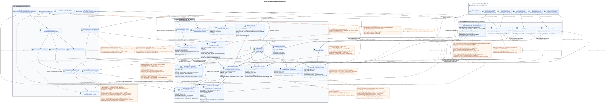

# Проектная доменная модель Messenger API

Статус: **проектное предложение (proposal) для будущего рефакторинга**.

Этот документ описывает целевое внутреннее устройство Messenger API. Он не
изменяет действующие маршруты, JSON-поля, фильтры, пагинацию, действия, события
или WebSocket-контракт. Текущий публичный контракт зафиксирован в
[`workspace_api.md`](workspace_api.md) и остаётся жёстким инвариантом. Базовые
доменные решения описаны в
[`messenger_domain_model.md`](messenger_domain_model.md).
Конкретные декларации RestAlchemy, отображение полей и полный контракт
основных эндпоинтов находятся в
[`messenger_restalchemy_api_spec.md`](messenger_restalchemy_api_spec.md).

Термины используются в значениях из [общего глоссария](index.md#глоссарий-проектной-документации):
размещение (placement), привязка (binding), транзакционный журнал исходящих
событий (transactional outbox), проекция (projection), веерное распространение
(fan-out) и фоновый исполнитель (worker).

## Граница между текущим состоянием и проектным предложением

В текущей реализации уже существуют публичные доменные модели
`WorkspaceUserMessage`, `WorkspaceUserStream`, `WorkspaceUserTopic` и
`WorkspaceUser`. Первые три читаются из SQL-представлений, а контроллеры Messenger
используют `StoreResourceController` и `sql_canonical_store`. Некоторые
текущие представления выполняют агрегаты, боковые/коррелированные подзапросы и
другие вычисления на пути чтения.

Целевая модель сохраняет публичные имена и форму ресурсов, но меняет только их
внутренний источник:

- физические сохраняемые в SQL RestAlchemy-модели хранят канонические данные и
  заранее материализованное пользовательское состояние;
- SQL-представления только для чтения адаптируют плоскую форму и не выполняют тяжёлых
  вычислений;
- `ResourceByRAModel`, стандартные `objects`/`filters` и скалярные UUID-свойства
  для публичных UUID-ссылок; физические столбцы остаются индексированными FK;
  контроллеры с пагинацией обслуживают обычный путь чтения;
- примесь ограничения области и переопределения контроллеров остаются только там, где нужны
  IAM-контекст, сохранение имён query/header и marker shape при принятой target
  пагинации `100/500`, либо доменные действия;
- написанный вручную SQL и текущее нестандартное SQL-хранилище не входят в основной
  путь запроса.

Ни одно имя таблицы или новый столбец, помеченные ниже как проектные, не являются
утверждённой миграцией. Этот документ не разрешает добавление нового публичного
эндпоинта или поля.

## Три слоя

Редактируемый PlantUML-исходник:
[`messenger_api_domain_model.puml`](diagrams/messenger_api_domain_model.puml).

| Публичная RestAlchemy-модель | Подтверждённый текущий источник | Целевой источник |
| --- | --- | --- |
| `WorkspaceUserMessage` | `m_workspace_user_messages_view` | `messenger_api_user_messages_v1`: ведущая `USER_MESSAGE_BINDING`, индексированные joins с одним placement/message/state. |
| `WorkspaceUserStream` | `m_workspace_user_streams` | `messenger_api_user_streams_v1`: ведущая `USER_STREAM_BINDING`, готовые счётчики и один canonical stream. |
| `WorkspaceUserTopic` | `m_workspace_user_topics_view` | `messenger_api_user_topics_v1`: ведущая `USER_TOPIC_BINDING`, готовые user counts и один canonical topic с global `is_done`. |
| `WorkspaceUser` | `m_workspace_users` | Прямой target `WorkspaceUser`/`messenger_users`; отдельное вычисляемое view не нужно. |

`WorkspaceStreamBinding`, `WorkspaceStream`, `WorkspaceUserTopicFlags`,
`WorkspaceStreamTopic` и `WorkspaceUser` — подтверждённые текущие имена
RestAlchemy-моделей. Текущая физическая `WorkspaceMessage` использует
`m_workspace_messages`; это имя относится только к сравнению с текущим
состоянием. Целевое предложение для будущей миграции использует единые пары
модель/таблица: `WorkspaceMessage`/`messenger_messages`,
`WorkspaceMessagePlacement`/`messenger_message_placements`,
`WorkspaceUserMessageBinding`/`messenger_user_message_bindings` и
`WorkspaceUserMessageState`/`messenger_user_message_states`. Эти имена являются частью
проектного предложения (proposal) для будущей миграции, но ещё не существуют в
рабочей схеме.

RestAlchemy `relationships.relationship` не используется для UUID-полей,
которые действующий JSON возвращает как UUID: отношение сериализовалось бы как
URI. Например, публичный `WorkspaceStream.owner` — обычное UUID-свойство, а
физический `owner_uuid` — индексированный FK на `WorkspaceUser` с
`ON DELETE RESTRICT`. То же разделение API/БД применяется к публичным
`author_uuid`, `user_uuid`, `message_uuid`, `stream_uuid`, `topic_uuid` и
другим UUID-ссылкам действующего контракта. UUID размещения публикуется как
`WorkspaceUserMessage.uuid`; скрытый `binding_uuid` и внутренний канонический
`MESSAGE.uuid` остаются скалярными UUID-свойствами над физическими внешними
ключами/идентичностями, но не входят в текущий публичный JSON. Ссылочная
целостность не переносится в валидацию
приложения: конкретные индексированные ограничения FK и действия перечислены в
[`messenger_restalchemy_api_spec.md`](messenger_restalchemy_api_spec.md#uuid-свойства-в-api-и-внешние-ключи-в-бд).

## Сообщение: строка от привязки с публичным UUID размещения

### Физические сущности

Целевая проектная `WorkspaceMessage` (`messenger_messages`) получает семантику
канонического `MESSAGE`; существующая таблица указана выше только в сравнении с
текущим состоянием. После будущей миграции одна целевая запись хранит ровно один
экземпляр:

- содержимого и автора;
- проекции полей `source`, `provider`, `delivery`;
- материализованных `reactions` и `reaction_users`;
- публичных `created_at` и `updated_at`.

`MESSAGE.uuid` — стабильный внутренний идентификатор единственной записи
содержимого. Публичный идентификатор во всех ответах и URL —
`MESSAGE_PLACEMENT.uuid`, одинаковый для всех пользователей одного размещения и
различный для разных topics одной канонической `MESSAGE`.

Целевая физическая модель разделяет три понятия:

- `MESSAGE_PLACEMENT` — глобальный контекст одной канонической `MESSAGE` в
  конкретном стриме/теме, уникальный по
  `(project_id,message_uuid,stream_uuid,topic_uuid)`; `topic_uuid` обязателен;
- `USER_MESSAGE_BINDING` — доступ пользователя к конкретному размещению,
  отношение/роль, видимость и разрешения, уникальный по
  `(project_id,placement_uuid,user_uuid)`;
- `USER_MESSAGE_STATE` — единственная для пользователя и размещения строка
  с сохранённым `read_at` (публичный `read = read_at IS NOT NULL`), `mentioned`,
  `starred`, `pinned` и аналогичными флагами, уникальная по
  `(project_id,user_uuid,placement_uuid)`.

У пользовательской привязки есть собственный скрытый UUID для жизненного цикла
и восстановления объекта. UUID размещения, напротив, публикуется как
идентификатор сообщения. `revision` или версия привязки отсутствует.
Копирование создаёт новый явный `MESSAGE_PLACEMENT` и нужные пользовательские
привязки, но сохраняет исходный внутренний `MESSAGE.uuid`.

### Принятое решение UUIDv5

`MESSAGE_PLACEMENT.uuid` детерминированно вычисляется как
`UUIDv5(namespace=TOPIC.uuid, name=MESSAGE.uuid)`. Namespace — канонический
глобально уникальный UUID темы; name — только канонический UUID сообщения в
lowercase hyphenated ASCII-представлении без braces, префиксов и дополнительных
полей. Project и stream не входят в name.

Это безопасно только вместе с физическим инвариантом: каждый `TOPIC` принадлежит
ровно одному `PROJECT` и `STREAM`, а его ownership/identity неизменяемы. Перенос
темы означает создание нового `TOPIC` и миграцию размещений, а не update
существующей строки. UUIDv5 не заменяет авторитетный business key
`(project_id,message_uuid,stream_uuid,topic_uuid)`, составные FK и проверку
принадлежности topic указанным project/stream.

### Плоская модель `WorkspaceUserMessage`

Представление только для чтения `messenger_api_user_messages_v1` в целевой
модели начинается с одной строки `USER_MESSAGE_BINDING` и выполняет
индексированные соединения с одним
`MESSAGE_PLACEMENT`, одной `WorkspaceMessage` и одной
`USER_MESSAGE_STATE`. FK и уникальные ключи запрещают размножение строк: одна
пользовательская привязка даёт ровно одну публичную строку.

| Публичные поля | Источник |
| --- | --- |
| `uuid` | `MESSAGE_PLACEMENT.uuid`; детерминированный публичный идентификатор placement. |
| скрытый `binding_uuid` | `USER_MESSAGE_BINDING.uuid`; уникальная техническая идентичность строки ORM, отсутствует в действующем публичном JSON. |
| внутренний `message_uuid` | `MESSAGE.uuid`; канонический FK содержимого, отсутствует в действующем публичном JSON. |
| `project_id`, `user_uuid` | Область пользовательской привязки/состояния. |
| `stream_uuid`, `topic_uuid` | Контекст из `MESSAGE_PLACEMENT`. |
| `read`, `mentioned`, `starred`, `pinned` | Готовое состояние пользователя для placement из `USER_MESSAGE_STATE`; `read` — скалярная проекция `read_at IS NOT NULL`. |
| `is_own` | Простое скалярное сравнение `user_uuid` привязки и `MESSAGE.author_uuid`; оно не требует обхода других строк. |
| `author_uuid`, `payload` | Канонический `MESSAGE`. |
| `source_name`, `source`, `provider`, `delivery` | Канонический `MESSAGE`; внутреннее хранилище `provider`/`delivery` не становится публичным. |
| `reactions`, `reaction_users` | Заранее материализованное состояние канонического `MESSAGE`, без агрегатов в представлении чтения. |
| `created_at`, `updated_at` | Только канонический `MESSAGE`. |

Публичные временные метки никогда не берутся из времени создания или изменения
привязки. Поэтому автор и получатель видят одну дату сообщения, даже если
привязка получателя появилась позже. Операции чтения/добавления в избранное/
закрепления/изменения видимости могут изменить
техническую временную метку состояния/привязки, но не публичный
`WorkspaceUserMessage.updated_at`.

Публичная сортировка и контракт пагинации по ключу остаются
`(created_at, uuid)`: `created_at` приходит из `MESSAGE`, а `uuid` — из
`MESSAGE_PLACEMENT`. Никакая
дублирующая временная метка или ключ сортировки в привязке сейчас не
утверждаются.

Если у пользователя несколько размещений одной канонической `MESSAGE`, список
содержит несколько строк с разными публичными placement UUID и разными
`stream_uuid`/`topic_uuid`; персональные флаги также placement-scoped. Скрытый `binding_uuid`
остаётся уникальным `get_id_property()` только для восстановления/отображения
объектов RestAlchemy. Адаптер публичного ресурса и маршруты используют
`MESSAGE_PLACEMENT.uuid` и никогда не публикуют внутренний binding key.
Получение и placement-scoped actions однозначно восстанавливают одну видимую
строку по `(project_id,current_user,placement_uuid)`. Маркер страницы — публичный
placement UUID; контроллер восстанавливает стабильную границу
`(MESSAGE.created_at,MESSAGE_PLACEMENT.uuid)` без скрытого `binding_uuid`.

### Реакции

Источником истины для реакций служат отдельные изменяемые строки фактов. Одна
строка с бизнес-ключом
`(project_id, canonical_message_uuid, user_uuid, emoji_name)`
означает одну реакцию конкретного пользователя на каноническую `MESSAGE`;
привязка не входит в идентичность. Видимая привязка используется только для
проверки доступа/разрешений по публичному placement UUID. Реакция канонически
глобальна и намеренно видима во всех placements сообщения, даже если их
приватные аудитории различаются. Этот privacy trade-off принят как Critic risk
#8 и не является OPEN.

Публичные поля `reactions` и `reaction_users` сохраняются без переименования как
материализованные снимки только для чтения в `MESSAGE`. Создание/обновление/
удаление реакции в транзакции запроса меняет ровно одну строку факта и не
выполняет цикл «чтение — изменение — запись» общего JSON. Единственный fenced
владелец scope `message` с ключом `(project_id, canonical_message_uuid)` читает
факты затронутого сообщения и как единственный писатель атомарно
заменяет оба снимка. Факты являются источником истины, снимки можно перестроить, а
короткая задержка их обновления является принятой согласованностью в конечном
счёте (eventual consistency).

## Модели чтения пользователей, стримов и тем

### `WorkspaceUser`

`WorkspaceUser` становится прямой целевой физической моделью над
`messenger_users`; `m_workspace_users` здесь относится только к current-runtime
comparison выше.
Стандартный `ResourceByRAModel` скрывает внутренние идентификаторы провайдера и
сохраняет текущую публичную проекцию. Проектное представление сообщений
ссылается на пользователя только через индексированный внешний ключ
«многие-к-одному» и не агрегирует пользовательские данные.

### `WorkspaceUserStream`

`WorkspaceUserStream` сохраняет текущие публичные поля, но целевое представление
строится от физической `WorkspaceStreamBinding` текущего пользователя:

- членство/роль/уведомления и состояние в области пользователя берутся из привязки;
- канонические имя/описание/источник/приватность/тема по умолчанию и временные метки
  берутся из одной `WorkspaceStream`;
- счётчики непрочитанных сообщений и другое вычисляемое состояние заранее
  материализуются прямо в уникальной строке привязки
  `(project_id,user_uuid,stream_uuid)`;
- `last_message_uuid` также хранится как готовое физическое состояние, а не
  ищется боковым подзапросом при каждом чтении;
- отображение имени личного чата может использовать только простое
  индексированное соединение «многие-к-одному» с `WorkspaceUser`, без веерного
  распространения.

Физическая `WorkspaceStream` хранит `owner_uuid` и первоначальный
`direct_user_uuid` как scalar UUID FK. Публичный `owner` — alias
`owner_uuid AS owner`, а публичный `direct_user_uuid` viewer-relative: owner
видит `stream.direct_user_uuid`, второй участник — `stream.owner_uuid`, self-chat
— собственный UUID. View использует только scalar `CASE` над одной stream row и
ведущей `USER_STREAM_BINDING`; list/get/event snapshot имеют одинаковую
семантику, relationship URI или one-to-many join не требуется.

Физическая `WorkspaceStreamBinding` не удаляется при revoke. Внутренние
`active` и монотонный `membership_generation` переживают revoke/re-add и не
добавляются в public JSON. Message/reaction view/action всегда проверяет active
membership и совпадение generation snapshot; visibility binding alone не
является authorization.

Создание с одним `direct_user_uuid` всегда сохраняет стрим с `private=true`.
Если UUID равен текущему владельцу/пользователю, это чат с собой: физически
существует одна привязка владельца, и только этот пользователь видит стрим.
Отправка в чат с собой создаёт одну каноническую `MESSAGE`, одно явное
размещение, привязку автора и её уникальное `USER_MESSAGE_STATE`; веерное
распространение получателям не создаёт других пользовательских привязок или
состояний, поэтому сообщение появляется ровно один раз только у текущего
пользователя.

Отдельная таблица состояния пользователя в стриме по умолчанию не вводится:
жизненные циклы доступа и проекции используют одну и ту же уникальную
кардинальность пользователя/стрима. Выделение возможно только при отдельно
доказанной необходимости.

### `WorkspaceUserTopic`

`WorkspaceUserTopic` использует целевое представление
`messenger_api_user_topics_v1`. Ведущей физической строкой становится уникальная
`USER_TOPIC_BINDING` `(project_id,user_uuid,topic_uuid)`:

- режим уведомлений и счётчики в области пользователя читаются из готового
  `USER_TOPIC_BINDING`;
- глобальный `is_done`, имя/стрим/источник/конфигурация сводки и канонические
  временные метки приходят из одной `WorkspaceStreamTopic`/`TOPIC`;
- `last_message_uuid`, признак устаревания сводки и счётчики непрочитанных сообщений материализуются
  заранее;
- представление сообщений не используется для подсчёта или поиска последнего сообщения.

Агрегаты уровня темы хранятся в этой строке привязки. Отдельная таблица
состояния по умолчанию не вводится; публичное представление выполняет одно
индексированное соединение с канонической темой.

### Папки

Каноническая `FOLDER` и уникальная по `(project_id,user_uuid,folder_uuid)`
`USER_FOLDER_BINDING` разделяют общие данные папки и пользовательскую
видимость/состояние. `unread_count` и `mention_count` хранятся прямо в
привязке вместе с read-only JSONB `folder_items_snapshot`, его внутренней
версией и временем обновления. Публичное `folder_items` отображает снимок
напрямую (`[]` для пустой папки), а представление чтения папки присоединяет одну
готовую строку привязки к одной канонической папке. Публичные поля элементов папки
`unread_count`, `active_unread_count` и `passive_unread_count` берутся из
соответствующей `USER_STREAM_BINDING` по индексированному ключу
пользователя/стрима. Ни представление папки, ни представление элемента папки не
выполняют `COUNT`, `GROUP BY`, коррелированный запрос или обход привязок
сообщений.

`FOLDER_ITEM` связывает папку с каноническим поддерживаемым объектом, например
стримом, в точной форме действующего публичного контракта. Для системных папок
их `USER_FOLDER_BINDING` содержит фиксированный `rule`/`type`, который нельзя
удалить или произвольно изменить обычной пользовательской операцией. Состав
системной папки материализован заранее в автоматических `FOLDER_ITEM`:

- `All chats` — все доступные пользователю неархивные стримы;
- `Personal` — доступные неархивные стримы с каноническим `private = true`;
- `Channels` — доступные неархивные стримы с `private = false`.

Это точный действующий критерий `Personal`: он определяется `private = true`, а
не наличием `direct_user_uuid`. Источником истины служат активные
`USER_STREAM_BINDING` и канонический `STREAM` с обязательным
`is_archived = false`; затем `private` разделяет `Personal` и `Channels`, а
`All chats` включает все такие доступные стримы. Любое изменение
нормализованных items/pin или автоматического состава пишет transactional outbox
и выводит immutable task `folder_projection` без coalescing, с scope
`user-folder:(project_id,user_uuid,folder_uuid)`. Фоновый исполнитель приводит
`FOLDER_ITEM` к актуальному source of truth и атомарно заменяет готовый
снимок, счётчики, версию/время проекции и ready event. Путь клиентского
чтения возвращает одну готовую строку/страницу без N+1, `json_agg`, `COUNT`
и custom SQL; до завершения task виден предыдущий снимок.

## Отображение RestAlchemy и контроллеры

Целевая реализация следует обычному стилю Exordos Core:

1. Физические сущности используют `SQLStorableMixin`, стандартные
   `objects`/`filters` и скалярные UUID-свойства. Будущая схема сохраняет
   индексированные ограничения внешних ключей с явно выбранными ссылочными
   действиями; публичный UUID никогда не превращается в URI отношения
   RestAlchemy.
2. Публичные модели чтения отображаются через `ResourceByRAModel` с текущими
   скрытыми полями и правами только для чтения.
3. Коллекции обслуживает `BaseResourceControllerPaginated` с минимальным
   переопределением и примесью ограничения области проекта/пользователя.
   Target policy: отсутствующий `page_limit` и `0` дают `100`, `1..500`
   принимается точно, отрицательное/нецелое/большее `500` даёт HTTP `400` без
   clamp; unbounded mode отсутствует. Подтверждённый пробел текущей реализации
   отделён от проектного предложения: отсутствующий `page_limit` и
   `page_limit=0` сейчас дают неограниченное чтение, отрицательное или
   нецелочисленное значение — HTTP `400`, а положительные значения не имеют
   максимума и не ограничиваются сверху. Target `100/500` — сознательное
   observable compatibility change, а не описание текущего runtime.
4. Узкое переопределение допустимо для сохранения действующей составной
   пагинации сообщений по ключу и текущих IAM-/доменных действий, но оно
   работает через модели/фильтры RestAlchemy, а не через необработанный SQL или
   отдельную абстракцию хранилища.
5. Действия создания/обновления пишут физические модели в текущей транзакции
   запроса; представление только для чтения никогда не используется как цель
   записи.

## Путь чтения

### Сообщения

1. IAM-контекст задаёт `project_id` и `user_uuid`.
2. Обычный фильтр RestAlchemy выбирает индексированную
   `USER_MESSAGE_BINDING` в этой области.
3. Простое представление присоединяет один `MESSAGE_PLACEMENT`, одну
   каноническую `MESSAGE` и одно уникальное `USER_MESSAGE_STATE`.
4. `ResourceByRAModel` возвращает существующую плоскую
   `WorkspaceUserMessage`: `MESSAGE_PLACEMENT.uuid` публикуется как `uuid`, а
   канонический `MESSAGE.uuid`, технический `binding_uuid` и поля доступа
   скрываются.

Здесь нет вычисления аудитории, разрешений, упоминаний, реакций, счётчиков или
видимости. Все эти значения уже записаны в привязке/состоянии/сообщении.

### Стримы, темы, папки и пользователи

Коллекции стримов, тем и папок начинаются с одной уникальной физической строки
привязки пользователя к контейнеру и присоединяют одну каноническую строку
стрима/темы/папки. Готовые агрегаты уже записаны в ведущей привязке. Ресурс
пользователя читает `WorkspaceUser` напрямую. Ни один из этих путей не
агрегирует пользовательские привязки сообщений и не обходит множество
сообщений.

## Путь записи

### Синхронная отправка

Обычный `POST /messages/` выполняет минимальную синхронную работу в одной
транзакции запроса:

1. Проверяет текущий доступ автора к выбранному стриму/теме.
2. Создаёт одну каноническую `MESSAGE`.
3. Создаёт одно явное `MESSAGE_PLACEMENT` в выбранном стриме/теме.
4. Сразу создаёт одну авторскую `USER_MESSAGE_BINDING` и её уникальное
   `USER_MESSAGE_STATE` с готовыми общими для сообщения флагами.
5. В той же транзакции пишет неизменяемые доменные события transactional
   outbox — ровно по одному для каждой выводимой initial typed task.
6. Возвращает автору плоскую API-строку этой привязки.

API не выполняет веерное распространение получателям, не вычисляет права и
видимость всех получателей и не пересчитывает агрегаты. Автор видит
отправленное сообщение сразу.

### Остальные записи

- Копирование создаёт новое явное `MESSAGE_PLACEMENT`, пользовательскую
  привязку автора и событие журнала исходящих событий со ссылкой на
  существующую `MESSAGE`. Новый публичный эндпоинт копирования этим документом
  не вводится.
- Чтение/добавление в избранное/закрепление изменяют уникальное
  `USER_MESSAGE_STATE`; видимость/доступ принадлежат `USER_MESSAGE_BINDING`
  конкретного размещения.
- Редактирование содержимого сначала проверяет разрешения через применимую
  пользовательскую привязку, затем изменяет единственную каноническую
  `MESSAGE`; все размещения читают обновлённое содержимое.
- Действующий `DELETE /messages/{uuid}` сохраняет публичную семантику полного
  удаления: `MESSAGE_PLACEMENT.uuid` адресует размещение, через применимую
  видимую пользовательскую привязку проверяются доступ и авторство, после чего
  удаляются `MESSAGE`, размещения, пользовательские привязки и состояние.
  Скрытие или удаление отдельной привязки остаётся другой внутренней доменной
  операцией и не подменяет публичный
  `DELETE`.

Каждая операция изменения состояния пишет неизменяемое доменное событие/событие
журнала исходящих событий в той же транзакции. Каждое событие порождает одну
отдельную immutable typed task с уникальным `outbox_event_uuid`; повторная
derivation идемпотентна. Initial design не объединяет tasks. `GET`/операции
списка не создают событий или задач.

Task проходит `pending -> leased/running -> completed|failed`; lease имеет
expiry, owner и fencing token. Ошибка увеличивает attempts и планирует
`next_retry_at` с backoff; после max attempts запись попадает в DLQ. Reaper
возвращает expired running work, reconciliation создаёт отсутствующую task по
immutable outbox event, handlers и projection writes идемпотентны по
`outbox_event_uuid`. Наблюдаемость включает lag, retries, stuck/expired leases и
DLQ. Отсутствие coalescing увеличивает throughput/storage нагрузку, поэтому
backpressure и capacity budget обязательны; будущая оптимизация не входит в
initial design.

## Путь фоновой обработки {#путь-фоновой-обработки}

После синхронной отправки обработчик журнала исходящих событий/проектор создаёт
типизированную задачу `fanout` для конкретного размещения; фоновый исполнитель
не обнаруживает работу сканированием отсутствующих привязок. Затем фоновый
исполнитель асинхронно:

1. Один свободный слот фонового исполнителя получает эксклюзивное владение
   конкретным `(project_id, topic_uuid)` с ожидающими сообщениями.
2. Внутри захваченной темы выбирает явные задачи размещений, упорядочивая их
   канонические `MESSAGE` от самой поздней к самой ранней по
   `MESSAGE.created_at DESC`.
3. Вычисляет получателей, разрешения и видимость.
4. Для каждого размещения отдельно создаёт `USER_MESSAGE_BINDING` допущенных
   получателей, уникальную по `(project_id,placement_uuid,user_uuid)`, и вместе
   с ней создаёт или идемпотентно обеспечивает уникальное
   `USER_MESSAGE_STATE` по `(project_id,user_uuid,placement_uuid)`. Binding и
   state сохраняют одинаковый `membership_generation`. Для
   дополнительного размещения того же сообщения создаётся отдельное состояние;
   существующее состояние переиспользуется только внутри того же placement.
   Целевой стрим/тема никогда не выводится из
   пользовательских привязок.
   Ожидаемый `membership_generation` приходит из source event/task; conditional
   upsert выполняется только при active membership и точном совпадении. Stale
   task делает no-op. Re-add conditional-upsert'ом переводит те же уникальные
   binding/state rows на новое generation и полностью сбрасывает state к
   defaults; старые персональные флаги не переиспользуются.
5. Создаёт отдельные immutable задачи фактических областей для общих
   счётчиков/снимков. Каждый handler атомарно фиксирует projection update и все
   соответствующие durable ready public event rows в одной DB transaction.

Подтверждённые литералы видов типизированных задач: `fanout`,
`content_mentions`, `reaction_snapshot`, `read_counters`,
`delivery_snapshot_event`, `topic_state_projection` и
`topic_membership_policy_rebuild`. Initial design не объединяет задачи: одному
source outbox event соответствует одна immutable typed task с уникальным
`outbox_event_uuid`; handler при выполнении читает последнее зафиксированное
состояние источника.

Владение задачами определяется фактической строкой, которую они меняют:

| Task kind | Scope kind/key | Порядок и единственный автор |
| --- | --- | --- |
| `fanout`, placement-scoped `content_mentions`, history/backfill | `topic`: `(project_id, topic_uuid)` | последовательно внутри topic, `MESSAGE.created_at DESC` |
| `reaction_snapshot` | `message`: `(project_id, canonical_message_uuid)` | один автор canonical reaction snapshots |
| stream counters | `user-stream`: `(project_id, user_uuid, stream_uuid)` | один автор строки stream binding |
| folder counters/automatic items | `user-folder`: `(project_id, user_uuid, folder_uuid)` | один автор строки folder binding/items |
| topic counters | `user-topic`: `(project_id, user_uuid, topic_uuid)` | один автор строки topic binding |
| `topic_state_projection` | `topic`: `(project_id, topic_uuid)` | ready events/read-only copies после canonical `TOPIC.is_done` commit |
| иная shared projection | явно объявленный scope exact physical row | fallback на `topic` запрещён |

Одновременно действует один lease/fencing token для одного exact scope key;
разные scopes выполняются параллельно. Topic-worker работает только с
placements/bindings своей темы и не выполняет unsafe read-modify-write shared
rows. Atomic counter delta допустима только с exactly-once effect guard по
`outbox_event_uuid`; иначе scope worker перечитывает источники и заменяет
проекцию. Результаты разных scopes могут стать видимыми клиенту в разное время
в пределах принятой eventual consistency.

После веерного распространения, чтения, скрытия, перемещения, удаления и других
влияющих изменений типизированные задачи счётчиков идемпотентно обновляют
готовые поля в уникальных
`USER_STREAM_BINDING`, `USER_TOPIC_BINDING` и `USER_FOLDER_BINDING`. Эти
агрегаты никогда не хранятся в привязке/состоянии отдельного сообщения. Полный
пересчёт из фактов/привязок сообщений разрешён только как явное фоновое
восстановление/перестроение; ни `GET`/операция списка, ни изменяющий состояние
клиентский запрос не выполняет его синхронно.

Fan-out root одного outbox event обрабатывает recipients immutable keyset
batches: `USER_STREAM_BINDING.user_uuid ASC`, без `OFFSET`. Default batch size
`1000`, hard maximum `5000`; конфигурация вне `1..5000` не запускается. Batch
атомарно пишет binding/state, downstream outbox/tasks и ready events, затем
фиксирует cursor/count и создаёт следующий batch. Retry повторяет только этот
batch. После каждого batch topic claim может быть отдан другой старой работе;
newest-first сохраняется, но starvation запрещён. Intent `<=1s p95` требует
benchmark и не является hard API guarantee.

Создание, изменение или удаление `USER_STREAM_BINDING` также порождает
отдельную immutable typed task автоматических папок. Фоновый исполнитель
читает актуальные активные привязки стримов и только канонические `STREAM` с
`is_archived = false`: `All chats` включает все такие доступные стримы,
`Personal` — строки с `private = true`, `Channels` — строки с
`private = false`. Затем он идемпотентно приводит готовые `FOLDER_ITEM` к этим
правилам и обновляет агрегаты их
`USER_FOLDER_BINDING`. Эта проекция полностью перестраиваема; клиентский `GET` не
создаёт задачу и не вычисляет членство папки.

Для изменения реакции задача scope `message` получает затронутое каноническое
сообщение, читает его исходные факты реакций и монопольно обновляет
`MESSAGE.reactions` вместе с `MESSAGE.reaction_users`. Параллельные запросы API
безопасно вставляют/удаляют независимые строки фактов, уникальный бизнес-ключ
предотвращает дубликат одной и той же реакции пользователя, а общие снимки
никогда не записываются обработчиками запросов. Если сообщение имеет размещения
в нескольких темах, exact key `(project_id, canonical_message_uuid)` всё равно
направляет задачу ровно одному владельцу; topic lock для этой shared row не
используется.

Фоновый исполнитель в одной DB transaction обновляет materialized state и
создаёт все соответствующие готовые публичные записи
`WorkspaceEvent`/WebSocket; оба эффекта commit/rollback вместе. Unique
derivation key из `outbox_event_uuid` делает повтор handler идемпотентным и не
создаёт дубликат в event store. Отдельный WebSocket dispatcher не создаёт
business events: он читает durable rows, доставляет/повторяет/воспроизводит их,
а сетевой send не влияет на долговечность записи.

При reconnect клиент передаёт последний полностью обработанный cursor. Сервер
фиксирует high-watermark, воспроизводит все более новые видимые durable events,
буферизует возникший live tail и после drain переключает соединение без gap.
Доставка at-least-once: клиент дедуплицирует по event UUID и продвигает cursor
только после обработки. Истёкший cursor даёт явную `epoch_pruned`/`410`
ошибку; численное retention window остаётся operational policy. Event rows для
пользователя несут membership generation; dispatcher и replay подавляют data
events, если membership inactive или generation уже изменился. Допустимое
`stream.deleted`/revocation-событие остаётся отдельным control effect.

Обработка выполняется пулом из нескольких параллельных слотов фонового
исполнителя. Конфигурация задаёт максимальное число одновременно работающих
слотов `N`; конкретное имя параметра конфигурации и модель исполнения — потоки
ОС, задачи asyncio, процессы или другая реализация — пока не выбираются. В
каждый момент один слот обрабатывает не более одной темы, а один
`(project_id, topic_uuid)` принадлежит не более чем одному слоту. Разные темы с
ожидающими сообщениями могут обрабатываться одновременно разными слотами, но
суммарно не более настроенного ограничения `N`.

Владение темой не означает постоянное секционирование. Слот может динамически
получить тему, безопасно освободить её и позволить другому слоту повторный
захват. Архитектурный инвариант — отсутствие одновременных владельцев одной темы
и безопасное освобождение/повторное получение; строка аренды, рекомендательная
блокировка, `SKIP LOCKED`, координатор или другой конкретный механизм этим
проектным предложением не выбирается.

Этот порядок «сначала новые» обязателен для веерного распространения
получателям, наверстывания/перестроения и любого другого массового построения
пользовательских привязок. Первичный порядок определяется только каноническим
`MESSAGE.created_at`, а не временем создания задачи фонового исполнителя,
привязки или появления сообщения у получателя. Например, сообщения с временными
метками `14:20`, `14:19`, `14:15` обрабатываются именно в порядке
`14:20` → `14:19` → `14:15`, чтобы самые свежие сообщения появились у клиента
первыми.

Приоритет новых сообщений не отменяет продвижение в конечном счёте: старые
сообщения не могут бесконечно голодать при постоянном поступлении новых.
Конкретный механизм
ограниченных пакетов, справедливости, границы снимка или очереди должен работать
в границах захвата темы, но пока остаётся деталью реализации и этим проектным
предложением не проектируется.

Единицей взаимоисключения является `TOPIC`, а не `STREAM`. Каждый placement,
включая direct chat и self-chat, обязан ссылаться на канонический или
технический `TOPIC`; `null`, sentinel и резервное секционирование по stream
запрещены.

Привязки получателей появляются с допустимой задержкой около секунды. До их
появления получатель не видит сообщение; это запланированная согласованность в
конечном счёте, а не ошибка API. После появления привязки API и событие
реального времени показывают сообщение с каноническими
`MESSAGE.created_at`/`updated_at`, а не со временем веерного распространения.

Журнал исходящих событий, фоновый исполнитель и диспетчер на схеме показаны
концептуально. Task lifecycle уже обязан иметь lease expiry, owner/fencing token,
attempts, retry/backoff, max attempts/DLQ и reaper/reconciliation; конкретный
runtime/transport диспетчера не выбирается.

## Инварианты простых представлений, кардинальности и индексов

1. Одна ведущая физическая строка даёт ровно одну строку представления чтения.
2. Разрешены только индексированные `LEFT JOIN`/`INNER JOIN` связей
   «один-к-одному» или «многие-к-одному». Соединение не может умножать строки.
3. В представлениях чтения запрещены агрегаты, `GROUP BY`, оконные функции,
   боковые соединения, коррелированные подзапросы и веерное распространение
   «один-ко-многим».
4. Каждый внешний ключ, участвующий в соединении, индексирован. Область
   проекта/пользователя и фактические публичные пути фильтрации/сортировки
   должны иметь подходящие составные индексы; точный DDL проверяется планами
   запросов перед миграцией.
5. `MESSAGE_PLACEMENT` уникально по
   `(project_id,message_uuid,stream_uuid,topic_uuid)` и является единственным
   источником истины для целевого контекста. `USER_MESSAGE_BINDING` уникальна по
   `(project_id,placement_uuid,user_uuid)`; размещение/привязка без родительской
   строки невозможны. `TOPIC` обязателен, глобально уникален и неизменно
   принадлежит ровно одному `PROJECT`/`STREAM`; составные FK гарантируют это
   независимо от UUIDv5.
6. `USER_MESSAGE_STATE` уникально по
   `(project_id,user_uuid,placement_uuid)`, поэтому `read`, `mentioned`,
   `starred`, `pinned` однозначно принадлежат публично адресуемому placement.
7. Канонические данные стрима/темы/папки хранятся один раз. Готовые агрегаты
   пользователя находятся прямо в уникальных привязках пользователя к
   контейнеру с ключами
   `(project,user,stream)`, `(project,user,topic)` и `(project,user,folder)`;
   отдельная таблица состояния не вводится без доказанной потребности
   жизненного цикла.
8. Публичный порядок сообщений использует каноническое `MESSAGE.created_at`;
   временные метки привязки не меняют хронологию.
9. Максимальное число одновременно работающих слотов фонового исполнителя
   задаётся конфигурацией; имя параметра и примитив исполнения не являются частью
   архитектурного контракта.
10. Для topic-scoped work единица эксклюзивного владения —
    `(project_id, topic_uuid)`. Одну тему одновременно обрабатывает не более
    одного слота; разные темы могут обрабатываться параллельно в пределах
    настроенного ограничения параллелизма. Topic lock не является блокировкой
    общих message/user-stream/user-folder rows.
11. Владение темой допускает динамический захват, но требует безопасного
    освобождения и повторного захвата без одновременных владельцев.
12. Внутри каждой захваченной темы фоновый исполнитель обрабатывает явные задачи
    размещений и выбирает канонические сообщения по
    `MESSAGE.created_at DESC`. Временные метки задачи/привязки не участвуют в
    первичном порядке.
13. Приоритет «сначала новые» обязан сохранять продвижение старых сообщений в
    конечном счёте и не допускает их бесконечного голодания.
14. Путь запроса не создаёт привязки/состояния получателей и не пересчитывает
    материализованное состояние. Фоновый исполнитель создаёт привязку
    получателя и соответствующее уникальное `USER_MESSAGE_STATE` вместе.
15. `revision`/версия привязки отсутствует.
16. Публичный UUID сообщения всегда равен `MESSAGE_PLACEMENT.uuid` и вычисляется
    как `UUIDv5(namespace=TOPIC.uuid, name=MESSAGE.uuid)`. `MESSAGE.uuid` и
    `binding_uuid` не входят в публичный JSON; разные placements имеют разные
    публичные UUID.
17. Факт реакции уникален по
    `(project_id,canonical_message_uuid,user_uuid,emoji_name)`. API меняет одну строку факта,
    а один эксклюзивный владелец — фоновый исполнитель — является единственным
    писателем снимков `reactions`/`reaction_users`.
18. Каждая транзакция изменения состояния пишет неизменяемое доменное
    событие/событие журнала исходящих событий; `GET`/операции списка не создают
    задач. Каждому событию соответствует одна immutable typed task с unique
    `outbox_event_uuid`; coalescing отсутствует, handlers идемпотентны.
19. Фоновый исполнитель создаёт готовые публичные записи событий WebSocket
    только в одной DB transaction с materialized state. Сетевая
    отправка/повтор/воспроизведение принадлежат отдельному диспетчеру/сервису.
20. Публичные UUID-ссылки объявлены скалярными UUID-свойствами, а физические
    столбцы хранения остаются индексированными внешними ключами с явными
    ссылочными действиями. В частности, `WorkspaceStream.owner` — UUID,
    физический `owner_uuid` ссылается на пользователя. Публичный placement UUID,
    внутренний `MESSAGE.uuid` и скрытый `binding_uuid` являются скалярными
    UUID/FK/идентификаторами; только первый сериализуется как UUID ресурса.
21. `direct_user_uuid` при создании принудительно означает `private=true`.
    Чат с собой, в котором `direct_user_uuid` равен UUID текущего пользователя,
    имеет одну привязку владельца; его размещение не получает дополнительных
    привязок получателей и отображает каноническое сообщение один раз только
    этому пользователю.
22. Состояние отдельного сообщения хранит `read_at` (или эквивалентный маркер
    источника) и персональные флаги, но не агрегаты контейнеров. Публичные
    представления стрима/темы/папки читают готовые поля привязок без `COUNT`,
    `GROUP BY`, коррелированного подзапроса или обхода привязок сообщений.
23. Обновления проекций агрегатов идемпотентны и согласованы в конечном счёте;
    перестроение из привязок сообщений является только фоновой задачей
    восстановления.
24. Системные `USER_FOLDER_BINDING` имеют фиксированный `rule`/`type`, а
    автоматические `FOLDER_ITEM` являются перестраиваемой материализованной
    проекцией активных `USER_STREAM_BINDING` и канонических `STREAM` с
    `is_archived = false`: `All chats` включает все, `Personal` — только
    `private = true`, `Channels` — только `private = false`. Обычный
    пользовательский путь не удаляет системную папку и не меняет её правило.
25. `USER_STREAM_BINDING` — persistent lifecycle row. Revoke синхронно меняет
    `active=false` и увеличивает generation; каждый read/action проверяет это
    состояние, stale task не может resurrect access, cleanup необязателен.
26. Каждая task владеет exact scope key. Canonical snapshots используют
    `message`, агрегаты — `user-stream`/`user-topic`/`user-folder`; неявный
    fallback на `topic` запрещён. Одновременно действует один lease/fencing
    token на ключ, разные scopes параллельны. Atomic delta допустима только с
    exactly-once effect guard по `outbox_event_uuid`; иначе scope worker
    recomputes/writes.
27. `TOPIC.is_done` — каноническое общее поле темы. Toggle сериализуется на
    `TOPIC`, увеличивает version/`updated_at` и пишет outbox; пользовательская
    binding не authoritative writer.
28. Реакции canonical-message-global во всех placements; cross-audience
    visibility принята намеренно после placement access check.
29. `2xx`/`201` означает primary commit, а не завершение фоновых эффектов.
    Авторский RYW синхронен; recipient/history/counters/snapshots/events
    асинхронны, около секунды — SLO intent.
30. Projection update и ready events атомарны в одной worker transaction.
    Reconnect обязателен через cursor replay без gap; доставка at-least-once.
31. Tenant-owned rows имеют `project_id`, `UNIQUE(project_id,uuid)` и composite
    FK; worker scope/query включает project. Authorization повторно проверяется
    внутри mutation transaction. Точная non-direct role matrix остаётся OPEN,
    потому что current contract её не определяет.
32. Fan-out не использует unbounded recipient transaction: immutable batches
    имеют default `1000`, maximum `5000`, cursor `user_uuid ASC`, checkpoint и
    bounded fairness.

## Закрытые блокирующие риски Critic-review

- **Risk #1 resolved:** public message ID — детерминированный placement UUID;
  canonical content ID остаётся внутренним.
- **Risk #2 resolved:** persistent stream membership с `active` и
  `membership_generation` создаёт синхронную deny boundary.
- **Risk #3 resolved:** initial design не использует coalescing; одна immutable
  task соответствует одному outbox event, а lease/retry/reaper/DLQ закрывают
  crash-stuck lifecycle.
- **Risk #4 resolved:** topic ownership ограничено topic-scoped work; каждая
  shared projection имеет свой exact scope и единственного fenced writer.
- **Risk #5 resolved:** pagination `100/500`, `0 -> 100` и observable async
  timing приняты как сознательное изменение поведения.
- **Risk #6 resolved:** `TOPIC.is_done` канонический и изменяется
  сериализованным toggle с version/outbox; binding не writable source.
- **Risk #8 accepted:** reactions намеренно canonical-message-global во всех
  placements, включая разные аудитории.
- **Risk #9 resolved:** projection и ready event rows атомарны; mandatory
  cursor replay с at-least-once delivery закрывает event-loss window.
- **Risk #7 partially resolved:** tenant integrity и transactional recheck
  зафиксированы; non-direct role/action cells остаются точечно OPEN.
- **Risk #10 resolved:** bounded keyset fan-out batches `1000/5000` исключают
  unbounded transaction и дают checkpoint/retry/fairness.
- **Risk #11 resolved:** native data конвертируются versioned migrations после
  verified backup/restore rehearsal; ручные bounded scripts выполняют rebuild и
  отдельный destructive reset Zulip-derived messages/files с fresh reimport.
  Полная процедура и rollback gate определены в
  [`migration_release_runbook.md`](diagrams/sequence/worker_flows/migration_release_runbook.md).
- **Risk #12 resolved:** нормализованные `FOLDER_ITEM` остаются источником
  истины, а `USER_FOLDER_BINDING.folder_items_snapshot` даёт точный публичный
  массив одним индексированным чтением без N+1 и runtime aggregation.

## Открытые решения

Единственный канонический список находится в
[`messenger_architecture_inventory.md`](messenger_architecture_inventory.md#единственный-список-open-решений).
Этот документ не поддерживает отдельную копию списка.
