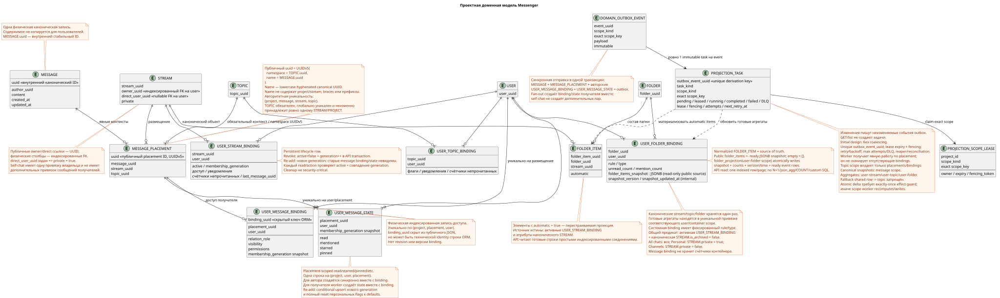

# Черновая доменная модель Messenger

Статус: **proposal (проектное предложение) для совместного обсуждения**.

Этот документ описывает целевую доменную модель будущего рефакторинга. Он не
меняет действующий публичный клиентский интерфейс. Текущий публичный контракт
зафиксирован отдельно в [`workspace_api.md`](workspace_api.md) и должен
остаться неизменным.

Термины используются в значениях из [общего глоссария](index.md#глоссарий-проектной-документации):
размещение (placement), привязка (binding), transactional outbox, проекция
(projection), fan-out и worker (фоновый исполнитель).

## Основная идея

`MESSAGE` — центральная самостоятельная каноническая сущность. Содержимое
сообщения хранится ровно в одном экземпляре независимо от количества
пользователей, которые его видят.

Размещение, доступ и пользовательское состояние разделены.
`MESSAGE_PLACEMENT` связывает каноническое сообщение с конкретным контекстом
stream/topic. `USER_MESSAGE_BINDING` даёт пользователю доступ к размещению и
хранит `visibility`/`permissions`. `USER_MESSAGE_STATE` хранит персональное
состояние пользователя для конкретного размещения. Копии содержимого для
пользователей не создаются. Копирование создаёт новое явное размещение и
привязки, а публичным UUID ресурса становится детерминированный UUID
размещения.

Отображение этой модели на публичные RestAlchemy-модели и пути API описано в
отдельном proposal
[`messenger_api_domain_model.md`](messenger_api_domain_model.md).
Детальные декларации RestAlchemy и неизменяемые HTTP/JSON-контракты собраны в
[`messenger_restalchemy_api_spec.md`](messenger_restalchemy_api_spec.md).

## Сущности

### `MESSAGE`

- Единственная каноническая запись сообщения и его содержимого.
- Её `uuid` является стабильным внутренним идентификатором единственной
  канонической записи содержимого и не публикуется как UUID ресурса сообщения.
- Хранит авторство и публичные `created_at`/`updated_at` сообщения.
- Не дублируется при появлении новых пользователей, которым сообщение видно.
- Не хранит персональные флаги просмотра или пользовательского состояния.
- Остальной состав полей будет определён отдельно и в эту черновую модель не
  входит.

### `MESSAGE_PLACEMENT`

Глобальная физическая строка размещения `MESSAGE` в одном stream/topic:

- `uuid`, который одновременно является физической идентичностью размещения и
  публичным UUID ресурса сообщения;
- `message_uuid`, `stream_uuid`, `topic_uuid`;
- бизнес-ключ `(project_id,message_uuid,stream_uuid,topic_uuid)`.

Несколько размещений одной `MESSAGE` обрабатываются независимо. Worker не
выводит требуемый stream/topic из набора пользовательских привязок. `topic_uuid`
обязателен: direct chat и self-chat также имеют канонический или технический
`TOPIC`, без `null` и sentinel-значений.

### `USER_MESSAGE_BINDING`

Физическая индексированная строка доступа конкретного пользователя к одному
размещению:

- скрытый внутренний `binding_uuid`;
- `placement_uuid`, `user_uuid`;
- отношение/роль, `visibility`, `permissions`;
- уникальный ключ `(project_id,placement_uuid,user_uuid)`.

Удаление или скрытие привязки закрывает доступ пользователя к этому размещению,
не удаляя `MESSAGE` и не меняя доступ других пользователей. `revision` или
версия привязки отсутствует.

### `USER_MESSAGE_STATE`

Единственная строка персонального состояния размещения, уникальная по
`(project_id,user_uuid,placement_uuid)`. Здесь хранятся сохранённый `read_at`
(или эквивалентный маркер), `membership_generation`, `mentioned`, `starred`, `pinned` и аналогичные
флаги. Публичный `read` является скалярной проекцией
`read_at IS NOT NULL`. Агрегаты контейнеров здесь не хранятся. Состояние не
дублируется между bindings одного размещения. При копировании в другой
stream/topic создаётся отдельное состояние; глобальный флаг уровня
канонического сообщения не вводится без отдельного подтверждённого решения.
При re-add conditional upsert переводит ту же business-key row на новое
generation и атомарно сбрасывает все персональные флаги к defaults; старое
состояние не переиспользуется.

## Решение об идентичности публичного сообщения

Статус решения: **принято**. Оно заменяет прежнее предложение публиковать
`MESSAGE.uuid`.

- Публичный `WorkspaceUserMessage.uuid` и параметр `{message_uuid}` во всех
  существующих URL равны `MESSAGE_PLACEMENT.uuid`.
- UUID размещения вычисляется как
  `UUIDv5(namespace=TOPIC.uuid, name=MESSAGE.uuid)`.
- Namespace — канонический `TOPIC.uuid`. Name — только канонический
  `MESSAGE.uuid` в стандартной lowercase hyphenated ASCII-форме, без braces,
  префиксов или дополнительных полей.
- Например, при namespace
  `4ec0b996-b778-45f8-8ef4-ef863be0c047` и name
  `aaaaaaaa-aaaa-4aaa-8aaa-aaaaaaaaaaaa` результат равен
  `8b9eb310-407c-55fb-881b-092f92ddce88`.
- Одинаковая пара topic/message при повторе или retry всегда даёт тот же UUID.
  Копирование в другой topic, в том числе другого stream, даёт новый UUID
  размещения и не копирует `MESSAGE`.
- `TOPIC.uuid` глобально уникален, каждый `TOPIC` неизменно принадлежит ровно
  одному `STREAM` и `PROJECT`. Перенос topic в другой stream/project не является
  обновлением идентичности: требуется новый `TOPIC` и явная миграция размещений.
- UUIDv5 не заменяет целостность БД. Авторитетным ограничением остаётся
  `(project_id,message_uuid,stream_uuid,topic_uuid)`, дополненное составными FK,
  которые гарантируют принадлежность topic указанным stream/project.
- `USER_MESSAGE_BINDING` уникален как минимум по
  `(project_id,user_uuid,placement_uuid)`. Его собственный UUID остаётся скрытым
  техническим ключом строки ORM.

Форма публичных JSON и URL не меняется, но семантика UUID меняется. Поэтому
будущая миграция должна создать детерминированное отображение старых публичных
идентификаторов на placement UUID, обновить ссылки/маркеры и обеспечить период
совместимости или согласованный cutover/rollback. Конкретный rollout остаётся
отдельным проектным этапом.

### `USER`, `STREAM`, `TOPIC`, `FOLDER` и их привязки

`STREAM`, `TOPIC` и `FOLDER` — канонические сущности в единственном
экземпляре. Их видимость и персональное состояние задают соответственно
уникальные строки:

- `USER_STREAM_BINDING (project,user,stream)`;
- `USER_TOPIC_BINDING (project,user,topic)`;
- `USER_FOLDER_BINDING (project,user,folder)`.

`USER_STREAM_BINDING` является persistent membership lifecycle row: revoke не
удаляет её, а атомарно устанавливает `active=false` и увеличивает монотонный
`membership_generation`. Re-add увеличивает generation ещё раз. Старые
message bindings/state не становятся видимыми автоматически.

Готовые `unread_count`, `mention_count` и другие агрегаты соответствующего
уровня хранятся прямо в этих привязках, потому что область агрегата совпадает с
кардинальностью строки. Отдельная state table не вводится без доказанной
необходимости разделить жизненный цикл доступа и проекции.

`FOLDER_ITEM` связывает каноническую `FOLDER` с одним поддерживаемым
каноническим объектом, например `STREAM`, строго в форме действующего
публичного контракта folders/folder_items. Он не копирует объект и не вводит
новые публичные действия. Представления папок и элементов используют только
простые индексированные соединения; `COUNT` и обход сообщений в пути запроса
запрещены.

Нормализованные `FOLDER_ITEM` — source of truth состава. Для текущего
вложенного публичного `folder_items` без N+1 и агрегации при чтении
`USER_FOLDER_BINDING` хранит готовый read-only JSONB
`folder_items_snapshot`, его внутреннюю версию и время обновления. Пустой
публичный массив всегда `[]`; готовые счётчики элементов поступают из
уникальной `USER_STREAM_BINDING`.

Системные папки представлены системными `USER_FOLDER_BINDING` с фиксированным
`rule`/`type`: правило нельзя удалить или произвольно изменить через обычный
пользовательский путь. Их состав не вычисляется при клиентском чтении. Готовые
автоматические `FOLDER_ITEM` поддерживаются worker как перестраиваемая
материализованная проекция, источником истины для которой служат активные
`USER_STREAM_BINDING` и атрибуты канонического `STREAM`. Общий предикат
состава — активная `USER_STREAM_BINDING` + каноническая
`STREAM.is_archived = false`; после него действуют точные правила:

- `All chats` включает каждый доступный пользователю неархивный stream;
- `Personal` включает доступные неархивные streams с каноническим
  `private = true` — именно такой критерий использует действующий контракт;
- `Channels` включает доступные неархивные streams с `private = false`.

Каждое изменение items/pin или автоматического состава пишет immutable
transactional outbox event. Из него выводится одна immutable typed task
`folder_projection` без coalescing и с scope
`user-folder:(project_id,user_uuid,folder_uuid)`. Владелец fenced lease приводит
нормализованные items к актуальному source of truth, а затем в одной
транзакции заменяет snapshot, готовые счётчики, версию/время проекции и
создаёт ready public event. Публичные folders/folder_items endpoints и JSON не
меняются; до фоновой фиксации они могут видеть предыдущий снимок.

Публичные UUID-ссылки в RestAlchemy API остаются скалярными UUID-свойствами, а
физические столбцы `*_uuid` являются индексированными внешними ключами с явно
выбранным действием ссылочной целостности. В частности,
`WorkspaceStream.owner` сериализуется как UUID, а физический `owner_uuid`
ссылается на workspace user; URI отношения в публичном JSON не появляется.

Создание stream с одним `direct_user_uuid` всегда создаёт private stream.
Если `direct_user_uuid` равен UUID владельца/текущего пользователя, это
self-chat с единственной привязкой владельца. Сообщение self-chat всё так же
имеет одну каноническую `MESSAGE` и одно размещение; авторские
`USER_MESSAGE_BINDING` и `USER_MESSAGE_STATE` уже дают доступ и готовые флаги
единственному участнику, поэтому recipient fan-out не создаёт других
пар binding/state, а сообщение отображается ровно один раз только этому пользователю.

## Связи

Редактируемый PlantUML-исходник:
[`messenger_domain_model.puml`](diagrams/messenger_domain_model.puml).

Связь с `TOPIC` обязательна для любого размещения, включая direct chat и
self-chat. Авторство принадлежит каноническому `MESSAGE`.

## Путь чтения и фоновая актуализация

Публичный API читает готовые физические и индексированные
`USER_MESSAGE_BINDING`-записи для пользователя, присоединяет одно
`MESSAGE_PLACEMENT`, активную `USER_STREAM_BINDING` того же generation,
единственную `MESSAGE` и одно уникальное
`USER_MESSAGE_STATE`. Скрытый `binding_uuid` может быть технической
идентичностью строки ORM, но публичный JSON/URL всегда использует
`MESSAGE_PLACEMENT.uuid`. В пути запроса не должно быть сложных вычисляемых
представлений или тяжёлых пересчётов.

Синхронная отправка в одной транзакции создаёт каноническую `MESSAGE`,
одно `MESSAGE_PLACEMENT`, авторские `USER_MESSAGE_BINDING` и
`USER_MESSAGE_STATE`, а также неизменяемые записи transactional outbox — по
одной для каждой выводимой initial typed task. Поэтому
автор сразу читает готовые исходные флаги без ленивого создания state.

Каждая изменяющая состояние транзакция пишет неизменяемое доменное событие в
transactional outbox. Каждое событие порождает отдельную immutable typed task с
уникальным `outbox_event_uuid`; `GET`/list не создают задач. Worker получает явную
работу, а не сканирует отсутствующие привязки, и для каждого получателя
отдельно по размещению вместе создаёт `USER_MESSAGE_BINDING` и уникальный
`USER_MESSAGE_STATE`. Task несёт ожидаемый membership generation и делает
conditional upsert только при active membership и точном совпадении generation;
stale task делает no-op. Ленивого создания state в пути чтения нет. Допустима
задержка eventual consistency около секунды как целевой SLO intent, а не
строгая гарантия до выбора operational SLO. `2xx`/`201` означает commit
первичной мутации; автор получает immediate read-your-write, а другие
пользователи могут увидеть проекции позже. Worker фиксирует изменение проекции
и все соответствующие durable ready WebSocket event rows атомарно в одной DB
transaction: либо фиксируются оба, либо оба откатываются. Отдельный dispatcher
только читает event store, отправляет/повторяет/воспроизводит события и владеет
сетевыми соединениями.

Topic worker владеет только topic-scoped placements/bindings и внутри темы
соблюдает `MESSAGE.created_at DESC`. Общие проекции получают отдельные exact
scopes: `message` для canonical snapshots, `user-stream`, `user-topic` и
`user-folder` для соответствующих агрегатов. Одновременно действует один
lease/fencing token на exact scope key; разные scopes параллельны. Topic worker
не выполняет unsafe read-modify-write shared rows. Atomic counter delta допустима
только с exactly-once effect guard по `outbox_event_uuid`; иначе scope worker
пересчитывает и заменяет проекцию.

Fan-out одного placement разбивается на immutable keyset batches. Default
размер — `1000` recipients, допустимый runtime maximum — `5000`; конфигурация
`<=0` или `>5000` не проходит startup validation. Получатели идут по
`USER_STREAM_BINDING.user_uuid ASC` без `OFFSET`; каждый batch повторно
проверяет active membership/generation, атомарно пишет binding/state,
downstream work и ready events и только после commit создаёт checkpoint/следующий
batch. Один batch имеет короткую транзакцию; root хранит cursor/count/status.

## Инварианты

1. Публичный клиентский API и его наблюдаемое поведение остаются неизменными.
2. Содержимое каждого сообщения хранится ровно в одной записи `MESSAGE`.
3. Каждый контекст stream/topic представлен явным `MESSAGE_PLACEMENT`.
4. Пользователь получает доступ к размещению только через соответствующий
   `USER_MESSAGE_BINDING`.
5. Привязка получателя уникальна по
   `(project_id,placement_uuid,user_uuid)`.
6. Персональные флаги сообщения принадлежат единственному для пользователя и
   размещения `USER_MESSAGE_STATE`, а не каноническому сообщению.
7. Скрытие или удаление привязки не удаляет `MESSAGE` и не меняет доступ
   других пользователей.
8. Путь запроса использует готовые строки привязки/размещения/состояния;
   сложные пересчёты выполняются вне запроса.
9. `revision` или версия привязки не добавляется до отдельного проектирования
   фоновой обработки.
10. Публичный UUID сообщения всегда равен `MESSAGE_PLACEMENT.uuid`, вычисленному
    как `UUIDv5(namespace=TOPIC.uuid, name=MESSAGE.uuid)`. Он одинаков для всех
    пользователей одного размещения и различен для разных topics. Канонический
    `MESSAGE.uuid` внутренний, UUID пользовательской привязки скрыт.
11. Изменяющие состояние операции пишут неизменяемые события outbox; чтения не
    создают задач, а worker не ищет работу сканированием отсутствующих строк.
12. WebSocket dispatcher отделён от worker проекций. Worker пишет проекцию и
    ready event rows в одной транзакции; dispatcher не создаёт business event и
    не влияет сетевой отправкой на его долговечность.
13. Публичные UUID-ссылки являются скалярными UUID-свойствами RestAlchemy, но
    физические UUID-столбцы остаются индексированными внешними ключами с явно
    выбранными действиями; URI отношения не меняет JSON-контракт.
14. `direct_user_uuid` при создании stream означает `private=true`; self-chat
    содержит одну авторскую пару binding/state и не создаёт пар другим пользователям.
15. Агрегаты stream/topic/folder хранятся только в уникальной привязке
    соответствующего контейнерного уровня, никогда не в привязке/состоянии
    отдельного сообщения. Представления читают готовые значения без `COUNT`,
    `GROUP BY` или обхода сообщений.
16. Worker обновляет агрегаты идемпотентно по типизированным задачам после
    fan-out, read/hide/move/delete и подобных изменений. Repair/rebuild из
    привязок сообщений допускается только в фоне; eventual consistency принята.
17. Каноническая `FOLDER` хранится один раз; `USER_FOLDER_BINDING` определяет
    пользовательский доступ/состояние и готовые агрегаты, а `FOLDER_ITEM`
    только связывает папку с поддерживаемым каноническим объектом.
18. Системные folder bindings имеют фиксированное правило, а их автоматические
    элементы являются перестраиваемой проекцией из активных stream bindings;
    API читает готовые элементы и счётчики без вычисления состава.
19. Синхронная отправка создаёт авторские `USER_MESSAGE_BINDING` и
    `USER_MESSAGE_STATE` вместе; fan-out для каждого получателя так же создаёт
    готовую пару binding/state; ленивое создание state в read path запрещено.
20. Initial design не использует coalescing: одному immutable outbox event
    соответствует одна immutable typed task с уникальным derivation key.
    Lease expiry, fencing token, retry/backoff, max attempts/DLQ и reaper
    обеспечивают crash recovery; handlers идемпотентны по source event.
21. Revoke stream membership синхронно устанавливает `active=false` и увеличивает
    persistent `membership_generation`. Каждый message/reaction read/action
    проверяет active membership и generation; background cleanup не является
    security boundary.
22. Topic UUID обязателен для placement, но не является универсальной
    блокировкой. Каждая shared projection task владеет своим фактическим exact
    scope key; fallback общей строки на topic запрещён.
23. `TOPIC.is_done` — глобальное каноническое состояние одной темы. Toggle
    сериализуется на строке `TOPIC`, увеличивает её version/`updated_at` и пишет
    outbox в той же транзакции. `USER_TOPIC_BINDING` не является authoritative
    writer этого признака.
24. Реакции намеренно общие для канонического `MESSAGE` во всех placements.
    Placement UUID используется только для access check; raw facts и
    `reactions`/`reaction_users` имеют message scope. Cross-placement visibility
    между разными аудиториями является принятой семантикой.
25. Для каждой публичной resource-list отсутствующий/`0` `page_limit` даёт
    `100`, `1..500` принимается точно, остальные значения дают HTTP `400`;
    unbounded mode отсутствует.
26. Reconnect использует durable cursor/replay: после последнего обработанного
    cursor воспроизводятся все более новые видимые events без разрыва с live.
    Доставка at-least-once; клиент дедуплицирует по event UUID и продвигает
    cursor только после обработки.
27. Все tenant-owned rows и scope keys содержат `project_id`; physical
    `UNIQUE(project_id,uuid)` и composite FK запрещают cross-project edges.
    Mutation повторно проверяет authorization внутри блокирующей транзакции.
28. Fan-out batch default `1000`, hard maximum `5000`; keyset cursor —
    `user_uuid ASC`, retry ограничен одним batch, unbounded transaction
    запрещена, scheduler обеспечивает bounded fairness старой работе.
29. Migration/release выполняется только после verified backup/restore rehearsal
    и acceptance gate. Native messages/states/files сохраняются и мигрируются;
    Zulip-derived messages/files проходят намеренный destructive reset с ручным
    scoped cleanup и fresh complete reimport. Старые Zulip Workspace UUID,
    ссылки и локальное состояние не обязаны сохраняться.

## Открытые вопросы

Единственный канонический список находится в
[`messenger_architecture_inventory.md`](messenger_architecture_inventory.md#единственный-список-open-решений).
Этот документ сохраняет только принятые доменные инварианты.
