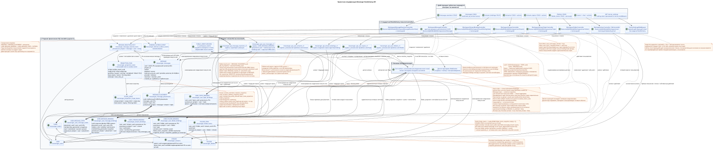

# Проектная спецификация RestAlchemy API Messenger

Статус: **проектная спецификация реализации; документация до реализации**.

Этот документ показывает, как действующий Workspace/Messenger v1 API может
быть реализован через обычные RestAlchemy-модели, простые SQL-представления и
физические доменные строки. Он не меняет ни одного публичного маршрута, HTTP-
метода, JSON-поля, действия, события или полезной нагрузки WebSocket. Семантика
UUID сообщения целенаправленно меняется на placement identity, а пагинация и
видимое клиенту время распространения изменений получают явно принятые
ограничения совместимости. Эти изменения требуют release note и отдельного
migration/cutover mapping.
Канонический действующий контракт находится в
[`workspace_api.md`](workspace_api.md). Доменные инварианты и фоновые пути
описаны в [`messenger_domain_model.md`](messenger_domain_model.md) и
[`messenger_api_domain_model.md`](messenger_api_domain_model.md).

Текущие `StoreResourceController`, `sql_canonical_store`, тяжёлые представления,
внутреннее наследование моделей и существующее разбиение классов контроллеров не
являются архитектурным образцом. В этом документе они используются только как
источник наблюдаемого публичного контракта и считаются заменяемыми.

## Граница проектного решения и текущего контракта

Подтверждённые инварианты целевого дизайна:

1. `MESSAGE` хранит каноническое содержимое, автора, `source`/`provider`/`delivery` и
   публичные `created_at`/`updated_at` ровно один раз.
2. Физический `MESSAGE_PLACEMENT` задаёт глобальный контекст потока и темы для
   канонического сообщения. `MESSAGE_PLACEMENT` представляет размещение (placement), а
   `USER_MESSAGE_BINDING` — привязку (binding), которая даёт пользователю доступ к
   конкретному размещению, а единственный `(project,user,placement)`
   `USER_MESSAGE_STATE` хранит персональные `read`, `mentioned`, `starred`,
   `pinned` и аналогичные флаги уровня сообщения.
3. `WorkspaceUserMessage.uuid` и UUID во всех URL и ответах сообщений — это
   `MESSAGE_PLACEMENT.uuid = UUIDv5(namespace=TOPIC.uuid, name=MESSAGE.uuid)`.
   `MESSAGE.uuid` и `USER_MESSAGE_BINDING.uuid` остаются внутренними.
4. Несколько размещений одной канонической `MESSAGE` дают несколько строк с
   разными публичными UUID и разными stream/topic. Персональное состояние
   placement-scoped и приходит из `USER_MESSAGE_STATE`.
5. Стабильная UI-ссылка содержит UUID placement; она однозначно задаёт контекст
   stream/topic. Canonical content UUID клиенту не нужен.
6. Представление `WorkspaceUserMessage` основано на одной строке привязки пользователя и делает только
   индексированные соединения с одним размещением, одной `MESSAGE` и одним состоянием пользователя.
   Публичные метки времени всегда приходят из `MESSAGE`.
7. Синхронная отправка в одной транзакции создаёт `MESSAGE`,
   `MESSAGE_PLACEMENT`, авторские `USER_MESSAGE_BINDING` и
   `USER_MESSAGE_STATE`, а также неизменяемые записи transactional outbox — по
   одной для каждой выводимой initial typed task.
   Это даёт немедленный ответ автору с готовыми персональными флагами без
   ленивого создания state. Worker (фоновый исполнитель) вместе с каждой
   привязкой получателя создаёт его `USER_MESSAGE_STATE`; он не ищет работу
   сканированием отсутствующих привязок.
8. Пул worker имеет настраиваемый предел параллельности. Topic-scoped work
   эксклюзивно владеет темой и внутри неё выбирает `MESSAGE.created_at DESC`;
   shared projections используют собственные exact scopes. Эти правила не
   добавляют нового публичного API.
9. `revision` у привязки сообщения отсутствует.
10. Исходный факт реакции принадлежит канонической `MESSAGE`; API меняет одну строку факта,
    а эксклюзивный owner scope `message` материализует публичные снимки `reactions` и
    `reaction_users`, доступные только для чтения, без цикла «прочитать–изменить–записать» в пути запроса.
    Снимки намеренно одинаковы во всех placements, включая разные аудитории.
11. Любая операция, изменяющая состояние, атомарно пишет неизменяемое доменное событие в outbox.
    Каждое событие порождает ровно одну отдельную immutable typed projection task
    с уникальным `outbox_event_uuid`; initial design не использует coalescing.
    `GET` и операции списка задач не создают.
12. Worker в одной DB transaction фиксирует materialized state и все
    соответствующие durable ready WebSocket event rows. Отдельный dispatcher
    только читает event store, отправляет/повторяет/воспроизводит и владеет
    сетевыми соединениями.
13. UUID-ссылки, которые текущий публичный JSON передаёт как UUID, объявляются в
    API RestAlchemy-моделях обычными `properties.property(types.UUID())`, а не
    `relationships.relationship`: такая связь сериализовалась бы как URI и
    сломал контракт. Соответствующие физические столбцы `*_uuid` остаются
    индексированными внешними ключами с явным действием ссылочной целостности.
14. Если создание потока содержит `direct_user_uuid`, доменная команда всегда
    сохраняет `private=true`. Значение, равное UUID текущего `owner`, создаёт
    чат с самим собой с единственной привязкой пользователя; сообщения в нём получают только
    авторскую привязку и отображаются ровно один раз.
15. `STREAM`, `TOPIC` и `FOLDER` — канонические сущности в единственном экземпляре. Готовые
    персональные агрегаты непрочитанных сообщений и упоминаний хранятся прямо в уникальных
    привязках пользователя к потоку, теме и папке. Привязка и состояние для отдельного сообщения
    хранят только доступ, `read_at` и персональные флаги; счётчики контейнеров там
    запрещены.
16. `USER_STREAM_BINDING` — persistent lifecycle row с `active` и монотонным
    `membership_generation`. Revoke синхронно запрещает message/reaction access;
    stale tasks старого generation не могут восстановить доступ.
17. Все публичные операции списка ограничены: значение по умолчанию `100`,
    жёсткий максимум `500`; отсутствие `page_limit` и `page_limit=0` означают
    `100`, а отрицательное, нецелое и большее `500` значение дают HTTP `400`.
18. `2xx`/`201` подтверждает фиксацию первичной мутации, а не завершение всех
    проекций. Автор получает немедленное read-your-write; получатели, счётчики,
    materialized snapshots и готовые публичные события появляются асинхронно.
19. `TOPIC.is_done` — канонический глобальный признак темы. Он не принадлежит
    пользовательской привязке; `USER_TOPIC_BINDING` хранит только доступ,
    уведомления, персональные настройки и готовые пользовательские агрегаты.

Имена `messenger_*` ниже — точные имена **этого проектного решения**, а не разрешение на
миграцию. До отдельного проекта миграции производственная схема не меняется.

## Обзор слоёв



Редактируемый PlantUML-исходник:
[`messenger_restalchemy_api_spec.puml`](diagrams/messenger_restalchemy_api_spec.puml).

```text
текущий маршрут -> стандартные RA-контроллер и ресурс -> представление формы только для чтения
                                                               \-> записываемая физическая модель
```

SQL-представление в целевом дизайне является только адаптером формы. Одна ведущая
физическая строка даёт одну выходную строку; разрешены индексированные соединения «один к одному» и «многие к одному»
`LEFT JOIN`/`INNER JOIN`. Запрещены агрегаты, `GROUP BY`, оконные функции,
латеральные и коррелированные подзапросы, а также fan-out/распределение «один ко многим».

## Общие соглашения RestAlchemy

### Область, транзакция и пагинация

- Промежуточное ПО IAM передаёт `project_id` и текущий `user_uuid` в контекст запроса.
- `get_autofilters()` добавляет область ко всем `get`/`filter`/`update`/`delete`;
  клиент не может заменить её полями JSON или строки запроса.
- `get_autovalues()` задаёт принадлежащую серверу область при создании.
- Транзакция запроса RestAlchemy одна. Доменные действия получают текущий
  `session`; отдельный `engine_factory.session_manager()` не открывается.
- Коллекции используют `BaseResourceControllerPaginated` и сохраняют
  `page_limit`, `page_marker`, `X-Pagination-Limit` и
  `X-Pagination-Marker`; `sort_key=created_at&sort_dir=asc|desc` остаётся
  неизменным.
- Фактическая текущая семантика исполнения содержит подтверждённый пробел:
  общие RestAlchemy и `StoreResourceController` задают
  `_pagination_limit = 0`. Поэтому отсутствующий `page_limit` и
  `page_limit=0` сейчас дают `limit=None` и безлимитное чтение;
  отрицательные и нецелочисленные значения возвращают HTTP `400`, а для слишком большого положительного
  значения нет ни жёсткого максимума, ни ограничения сверху. Это не целевое
  поведение.
- Целевая политика едина для всех публичных операций списка: отсутствующий
  `page_limit` и `page_limit=0` дают `100`; значения `1..500` применяются
  точно; отрицательное, нецелочисленное и большее `500` значение возвращает
  HTTP `400` без silent clamp. Неограниченного режима и обхода правила нет.
- Для `GET .../topic_summary_endpoints/`, который сейчас не принимает параметры
  пагинации, target-контроллер принимает те же `page_limit`/`page_marker`,
  сохраняет JSON-массив без нового envelope и добавляет стандартные
  `X-Pagination-Limit`/`X-Pagination-Marker`. Это сознательное observable
  изменение, а не описание текущего исполнения.
- Индексы маршрутов возвращают конечный статический реестр зарегистрированных
  путей и не выполняют чтение пользовательской коллекции из БД; они структурно
  ограничены самим реестром и не являются обходом политики resource-list.
- Публичный message marker является placement UUID. Целевой контроллер
  восстанавливает его в той же viewer/project/filter scope и использует
  стабильный кортеж `(MESSAGE.created_at,MESSAGE_PLACEMENT.uuid)`; скрытый
  `binding_uuid` в marker не входит.
- Поля, допускающие `null`, могут отсутствовать в стандартном выводе REST-упаковщика; примеры JSON
  ниже показывают полную форму, в которой проекция, допускающая `null`, явно
  равна `null`.

### UUID-свойства в API и внешние ключи в БД {#uuid-свойства-в-api-и-внешние-ключи-в-бд}

Связь RestAlchemy является значением API в форме URI. Поэтому публичные поля
`owner`, `author_uuid`, `user_uuid`, `message_uuid`, `stream_uuid`,
`topic_uuid`, `direct_user_uuid`, `default_topic_uuid` и
другие UUID-ссылки текущего контракта объявляются обычными UUID-свойствами.
Объект связи не участвует в их сериализации. Это правило относится и к
записываемым физическим RestAlchemy-моделям: приложение работает со скалярными UUID,
а миграция схемы создаёт реальное ограничение и индекс для базового
столбца `*_uuid`. `project_id` остаётся областью IAM; внутренние
`scope_kind`/`scope_key` outbox и tasks кодируют точный составной ключ области,
а не являются ложным внешним ключом сразу на несколько таблиц.

`MESSAGE_PLACEMENT.uuid` объявляется скалярным UUID-свойством и публикуется как
`WorkspaceUserMessage.uuid`. Внутренний `MESSAGE.uuid` и скрытый `binding_uuid`
также остаются скалярными UUID/FK/ключами, но разрешения полей не выпускают их в
текущий message JSON.

Целевые ограничения основного проектного решения:

| UUID-свойство RestAlchemy | Физический индексированный столбец и цель | Действие ссылочной целостности |
| --- | --- | --- |
| сообщение `author_uuid` | `messenger_messages.author_uuid -> messenger_users.uuid` | `ON DELETE RESTRICT` |
| размещение `message_uuid` | `messenger_message_placements.message_uuid -> messenger_messages.uuid` | `ON DELETE CASCADE` |
| размещение `stream_uuid` | `messenger_message_placements.stream_uuid -> messenger_streams.uuid` | `ON DELETE CASCADE` |
| обязательное размещение `topic_uuid` | `messenger_message_placements.topic_uuid -> messenger_topics.uuid` | `ON DELETE CASCADE` |
| привязка пользователя `placement_uuid` | `messenger_user_message_bindings.placement_uuid -> messenger_message_placements.uuid` | `ON DELETE CASCADE` |
| привязка пользователя `user_uuid` | `messenger_user_message_bindings.user_uuid -> messenger_users.uuid` | `ON DELETE CASCADE` |
| состояние пользователя `placement_uuid` / `user_uuid` | соответствующие UUID размещения и пользователя | `ON DELETE CASCADE` |
| факт реакции `canonical_message_uuid` / `user_uuid` | соответствующие UUID канонического сообщения и пользователя | `ON DELETE CASCADE` |
| поток `owner` | физический `messenger_streams.owner_uuid -> messenger_users.uuid`; псевдоним в публичном представлении остаётся `owner` | `ON DELETE RESTRICT` |
| поток `direct_user_uuid` | `messenger_streams.direct_user_uuid -> messenger_users.uuid` | `ON DELETE RESTRICT` |
| поток `default_topic_uuid` | `messenger_streams.default_topic_uuid -> messenger_topics.uuid` | `ON DELETE SET NULL` |
| привязка потока `stream_uuid` / `user_uuid` | соответствующие UUID потока и пользователя | `ON DELETE CASCADE` |
| привязка потока `who_uuid` | `messenger_stream_bindings.who_uuid -> messenger_users.uuid` | `ON DELETE RESTRICT` |
| привязка пользователя к потоку `stream_uuid` / `user_uuid` | соответствующие UUID потока и пользователя | `ON DELETE CASCADE` |
| привязка пользователя к папке `folder_uuid` / `user_uuid` | соответствующие UUID папки и пользователя | `ON DELETE CASCADE` |
| тема `stream_uuid` | `messenger_topics.stream_uuid -> messenger_streams.uuid` | `ON DELETE CASCADE` |
| публичные ссылки `summary_last_message_uuid` / `last_message_uuid` | соответствующий публичный UUID placement | `ON DELETE SET NULL` |
| привязка пользователя к теме `topic_uuid` / `user_uuid` | соответствующие UUID темы и пользователя | `ON DELETE CASCADE` |

Для tenant-owned edges миграция должна использовать составные unique/FK по
`project_id`, а placement дополнительно обязан ссылаться на topic, принадлежащий
тому же stream/project. `TOPIC.uuid` глобально уникален и ownership неизменяем.
`USER_STREAM_BINDING` сохраняется при revoke как tombstone; её business key
остаётся уникальным, а `(active,membership_generation)` является persistent
security state. `USER_MESSAGE_BINDING.membership_generation` — snapshot этого
поколения и участвует в индексированном access predicate.

`WorkspaceStream.owner` в API и RestAlchemy-модели чтения остаётся UUID-свойством и
сериализуется ровно как UUID пользователя. Физический записываемый столбец называется
`owner_uuid`; представление потока без вычислений даёт скалярный псевдоним
`owner_uuid AS owner`. Ни публичный ресурс, ни физический внешний ключ не превращаются в
связь RestAlchemy или URI. DDL здесь не создаётся: таблица фиксирует
обязательные ограничения для будущего проекта миграции.

### ADR: tenant isolation и текущая граница ролей

Каждая каноническая, projection, binding/state, outbox, task и public-event
строка, которой применима tenant-область, содержит `project_id`. Физические
таблицы задают `UNIQUE(project_id, uuid)` и составные FK
`(project_id, referenced_uuid)` для `MESSAGE`, `MESSAGE_PLACEMENT`, user
bindings/state, `TOPIC`, `STREAM`, `FOLDER`, `FOLDER_ITEM`, reaction facts,
outbox/tasks/events. Составные FK placement -> topic/stream гарантируют, что
`TOPIC` принадлежит указанному `STREAM` и тому же project. Worker queries,
scope keys и migration/backfill joins всегда включают `project_id`.

API переиспользует текущие `ModelWithProject`, request project scope, session и
RestAlchemy filters. Lookup/list/action вне current project или для невидимого
ресурса даёт `404`; видимый ресурс с недостаточным разрешением — `403`.
Mutation повторно читает/блокирует project-scoped resource и проверяет active
membership/permission внутри той же транзакции, а не доверяет preflight view.

Наблюдаемая current-runtime матрица ниже не превращает отсутствие policy в
новое target-разрешение:

| Операция current API | `guest` | `member` | `moderator` | `administrator` | `owner` | Target role |
| --- | --- | --- | --- | --- | --- | --- |
| `add_users` из видимого stream | runtime разрешает | runtime разрешает | runtime разрешает | runtime разрешает | runtime разрешает | **OPEN:** target permission/assignable-role matrix не наследует отсутствие current проверки |
| `PUT stream_bindings/{uuid}` non-direct | actor role не проверяется; project-only lookup | то же | то же | то же | то же | **OPEN:** actor × target-role/self matrix |
| `DELETE stream_bindings/{uuid}` non-direct | actor role не проверяется; project-only lookup | то же | то же | то же | то же | **OPEN:** actor × target-role/self и last-owner rule |
| update/delete binding direct/self | `400` | `400` | `400` | `400` | `400` | membership/role immutable |

`add_users` требует видимость родительского `WorkspaceUserStream`, поэтому actor
является участником, но role hierarchy current code не проверяет. Binding
get/update/delete сейчас project-scoped, но не проверяет role actor или его
membership в target stream. `workspace_api.md` фиксирует role literals и
immutable direct membership, но не объявляет non-direct permission matrix.

Tenant-integrity часть Risk #7 закрыта составными ключами и transactional
recheck. Role/action часть остаётся точечно OPEN: какие roles могут добавлять
участников и назначать target role; кто меняет/удаляет свою или чужую binding;
обязателен ли хотя бы один `owner`; разрешены ли self-demotion/self-removal
последнего owner. Если owner обязателен, mutation блокирует stream и owner
bindings либо использует version/CAS, проверяет post-state `owner_count >= 1` и
лишь затем commit; конкурентные операции не оставляют ноль owners. Direct/self
правила закрыты: membership равно identity pair, update/add/remove binding дают
`400`, self-chat содержит одного owner, delete self-chat stream тоже даёт `400`.

Минимальные общие примеси проектного решения:

```python
from restalchemy.common import contexts
from restalchemy.dm import filters


class RequestSessionMixin:
    @property
    def session(self):
        return contexts.Context().get_session()


class ProjectScopeMixin(RequestSessionMixin):
    def get_autofilters(self):
        return {
            "project_id": filters.EQ(self.get_context().project_id),
        }

    def get_autovalues(self):
        return {
            "project_id": self.get_context().project_id,
        }


class ViewerScopeMixin(ProjectScopeMixin):
    def get_autofilters(self):
        result = super().get_autofilters()
        result["user_uuid"] = filters.EQ(self.get_context().user_uuid)
        return result

    def get_autovalues(self):
        result = super().get_autovalues()
        result["user_uuid"] = self.get_context().user_uuid
        return result


class BoundedPaginationMixin:
    _pagination_limit = 100
    _pagination_max_limit = 500

    def normalize_page_limit(self, value):
        # Proposal contract: omitted/0 -> 100; 1..500 exact; otherwise HTTP 400.
        return pagination_policy.validate(value, default=100, maximum=500)
```

Физические привязки в области пользователя используют обычную идентичность хранилища в этой области.
Их UUID не является публичным ID ресурса сообщения: путь ресурса принимает
`MESSAGE_PLACEMENT.uuid`, а контроллер отдельно проверяет привязки текущего
пользователя и active stream membership с generation.

```python
from restalchemy.dm import models
from restalchemy.dm import properties
from restalchemy.dm import types


class ProjectUserScopedModelWithUUID(models.ModelWithUUID):
    project_id = properties.property(
        types.UUID(), required=True, read_only=True, id_property=True,
    )
    user_uuid = properties.property(
        types.UUID(), required=True, read_only=True, id_property=True,
    )

    @classmethod
    def get_id_property(cls):
        return {"uuid": cls.properties.properties["uuid"]}
```

### Разрешения полей

`ResourceByRAModel` сохраняет стиль snake_case (`convert_underscore=False`) и
`process_filters=True`. Модели публичных представлений содержат полный плоский ответ;
`FieldsPermissions` отдельно задаёт доступную для записи поверхность CREATE/UPDATE. Внутренние внешние ключи,
учёт работы worker и исходное хранилище провайдера скрыты, а не объявляются доступными клиенту для записи.

### Общая HTTP-семантика

- `GET` коллекции: `200` и массив JSON;
- `POST` коллекции: `201` и полный созданный ресурс; повторное
  детерминированное создание прямого потока может вернуть существующий ресурс со статусом
  `200`;
- `GET`/`PUT` ресурса: `200` и полный ресурс;
- действие `POST .../invoke`: `200` и полный ресурс либо документированный
  список;
- успешный `DELETE`: `204`, тело отсутствует;
- некорректный или недопустимый доменный запрос: `400`; без аутентификации: `401`; недостаток
  прав: `403`; невидимый или отсутствующий ресурс в области: `404`.

### ADR: ограниченная пагинация и видимое время изменений

Статус: **принятое сознательное изменение поведения; Risk #5 закрыт**.

Все resource-list endpoints используют `page_limit`: отсутствие/`0` означает
`100`, `1..500` принимается точно, отрицательное, нецелое и большее `500`
значение даёт HTTP `400`. Endpoint-specific меньших ограничений в текущем
публичном Workspace-контракте не подтверждено; поэтому target overrides
отсутствуют. External Bridge Control API в эту политику не входит.

Клиенты, которые использовали отсутствие параметра или `0` как полный export,
должны читать страницы до отсутствия следующего marker. Публичный JSON не
меняется, но rollout требует release/compatibility note вместе с изменением
семантики message UUID.

Изменяющая транзакция синхронно фиксирует каноническое первичное состояние,
необходимые авторские placement/binding/state и один или несколько immutable
outbox events — ровно по одному для каждой выводимой initial typed task. После
commit автор получает immediate read-your-write. Recipient bindings/history,
агрегаты контейнеров, materialized snapshots и готовые публичные события
строятся асинхронно. Поэтому `2xx`/`201` означает принятие и фиксацию первичной
мутации, но не завершение всех фоновых проекций; другие пользователи могут
увидеть результат позже. Задержка около одной секунды — целевой SLO intent, а
не строгая гарантия до выбора и эксплуатации измеримого SLO.

Готовая запись WebSocket и проекция commit/rollback атомарно в одной worker DB
transaction. Получатель события после доставки может прочитать
соответствующее состояние через REST. Dispatcher не создаёт business event, а
сетевой send не влияет на его долговечность.

Reconnect обязателен через cursor replay без gap: клиент передаёт последний
обработанный cursor, сервер фиксирует high-watermark, воспроизводит все более
новые видимые durable rows, буферизует live tail и после drain переключает
соединение. Доставка at-least-once; клиент дедуплицирует по event UUID и
продвигает cursor только после обработки. Слишком старый cursor даёт явную
`epoch_pruned`/`410` ошибку; размер retention window остаётся operational
policy. Event audience rows несут membership generation, поэтому dispatcher и
replay не доставляют data events после revoke или из старого generation.

Точный общий конверт ошибки и коды приложения остаются в
[`workspace_api.md`](workspace_api.md#general-rules).

## Сообщения

### ADR: публичная identity сообщения через placement

Статус: **принято**. Это решение закрывает первый блокер Critic-review и
заменяет ранее обсуждавшуюся каноническую идентичность публичного ресурса.

Публичный `WorkspaceUserMessage.uuid`, `{message_uuid}`, `page_marker`,
`last_message_uuid` и ссылки событий означают `MESSAGE_PLACEMENT.uuid`.
Канонический `MESSAGE.uuid` остаётся внутренним FK единственной записи
содержимого. UUID placement вычисляется строго как
`UUIDv5(namespace=TOPIC.uuid, name=MESSAGE.uuid)`: name — только lowercase
hyphenated ASCII UUID канонического сообщения без braces, префиксов или иных
полей. Project и stream не включаются в name.

Повтор/retry одной пары topic/message возвращает тот же UUID; другой topic даёт
другой UUID. `TOPIC` обязателен и глобально уникален, неизменно принадлежит
одному `PROJECT`/`STREAM`. Его перенос означает новый topic и миграцию
placements. Авторитетная уникальность БД остаётся
`(project_id,message_uuid,stream_uuid,topic_uuid)`; UUIDv5 не заменяет составные
FK, unique constraint или проверку принадлежности topic.

HTTP paths и JSON keys не меняются, но смысл идентификатора меняется. До cutover
нужны backfill placement UUID, отображение прежних links/markers/events,
проверка коллизий и план совместимости/rollback. Этот rollout является
обязательной частью будущего migration design, а не неявной конвертацией в
request path.

### Физическое сообщение, размещение, привязка и состояние пользователя

`WorkspaceMessage` — записываемая каноническая модель. Контекст размещения, персональный
доступ и персональное состояние уровня сообщения являются тремя разными записываемыми
RestAlchemy-моделями. UUID-ссылки являются скалярными свойствами; физические
ограничения определены выше, а публичное представление сохраняет прежние UUID-поля.

```python
from restalchemy.dm import models
from restalchemy.dm import properties
from restalchemy.dm import types
from restalchemy.storage.sql import orm

from workspace.messenger_api.dm import message_payloads


class WorkspaceMessage(
    models.ModelWithUUID,
    models.ModelWithProject,
    models.ModelWithTimestamp,
    orm.SQLStorableMixin,
):
    __tablename__ = "messenger_messages"

    # Realm-global provider identity; cross-account project projection is the
    # one remaining Bridge boundary and must not choose an arbitrary account.
    PROVIDER_MAPPING_KEY = ("provider_realm_uuid", "provider_message_id")

    author_uuid = properties.property(
        types.UUID(), required=True, read_only=True,
    )
    payload = properties.property(
        message_payloads.WORKSPACE_MESSAGE_PAYLOAD_TYPE, required=True,
    )
    source_name = properties.property(
        types.Enum(["native", "zulip"]), default="native",
    )
    source = properties.property(types.Dict(), default=lambda: {"kind": "native"})
    provider_uuid = properties.property(
        types.AllowNone(types.UUID()), default=None, read_only=True,
    )
    provider_realm_uuid = properties.property(
        types.AllowNone(types.UUID()), default=None, read_only=True,
    )
    provider_message_id = properties.property(
        types.AllowNone(types.String(max_length=2048)), default=None,
        read_only=True,
    )
    provider = properties.property(types.AllowNone(types.Dict()), default=None)
    delivery = properties.property(types.AllowNone(types.Dict()), default=None)
    reactions = properties.property(types.Dict(), default=dict, read_only=True)
    reaction_users = properties.property(
        types.Dict(), default=dict, read_only=True,
    )


class WorkspaceMessagePlacement(
    models.ModelWithUUID,
    models.ModelWithProject,
    models.ModelWithTimestamp,
    orm.SQLStorableMixin,
):
    __tablename__ = "messenger_message_placements"

    # Domain command sets uuid = UUIDv5(namespace=topic_uuid, name=message_uuid).

    BUSINESS_KEY = (
        "project_id", "message_uuid", "stream_uuid", "topic_uuid",
    )

    message_uuid = properties.property(
        types.UUID(), required=True, read_only=True,
    )
    stream_uuid = properties.property(
        types.UUID(), required=True, read_only=True,
    )
    topic_uuid = properties.property(
        types.UUID(), required=True, read_only=True,
    )


class WorkspaceUserMessageBinding(
    models.ModelWithUUID,
    models.ModelWithProject,
    models.ModelWithTimestamp,
    orm.SQLStorableMixin,
):
    __tablename__ = "messenger_user_message_bindings"

    BUSINESS_KEY = ("project_id", "placement_uuid", "user_uuid")

    placement_uuid = properties.property(
        types.UUID(), required=True, read_only=True,
    )
    user_uuid = properties.property(
        types.UUID(), required=True, read_only=True,
    )
    membership_generation = properties.property(
        types.Integer(min_value=1), required=True, read_only=True,
    )
    relation_role = properties.property(types.String(max_length=64), required=True)
    visibility = properties.property(types.String(max_length=64), required=True)
    permissions = properties.property(types.Dict(), required=True)


class WorkspaceUserMessageState(
    models.ModelWithUUID,
    models.ModelWithProject,
    models.ModelWithTimestamp,
    orm.SQLStorableMixin,
):
    __tablename__ = "messenger_user_message_states"

    BUSINESS_KEY = ("project_id", "user_uuid", "placement_uuid")

    placement_uuid = properties.property(
        types.UUID(), required=True, read_only=True,
    )
    user_uuid = properties.property(
        types.UUID(), required=True, read_only=True,
    )
    membership_generation = properties.property(
        types.Integer(min_value=1), required=True, read_only=True,
    )
    read_at = properties.property(
        types.AllowNone(types.UTCDateTimeZ()), default=None,
    )
    mentioned = properties.property(types.Boolean(), default=False)
    starred = properties.property(types.Boolean(), default=False)
    pinned = properties.property(types.Boolean(), default=False)
```

Будущая migration создаёт hidden realm-scoped provider mapping для
`(provider_realm_uuid,provider_message_id)`: importing account UUID, mutable
email/server URL и project не являются canonical provider identity. Эти поля
скрыты из public JSON и обеспечивают retry/resume fresh provider import; они не
сохраняют старые Workspace UUID. Public `provider.account_uuid` остаётся
current-contract access/account projection. Когда accounts одного realm
назначают один provider chat разным projects, физическое размещение общей
canonical row и выбор account projection остаются одним явным Bridge OPEN; до
решения нельзя назначать arbitrary primary account.

Numeric Zulip object UUIDs вычисляются единообразно:
`UUIDv5(namespace=verified_realm_uuid,
name="<entity_type>:<decimal_provider_id>")`. Разрешены только
`user`, `channel`, `message`, `attachment`; decimal ID — unsigned shortest
base-10 ASCII (`0` либо digits без leading zeros/sign/whitespace), name bytes —
точные ASCII/UTF-8 bytes. Realm text сначала канонизируется в lowercase
hyphenated UUID и разбирается в 16 RFC 4122/network-order octets. Project/account
UUID не участвуют в алгоритме.

Метки времени размещения, привязки и состояния — внутренние метки времени жизненного цикла. Они не
заменяют публичные метки времени сообщения. Проектное имя представления:
`messenger_api_user_messages_v1`.

`USER_MESSAGE_STATE.read_at` (или семантически эквивалентный сохранённый маркер)
является источником истины только для одной пары пользователя и размещения. Публичное логическое поле `read`
получается простым скалярным выражением `read_at IS NOT NULL`. Ни эта строка состояния,
ни `USER_MESSAGE_BINDING` не хранят агрегаты непрочитанных сообщений потока или папки: эти
счётчики принадлежат описанным ниже уникальным привязкам пользователя к контейнеру.

```python
from restalchemy.dm import models
from restalchemy.dm import properties
from restalchemy.dm import types
from restalchemy.storage.sql import orm

from workspace.messenger_api.dm import message_payloads


class WorkspaceUserMessage(
    models.ModelWithProject,
    models.ModelWithTimestamp,
    orm.SQLStorableMixin,
):
    __tablename__ = "messenger_api_user_messages_v1"

    binding_uuid = properties.property(
        types.UUID(), required=True, read_only=True, id_property=True,
    )
    uuid = properties.property(types.UUID(), required=True, read_only=True)
    canonical_message_uuid = properties.property(
        types.UUID(), required=True, read_only=True,
    )
    user_uuid = properties.property(types.UUID(), required=True, read_only=True)
    stream_uuid = properties.property(types.UUID(), required=True)
    topic_uuid = properties.property(types.UUID(), required=True)
    author_uuid = properties.property(types.UUID(), required=True, read_only=True)
    payload = properties.property(
        message_payloads.WORKSPACE_MESSAGE_PAYLOAD_TYPE, required=True,
    )
    read = properties.property(types.Boolean(), default=False, read_only=True)
    pinned = properties.property(types.Boolean(), default=False, read_only=True)
    starred = properties.property(types.Boolean(), default=False, read_only=True)
    is_own = properties.property(types.Boolean(), default=False, read_only=True)
    mentioned = properties.property(types.Boolean(), default=False, read_only=True)
    reactions = properties.property(types.Dict(), default=dict, read_only=True)
    reaction_users = properties.property(types.Dict(), default=dict, read_only=True)
    source_name = properties.property(
        types.Enum(["native", "zulip"]), default="native",
    )
    source = properties.property(types.Dict(), default=lambda: {"kind": "native"})
    provider = properties.property(
        types.AllowNone(types.Dict()), default=None, read_only=True,
    )
    delivery = properties.property(
        types.AllowNone(types.Dict()), default=None, read_only=True,
    )

    @classmethod
    def get_id_property(cls):
        # Unique technical ORM identity of one view row; never a public ID.
        return {"binding_uuid": cls.properties.properties["binding_uuid"]}
```

Приведённый выше `get_id_property()` намеренно **не** является публичной идентичностью сообщения.
Представлению без вычислений нужен уникальный ключ для восстановления и сопоставления объектов, тогда как
один placement имеет отдельную строку для каждого пользователя. Публичные JSON, ссылки и параметры маршрута
всегда используют `MESSAGE_PLACEMENT.uuid`; `binding_uuid` скрыт для каждого метода.
Поскольку стандартный `ResourceByRAModel.get_resource_id()` делегирует техническому ID модели,
целевому решению нужны показанные ниже узкий адаптер ресурса и поиск в контроллере по placement ID.
Это стандартное расширение RestAlchemy, а не специализированное SQL-хранилище.

Сопоставление представления:

| Публичное поле | Физический источник | Разрешение API | Путь записи |
| --- | --- | --- | --- |
| `uuid` | `MESSAGE_PLACEMENT.uuid` | детерминированный placement ID только для чтения | создание размещения |
| внутреннее `binding_uuid` | `USER_MESSAGE_BINDING.uuid` | скрыто, никогда не является ID ресурса | создание привязки автором или worker |
| внутреннее `canonical_message_uuid` | `MESSAGE.uuid` | скрыто | создание канонического сообщения |
| `project_id`, `user_uuid` | область привязки и состояния пользователя | только для чтения | IAM или worker |
| `stream_uuid`, `topic_uuid` | скалярные UUID-столбцы `MESSAGE_PLACEMENT`; индексированные внешние ключи в БД | только для создания в публичном API | начальное размещение |
| `read`, `mentioned`, `starred`, `pinned` | уникальное для placement `USER_MESSAGE_STATE`; публичное `read` — скалярное `read_at IS NOT NULL` | только для чтения в CRUD | действия или worker |
| `is_own` | скалярное равенство соединённых ID | только для чтения | не хранится как источник истины |
| `author_uuid`, `payload` | `MESSAGE.author_uuid/payload` | автор только для чтения; `payload` для создания и обновления | каноническое сообщение |
| `source_name`, `source` | `MESSAGE` | только для создания | каноническое сообщение |
| `provider`, `delivery` | материализованная проекция `MESSAGE` | только для чтения | путь провайдера или фоновый путь |
| `reactions`, `reaction_users` | материализованное каноническое состояние | только для чтения | изменение реакции или фоновый путь |
| `created_at`, `updated_at` | `MESSAGE.created_at/updated_at` | только для чтения | только каноническое сообщение |

Представление состоит ровно из одной ведущей `USER_MESSAGE_BINDING`, соединённой как «многие к одному»
с одной `MESSAGE_PLACEMENT`, одной активной `USER_STREAM_BINDING` того же
project/user/stream и текущего `membership_generation`, затем как «многие к
одному» с одной `MESSAGE`, а также индексированного
соединения «один к одному» с `USER_MESSAGE_STATE` по `(project_id,user_uuid,placement_uuid)`.
Оно сопоставляет `uuid <- placement.uuid`, скрытое `binding_uuid <- user_binding.uuid` и
скрытое `canonical_message_uuid <- message.uuid`. В нём нет вычислений получателей,
прав, реакций или непрочитанных сообщений. Условие active+generation является
security predicate, а не eventual projection. Пользователь с одним сообщением в
нескольких размещениях получает по одной строке на привязку; эти строки имеют разные
публичные placement UUID и placement-scoped state.

`MESSAGE_PLACEMENT` уникально по
`(project_id,message_uuid,stream_uuid,topic_uuid)`. Доступ получателя уникален
по `(project_id,placement_uuid,user_uuid)`. Персональное состояние уникально по
`(project_id,user_uuid,placement_uuid)` и переиспользуется только внутри этого
размещения. `topic_uuid` обязателен для каждого placement, включая direct/self
chat; `null`, sentinel и резервный вариант только по stream запрещены.

UUID placement вычисляется доменной командой до вставки:
`UUIDv5(namespace=TOPIC.uuid, name=MESSAGE.uuid)`. Name содержит только
lowercase hyphenated ASCII UUID канонического сообщения без braces, префиксов
или дополнительных полей. `TOPIC.uuid` глобально уникален; составные FK
гарантируют, что topic принадлежит указанным `project_id` и `stream_uuid`.
Ownership topic неизменяем: перенос означает новый topic и явную миграцию
placements. UUIDv5 не заменяет авторитетный business key и FK.

### Transactional outbox и типизированные задачи проекции

Каждая команда, изменяющая состояние, записывает неизменяемое доменное событие outbox в той же
транзакции, что и изменение физической исходной модели. Worker не сканирует
отсутствующие привязки и не сравнивает целые таблицы для поиска работы. Проектор
создаёт отдельную immutable typed task для каждого source event;
при выполнении задача читает последнее зафиксированное исходное состояние. `GET` и получение списка
коллекции никогда не создают события outbox или задачи.

```python
from restalchemy.dm import models
from restalchemy.dm import properties
from restalchemy.dm import types
from restalchemy.storage.sql import orm


TASK_KINDS = (
    "fanout",
    "content_mentions",
    "reaction_snapshot",
    "read_counters",
    "folder_projection",
    "delivery_snapshot_event",
    "topic_state_projection",
    "topic_membership_policy_rebuild",
)


class WorkspaceDomainOutboxEvent(
    models.ModelWithUUID,
    models.ModelWithProject,
    models.ModelWithTimestamp,
    orm.SQLStorableMixin,
):
    __tablename__ = "messenger_domain_outbox_events"

    event_kind = properties.property(types.Enum(TASK_KINDS), required=True)
    scope_kind = properties.property(types.String(max_length=64), required=True)
    scope_key = properties.property(types.String(max_length=512), required=True)
    payload = properties.property(types.Dict(), required=True)


class WorkspaceProjectionTask(
    models.ModelWithUUID,
    models.ModelWithProject,
    models.ModelWithTimestamp,
    orm.SQLStorableMixin,
):
    __tablename__ = "messenger_projection_tasks"

    DERIVATION_KEY = ("project_id", "outbox_event_uuid")

    outbox_event_uuid = properties.property(types.UUID(), required=True, read_only=True)
    task_kind = properties.property(types.Enum(TASK_KINDS), required=True)
    scope_kind = properties.property(types.String(max_length=64), required=True)
    scope_key = properties.property(types.String(max_length=512), required=True)
    payload = properties.property(types.Dict(), required=True)
    status = properties.property(types.Enum([
        "pending", "leased", "running", "completed", "failed", "dead_letter",
    ]), default="pending")
    lease_owner = properties.property(types.AllowNone(types.String()), default=None)
    fencing_token = properties.property(types.Integer(min_value=0), default=0)
    lease_expires_at = properties.property(
        types.AllowNone(types.UTCDateTimeZ()), default=None,
    )
    attempts = properties.property(types.Integer(min_value=0), default=0)
    next_retry_at = properties.property(
        types.AllowNone(types.UTCDateTimeZ()), default=None,
    )
    last_error = properties.property(
        types.AllowNone(types.String(max_length=4096)), default=None,
    )


class WorkspaceProjectionScopeLease(
    models.ModelWithUUID,
    models.ModelWithProject,
    models.ModelWithTimestamp,
    orm.SQLStorableMixin,
):
    __tablename__ = "messenger_projection_scope_leases"
    BUSINESS_KEY = ("project_id", "scope_kind", "scope_key")

    scope_kind = properties.property(types.String(max_length=64), required=True)
    scope_key = properties.property(types.String(max_length=512), required=True)
    owner = properties.property(types.AllowNone(types.String()), default=None)
    fencing_token = properties.property(types.Integer(min_value=0), default=0)
    lease_expires_at = properties.property(
        types.AllowNone(types.UTCDateTimeZ()), default=None,
    )


class WorkspaceFanoutRoot(
    models.ModelWithUUID,
    models.ModelWithProject,
    models.ModelWithTimestamp,
    orm.SQLStorableMixin,
):
    __tablename__ = "messenger_fanout_roots"
    DERIVATION_KEY = ("project_id", "outbox_event_uuid")

    outbox_event_uuid = properties.property(types.UUID(), required=True)
    placement_uuid = properties.property(types.UUID(), required=True)
    next_user_uuid = properties.property(types.AllowNone(types.UUID()), default=None)
    processed_count = properties.property(types.Integer(min_value=0), default=0)
    status = properties.property(
        types.Enum(["pending", "running", "completed", "failed"]),
        default="pending",
    )


class WorkspaceFanoutBatchTask(
    models.ModelWithUUID,
    models.ModelWithProject,
    models.ModelWithTimestamp,
    orm.SQLStorableMixin,
):
    __tablename__ = "messenger_fanout_batch_tasks"
    BUSINESS_KEY = ("project_id", "fanout_root_uuid", "batch_no")

    fanout_root_uuid = properties.property(types.UUID(), required=True)
    batch_no = properties.property(types.Integer(min_value=0), required=True)
    start_user_uuid = properties.property(types.AllowNone(types.UUID()), default=None)
    end_user_uuid = properties.property(types.AllowNone(types.UUID()), default=None)
    batch_size = properties.property(types.Integer(min_value=1, max_value=5000))
    status = properties.property(
        types.Enum(["pending", "leased", "running", "completed", "failed", "dead_letter"]),
        default="pending",
    )
    lease_owner = properties.property(types.AllowNone(types.String()), default=None)
    fencing_token = properties.property(types.Integer(min_value=0), default=0)
    lease_expires_at = properties.property(
        types.AllowNone(types.UTCDateTimeZ()), default=None,
    )
    attempts = properties.property(types.Integer(min_value=0), default=0)
    next_retry_at = properties.property(
        types.AllowNone(types.UTCDateTimeZ()), default=None,
    )
    last_error = properties.property(
        types.AllowNone(types.String(max_length=4096)), default=None,
    )
```

`batch_no` начинается с `0` и монотонно увеличивается только после commit
предыдущего batch. Он является non-null idempotency key; nullable
`start_user_uuid` остаётся исключительно keyset boundary, поэтому PostgreSQL
семантика нескольких `NULL` не может создать дубликаты первого batch.

Эти имена являются внутренними именами проектного решения, а не публичными ресурсами. Неизменяемое
событие outbox сохраняет каждый переход состояния; ровно одна immutable task
ссылается на него уникальным `outbox_event_uuid`. Повторная derivation является
идемпотентным conflict/no-op и не создаёт дубликат. Если процесс падает между
append и derivation, индексированный reconciliation `OUTBOX LEFT JOIN TASK` по
UUID создаёт пропущенную task; события не теряются.

Worker атомарно получает lease с новым fencing token, переводит task из
`pending`/retryable `failed` в `leased`/`running` и может завершить запись только
с тем же token. Expired lease возвращает reaper/reconciliation. Ошибка увеличивает
`attempts`, задаёт `next_retry_at` с backoff; после configurable max attempts
task переходит в DLQ (`dead_letter`). Handler и projection writes идемпотентны по
`outbox_event_uuid`. Обязательные метрики: outbox/task lag, retry rate, oldest
pending/running age, expired leases, stuck tasks и DLQ size.

Initial design сознательно платит большим числом tasks за простую доказуемую
семантику. Нужны capacity/backpressure limits и честный throughput budget.
Coalescing может рассматриваться только как будущая отдельная оптимизация после
измерений и не является частью этой модели.

### Bounded fan-out batches

Одна immutable `fanout` root task по-прежнему однозначно выводится из одного
source outbox event. Она порождает последовательность immutable child
`fanout_batch` units; это не coalescing и не объединение source events. Их
уникальный derivation key — `(project_id, fanout_root_uuid, batch_no)`;
`start_user_uuid` остаётся только допускающей `null` keyset boundary. Каждый
batch использует тот же обязательный lease/fencing/retry/backoff/DLQ/reaper
протокол, поэтому retry повторяет только этот batch.

Настройка размера batch имеет default `1000` recipients и runtime hard maximum
`5000`. Значение `<=0` или `>5000` отклоняется при validation/startup; silent
clamp и небезопасный unbounded batch запрещены. Default и maximum должны быть
load-tested и остаются tunable в пределах указанного hard maximum.

Recipient scan использует stable keyset, не `OFFSET`: активные
`USER_STREAM_BINDING` заданных project/stream выбираются по
`user_uuid ASC`, с условием `user_uuid > start_user_uuid`; автор исключается.
Для каждого кандидата batch повторно проверяет `active=true` и ожидаемый
`membership_generation`. Re-add/изменение membership, уже прошедшее cursor,
обслуживается отдельным membership/history event, поэтому cursor не
возвращается назад и не переиспользует старое state.

Каждый batch выполняется короткой DB transaction: bulk insert/upsert
`USER_MESSAGE_BINDING` + placement-scoped `USER_MESSAGE_STATE`, immutable
downstream outbox/tasks фактических scopes и все соответствующие durable ready
events фиксируются вместе. Unique binding/state keys и source/batch derivation
keys делают retry одного batch идемпотентным; повтор не переигрывает уже
зафиксированные предыдущие batches. Следующий batch row и новый checkpoint
создаются только в commit предыдущего. Root хранит cursor, processed count,
status и completion.

Topic scheduler сначала выбирает fan-out roots по `MESSAGE.created_at DESC`, но
после каждого bounded batch освобождает/requeue claim так, чтобы старые
batch/history tasks получали bounded fairness. Queue admission и backpressure
учитывают project/topic и configured concurrency; одна огромная аудитория не
может занять unbounded transaction или бесконечно вытеснять другие topics.

Transaction-time intent для batch — `<=1s p95` после измерений; это не hard API
guarantee до benchmark. Обязательные метрики: batch latency, rows processed,
WAL bytes если доступны, recipients remaining, fan-out lag, oldest pending
batch, retry rate и DLQ. Большая аудитория поддерживается множеством batches.

`scope_key` — внутреннее индексируемое представление **точного** составного
ключа из следующей таблицы; оно не является публичным UUID. Формат кодирования
ключа выбирается при проектировании хранения, но не может терять ни один
компонент tuple. Один `WorkspaceProjectionScopeLease` с fencing token разрешает
одновременно писать один exact scope; разные keys/scopes параллельны.

| Task kind/effect | `scope_kind` и фактический scope key | Гарантия |
| --- | --- | --- |
| `fanout`, placement-scoped `content_mentions`, history/backfill | `topic`: `(project_id, topic_uuid)` | последовательный newest-first placement processing внутри темы |
| `reaction_snapshot`/canonical snapshot | `message`: `(project_id, canonical_message_uuid)` | один автор canonical `MESSAGE` snapshots |
| stream aggregates | `user-stream`: `(project_id, user_uuid, stream_uuid)` | один автор соответствующей `USER_STREAM_BINDING` |
| `folder_projection` | `user-folder`: `(project_id, user_uuid, folder_uuid)` | один автор normalized items, ready `USER_FOLDER_BINDING` snapshot/counts и event rows |
| topic aggregates | `user-topic`: `(project_id, user_uuid, topic_uuid)` | один автор `USER_TOPIC_BINDING` |
| `topic_state_projection` | `topic`: `(project_id, topic_uuid)` | события и необязательные rebuildable copies после canonical `TOPIC.is_done` commit |
| delivery/иная shared row | отдельный явно объявленный kind/key физической строки | fallback на `topic` запрещён |

Topic worker не выполняет unsafe read-modify-write shared rows. Atomic SQL
increment/decrement счётчика допустим только с exactly-once effect guard,
уникальным по `outbox_event_uuid`; иначе владелец фактического scope читает
последнее source state и заменяет проекцию. Если один доменный переход требует
нескольких scope effects, API transaction пишет отдельное immutable outbox
event для каждой выводимой task: инвариант «один event — одна task» сохраняется.
Результаты разных scopes фиксируются и становятся видимыми независимо в рамках
eventual consistency.

Membership-dependent payload содержит ожидаемый
`membership_generation` для каждого user/stream target. Worker выполняет
conditional create/upsert recipient binding/state только если physical
`USER_STREAM_BINDING.active=true` и generation по-прежнему равен ожидаемому.
Несовпадение означает idempotent no-op: stale fan-out/history/backfill не может
воскресить доступ. Созданные `USER_MESSAGE_BINDING` и `USER_MESSAGE_STATE`
сохраняют generation snapshot. При новом membership lifecycle conditional
upsert переводит обе уникальные строки на новое generation и атомарно
сбрасывает персональные флаги state к defaults; прежние `read/star/pin/hidden`
не переиспользуются. Optional cleanup старых поколений не является
security-critical.

### Контроллер и ресурс сообщения

```python
from restalchemy.api import actions
from restalchemy.api import constants
from restalchemy.api import controllers
from restalchemy.api import field_permissions
from restalchemy.api import resources
from restalchemy.dm import filters


class WorkspaceUserMessageResource(resources.ResourceByRAModel):
    def get_resource_id(self, model):
        # Location/resource identity exposed to the client.
        return str(model.uuid)

    def get_id_type(self):
        return self.get_property_type("uuid")


MESSAGE_FIELDS = field_permissions.FieldsPermissions(
    default=field_permissions.Permissions.RO,
    fields={
        "binding_uuid": {
            constants.ALL: field_permissions.Permissions.HIDDEN,
        },
        "canonical_message_uuid": {
            constants.ALL: field_permissions.Permissions.HIDDEN,
        },
        "stream_uuid": {
            constants.CREATE: field_permissions.Permissions.RW,
        },
        "topic_uuid": {
            constants.CREATE: field_permissions.Permissions.RW,
        },
        "payload": {
            constants.CREATE: field_permissions.Permissions.RW,
            constants.UPDATE: field_permissions.Permissions.RW,
        },
        "source_name": {
            constants.CREATE: field_permissions.Permissions.RW,
        },
        "source": {
            constants.CREATE: field_permissions.Permissions.RW,
        },
    },
)


class WorkspaceMessageController(
    ViewerScopeMixin,
    controllers.BaseResourceControllerPaginated,
):
    __default_sort__ = {"created_at": "asc"}
    __sortable_fields__ = ("created_at",)
    __resource__ = WorkspaceUserMessageResource(
        WorkspaceUserMessage,
        convert_underscore=False,
        process_filters=True,
        fields_permissions=MESSAGE_FIELDS,
    )

    def get(self, uuid):
        # The public path always carries MESSAGE_PLACEMENT.uuid.
        return message_queries.visible_by_placement_uuid(
            context=self.get_context(), placement_uuid=uuid, session=self.session,
        )

    def create(self, **values):
        # One transaction: message + placement + author binding/state + outbox.
        return message_commands.send(
            context=self.get_context(), values=values, session=self.session,
        )

    def update(self, uuid, **values):
        return message_commands.edit(
            context=self.get_context(), placement_uuid=uuid,
            payload=values["payload"], session=self.session,
        )

    def delete(self, uuid):
        message_commands.hard_delete(
            context=self.get_context(), placement_uuid=uuid, session=self.session,
        )

    @actions.post
    def read(self, resource, *args, **kwargs):
        return message_commands.set_read_by_placement_uuid(
            context=self.get_context(), placement_uuid=resource.uuid,
            value=True, session=self.session,
        )

    @actions.post
    def read_up_to(self, resource, *args, **kwargs):
        return message_commands.read_through(
            context=self.get_context(), placement_uuid=resource.uuid,
            session=self.session,
        )

    @actions.post
    def star(self, resource, *args, **kwargs):
        return message_commands.set_starred_by_placement_uuid(
            context=self.get_context(), placement_uuid=resource.uuid,
            value=True, session=self.session,
        )

    @actions.post
    def unstar(self, resource, *args, **kwargs):
        return message_commands.set_starred_by_placement_uuid(
            context=self.get_context(), placement_uuid=resource.uuid,
            value=False, session=self.session,
        )
```

`message_commands` здесь обозначает узкий модуль доменных действий над
объектами RestAlchemy и физическими моделями, а не специализированное хранилище и не написанный вручную
SQL. Он всегда получает `session` запроса. `visible_by_placement_uuid` тоже
работает через индексированные модели привязок, обязательно соединяет активную
`USER_STREAM_BINDING` и проверяет generation snapshot, после чего
восстанавливает ровно один контекст для текущего пользователя. Та же проверка
повторяется внутри каждой изменяющей команды до записи; visibility binding без
активного membership не является authorization.
Стандартный RestAlchemy `get()` по `get_id_property()` здесь не используется:
публичная диспетчеризация получения, обновления, удаления и действий принимает
placement UUID и проходит через показанные переопределения. Узкий pagination
adapter также формирует `X-Pagination-Marker` из `model.uuid`, восстанавливает
видимый marker по `(project_id,current_user,placement_uuid)` и строит
RestAlchemy filters для кортежа
`(MESSAGE.created_at sort_dir,MESSAGE_PLACEMENT.uuid ASC)`. Скрытый
`binding_uuid` не входит ни в marker, ни в публичную сортировку.

### Покрытие конечных точек сообщений

| Операция | Текущий маршрут | Целевые чтение и запись | Тело | Успешный ответ |
| --- | --- | --- | --- | --- |
| список | `GET /api/workspace/v1/messenger/messages/` | `WorkspaceMessageController` -> публичное представление | без тела; фильтры и пагинация ниже | `200`, `MESSAGE_LIST_RESPONSE` |
| создание | `POST /api/workspace/v1/messenger/messages/` | `MESSAGE` + `MESSAGE_PLACEMENT` + авторские `USER_MESSAGE_BINDING`/`USER_MESSAGE_STATE` + неизменяемые outbox events 1:1 с initial tasks | `MESSAGE_CREATE_REQUEST` | `201`, `MESSAGE_RESPONSE` |
| получение | `GET /api/workspace/v1/messenger/messages/{message_uuid}` | placement UUID + доступ текущего пользователя | без тела | `200`, `MESSAGE_RESPONSE` |
| обновление | `PUT /api/workspace/v1/messenger/messages/{message_uuid}` | placement UUID -> каноническое `MESSAGE.payload` после проверки прав | `MESSAGE_UPDATE_REQUEST` | `200`, `MESSAGE_EDIT_RESPONSE` |
| удаление | `DELETE /api/workspace/v1/messenger/messages/{message_uuid}` | placement UUID -> удаление канонического корня по принятой текущей семантике | без тела | `204`, пустое тело |
| прочтение | `POST .../{message_uuid}/actions/read/invoke` | placement UUID -> уникальное placement-scoped `USER_MESSAGE_STATE` | без тела | `200`, `MESSAGE_READ_RESPONSE` |
| прочтение до сообщения | `POST .../{message_uuid}/actions/read_up_to/invoke` | placement UUID однозначно задаёт stream/topic boundary | без тела | `200`, `MESSAGE_READ_RESPONSE` |
| добавление в избранное | `POST .../{message_uuid}/actions/star/invoke` | placement UUID -> placement-scoped `USER_MESSAGE_STATE` | без тела | `200`, `MESSAGE_STAR_RESPONSE` |
| удаление из избранного | `POST .../{message_uuid}/actions/unstar/invoke` | placement UUID -> placement-scoped `USER_MESSAGE_STATE` | без тела | `200`, `MESSAGE_RESPONSE` |

Пример списка:

```http
GET /api/workspace/v1/messenger/messages/?stream_uuid=75309057-419c-4b12-a7c1-3932429ec4a6&topic_uuid=4ec0b996-b778-45f8-8ef4-ef863be0c047&sort_key=created_at&sort_dir=desc&page_limit=50&page_marker=a93dca35-3061-4748-bda4-7f6f8c660ea5
```

Если существует следующая страница, ответ содержит заголовки:

```text
X-Pagination-Limit: 50
X-Pagination-Marker: 6e486abb-d881-4a50-9843-2c8514908835
```

`MESSAGE_CREATE_REQUEST`:

```json
{
  "stream_uuid": "75309057-419c-4b12-a7c1-3932429ec4a6",
  "topic_uuid": "4ec0b996-b778-45f8-8ef4-ef863be0c047",
  "payload": {
    "kind": "markdown",
    "content": "Hello, workspace"
  }
}
```

`topic_uuid` можно опустить или передать как `null` в публичном запросе; в этом
случае команда до создания placement обязана разрешить каноническую тему по
умолчанию, иначе возвращается `400` с кодом `400001007`. Физическая
`MESSAGE_PLACEMENT.topic_uuid` после разрешения всегда non-null, включая
direct/self chat.

`MESSAGE_UPDATE_REQUEST`:

```json
{
  "payload": {
    "kind": "markdown",
    "content": "Edited text"
  }
}
```

`MESSAGE_RESPONSE`:

```json
{
  "uuid": "a93dca35-3061-4748-bda4-7f6f8c660ea5",
  "project_id": "22222222-2222-2222-2222-222222222222",
  "stream_uuid": "75309057-419c-4b12-a7c1-3932429ec4a6",
  "topic_uuid": "4ec0b996-b778-45f8-8ef4-ef863be0c047",
  "author_uuid": "11111111-1111-1111-1111-111111111111",
  "payload": {
    "kind": "markdown",
    "content": "Hello, workspace"
  },
  "user_uuid": "11111111-1111-1111-1111-111111111111",
  "read": true,
  "pinned": false,
  "starred": false,
  "is_own": true,
  "mentioned": false,
  "reactions": {},
  "reaction_users": {},
  "source_name": "native",
  "source": {
    "kind": "native"
  },
  "provider": null,
  "delivery": null,
  "created_at": "2026-06-22T10:10:00Z",
  "updated_at": "2026-06-22T10:10:00Z"
}
```

`MESSAGE_EDIT_RESPONSE`:

```json
{
  "uuid": "a93dca35-3061-4748-bda4-7f6f8c660ea5",
  "project_id": "22222222-2222-2222-2222-222222222222",
  "stream_uuid": "75309057-419c-4b12-a7c1-3932429ec4a6",
  "topic_uuid": "4ec0b996-b778-45f8-8ef4-ef863be0c047",
  "author_uuid": "11111111-1111-1111-1111-111111111111",
  "payload": {
    "kind": "markdown",
    "content": "Edited text"
  },
  "user_uuid": "11111111-1111-1111-1111-111111111111",
  "read": true,
  "pinned": false,
  "starred": false,
  "is_own": true,
  "mentioned": false,
  "reactions": {},
  "reaction_users": {},
  "source_name": "native",
  "source": {
    "kind": "native"
  },
  "provider": null,
  "delivery": null,
  "created_at": "2026-06-22T10:10:00Z",
  "updated_at": "2026-06-22T10:11:00Z"
}
```

`MESSAGE_READ_RESPONSE` равен полному ресурсу и содержит `read: true`:

```json
{
  "uuid": "a93dca35-3061-4748-bda4-7f6f8c660ea5",
  "project_id": "22222222-2222-2222-2222-222222222222",
  "stream_uuid": "75309057-419c-4b12-a7c1-3932429ec4a6",
  "topic_uuid": "4ec0b996-b778-45f8-8ef4-ef863be0c047",
  "author_uuid": "11111111-1111-1111-1111-111111111111",
  "payload": {
    "kind": "markdown",
    "content": "Hello, workspace"
  },
  "user_uuid": "33333333-3333-3333-3333-333333333333",
  "read": true,
  "pinned": false,
  "starred": false,
  "is_own": false,
  "mentioned": false,
  "reactions": {},
  "reaction_users": {},
  "source_name": "native",
  "source": {
    "kind": "native"
  },
  "provider": null,
  "delivery": null,
  "created_at": "2026-06-22T10:10:00Z",
  "updated_at": "2026-06-22T10:10:00Z"
}
```

`MESSAGE_STAR_RESPONSE` — та же полная строка с `starred: true`:

```json
{
  "uuid": "a93dca35-3061-4748-bda4-7f6f8c660ea5",
  "project_id": "22222222-2222-2222-2222-222222222222",
  "stream_uuid": "75309057-419c-4b12-a7c1-3932429ec4a6",
  "topic_uuid": "4ec0b996-b778-45f8-8ef4-ef863be0c047",
  "author_uuid": "11111111-1111-1111-1111-111111111111",
  "payload": {
    "kind": "markdown",
    "content": "Hello, workspace"
  },
  "user_uuid": "33333333-3333-3333-3333-333333333333",
  "read": true,
  "pinned": false,
  "starred": true,
  "is_own": false,
  "mentioned": false,
  "reactions": {},
  "reaction_users": {},
  "source_name": "native",
  "source": {
    "kind": "native"
  },
  "provider": null,
  "delivery": null,
  "created_at": "2026-06-22T10:10:00Z",
  "updated_at": "2026-06-22T10:10:00Z"
}
```

`MESSAGE_LIST_RESPONSE`:

```json
[
  {
    "uuid": "a93dca35-3061-4748-bda4-7f6f8c660ea5",
    "project_id": "22222222-2222-2222-2222-222222222222",
    "stream_uuid": "75309057-419c-4b12-a7c1-3932429ec4a6",
    "topic_uuid": "4ec0b996-b778-45f8-8ef4-ef863be0c047",
    "author_uuid": "11111111-1111-1111-1111-111111111111",
    "payload": {
      "kind": "markdown",
      "content": "Hello, workspace"
    },
    "user_uuid": "11111111-1111-1111-1111-111111111111",
    "read": true,
    "pinned": false,
    "starred": false,
    "is_own": true,
    "mentioned": false,
    "reactions": {},
    "reaction_users": {},
    "source_name": "native",
    "source": {
      "kind": "native"
    },
    "provider": null,
    "delivery": null,
    "created_at": "2026-06-22T10:10:00Z",
    "updated_at": "2026-06-22T10:10:00Z"
  }
]
```

Только автор может редактировать или безвозвратно удалять каноническое сообщение. Каждое чтение и действие
начинается с `(project_id, текущий пользователь, UUID placement)` и требует
активное членство в stream плюс применимую видимую привязку; недоступное
сообщение возвращает `404`.
После этой проверки прав редактирование и удаление содержимого являются каноническими операциями.
Placement однозначно задаёт строку ответа и состояние персонального действия.
Поле `payload` с разметкой Markdown
ограничено 1–40 000 символами после удаления краевых пробелов, как в текущем контракте.

## Реакции на сообщения

Публичные поля `reactions` и `reaction_users` сохраняются в каждом
ответе `WorkspaceUserMessage` с текущими именами и формами JSON. Это
материализованные снимки канонической `MESSAGE`, доступные только для чтения; запросы API никогда
не выполняют цикл «прочитать–изменить–записать» ни для одного из этих JSON-значений.

Источник истины — отдельная записываемая модель исходных фактов. Одна строка означает, что
один участник поставил одну реакцию `emoji_name` на одну каноническую `MESSAGE`.
Публичное поле запроса/ответа `message_uuid` теперь является placement UUID и
однозначно задаёт access context; hidden fact FK остаётся canonical message UUID.
`USER_MESSAGE_BINDING` и active `USER_STREAM_BINDING` используются для проверки
доступа и generation.

Принята canonical-message-global semantics: факт и snapshots общие для всех
placements одной `MESSAGE`. Action использует публичный placement UUID только
для project/access/generation проверки, затем записывает факт по canonical
message UUID. Поэтому UUID/активность реактора намеренно могут быть видны
аудиториям других, в том числе приватных, placements того же сообщения. Это
явно принятый privacy trade-off (Critic risk #8), а не OPEN или дефект. В
`WorkspaceMessageReactionView.message_uuid` остаётся placement UUID конкретной
access-scoped строки ответа; canonical FK факта скрыт.

```python
from restalchemy.dm import models
from restalchemy.dm import properties
from restalchemy.dm import types
from restalchemy.storage.sql import orm


# Reaction-relevant excerpt of the canonical declaration shown above.
class WorkspaceMessage(
    models.ModelWithUUID,
    models.ModelWithProject,
    models.ModelWithTimestamp,
    orm.SQLStorableMixin,
):
    __tablename__ = "messenger_messages"

    reactions = properties.property(types.Dict(), default=dict, read_only=True)
    reaction_users = properties.property(
        types.Dict(), default=dict, read_only=True,
    )


class WorkspaceMessageReactionFact(
    models.ModelWithUUID,
    models.ModelWithProject,
    models.ModelWithTimestamp,
    orm.SQLStorableMixin,
):
    __tablename__ = "messenger_message_reaction_facts"

    BUSINESS_KEY = (
        "project_id", "canonical_message_uuid", "user_uuid", "emoji_name",
    )

    canonical_message_uuid = properties.property(
        types.UUID(), required=True, read_only=True,
    )
    user_uuid = properties.property(
        types.UUID(), required=True, read_only=True,
    )
    emoji_name = properties.property(types.String(max_length=128), required=True)


class WorkspaceMessageReactionView(
    models.ModelWithUUID,
    models.ModelWithProject,
    models.ModelWithTimestamp,
    orm.SQLStorableMixin,
):
    __tablename__ = "messenger_api_message_reactions_v1"

    # Public placement UUID; never the internal canonical MESSAGE.uuid.
    message_uuid = properties.property(types.UUID(), required=True)
    user_uuid = properties.property(types.UUID(), required=True, read_only=True)
    emoji_name = properties.property(types.String(max_length=128), required=True)
    provider = properties.property(
        types.AllowNone(types.Dict()), default=None, read_only=True,
    )
    delivery = properties.property(
        types.AllowNone(types.Dict()), default=None, read_only=True,
    )
```

Сопоставление представления:

| Публичное поле | Физический источник | Разрешение API | Путь записи |
| --- | --- | --- | --- |
| `uuid` | UUID исходного факта реакции | ID только для чтения | создание факта |
| `project_id` | область исходного факта | только для чтения | IAM |
| `message_uuid` | публичный `MESSAGE_PLACEMENT.uuid`; перед записью ссылка разрешается в скрытый `canonical_message_uuid` факта | создание и обновление | одна строка факта после access check placement |
| `user_uuid` | участник исходного факта | только для чтения | IAM при создании |
| `emoji_name` | значение исходного факта | создание и обновление | одна строка факта |
| `provider`, `delivery` | очищенная проекция сообщения и провайдера в простом представлении | только для чтения | путь провайдера или фоновый путь |
| `created_at`, `updated_at` | жизненный цикл исходного факта | только для чтения | одна строка факта |

База данных обеспечивает уникальность бизнес-ключа
`(project_id, canonical_message_uuid, user_uuid, emoji_name)`. Параллельные пользователи безопасно вставляют и
удаляют независимые строки; дубликат от одного пользователя отклоняется в соответствии с
текущим контрактом конфликтов и ошибок. Ни один снимок JSON не участвует в
обеспечении уникальности или обработке конфликтов.

Публичное представление — это одна ведущая строка reaction fact с простыми
many-to-one joins к canonical message и выбранному access placement.
`WorkspaceMessageReactionController` применяет область
проекта и перед возвратом или изменением факта проверяет готовый индексированный путь
`USER_MESSAGE_BINDING -> MESSAGE_PLACEMENT -> active USER_STREAM_BINDING` на
видимость, generation и права. Привязка
не входит в бизнес-идентичность реакции, и отдельная копия реакции для
размещения не создаётся. Поскольку UUID-only GET/PUT/DELETE реакции не содержат
placement UUID, точный способ сохранять/восстанавливать публичный
`message_uuid` и access context при нескольких placements остаётся в едином
OPEN-списке: допустимо выбрать только явно зафиксированную стабильную политику,
но не hidden binding и не произвольную строку view.

```python
from restalchemy.api import constants
from restalchemy.api import controllers
from restalchemy.api import field_permissions
from restalchemy.api import resources


REACTION_FIELDS = field_permissions.FieldsPermissions(
    default=field_permissions.Permissions.RO,
    fields={
        "message_uuid": {
            constants.CREATE: field_permissions.Permissions.RW,
            constants.UPDATE: field_permissions.Permissions.RW,
        },
        "emoji_name": {
            constants.CREATE: field_permissions.Permissions.RW,
            constants.UPDATE: field_permissions.Permissions.RW,
        },
    },
)


class WorkspaceMessageReactionController(
    ProjectScopeMixin,
    controllers.BaseResourceControllerPaginated,
):
    __resource__ = resources.ResourceByRAModel(
        WorkspaceMessageReactionView,
        convert_underscore=False,
        process_filters=True,
        fields_permissions=REACTION_FIELDS,
    )

    def create(self, **values):
        return reaction_fact_commands.create_one(
            context=self.get_context(), values=values, session=self.session,
        )

    def get(self, uuid):
        reaction = super().get(uuid=uuid)
        reaction_access.ensure_visible_for_resolved_placement(
            context=self.get_context(), reaction=reaction,
            session=self.session,
        )
        return reaction

    def filter(self, **filters):
        return reaction_queries.visible_facts(
            context=self.get_context(), filters=filters, session=self.session,
        )

    def update(self, uuid, **values):
        return reaction_fact_commands.update_one_owned(
            context=self.get_context(), reaction_uuid=uuid,
            values=values, session=self.session,
        )

    def delete(self, uuid):
        reaction_fact_commands.delete_one_owned(
            context=self.get_context(), reaction_uuid=uuid, session=self.session,
        )
```

Эти узкие команды разрешают публичный placement UUID, синхронно проверяют
active membership и generation, затем вызывают стандартную операцию
RestAlchemy вставки, обновления или удаления ровно одного исходного факта в
текущей короткой транзакции. Они не обновляют `MESSAGE.reactions`,
`MESSAGE.reaction_users` или какой-либо общий документ JSON. Их единственный
писатель — worker. Переопределение фильтра аналогично использует индексированные RestAlchemy-модели и
связи RestAlchemy поверх готовых привязок; оно не добавляет агрегирующее представление или
написанный вручную SQL.

После успешного изменения факта фоновая обработка выбирает ровно один fenced
слот scope `message` с ключом `(project_id, canonical_message_uuid)`.
Этот слот читает все исходные факты для каждого затронутого канонического
`canonical_message_uuid` — как старой, так и новой цели, если обновление перемещает факт, — и
атомарно заменяет `MESSAGE.reactions` и `MESSAGE.reaction_users`.
Эти снимки являются перестраиваемым производным состоянием и могут отставать от изменения факта на
принятый интервал итоговой согласованности. Параллельные участники безопасно вставляют или
удаляют независимые строки; только этот единственный владелец пишет общие снимки,
поэтому в пути запроса API нет гонки с потерей обновления из-за цикла «прочитать–изменить–записать». Если одно
каноническое сообщение имеет размещения в нескольких темах, scope key не
меняется и topic lock не используется; конкретный storage/claim primitive для
общего lease/fencing protocol остаётся открытой implementation detail.

| Операция | Текущий маршрут | Целевые чтение и запись | Тело | Успешный ответ |
| --- | --- | --- | --- | --- |
| список | `GET /api/workspace/v1/messenger/message_reactions/` | представление реакций в области | без тела; поддерживаются фильтры `message_uuid`/`user_uuid` и пагинация | `200`, `REACTION_LIST_RESPONSE` |
| создание | `POST /api/workspace/v1/messenger/message_reactions/` | placement UUID -> access check -> один исходный факт реакции на каноническое сообщение | `REACTION_CREATE_REQUEST` | `201`, `REACTION_RESPONSE` |
| получение | `GET /api/workspace/v1/messenger/message_reactions/{reaction_uuid}` | представление реакций в области | без тела | `200`, `REACTION_RESPONSE` |
| обновление | `PUT /api/workspace/v1/messenger/message_reactions/{reaction_uuid}` | один принадлежащий пользователю исходный факт | `REACTION_UPDATE_REQUEST` | `200`, `REACTION_UPDATE_RESPONSE` |
| удаление | `DELETE /api/workspace/v1/messenger/message_reactions/{reaction_uuid}` | один принадлежащий пользователю исходный факт | без тела | `204`, пустое тело |

Пример списка:

```http
GET /api/workspace/v1/messenger/message_reactions/?message_uuid=a93dca35-3061-4748-bda4-7f6f8c660ea5&page_limit=100
```

`REACTION_CREATE_REQUEST`:

```json
{
  "message_uuid": "a93dca35-3061-4748-bda4-7f6f8c660ea5",
  "emoji_name": "thumbs_up"
}
```

`REACTION_UPDATE_REQUEST`:

```json
{
  "emoji_name": "heart"
}
```

`REACTION_RESPONSE`:

```json
{
  "uuid": "bd4b7632-8788-435a-93cc-6873657335c6",
  "project_id": "22222222-2222-2222-2222-222222222222",
  "message_uuid": "a93dca35-3061-4748-bda4-7f6f8c660ea5",
  "user_uuid": "11111111-1111-1111-1111-111111111111",
  "emoji_name": "thumbs_up",
  "provider": null,
  "delivery": null,
  "created_at": "2026-06-22T10:12:00Z",
  "updated_at": "2026-06-22T10:12:00Z"
}
```

`REACTION_UPDATE_RESPONSE`:

```json
{
  "uuid": "bd4b7632-8788-435a-93cc-6873657335c6",
  "project_id": "22222222-2222-2222-2222-222222222222",
  "message_uuid": "a93dca35-3061-4748-bda4-7f6f8c660ea5",
  "user_uuid": "11111111-1111-1111-1111-111111111111",
  "emoji_name": "heart",
  "provider": null,
  "delivery": null,
  "created_at": "2026-06-22T10:12:00Z",
  "updated_at": "2026-06-22T10:13:00Z"
}
```

`REACTION_LIST_RESPONSE`:

```json
[
  {
    "uuid": "bd4b7632-8788-435a-93cc-6873657335c6",
    "project_id": "22222222-2222-2222-2222-222222222222",
    "message_uuid": "a93dca35-3061-4748-bda4-7f6f8c660ea5",
    "user_uuid": "11111111-1111-1111-1111-111111111111",
    "emoji_name": "thumbs_up",
    "provider": null,
    "delivery": null,
    "created_at": "2026-06-22T10:12:00Z",
    "updated_at": "2026-06-22T10:12:00Z"
  }
]
```

Создание дубликата канонического `(canonical_message_uuid, user_uuid, emoji_name)` отклоняется
в соответствии с текущим контрактом. Любой пользователь, которому видно сообщение, может
получить список или отдельный ресурс; только владелец реакции может обновить или удалить её. Публичная ссылка на сообщение
разрешается как placement UUID через видимую привязку и active membership;
канонический FK факта не публикуется. Меж-placement visibility является
намеренно принятой canonical-message-global семантикой выше.
Известное расхождение текущего контракта остаётся явно указанным: сгенерированный OpenAPI включает
исходные `provider_metadata` и `delivery_metadata` в
схемы `WorkspaceMessageReactions`, тогда как проекция времени исполнения удаляет их.
Целевой публичный JSON выше следует поведению времени исполнения и публикует только `provider`/`delivery`.

## Стримы и привязки стримов

### Физические и публичные модели

Канонические данные стрима и членство остаются разделёнными. Материализованное
состояние непрочитанных сообщений и последнего сообщения хранится прямо в
уникальной привязке пользователя к стриму, поскольку область агрегации имеет
ту же кардинальность; отдельная таблица состояния по умолчанию не вводится.
Публичные `owner` и `direct_user_uuid` — скалярные UUID-свойства, а физические
колонки `owner_uuid`/`direct_user_uuid` являются индексированными внешними
ключами. При наличии `direct_user_uuid` доменная команда создания атомарно
устанавливает `private=true`; само поле `private` в публичном контракте создания
остаётся под управлением сервера. Для обычной пары direct chat физическая строка
хранит создателя в `owner_uuid` и второго участника в `direct_user_uuid`, но
публичный view возвращает viewer-relative peer: владельцу —
`STREAM.direct_user_uuid`, второму участнику — `STREAM.owner_uuid`. Для self-chat
оба значения равны текущему пользователю. Это простой scalar `CASE` над одной
канонической строкой и ведущей `USER_STREAM_BINDING`, а не relationship, URI,
агрегация или обход участников.

`WorkspaceStreamBinding` является persistent membership lifecycle row. Revoke
не удаляет её физически: транзакция атомарно устанавливает `active=false`,
увеличивает монотонный `membership_generation` и пишет outbox. Re-add снова
увеличивает generation и активирует ту же business-key row как новый lifecycle.
Старые message bindings/states никогда не становятся видимыми автоматически.

Каждый публичный message GET/list/action и reaction access check выполняет
индексированное соединение или повторную проверку активной
`USER_STREAM_BINDING` по `(project_id,current_user,placement.stream_uuid)` и
равенства generation snapshot в `USER_MESSAGE_BINDING` текущему поколению.
Одна `USER_MESSAGE_BINDING` без активного membership не даёт authorization.
Поэтому revoke закрывает доступ сразу после commit независимо от отставания
cleanup/projections.

```python
from restalchemy.dm import models
from restalchemy.dm import properties
from restalchemy.dm import types
from restalchemy.storage.sql import orm


class WorkspaceStream(
    models.ModelWithUUID,
    models.ModelWithProject,
    models.ModelWithRequiredNameDesc,
    models.ModelWithTimestamp,
    orm.SQLStorableMixin,
):
    __tablename__ = "messenger_streams"

    owner_uuid = properties.property(types.UUID(), required=True, read_only=True)
    source_name = properties.property(
        types.Enum(["native", "zulip"]), default="native",
    )
    source = properties.property(types.Dict(), default=lambda: {"kind": "native"})
    invite_only = properties.property(types.Boolean(), default=False)
    announce = properties.property(types.Boolean(), default=False)
    direct_user_uuid = properties.property(
        types.AllowNone(types.UUID()), default=None,
    )
    private = properties.property(types.Boolean(), default=False)
    is_archived = properties.property(types.Boolean(), default=False)
    color = properties.property(types.Integer(min_value=0, max_value=16777215))
    default_topic_uuid = properties.property(
        types.AllowNone(types.UUID()), default=None, read_only=True,
    )
    provider = properties.property(types.AllowNone(types.Dict()), default=None)
    delivery = properties.property(types.AllowNone(types.Dict()), default=None)


class WorkspaceStreamBinding(
    models.ModelWithUUID,
    models.ModelWithProject,
    models.ModelWithTimestamp,
    orm.SQLStorableMixin,
):
    __tablename__ = "messenger_stream_bindings"

    BUSINESS_KEY = ("project_id", "user_uuid", "stream_uuid")

    stream_uuid = properties.property(types.UUID(), required=True, read_only=True)
    user_uuid = properties.property(types.UUID(), required=True, read_only=True)
    who_uuid = properties.property(types.UUID(), required=True, read_only=True)
    active = properties.property(types.Boolean(), default=True, read_only=True)
    membership_generation = properties.property(
        types.Integer(min_value=1), default=1, read_only=True,
    )
    role = properties.property(
        types.Enum(["guest", "member", "moderator", "administrator", "owner"]),
        default="member",
    )
    notification_mode = properties.property(
        types.Enum(["mentions_only", "muted", "all_messages"]),
        default="all_messages",
    )
    notification_updated_at = properties.property(types.UTCDateTimeZ(), required=True)
    unread_count = properties.property(types.Integer(min_value=0), default=0)
    active_unread_count = properties.property(types.Integer(min_value=0), default=0)
    passive_unread_count = properties.property(types.Integer(min_value=0), default=0)
    last_message_uuid = properties.property(
        types.AllowNone(types.UUID()), default=None,
    )
```

Предлагаемое публичное представление стрима
`messenger_api_user_streams_v1` строится от уникальной привязки текущего
пользователя к стриму и присоединяет один канонический стрим. Поля непрочитанных
сообщений и `last_message_uuid` уже хранятся в ведущей строке привязки; в этом
представлении нет присоединения состояния, обхода привязок сообщений или
агрегации.

```python
from restalchemy.dm import models
from restalchemy.dm import properties
from restalchemy.dm import types
from restalchemy.storage.sql import orm


class WorkspaceUserStream(
    ProjectUserScopedModelWithUUID,
    models.ModelWithRequiredNameDesc,
    models.ModelWithTimestamp,
    orm.SQLStorableMixin,
):
    __tablename__ = "messenger_api_user_streams_v1"

    owner = properties.property(types.UUID(), required=True, read_only=True)
    role = properties.property(types.String(max_length=32), required=True, read_only=True)
    notification_mode = properties.property(types.String(max_length=32), read_only=True)
    unread_count = properties.property(types.Integer(min_value=0), read_only=True)
    active_unread_count = properties.property(types.Integer(min_value=0), read_only=True)
    passive_unread_count = properties.property(types.Integer(min_value=0), read_only=True)
    source_name = properties.property(types.String(max_length=32), required=True)
    source = properties.property(types.Dict(), default=lambda: {"kind": "native"})
    invite_only = properties.property(types.Boolean(), default=False)
    announce = properties.property(types.Boolean(), default=False)
    direct_user_uuid = properties.property(
        types.AllowNone(types.UUID()), default=None, read_only=True,
    )
    private = properties.property(types.Boolean(), default=False, read_only=True)
    is_archived = properties.property(types.Boolean(), default=False, read_only=True)
    color = properties.property(types.Integer(min_value=0, max_value=16777215))
    last_message_uuid = properties.property(
        types.AllowNone(types.UUID()), default=None, read_only=True,
    )
    default_topic_uuid = properties.property(
        types.AllowNone(types.UUID()), default=None, read_only=True,
    )
    provider = properties.property(types.AllowNone(types.Dict()), default=None, read_only=True)
    delivery = properties.property(types.AllowNone(types.Dict()), default=None, read_only=True)
```

Предлагаемое публичное представление привязки
`messenger_api_stream_bindings_v1` сохраняет существующие плоские UUID-поля.
Записываемая физическая модель использует те же скалярные UUID-свойства поверх
индексированных столбцов внешних ключей и не раскрывает URI связей.

В `messenger_api_user_streams_v1` публичное `owner` отображается как
`STREAM.owner_uuid AS owner`. Публичное `direct_user_uuid` вычисляется
viewer-relative простым scalar `CASE`: для `binding.user_uuid =
stream.owner_uuid` возвращается `stream.direct_user_uuid`, а для второго
участника — `stream.owner_uuid`; self-chat возвращает один и тот же UUID.
Вычисление использует только ведущую binding row и одну каноническую stream row,
не содержит one-to-many join или aggregation и одинаково применяется к
list/get/event snapshot.

```python
class WorkspaceStreamBindingView(
    models.ModelWithUUID,
    models.ModelWithProject,
    models.ModelWithTimestamp,
    orm.SQLStorableMixin,
):
    __tablename__ = "messenger_api_stream_bindings_v1"

    viewer_user_uuid = properties.property(types.UUID(), required=True, read_only=True)
    stream_uuid = properties.property(types.UUID(), required=True, read_only=True)
    user_uuid = properties.property(types.UUID(), required=True, read_only=True)
    who_uuid = properties.property(types.UUID(), required=True, read_only=True)
    role = properties.property(types.String(max_length=32), required=True)
    notification_mode = properties.property(types.String(max_length=32), required=True)
    notification_updated_at = properties.property(types.UTCDateTimeZ(), required=True)
```

Сопоставление полей:

| Публичный ресурс/поля | Физический источник | Права/путь записи |
| --- | --- | --- |
| стрим: `uuid`, name/description/source/privacy/color/default/timestamps | `WorkspaceStream` | создание/обновление или действия стрима; ограничения идентичности/источника сохранены |
| стрим: `owner` | скалярный UUID-псевдоним `owner_uuid AS owner` канонического стрима | CRUD только для чтения |
| стрим: `direct_user_uuid` | viewer-relative scalar `CASE` над `WorkspaceStream.owner_uuid/direct_user_uuid` и текущей `WorkspaceStreamBinding.user_uuid` | задаётся только при create; в ответах только для чтения |
| стрим: `user_uuid`, `role`, `notification_mode` | уникальная привязка пользователя к стриму | CRUD только для чтения; действие уведомлений |
| счётчики стрима, `last_message_uuid` | та же уникальная привязка пользователя к стриму | только чтение/фоновое обновление |
| стрим: `provider`, `delivery` | каноническая/материализованная проекция | только чтение |
| привязка: `uuid`, `stream_uuid`, `user_uuid`, `who_uuid` | скалярные UUID-свойства привязки поверх индексированных внешних ключей | идентификаторы только для чтения; создаются через add-users |
| привязка: `role`, поля уведомлений | привязка | `PUT` привязки или действие уведомлений |
| временные метки привязки | привязка | только чтение |

Внутренние `active` и `membership_generation` не добавляются в публичный JSON.
Они являются security state: все public message/reaction paths обязаны проверять
их синхронно, а background cleanup не участвует в решении о доступе.

### Контроллеры/ресурсы

```python
from restalchemy.api import actions
from restalchemy.api import constants
from restalchemy.api import controllers
from restalchemy.api import field_permissions
from restalchemy.api import resources
from restalchemy.dm import filters


STREAM_FIELDS = field_permissions.FieldsPermissions(
    default=field_permissions.Permissions.RO,
    fields={
        "name": {
            constants.CREATE: field_permissions.Permissions.RW,
            constants.UPDATE: field_permissions.Permissions.RW,
        },
        "description": {
            constants.CREATE: field_permissions.Permissions.RW,
            constants.UPDATE: field_permissions.Permissions.RW,
        },
        "source_name": {constants.CREATE: field_permissions.Permissions.RW},
        "source": {constants.CREATE: field_permissions.Permissions.RW},
        "invite_only": {
            constants.CREATE: field_permissions.Permissions.RW,
            constants.UPDATE: field_permissions.Permissions.RW,
        },
        "announce": {
            constants.CREATE: field_permissions.Permissions.RW,
            constants.UPDATE: field_permissions.Permissions.RW,
        },
        "direct_user_uuid": {constants.CREATE: field_permissions.Permissions.RW},
        "color": {
            constants.CREATE: field_permissions.Permissions.RW,
            constants.UPDATE: field_permissions.Permissions.RW,
        },
    },
)


class WorkspaceStreamController(
    ViewerScopeMixin,
    controllers.BaseResourceControllerPaginated,
):
    __resource__ = resources.ResourceByRAModel(
        WorkspaceUserStream,
        convert_underscore=False,
        process_filters=True,
        fields_permissions=STREAM_FIELDS,
    )

    def create(self, **values):
        # The domain command forces private=True whenever direct_user_uuid exists.
        # direct_user_uuid == context.user_uuid is the supported self-chat case.
        return stream_commands.create(
            context=self.get_context(), values=values, session=self.session,
        )

    def update(self, uuid, **values):
        return stream_commands.update(
            context=self.get_context(), stream_uuid=uuid,
            values=values, session=self.session,
        )

    def delete(self, uuid):
        stream_commands.delete(
            context=self.get_context(), stream_uuid=uuid, session=self.session,
        )

    @actions.post
    def archive(self, resource, *args, **kwargs):
        return stream_commands.set_archived(resource, True, session=self.session)

    @actions.post
    def unarchive(self, resource, *args, **kwargs):
        return stream_commands.set_archived(resource, False, session=self.session)

    @actions.post
    def notifications(self, resource, *args, **values):
        return stream_commands.set_notifications(resource, values, self.session)

    @actions.post
    def read(self, resource, *args, **kwargs):
        return stream_commands.mark_read(resource, session=self.session)


class WorkspaceStreamBindingController(
    ProjectScopeMixin,
    controllers.BaseResourceControllerPaginated,
):
    __resource__ = resources.ResourceByRAModel(
        WorkspaceStreamBindingView,
        hidden_fields=["viewer_user_uuid"],
        convert_underscore=False,
        process_filters=True,
    )

    def get_autofilters(self):
        result = super().get_autofilters()
        result["viewer_user_uuid"] = filters.EQ(self.get_context().user_uuid)
        return result

    def update(self, uuid, **values):
        return stream_binding_commands.update_visible(
            context=self.get_context(), binding_uuid=uuid,
            values=values, session=self.session,
        )

    def delete(self, uuid):
        stream_binding_commands.revoke_visible(
            context=self.get_context(), binding_uuid=uuid, session=self.session,
        )

    @actions.post
    def add_users(self, resource, *args, **role_users):
        return stream_binding_commands.add_users(
            context=self.get_context(), stream_uuid=resource.uuid,
            role_users=role_users, session=self.session,
        )
```

`add_users` по-прежнему маршрутизируется внутри стрима, но обрабатывается
контроллером привязок. Неизменность членства и идентичности личного чата/чата с
собой остаётся доменной проверкой, а не ветвлением универсального контроллера.
Чат с собой создаёт единственную привязку стрима только для текущего владельца;
обычный личный чат создаёт привязки для двух уникальных пользователей пары.

`revoke_visible` не удаляет physical row. В одной транзакции он блокирует
актуальную строку membership, увеличивает `membership_generation`, устанавливает
`active=false` и пишет outbox. `add_users` для существующего tombstone также под
блокировкой увеличивает generation, устанавливает `active=true` и создаёт новую
историческую fan-out работу с ожидаемым поколением. Ответ grant означает, что
membership активен немедленно; исторические messages появляются асинхронно.
Старое placement-scoped state не переиспользуется: worker conditional-upsert'ом
переводит binding/state на текущее generation и полностью сбрасывает state к
defaults. Уникальный business key `(project_id,user_uuid,placement_uuid)` при
этом сохраняется; старые флаги не переживают новый lifecycle.

### Покрытие эндпоинтов стримов

| Операция | Текущий маршрут | Целевой путь чтения/записи | Тело | Успешный ответ |
| --- | --- | --- | --- | --- |
| список | `GET /api/workspace/v1/messenger/streams/` | ограниченное областью пользователя представление стримов | без тела; фильтры/пагинация | `200`, `STREAM_LIST_RESPONSE` |
| создание | `POST /api/workspace/v1/messenger/streams/` | стрим + привязка владельца + тема по умолчанию | `STREAM_CREATE_REQUEST` | `201`, `STREAM_RESPONSE`; существующий идемпотентный личный стрим: `200` |
| получение | `GET /api/workspace/v1/messenger/streams/{stream_uuid}` | ограниченное областью пользователя представление стримов | без тела | `200`, `STREAM_RESPONSE` |
| обновление | `PUT /api/workspace/v1/messenger/streams/{stream_uuid}` | канонический стрим | `STREAM_UPDATE_REQUEST` | `200`, `STREAM_RESPONSE` |
| удаление | `DELETE /api/workspace/v1/messenger/streams/{stream_uuid}` | корень канонического стрима | без тела | `204`, пустое тело |
| добавление пользователей | `POST .../{stream_uuid}/actions/add_users/invoke` | физические привязки стрима | `STREAM_ADD_USERS_REQUEST` | `200`, `STREAM_BINDING_LIST_RESPONSE` |
| архивация | `POST .../{stream_uuid}/actions/archive/invoke` | каноническое `is_archived=true` | без тела | `200`, `STREAM_ARCHIVED_RESPONSE` |
| восстановление из архива | `POST .../{stream_uuid}/actions/unarchive/invoke` | каноническое `is_archived=false` | без тела | `200`, `STREAM_RESPONSE` |
| уведомления | `POST .../{stream_uuid}/actions/notifications/invoke` | привязка текущего пользователя | `STREAM_NOTIFICATIONS_REQUEST` | `200`, `STREAM_NOTIFICATIONS_RESPONSE` |
| прочтение | `POST .../{stream_uuid}/actions/read/invoke` | привязки/состояние сообщений текущего пользователя | без тела | `200`, `STREAM_READ_RESPONSE` |

Пример получения списка:

```http
GET /api/workspace/v1/messenger/streams/?private=false&page_limit=50&page_marker=75309057-419c-4b12-a7c1-3932429ec4a6
```

`STREAM_CREATE_REQUEST`:

```json
{
  "name": "Engineering",
  "description": "Engineering workspace",
  "source_name": "native",
  "source": {
    "kind": "native"
  },
  "invite_only": false,
  "announce": false
}
```

`STREAM_DIRECT_CREATE_REQUEST` использует тот же маршрут и добавляет UUID
другого участника:

```json
{
  "name": "Direct",
  "description": "Private workspace",
  "source_name": "native",
  "source": {
    "kind": "native"
  },
  "direct_user_uuid": "33333333-3333-3333-3333-333333333333"
}
```

`STREAM_SELF_CHAT_CREATE_REQUEST` использует UUID текущего IAM-пользователя:

```json
{
  "name": "Personal notes",
  "description": "",
  "source_name": "native",
  "source": {
    "kind": "native"
  },
  "direct_user_uuid": "11111111-1111-1111-1111-111111111111"
}
```

В обоих случаях клиент не передаёт `private`: доменная команда сохраняет и
возвращает `private: true`. Ответ для чата с собой имеет ту же публичную форму
стрима: текущего пользователя в `owner`/`user_uuid`, роль `owner` и тот же UUID
текущего пользователя в `direct_user_uuid`:

```json
{
  "uuid": "64184b31-e43c-5b0d-95f8-b7b50bdc03c9",
  "name": "Personal notes",
  "description": "",
  "project_id": "22222222-2222-2222-2222-222222222222",
  "owner": "11111111-1111-1111-1111-111111111111",
  "user_uuid": "11111111-1111-1111-1111-111111111111",
  "role": "owner",
  "notification_mode": "all_messages",
  "unread_count": 0,
  "active_unread_count": 0,
  "passive_unread_count": 0,
  "source_name": "native",
  "source": {
    "kind": "native"
  },
  "invite_only": false,
  "announce": false,
  "direct_user_uuid": "11111111-1111-1111-1111-111111111111",
  "private": true,
  "is_archived": false,
  "color": 3368601,
  "last_message_uuid": null,
  "default_topic_uuid": "4ec0b996-b778-45f8-8ef4-ef863be0c047",
  "provider": null,
  "delivery": null,
  "created_at": "2026-06-22T09:00:00Z",
  "updated_at": "2026-06-22T09:00:00Z"
}
```

Создание возвращает `201`; повторное/параллельное создание той же
детерминированной идентичности личного чата может вернуть существующий ресурс с
`200`, как и задано текущим контрактом. В чате с собой единственная привязка
текущего пользователя служит единственным основанием видимости. Отправка
по-прежнему создаёт одно каноническое `MESSAGE`, одно размещение (placement) в
этом приватном стриме/теме, одну привязку автора и её событие в транзакционном
журнале исходящих событий (outbox). Веерное распространение (fan-out) не
находит дополнительного получателя и поэтому не создаёт другую
`USER_MESSAGE_BINDING`; сообщение показывается этому пользователю ровно один
раз.

`STREAM_UPDATE_REQUEST`:

```json
{
  "name": "Platform Engineering",
  "description": "Platform and reliability",
  "invite_only": true,
  "announce": false,
  "color": 3368601
}
```

Идентичность источника неизменна после создания. Идентичность и членство
личного чата также неизменны; конфликтующие запросы возвращают `400`.

`STREAM_ADD_USERS_REQUEST`:

```json
{
  "member": [
    "33333333-3333-3333-3333-333333333333",
    "44444444-4444-4444-4444-444444444444"
  ],
  "owner": [
    "55555555-5555-5555-5555-555555555555"
  ]
}
```

Неподдерживаемая роль возвращает `400001004`; значение роли, не являющееся
списком UUID, возвращает `400001005`.

`STREAM_NOTIFICATIONS_REQUEST`:

```json
{
  "notification_mode": "mentions_only"
}
```

`STREAM_RESPONSE`:

```json
{
  "uuid": "75309057-419c-4b12-a7c1-3932429ec4a6",
  "name": "Engineering",
  "description": "Engineering workspace",
  "project_id": "22222222-2222-2222-2222-222222222222",
  "owner": "11111111-1111-1111-1111-111111111111",
  "user_uuid": "11111111-1111-1111-1111-111111111111",
  "role": "owner",
  "notification_mode": "all_messages",
  "unread_count": 2,
  "active_unread_count": 2,
  "passive_unread_count": 0,
  "source_name": "native",
  "source": {
    "kind": "native"
  },
  "invite_only": false,
  "announce": false,
  "direct_user_uuid": null,
  "private": false,
  "is_archived": false,
  "color": 3368601,
  "last_message_uuid": "a93dca35-3061-4748-bda4-7f6f8c660ea5",
  "default_topic_uuid": "4ec0b996-b778-45f8-8ef4-ef863be0c047",
  "provider": null,
  "delivery": null,
  "created_at": "2026-06-22T09:00:00Z",
  "updated_at": "2026-06-22T10:10:00Z"
}
```

`STREAM_ARCHIVED_RESPONSE`:

```json
{
  "uuid": "75309057-419c-4b12-a7c1-3932429ec4a6",
  "name": "Engineering",
  "description": "Engineering workspace",
  "project_id": "22222222-2222-2222-2222-222222222222",
  "owner": "11111111-1111-1111-1111-111111111111",
  "user_uuid": "11111111-1111-1111-1111-111111111111",
  "role": "owner",
  "notification_mode": "all_messages",
  "unread_count": 2,
  "active_unread_count": 2,
  "passive_unread_count": 0,
  "source_name": "native",
  "source": {
    "kind": "native"
  },
  "invite_only": false,
  "announce": false,
  "direct_user_uuid": null,
  "private": false,
  "is_archived": true,
  "color": 3368601,
  "last_message_uuid": "a93dca35-3061-4748-bda4-7f6f8c660ea5",
  "default_topic_uuid": "4ec0b996-b778-45f8-8ef4-ef863be0c047",
  "provider": null,
  "delivery": null,
  "created_at": "2026-06-22T09:00:00Z",
  "updated_at": "2026-06-22T10:15:00Z"
}
```

`STREAM_NOTIFICATIONS_RESPONSE`:

```json
{
  "uuid": "75309057-419c-4b12-a7c1-3932429ec4a6",
  "name": "Engineering",
  "description": "Engineering workspace",
  "project_id": "22222222-2222-2222-2222-222222222222",
  "owner": "11111111-1111-1111-1111-111111111111",
  "user_uuid": "11111111-1111-1111-1111-111111111111",
  "role": "owner",
  "notification_mode": "mentions_only",
  "unread_count": 2,
  "active_unread_count": 1,
  "passive_unread_count": 1,
  "source_name": "native",
  "source": {
    "kind": "native"
  },
  "invite_only": false,
  "announce": false,
  "direct_user_uuid": null,
  "private": false,
  "is_archived": false,
  "color": 3368601,
  "last_message_uuid": "a93dca35-3061-4748-bda4-7f6f8c660ea5",
  "default_topic_uuid": "4ec0b996-b778-45f8-8ef4-ef863be0c047",
  "provider": null,
  "delivery": null,
  "created_at": "2026-06-22T09:00:00Z",
  "updated_at": "2026-06-22T10:16:00Z"
}
```

`STREAM_READ_RESPONSE`:

```json
{
  "uuid": "75309057-419c-4b12-a7c1-3932429ec4a6",
  "name": "Engineering",
  "description": "Engineering workspace",
  "project_id": "22222222-2222-2222-2222-222222222222",
  "owner": "11111111-1111-1111-1111-111111111111",
  "user_uuid": "11111111-1111-1111-1111-111111111111",
  "role": "owner",
  "notification_mode": "mentions_only",
  "unread_count": 0,
  "active_unread_count": 0,
  "passive_unread_count": 0,
  "source_name": "native",
  "source": {
    "kind": "native"
  },
  "invite_only": false,
  "announce": false,
  "direct_user_uuid": null,
  "private": false,
  "is_archived": false,
  "color": 3368601,
  "last_message_uuid": "a93dca35-3061-4748-bda4-7f6f8c660ea5",
  "default_topic_uuid": "4ec0b996-b778-45f8-8ef4-ef863be0c047",
  "provider": null,
  "delivery": null,
  "created_at": "2026-06-22T09:00:00Z",
  "updated_at": "2026-06-22T10:16:00Z"
}
```

`STREAM_LIST_RESPONSE`:

```json
[
  {
    "uuid": "75309057-419c-4b12-a7c1-3932429ec4a6",
    "name": "Engineering",
    "description": "Engineering workspace",
    "project_id": "22222222-2222-2222-2222-222222222222",
    "owner": "11111111-1111-1111-1111-111111111111",
    "user_uuid": "11111111-1111-1111-1111-111111111111",
    "role": "owner",
    "notification_mode": "all_messages",
    "unread_count": 2,
    "active_unread_count": 2,
    "passive_unread_count": 0,
    "source_name": "native",
    "source": {
      "kind": "native"
    },
    "invite_only": false,
    "announce": false,
    "direct_user_uuid": null,
    "private": false,
    "is_archived": false,
    "color": 3368601,
    "last_message_uuid": "a93dca35-3061-4748-bda4-7f6f8c660ea5",
    "default_topic_uuid": "4ec0b996-b778-45f8-8ef4-ef863be0c047",
    "provider": null,
    "delivery": null,
    "created_at": "2026-06-22T09:00:00Z",
    "updated_at": "2026-06-22T10:10:00Z"
  }
]
```

### Покрытие эндпоинтов привязок стримов

| Операция | Текущий маршрут | Целевой путь чтения/записи | Тело | Успешный ответ |
| --- | --- | --- | --- | --- |
| список | `GET /api/workspace/v1/messenger/stream_bindings/` | ограниченное областью просматривающего пользователя представление привязок | без тела; фильтры `stream_uuid`/пагинации | `200`, `STREAM_BINDING_LIST_RESPONSE` |
| получение | `GET /api/workspace/v1/messenger/stream_bindings/{binding_uuid}` | ограниченное областью просматривающего пользователя представление привязок | без тела | `200`, `STREAM_BINDING_RESPONSE` |
| обновление | `PUT /api/workspace/v1/messenger/stream_bindings/{binding_uuid}` | физическая привязка | `STREAM_BINDING_UPDATE_REQUEST` | `200`, `STREAM_BINDING_UPDATE_RESPONSE` |
| удаление | `DELETE /api/workspace/v1/messenger/stream_bindings/{binding_uuid}` | физическая привязка | без тела | `204`, пустое тело |

`STREAM_BINDING_UPDATE_REQUEST`:

```json
{
  "role": "moderator",
  "notification_mode": "mentions_only",
  "notification_updated_at": "2026-06-22T10:17:00Z"
}
```

`STREAM_BINDING_RESPONSE`:

```json
{
  "uuid": "3195a887-da5d-440b-bdf8-0d3d995a9e01",
  "project_id": "22222222-2222-2222-2222-222222222222",
  "stream_uuid": "75309057-419c-4b12-a7c1-3932429ec4a6",
  "user_uuid": "33333333-3333-3333-3333-333333333333",
  "who_uuid": "11111111-1111-1111-1111-111111111111",
  "role": "member",
  "notification_mode": "all_messages",
  "notification_updated_at": "1970-01-01T00:00:00Z",
  "created_at": "2026-06-22T09:05:00Z",
  "updated_at": "2026-06-22T09:05:00Z"
}
```

`STREAM_BINDING_UPDATE_RESPONSE`:

```json
{
  "uuid": "3195a887-da5d-440b-bdf8-0d3d995a9e01",
  "project_id": "22222222-2222-2222-2222-222222222222",
  "stream_uuid": "75309057-419c-4b12-a7c1-3932429ec4a6",
  "user_uuid": "33333333-3333-3333-3333-333333333333",
  "who_uuid": "11111111-1111-1111-1111-111111111111",
  "role": "moderator",
  "notification_mode": "mentions_only",
  "notification_updated_at": "2026-06-22T10:17:00Z",
  "created_at": "2026-06-22T09:05:00Z",
  "updated_at": "2026-06-22T10:17:00Z"
}
```

`STREAM_BINDING_LIST_RESPONSE`, также возвращаемый `add_users`:

```json
[
  {
    "uuid": "3195a887-da5d-440b-bdf8-0d3d995a9e01",
    "project_id": "22222222-2222-2222-2222-222222222222",
    "stream_uuid": "75309057-419c-4b12-a7c1-3932429ec4a6",
    "user_uuid": "33333333-3333-3333-3333-333333333333",
    "who_uuid": "11111111-1111-1111-1111-111111111111",
    "role": "member",
    "notification_mode": "all_messages",
    "notification_updated_at": "1970-01-01T00:00:00Z",
    "created_at": "2026-06-22T09:05:00Z",
    "updated_at": "2026-06-22T09:05:00Z"
  }
]
```

Обновление роли/удаление привязки и добавление пользователей для личного чата
или чата с собой отклоняются с `400`; обычное удаление лишает этого
пользователя доступа, не удаляя стрим.

### Граница агрегатов в привязке папки

CRUD папок и вложенные `folder_items` остаются за пределами основного
перепроектирования этого документа, но источник проекции непрочитанных
сообщений теперь определён. Каноническая папка и уникальная привязка
пользователя к папке разделены; отдельная таблица состояния по умолчанию не
создаётся, поскольку привязка уже имеет ровно нужную кардинальность.

```python
from restalchemy.dm import models
from restalchemy.dm import properties
from restalchemy.dm import types
from restalchemy.storage.sql import orm


class WorkspaceFolder(
    models.ModelWithUUID,
    models.ModelWithProject,
    models.ModelWithTimestamp,
    orm.SQLStorableMixin,
):
    __tablename__ = "messenger_folders"

    title = properties.property(
        types.String(min_length=1, max_length=64), required=True,
    )
    background_color_value = properties.property(
        types.AllowNone(types.Integer(min_value=0, max_value=2**32 - 1)),
        default=None,
    )
    system_type = properties.property(
        types.AllowNone(types.Enum(["all", "created"])),
        default="created", read_only=True,
    )


class WorkspaceUserFolderBinding(
    ProjectUserScopedModelWithUUID,
    orm.SQLStorableMixin,
):
    __tablename__ = "messenger_user_folder_bindings"

    BUSINESS_KEY = ("project_id", "user_uuid", "folder_uuid")

    folder_uuid = properties.property(types.UUID(), required=True, read_only=True)
    unread_count = properties.property(types.Integer(min_value=0), default=0)
    mention_count = properties.property(types.Integer(min_value=0), default=0)
    # Internal materialized projection. The public view exposes the same value
    # under the existing `folder_items` key; API requests never write it.
    folder_items_snapshot = properties.property(
        types.List(), default=list, read_only=True,
    )
    folder_items_snapshot_version = properties.property(
        types.Integer(min_value=0), default=0, read_only=True,
    )
    folder_items_snapshot_updated_at = properties.property(
        types.AllowNone(types.UTCDateTimeZ()), default=None, read_only=True,
    )
    # Internal proposal values; this field is not added to public JSON.
    automatic_rule = properties.property(
        types.AllowNone(types.Enum(["all_streams", "personal", "channels"])),
        default=None,
        read_only=True,
    )


class WorkspaceFolderItem(
    ProjectUserScopedModelWithUUID,
    orm.SQLStorableMixin,
):
    __tablename__ = "messenger_folder_items"

    BUSINESS_KEY = ("project_id", "user_uuid", "folder_uuid", "stream_uuid")

    folder_uuid = properties.property(types.UUID(), required=True, read_only=True)
    stream_uuid = properties.property(types.UUID(), required=True, read_only=True)
    order_index = properties.property(
        types.AllowNone(types.Integer(max_value=2**31 - 1)), default=None,
    )
    pinned_at = properties.property(types.AllowNone(types.UTCDateTimeZ()), default=None)
    chat_type = properties.property(
        types.Enum(["stream", "group", "private"]), required=True,
    )
    automatic = properties.property(types.Boolean(), default=False, read_only=True)


class WorkspaceUserFolder(
    models.ModelWithProject,
    models.ModelWithTimestamp,
    orm.SQLStorableMixin,
):
    __tablename__ = "messenger_api_user_folders_v1"

    binding_uuid = properties.property(
        types.UUID(), required=True, read_only=True, id_property=True,
    )
    uuid = properties.property(types.UUID(), required=True, read_only=True)
    user_uuid = properties.property(types.UUID(), required=True, read_only=True)
    title = properties.property(types.String(max_length=64), required=True)
    background_color_value = properties.property(
        types.AllowNone(types.Integer(min_value=0, max_value=2**32 - 1)),
        default=None,
    )
    unread_count = properties.property(types.Integer(min_value=0), read_only=True)
    system_type = properties.property(
        types.AllowNone(types.Enum(["all", "created"])), read_only=True,
    )
    # View mapping: USER_FOLDER_BINDING.folder_items_snapshot AS folder_items.
    folder_items = properties.property(types.List(), default=list, read_only=True)
```

`messenger_api_user_folders_v1` имеет одну ведущую строку
`WorkspaceUserFolderBinding` и одно индексированное соединение с канонической
папкой. `unread_count` поступает прямо из привязки; представление не выполняет
`COUNT`, `GROUP BY`, коррелированный подзапрос и не обходит привязки сообщений.
Публичное `folder_items` прямо отображает готовый JSONB
`WorkspaceUserFolderBinding.folder_items_snapshot`; пустой снимок всегда
сериализуется как `[]`, не `null`. Поэтому стандартный RestAlchemy
resource читает одну индексированную строку на папку и возвращает список или
страницу без N+1, `json_agg`, `COUNT`, подзапросов и custom SQL в request
path. `folder_items` остаётся только для чтения; create/delete/pin/unpin
меняют нормализованные `WorkspaceFolderItem`, а не JSONB-снимок.

Каждый элемент снимка имеет точную текущую публичную форму:
`uuid`, `project_id`, `folder_uuid`, `user_uuid`, `stream_uuid`, `chat_type`,
`order_index`, `pinned_at`, `unread_count`, `active_unread_count`,
`passive_unread_count`, `created_at`, `updated_at`. Первые восемь и временные
метки читаются из нормализованного `FOLDER_ITEM`, а три готовых счётчика — из
уникальной `USER_STREAM_BINDING` по
`(project_id,user_uuid,stream_uuid)`. Массив сериализуется
детерминированно: сначала строки с `pinned_at != null` по
`pinned_at DESC`, затем остальные; внутри каждой группы —
`order_index ASC NULLS LAST`, `created_at ASC`, `uuid ASC`.

`folder_items_snapshot_version` — монотонно растущая внутренняя
версия готовой проекции, а `folder_items_snapshot_updated_at` — время её
успешной фиксации. Они меняются только при фактическом изменении
детерминированного snapshot; retry/reconciliation с тем же результатом — no-op.
Оба поля внутренние, не попадают в JSON и не
подменяют публичные `FOLDER.created_at`/`updated_at` или временные метки
элементов. Сериализатор обязан производить только эту фиксированную схему
публичного элемента; внутренние `automatic` и проекционные поля не утекают.

Системные папки `All chats`, `Personal` и `Channels` в целевой модели
представлены системными `WorkspaceUserFolderBinding` с фиксированным внутренним
`automatic_rule`. Такую привязку нельзя удалять или переводить на другое
правило через публичный API. Поле правила остаётся внутренним: публичный
`system_type` и весь JSON папок/элементов папок не меняются.

Готовый состав системной папки хранится в физических
`WorkspaceFolderItem`. В терминах физического домена источник истины —
активная `USER_STREAM_BINDING` + каноническая
`STREAM.is_archived = false`; в декларациях RestAlchemy это `WorkspaceStreamBinding`
в паре с `WorkspaceStream` и тем же предикатом.
После этого общего предиката `private` определяет папку:

- `All chats` включает каждый доступный пользователю неархивный стрим;
- `Personal` включает только доступные неархивные стримы с
  `WorkspaceStream.private = true`; текущее поведение не требует
  `direct_user_uuid`;
- `Channels` включает доступные неархивные стримы с
  `WorkspaceStream.private = false`.

Состав не вычисляется в клиентском запросе. Каждые create/delete/pin/unpin
`FOLDER_ITEM`, а также изменение автоматического состава пишут в той же
транзакции immutable outbox event. Если одно source-изменение затрагивает
несколько системных папок, API transaction пишет отдельный event на каждый
exact user-folder scope, сохраняя инвариант «один event — одна task». Из события
детерминированно выводится
отдельная immutable typed task `folder_projection` с exact scope
`user-folder:(project_id,user_uuid,folder_uuid)`. Владелец fenced lease читает последние
нормализованные items и готовые `USER_STREAM_BINDING`, затем в одной
транзакции детерминированно заменяет `folder_items_snapshot`,
`unread_count`, `mention_count`, версию/время проекции и создаёт готовую
запись публичного события. Повтор задачи безопасен: он перестраивает
тот же результат из актуального source of truth; unique derivation/effect key не
даёт дублировать ready event. Полное сверение/перестроение выполняется тем же
фоновым handler; GET/list не исправляют снимок и не создают task.

Снимок должен иметь контролируемый предел числа элементов и размера
сериализованного JSONB и никогда не обрезается молча, потому что текущий
публичный контракт обещает полный `folder_items`. Архитектурная форма и
детерминированная сериализация выбраны; числовые capacity limits и операционная
политика переполнения для системной `All chats` относятся к единому OPEN-пункту
capacity/SLO и должны быть зафиксированы нагрузочными измерениями до rollout.

### Статус Critic risk #12

Риск тяжёлого/N+1-чтения вложенных `folder_items` **разрешён** выбранной целевой
формой: публичное чтение идёт из одной готовой JSONB-проекции в
`USER_FOLDER_BINDING`, а нормализованные `FOLDER_ITEM` остаются источником
истины. Числовые capacity limits для count/bytes и совместимая с полным ответом
операционная политика переполнения остаются отдельным OPEN-параметром rollout,
но не меняют выбранную архитектуру чтения/записи и статус Critic risk #12.

| Текущее публичное поле JSON | Готовый физический источник |
| --- | --- |
| `unread_count` папки | уникальная `WorkspaceUserFolderBinding.unread_count` |
| `folder_items` папки | `WorkspaceUserFolderBinding.folder_items_snapshot` (read-only JSONB, `[]` для пустой папки) |
| `unread_count` элемента папки | `unread_count` уникальной привязки пользователя к стриму |
| `active_unread_count` элемента папки | `active_unread_count` уникальной привязки пользователя к стриму |
| `passive_unread_count` элемента папки | `passive_unread_count` уникальной привязки пользователя к стриму |

Точные тела создания/обновления/удаления и полный неизменённый JSON
папок/элементов папок остаются нормативными в
[`workspace_api.md`](workspace_api.md#folders) и
[`workspace_api.md`](workspace_api.md#folder-items). Этот подраздел меняет
только происхождение целевого агрегата и не добавляет публичного поля или
эндпоинта.

## Темы стримов

### Физические и публичные модели

Канонические данные темы доступны для записи. Состояние уведомлений, признака
выполнения, счётчиков, последнего сообщения и устаревания сводки для пары
пользователь/тема является физическим и материализуется прямо в уникальной
привязке пользователя к теме, поскольку его область — та же пара. Отдельная
таблица состояния не вводится без подтверждённой потребности жизненного цикла.

```python
from restalchemy.dm import models
from restalchemy.dm import properties
from restalchemy.dm import types
from restalchemy.storage.sql import orm


class WorkspaceStreamTopic(
    models.ModelWithUUID,
    models.ModelWithProject,
    models.ModelWithTimestamp,
    orm.SQLStorableMixin,
):
    __tablename__ = "messenger_topics"

    stream_uuid = properties.property(types.UUID(), required=True, read_only=True)
    name = properties.property(types.String(max_length=128), required=True)
    color = properties.property(types.Integer(min_value=0, max_value=16777215))
    source_name = properties.property(
        types.Enum(["native", "zulip"]), default="native",
    )
    source = properties.property(types.Dict(), default=lambda: {"kind": "native"})
    summary = properties.property(
        types.AllowNone(types.String(min_length=1, max_length=4096)), default=None,
    )
    summary_last_message_uuid = properties.property(
        types.AllowNone(types.UUID()), default=None,
    )
    summary_enabled = properties.property(types.Boolean(), default=True)
    summary_system_prompt = properties.property(
        types.AllowNone(types.String(min_length=1, max_length=16384)), default=None,
    )
    summary_reasoning_effort = properties.property(
        types.AllowNone(types.Enum(["off", "minimal", "low", "medium", "high"])),
        default=None,
    )
    provider = properties.property(types.AllowNone(types.Dict()), default=None)
    delivery = properties.property(types.AllowNone(types.Dict()), default=None)
    is_done = properties.property(types.Boolean(), default=False)
    version = properties.property(types.Integer(min_value=0), default=0, read_only=True)


class WorkspaceUserTopicBinding(
    ProjectUserScopedModelWithUUID,
    orm.SQLStorableMixin,
):
    __tablename__ = "messenger_user_topic_bindings"

    BUSINESS_KEY = ("project_id", "user_uuid", "topic_uuid")

    topic_uuid = properties.property(
        types.UUID(), required=True, read_only=True,
    )
    notification_mode = properties.property(
        types.Enum(["mute", "default", "unmute", "follow"]), default="default",
    )
    unread_count = properties.property(types.Integer(min_value=0), default=0)
    active_unread_count = properties.property(types.Integer(min_value=0), default=0)
    passive_unread_count = properties.property(types.Integer(min_value=0), default=0)
    last_message_uuid = properties.property(
        types.AllowNone(types.UUID()), default=None,
    )
    summary_has_new_messages = properties.property(
        types.AllowNone(types.Boolean()), default=None,
    )
```

Предлагаемое публичное представление `messenger_api_user_topics_v1` строится
ровно от одной строки привязки пользователя к теме и присоединяет одну
каноническую тему.

```python
class WorkspaceUserTopic(
    ProjectUserScopedModelWithUUID,
    models.ModelWithTimestamp,
    orm.SQLStorableMixin,
):
    __tablename__ = "messenger_api_user_topics_v1"

    name = properties.property(types.String(max_length=128), required=True)
    stream_uuid = properties.property(types.UUID(), required=True)
    color = properties.property(types.Integer(min_value=0, max_value=16777215))
    last_message_uuid = properties.property(
        types.AllowNone(types.UUID()), default=None, read_only=True,
    )
    unread_count = properties.property(types.Integer(min_value=0), read_only=True)
    active_unread_count = properties.property(types.Integer(min_value=0), read_only=True)
    passive_unread_count = properties.property(types.Integer(min_value=0), read_only=True)
    is_default = properties.property(types.Boolean(), default=False, read_only=True)
    is_done = properties.property(types.Boolean(), default=False, read_only=True)
    notification_mode = properties.property(types.String(max_length=32), read_only=True)
    summary = properties.property(
        types.AllowNone(types.String(min_length=1, max_length=4096)),
        default=None, read_only=True,
    )
    summary_last_message_uuid = properties.property(
        types.AllowNone(types.UUID()), default=None, read_only=True,
    )
    summary_has_new_messages = properties.property(
        types.AllowNone(types.Boolean()), default=None, read_only=True,
    )
    summary_enabled = properties.property(types.Boolean(), default=True, read_only=True)
    summary_system_prompt = properties.property(
        types.AllowNone(types.String(min_length=1, max_length=16384)),
        default=None, read_only=True,
    )
    summary_reasoning_effort = properties.property(
        types.AllowNone(types.String(max_length=16)), default=None, read_only=True,
    )
    source_name = properties.property(types.String(max_length=32), required=True)
    source = properties.property(types.Dict(), default=lambda: {"kind": "native"})
    provider = properties.property(types.AllowNone(types.Dict()), default=None, read_only=True)
    delivery = properties.property(types.AllowNone(types.Dict()), default=None, read_only=True)
```

Сопоставление полей:

| Публичные поля | Физический источник | Права/путь записи |
| --- | --- | --- |
| `uuid`, `name`, `stream_uuid`, `color`, `is_done`, источник, сводки/конфигурация, provider/delivery, канонические временные метки | `WorkspaceStreamTopic` | создание/обновление имени, атомарный `toggle_done`, действие со сводкой/фоновая обработка |
| `project_id`, `user_uuid` | область привязки/IAM | только чтение |
| `last_message_uuid`, счётчики, уведомления, устаревание сводки | одна уникальная строка привязки пользователя к теме | CRUD только для чтения; действия/фоновая обработка |
| `is_default` | скалярное равенство UUID темы по умолчанию присоединённого стрима | адаптер формы только для чтения |

```python
from restalchemy.api import actions
from restalchemy.api import constants
from restalchemy.api import controllers
from restalchemy.api import field_permissions
from restalchemy.api import resources


TOPIC_FIELDS = field_permissions.FieldsPermissions(
    default=field_permissions.Permissions.RO,
    fields={
        "name": {
            constants.CREATE: field_permissions.Permissions.RW,
            constants.UPDATE: field_permissions.Permissions.RW,
        },
        "stream_uuid": {constants.CREATE: field_permissions.Permissions.RW},
        "color": {constants.CREATE: field_permissions.Permissions.RW},
        "source_name": {constants.CREATE: field_permissions.Permissions.RW},
        "source": {constants.CREATE: field_permissions.Permissions.RW},
    },
)


class WorkspaceStreamTopicController(
    ViewerScopeMixin,
    controllers.BaseResourceControllerPaginated,
):
    __resource__ = resources.ResourceByRAModel(
        WorkspaceUserTopic,
        convert_underscore=False,
        process_filters=True,
        fields_permissions=TOPIC_FIELDS,
    )

    def create(self, **values):
        return topic_commands.create(
            context=self.get_context(), values=values, session=self.session,
        )

    def update(self, uuid, **values):
        return topic_commands.rename(
            context=self.get_context(), topic_uuid=uuid,
            name=values["name"], session=self.session,
        )

    def delete(self, uuid):
        topic_commands.delete(
            context=self.get_context(), topic_uuid=uuid, session=self.session,
        )

    @actions.post
    def toggle_done(self, resource, *args, **kwargs):
        return topic_commands.toggle_done_canonical(
            context=self.get_context(), topic_uuid=resource.uuid,
            session=self.session,
        )

    @actions.post
    def notifications(self, resource, *args, **values):
        return topic_commands.set_notifications(resource, values, self.session)

    @actions.post
    def set_default(self, resource, *args, **kwargs):
        return topic_commands.set_default(resource, session=self.session)

    @actions.post
    def set_summary_prompt(self, resource, *args, **values):
        return topic_commands.set_summary_prompt(resource, values, self.session)

    @actions.post
    def read(self, resource, *args, **kwargs):
        return topic_commands.mark_read(resource, session=self.session)
```

`toggle_done` сохраняет существующую публичную форму «без тела -> `200` с
текущим пользовательским представлением», но меняет только каноническую строку
`TOPIC`. В транзакции после повторной проверки project scope и разрешения
контроллер блокирует одну строку темы, выполняет `is_done = not is_done`,
увеличивает `version`, обновляет `updated_at` и добавляет immutable outbox event.
Параллельные toggle-запросы сериализуются на этой строке и потому не теряют
переключение; `USER_TOPIC_BINDING.is_done` не является источником истины и не
записывается запросом.

Row-locking не создаёт публичного `409`: после успешного commit возвращается
`200`. Внутренний повтор транзакции допустим только когда предыдущая попытка
доказанно откатилась. Если клиент потерял ответ и исход commit неизвестен,
повторять неидемпотентный toggle вслепую нельзя — сначала следует выполнить
`GET` темы и повторить действие только если желаемое состояние не достигнуто.
Это сохраняет текущий endpoint без нового request field; будущий explicit
desired-state action потребовал бы отдельного изменения публичного контракта.

После canonical commit отдельная immutable `topic_state_projection` task
создаёт готовые `topic.updated` записи для видимых пользователей и, только если
это потребуется измерениями, перестраивает read-only copy `is_done` в
проекциях. Такая копия всегда sourced from `TOPIC` и не writable. Событие
становится dispatchable атомарно в одной DB transaction с проекцией; все клиенты видят одно общее
состояние темы.

### Покрытие эндпоинтов тем

| Операция | Текущий маршрут | Целевой путь чтения/записи | Тело | Успешный ответ |
| --- | --- | --- | --- | --- |
| список | `GET /api/workspace/v1/messenger/stream_topics/` | ограниченное областью пользователя представление тем | без тела; фильтры/пагинация | `200`, `TOPIC_LIST_RESPONSE` |
| создание | `POST /api/workspace/v1/messenger/stream_topics/` | каноническая тема + состояние пользователя | `TOPIC_CREATE_REQUEST` | `201`, `TOPIC_RESPONSE` |
| получение | `GET /api/workspace/v1/messenger/stream_topics/{topic_uuid}` | ограниченное областью пользователя представление тем | без тела | `200`, `TOPIC_RESPONSE` |
| обновление | `PUT /api/workspace/v1/messenger/stream_topics/{topic_uuid}` | имя канонической темы | `TOPIC_UPDATE_REQUEST` | `200`, `TOPIC_RESPONSE` |
| удаление | `DELETE /api/workspace/v1/messenger/stream_topics/{topic_uuid}` | корень канонической темы | без тела | `204`, пустое тело |
| переключение признака выполнения | `POST .../{topic_uuid}/actions/toggle_done/invoke` | канонический `TOPIC.is_done`; привязка только проверяет доступ | без тела | `200`, `TOPIC_ACTION_RESPONSE` |
| уведомления | `POST .../{topic_uuid}/actions/notifications/invoke` | привязка текущего пользователя к теме | `TOPIC_NOTIFICATIONS_REQUEST` | `200`, `TOPIC_ACTION_RESPONSE` |
| назначение темой по умолчанию | `POST .../{topic_uuid}/actions/set_default/invoke` | внешний ключ темы стрима по умолчанию | без тела | `200`, `TOPIC_ACTION_RESPONSE` |
| настройка запроса сводки | `POST .../{topic_uuid}/actions/set_summary_prompt/invoke` | конфигурация канонической темы | `TOPIC_SUMMARY_PROMPT_REQUEST` | `200`, `TOPIC_ACTION_RESPONSE` |
| прочтение | `POST .../{topic_uuid}/actions/read/invoke` | привязки/состояние сообщений текущего пользователя | без тела | `200`, `TOPIC_ACTION_RESPONSE` |

Пример получения списка:

```http
GET /api/workspace/v1/messenger/stream_topics/?stream_uuid=75309057-419c-4b12-a7c1-3932429ec4a6&page_limit=50
```

`TOPIC_CREATE_REQUEST`:

```json
{
  "name": "Releases",
  "stream_uuid": "75309057-419c-4b12-a7c1-3932429ec4a6"
}
```

`TOPIC_UPDATE_REQUEST`:

```json
{
  "name": "Release planning"
}
```

`TOPIC_NOTIFICATIONS_REQUEST`:

```json
{
  "notification_mode": "follow"
}
```

Допустимые значения: `mute`, `default`, `follow`; `unmute` принимается, только
если текущий режим стрима — `muted`, иначе возвращается `400001006`.

`TOPIC_SUMMARY_PROMPT_REQUEST`:

```json
{
  "summary_system_prompt": "Summarize decisions, owners, and unresolved risks.",
  "summary_reasoning_effort": "medium",
  "summary_enabled": true
}
```

Требуется хотя бы одно из трёх полей. Каждое из них необязательно; значения
запроса и уровня рассуждения, допускающие null, снимают переопределение.
Вызывать это действие может только владелец/администратор стрима; остальные
получают `403`.

`TOPIC_RESPONSE`:

```json
{
  "uuid": "4ec0b996-b778-45f8-8ef4-ef863be0c047",
  "project_id": "22222222-2222-2222-2222-222222222222",
  "name": "Releases",
  "stream_uuid": "75309057-419c-4b12-a7c1-3932429ec4a6",
  "user_uuid": "11111111-1111-1111-1111-111111111111",
  "color": 4491468,
  "last_message_uuid": "a93dca35-3061-4748-bda4-7f6f8c660ea5",
  "unread_count": 2,
  "active_unread_count": 2,
  "passive_unread_count": 0,
  "is_default": false,
  "is_done": false,
  "notification_mode": "default",
  "summary": null,
  "summary_last_message_uuid": null,
  "summary_has_new_messages": null,
  "summary_enabled": true,
  "summary_system_prompt": null,
  "summary_reasoning_effort": null,
  "source_name": "native",
  "source": {
    "kind": "native"
  },
  "provider": null,
  "delivery": null,
  "created_at": "2026-06-22T09:10:00Z",
  "updated_at": "2026-06-22T10:10:00Z"
}
```

`TOPIC_ACTION_RESPONSE` — полная строка темы; этот пример показывает тему после
действий follow, set-default, toggle-done, обновления запроса и прочтения:

```json
{
  "uuid": "4ec0b996-b778-45f8-8ef4-ef863be0c047",
  "project_id": "22222222-2222-2222-2222-222222222222",
  "name": "Releases",
  "stream_uuid": "75309057-419c-4b12-a7c1-3932429ec4a6",
  "user_uuid": "11111111-1111-1111-1111-111111111111",
  "color": 4491468,
  "last_message_uuid": "a93dca35-3061-4748-bda4-7f6f8c660ea5",
  "unread_count": 0,
  "active_unread_count": 0,
  "passive_unread_count": 0,
  "is_default": true,
  "is_done": true,
  "notification_mode": "follow",
  "summary": null,
  "summary_last_message_uuid": null,
  "summary_has_new_messages": null,
  "summary_enabled": true,
  "summary_system_prompt": "Summarize decisions, owners, and unresolved risks.",
  "summary_reasoning_effort": "medium",
  "source_name": "native",
  "source": {
    "kind": "native"
  },
  "provider": null,
  "delivery": null,
  "created_at": "2026-06-22T09:10:00Z",
  "updated_at": "2026-06-22T10:20:00Z"
}
```

`TOPIC_LIST_RESPONSE`:

```json
[
  {
    "uuid": "4ec0b996-b778-45f8-8ef4-ef863be0c047",
    "project_id": "22222222-2222-2222-2222-222222222222",
    "name": "Releases",
    "stream_uuid": "75309057-419c-4b12-a7c1-3932429ec4a6",
    "user_uuid": "11111111-1111-1111-1111-111111111111",
    "color": 4491468,
    "last_message_uuid": "a93dca35-3061-4748-bda4-7f6f8c660ea5",
    "unread_count": 2,
    "active_unread_count": 2,
    "passive_unread_count": 0,
    "is_default": false,
    "is_done": false,
    "notification_mode": "default",
    "summary": null,
    "summary_last_message_uuid": null,
    "summary_has_new_messages": null,
    "summary_enabled": true,
    "summary_system_prompt": null,
    "summary_reasoning_effort": null,
    "source_name": "native",
    "source": {
      "kind": "native"
    },
    "provider": null,
    "delivery": null,
    "created_at": "2026-06-22T09:10:00Z",
    "updated_at": "2026-06-22T10:10:00Z"
  }
]
```

## Пользователи Workspace и `/me/`

`WorkspaceUser` — физическая записываемая проекция (projection), а не
производное от сообщений представление. Публичный контроллер доступен только
для чтения, кроме действий над собственной учётной записью. В публичной модели
нет исходных идентификаторов провайдера: присутствует только очищенная оболочка.

```python
from restalchemy.dm import models
from restalchemy.dm import properties
from restalchemy.dm import types
from restalchemy.storage.sql import orm


class WorkspaceUser(
    models.ModelWithUUID,
    models.ModelWithTimestamp,
    orm.SQLStorableMixin,
):
    __tablename__ = "messenger_users"

    username = properties.property(
        types.String(min_length=1, max_length=128), required=True,
    )
    source = properties.property(types.Enum(["iam", "zulip"]), default="iam")
    identity_kind = properties.property(
        types.AllowNone(types.Enum(["external"])), default=None, read_only=True,
    )
    display_name = properties.property(
        types.AllowNone(types.String(max_length=256)), default=None, read_only=True,
    )
    provider = properties.property(
        types.AllowNone(types.Dict()), default=None, read_only=True,
    )
    status = properties.property(
        types.Enum(["active", "idle", "offline", "do_not_disturb"]),
        default="active",
    )
    status_emoji = properties.property(
        types.AllowNone(types.String(max_length=64)), default=None,
    )
    status_text = properties.property(
        types.AllowNone(types.String(max_length=256)), default=None,
    )
    first_name = properties.property(
        types.AllowNone(types.String(max_length=128)), default=None,
    )
    last_name = properties.property(
        types.AllowNone(types.String(max_length=128)), default=None,
    )
    email = properties.property(
        types.AllowNone(types.String(max_length=256)), default=None,
    )
    avatar = properties.property(types.String(max_length=2048), required=True)
    last_ping_at = properties.property(types.UTCDateTimeZ(), required=True)
```

| Публичные поля | Физический источник | Права / путь записи |
| --- | --- | --- |
| `uuid`, временные метки | `WorkspaceUser` | только чтение |
| `username`/`first_name`/`last_name`/`email`/`source` | проекция IAM/провайдера | браузерный API только для чтения |
| `identity_kind`, `display_name`, `provider` | очищенная внешняя проекция | только чтение; исходные ID провайдера скрыты |
| `status`/`status_emoji`/`status_text`/`last_ping_at` | физическая проекция пользователя | действие `presence` для собственной учётной записи |
| `avatar` | физическая проекция пользователя | действия загрузки/сброса для собственной учётной записи |

```python
from restalchemy.api import actions
from restalchemy.api import controllers
from restalchemy.api import field_permissions
from restalchemy.api import resources


class WorkspaceUserController(
    RequestSessionMixin,
    controllers.BaseResourceControllerPaginated,
):
    __resource__ = resources.ResourceByRAModel(
        WorkspaceUser,
        convert_underscore=False,
        process_filters=True,
        fields_permissions=field_permissions.UniversalPermissions(
            permission=field_permissions.Permissions.RO,
        ),
    )

    @actions.post
    def presence(self, resource, *args, **values):
        return user_commands.set_own_presence(
            context=self.get_context(), resource=resource,
            values=values, session=self.session,
        )

    @actions.post
    def avatar_upload(self, resource, *args, **multipart):
        return user_commands.set_own_avatar(
            context=self.get_context(), resource=resource,
            multipart=multipart, session=self.session,
        )

    @actions.post
    def avatar_reset(self, resource, *args, **kwargs):
        return user_commands.reset_own_avatar(
            context=self.get_context(), resource=resource, session=self.session,
        )


class MeController(WorkspaceUserController):
    def filter(self, filters, order_by=None):
        return self.get(self.get_context().user_uuid)
```

Пользователи глобальны, поэтому `ProjectScopeMixin` намеренно отсутствует.
`get` текущего пользователя IAM может материализовать или обновить его
IAM-проекцию; `get` другого UUID остаётся операцией только над проекцией.

| Операция | Текущий маршрут | Целевой путь чтения/записи | Тело | Успешный ответ |
| --- | --- | --- | --- | --- |
| список пользователей | `GET /api/workspace/v1/users/` | физический ресурс пользователя | без тела; фильтры/пагинация | `200`, `USER_LIST_RESPONSE` |
| получение пользователя | `GET /api/workspace/v1/users/{user_uuid}` | физический ресурс пользователя | без тела | `200`, `USER_RESPONSE` |
| присутствие | `POST .../{user_uuid}/actions/presence/invoke` | поля статуса собственной учётной записи | `USER_PRESENCE_REQUEST` | `200`, `USER_PRESENCE_RESPONSE` |
| загрузка аватара | `POST .../{user_uuid}/actions/avatar_upload/invoke` | аватар собственной учётной записи; multipart-файл | multipart, без JSON-тела | `200`, `USER_AVATAR_RESPONSE` |
| сброс аватара | `POST .../{user_uuid}/actions/avatar_reset/invoke` | аватар собственной учётной записи | пустой JSON-объект | `200`, `USER_RESPONSE` |
| собственная учётная запись | `GET /api/workspace/v1/me/` | текущий пользователь IAM | без тела и параметров запроса | `200`, `USER_RESPONSE` |

`USER_PRESENCE_REQUEST`:

```json
{
  "status": "active",
  "emoji": "coffee",
  "text": "Focusing"
}
```

`emoji`/`text` можно опустить, чтобы сохранить прежнее значение, или передать
как `null`, чтобы его очистить. Принимается только собственный UUID
аутентифицированного пользователя.

Загрузка аватара использует multipart, поэтому для неё намеренно не придуман
JSON:

```http
POST /api/workspace/v1/users/11111111-1111-1111-1111-111111111111/actions/avatar_upload/invoke
Content-Type: multipart/form-data

file=<PNG, JPEG, GIF, or WebP binary part, maximum 25 MiB>
```

Сброс аватара сохраняет текущее явное JSON-тело:

```json
{}
```

`USER_RESPONSE`:

```json
{
  "uuid": "11111111-1111-1111-1111-111111111111",
  "username": "alice",
  "source": "iam",
  "identity_kind": null,
  "display_name": null,
  "provider": null,
  "status": "active",
  "status_emoji": null,
  "status_text": null,
  "first_name": "Alice",
  "last_name": "Example",
  "email": "alice@example.com",
  "avatar": "urn:gravatar:00000000000000000000000000000000",
  "last_ping_at": "2026-06-22T10:20:00Z",
  "created_at": "2026-06-20T08:00:00Z",
  "updated_at": "2026-06-22T10:20:00Z"
}
```

`USER_PRESENCE_RESPONSE`:

```json
{
  "uuid": "11111111-1111-1111-1111-111111111111",
  "username": "alice",
  "source": "iam",
  "identity_kind": null,
  "display_name": null,
  "provider": null,
  "status": "active",
  "status_emoji": "coffee",
  "status_text": "Focusing",
  "first_name": "Alice",
  "last_name": "Example",
  "email": "alice@example.com",
  "avatar": "urn:gravatar:00000000000000000000000000000000",
  "last_ping_at": "2026-06-22T10:21:00Z",
  "created_at": "2026-06-20T08:00:00Z",
  "updated_at": "2026-06-22T10:21:00Z"
}
```

`USER_AVATAR_RESPONSE`:

```json
{
  "uuid": "11111111-1111-1111-1111-111111111111",
  "username": "alice",
  "source": "iam",
  "identity_kind": null,
  "display_name": null,
  "provider": null,
  "status": "active",
  "status_emoji": null,
  "status_text": null,
  "first_name": "Alice",
  "last_name": "Example",
  "email": "alice@example.com",
  "avatar": "urn:image:8f33f33a-534a-4bdb-8b55-5273a2b4b218",
  "last_ping_at": "2026-06-22T10:20:00Z",
  "created_at": "2026-06-20T08:00:00Z",
  "updated_at": "2026-06-22T10:22:00Z"
}
```

`USER_LIST_RESPONSE`:

```json
[
  {
    "uuid": "11111111-1111-1111-1111-111111111111",
    "username": "alice",
    "source": "iam",
    "identity_kind": null,
    "display_name": null,
    "provider": null,
    "status": "active",
    "status_emoji": null,
    "status_text": null,
    "first_name": "Alice",
    "last_name": "Example",
    "email": "alice@example.com",
    "avatar": "urn:gravatar:00000000000000000000000000000000",
    "last_ping_at": "2026-06-22T10:20:00Z",
    "created_at": "2026-06-20T08:00:00Z",
    "updated_at": "2026-06-22T10:20:00Z"
  }
]
```

## Пути чтения, записи и фоновой обработки

### Путь чтения

1. Контроллер получает область IAM и применяет индексированные автофильтры.
2. Коллекция сообщений читает `messenger_api_user_messages_v1`, начиная с
   `USER_MESSAGE_BINDING`, затем выполняет индексированные соединения с одним
   `MESSAGE_PLACEMENT`, одной `MESSAGE` и одним `USER_MESSAGE_STATE`;
   публичный `uuid` приходит из `MESSAGE_PLACEMENT`, а скрытая идентичность строки — из
   пользовательской привязки (binding).
3. Коллекция потоков читает уникальную привязку пользователя к потоку и один
   поток; коллекция тем — уникальную привязку пользователя к теме и одну тему;
   коллекция папок — уникальную привязку пользователя к папке и одну папку;
   строка доступа коллекции реакций ведёт к одной реакции. Готовые агрегаты
   находятся непосредственно в привязках контейнеров.
4. `ResourceByRAModel` применяет права на публичные поля и сериализует прежний
   плоский JSON.
5. Ни один путь чтения не вычисляет аудиторию, агрегат, последнее сообщение,
   счётчики, права или видимость обходом множества строк.

### Путь записи

- Отправка в одной транзакции создаёт ровно один `MESSAGE`, одно размещение
  (placement) `MESSAGE_PLACEMENT`, авторские `USER_MESSAGE_BINDING` и
  `USER_MESSAGE_STATE`, а также неизменяемый `WorkspaceDomainOutboxEvent`. Ответ
  автора читает готовые исходные персональные флаги без ленивого создания state.
  В API нет fan-out получателей, вычисления прав/видимости и пересчёта агрегатов.
- Копирование — внутренняя доменная операция: она создаёт явный новый
  `MESSAGE_PLACEMENT` в выбранных stream/topic, авторскую пользовательскую
  привязку и outbox-событие для прежней `MESSAGE`; новый topic даёт новый
  публичный placement UUID, новая публичная конечная точка не появляется.
- Редактирование сообщения проверяет права по пользовательской привязке,
  изменяет каноническое содержимое и записывает неизменяемое outbox-событие в
  той же транзакции.
- `DELETE` сообщения сохраняет семантику физического удаления: удаляет
  канонический корень и каскадно — размещения, пользовательские привязки,
  пользовательские состояния и зависимые факты.
- `read`/`star`/`pin` изменяют уникальный `USER_MESSAGE_STATE`; доступ к
  размещению, видимость и права принадлежат `USER_MESSAGE_BINDING`. Действия stream/topic
  изменяют соответствующую каноническую строку или уникальную пользовательскую
  привязку.
- Revoke membership в request transaction сохраняет physical
  `USER_STREAM_BINDING`, увеличивает `membership_generation`, устанавливает
  `active=false` и пишет outbox. После commit message/reaction paths немедленно
  отклоняются. Re-add создаёт новый generation; прежние bindings/state не
  активируются повторно.
- Создание/обновление/удаление реакции записывает или удаляет ровно одну строку
  исходного факта. Запрос не изменяет снимки `reactions`/`reaction_users`, а
  публичное чтение их не агрегирует; изменение реакции также записывает
  неизменяемое outbox-событие.
- Любая изменяющая состояние операция атомарно записывает неизменяемое
  доменное/outbox-событие. `GET` и получение списка не создают рабочие записи
  или задачи проекции.
- Все команды получают текущую сессию RestAlchemy. В пути обработки запроса
  приложения нет написанного вручную SQL и отдельного пользовательского
  хранилища.

### Путь фоновой обработки

После отправки проектор transactional outbox создаёт отдельную immutable
типизированную задачу `fanout` для source event и явного `MESSAGE_PLACEMENT`.
Worker не
сканирует таблицы в поиске отсутствующих привязок: он получает конкретные
scope/kind из задачи, читает последнее исходное состояние, вычисляет доступ и
права получателей и создаёт для каждого получателя готовую пару
`USER_MESSAGE_BINDING` + `USER_MESSAGE_STATE`. Привязка уникальна по
`(project_id,placement_uuid,user_uuid)`, а state — по
`(project_id,user_uuid,placement_uuid)`; ленивое создание state в пути чтения не используется. Каждое размещение обрабатывается
отдельно; worker никогда не выводит требуемые stream/topic из набора
пользовательских привязок. Получатели могут увидеть сообщение примерно на
секунду позже; это запланированная согласованность с задержкой
(eventual consistency). Публичные `created_at`/`updated_at` по-прежнему берутся
из `MESSAGE`, поэтому поздняя привязка не меняет дату.

Каждый membership-dependent fan-out/history/backfill target несёт ожидаемый
`membership_generation`. Conditional create/upsert выполняется только при
`active=true` и точном совпадении generation; stale task делает no-op. Re-add
создаёт fresh placement-scoped binding/state нового поколения. Ответ grant
означает немедленно активное membership, но историческая видимость появляется
асинхронно после projection commit. Cleanup старых поколений необязателен и не
является security boundary.

Кратко о контексте worker:

- настраиваемый предел конкурентности `N`, без выбранного имени параметра
  конфигурации или примитива исполнения;
- исключительное динамическое владение `(project_id, topic_uuid)` только для
  topic-scoped placement/binding work; shared projections имеют свои scopes;
- внутри захваченной темы основной порядок — `MESSAGE.created_at DESC`;
  `14:20`, `14:19`, `14:15` обрабатываются именно в таком порядке;
- fan-out получателей, догоняющая обработка и перестроение следуют тому же
  правилу «сначала новые»;
- обработка «сначала новые» обязана обеспечивать итоговый прогресс старых
  сообщений;
- механизм захвата, справедливость и дополнительный критерий для одинаковых
  временных меток остаются открытыми.

Типы задач, уже подтверждённые этим проектным предложением:

- `fanout` для готовых пар `USER_MESSAGE_BINDING` +
  `USER_MESSAGE_STATE` получателей конкретного размещения;
- `content_mentions` для проекций содержимого/упоминаний;
- `reaction_snapshot` для канонических снимков реакций;
- `read_counters` для состояния чтения и материализованных счётчиков;
- `delivery_snapshot_event` для проекции доставки и состояния публичных событий;
- `topic_membership_policy_rebuild` для перестроения состава участников/политики;
- `topic_state_projection` для ready `topic.updated` после canonical TOPIC commit;
- `folder_projection` для нормализованного состава, готового
  `folder_items_snapshot`, счётчиков и ready event одной папки;
  exact scope — `user-folder:(project_id,user_uuid,folder_uuid)`.

Каждое immutable outbox event выводит ровно одну immutable typed task с unique
`outbox_event_uuid`; coalescing нескольких событий отсутствует. При
многообластном эффекте транзакция пишет отдельное событие для каждой task.
Worker всегда читает последнее зафиксированное исходное состояние, но
идемпотентно отмечает effect конкретного source event.

`read_counters` и связанные типизированные задачи после fan-out, `read`, `hide`,
`move`, `delete` и других влияющих изменений идемпотентно обновляют готовые
агрегаты в `WorkspaceStreamBinding`, `WorkspaceUserTopicBinding` и
`WorkspaceUserFolderBinding`. Они не записывают счётчики контейнеров в
`USER_MESSAGE_BINDING`/`USER_MESSAGE_STATE`. Полный пересчёт из фактов сообщений
и привязок допустим только как явная фоновая задача восстановления/перестроения;
путь клиентского запроса никогда его не запускает. Stream, topic и folder
aggregates исполняются владельцами `user-stream`, `user-topic` и `user-folder`
exact scope keys; topic worker эти shared rows не меняет. Atomic counter delta
допустима только с unique `outbox_event_uuid` effect guard, иначе scope worker
пересчитывает/заменяет строку. Задержка проекций разных scopes является
принятой согласованностью с задержкой.

Worker области `message` с ключом
`(project_id, canonical_message_uuid)` материализует снимки реакций.
Public placement UUID используется только для access/authorization и затем
разрешается во внутреннюю canonical `MESSAGE`. После изменения исходного
`WorkspaceMessageReactionFact` worker читает факты
затронутого канонического сообщения и как единственный автор записи атомарно
заменяет оба доступных только для чтения снимка: `MESSAGE.reactions` и
`MESSAGE.reaction_users`. Факты являются источником истины, снимки допускают
перестроение и согласуются с задержкой; ответ/список API не выполняет
агрегацию. Для канонического сообщения с размещениями в нескольких темах scope
key остаётся тем же; один lease/fencing token разрешает запись ровно одному
владельцу, а topic lock не используется. Одна реакция и один список
`reaction_users` намеренно видны во всех placements этого `MESSAGE`, включая
placements с разными аудиториями; это принятая privacy-семантика.

Worker в одной DB transaction фиксирует materialized state и все
соответствующие ready `WorkspaceEvent`/WebSocket rows; unique derivation key по
`outbox_event_uuid` делает повтор идемпотентным. Только отдельный
WebSocket-dispatcher читает durable store, отправляет, повторяет и
воспроизводит; network send не влияет на долговечность business event.

Полная модель worker находится в
[`messenger_api_domain_model.md`](messenger_api_domain_model.md#путь-фоновой-обработки).

## Кардинальность и индексы

| Модель чтения | Ведущая строка | Допустимые соединения | Обязательные индексированные пути |
| --- | --- | --- | --- |
| сообщение пользователя | пользовательская привязка сообщения | привязка -> размещение -> сообщение, «многие к одному»; привязка -> active stream membership с generation; привязка -> пользовательское состояние, «один к одному» по user/placement | размещение `(project_id,message_uuid,stream_uuid,topic_uuid)`; привязка `(project_id,placement_uuid,user_uuid)`; состояние `(project_id,user_uuid,placement_uuid)`; public cursor `(MESSAGE.created_at,placement.uuid)` |
| поток пользователя | уникальная привязка пользователя к потоку | -> один канонический поток | уникальный `(project_id,user_uuid,stream_uuid)`; индексированный FK потока; готовые счётчики в привязке |
| привязка потока | видимая строка-адаптер привязки | -> одна целевая привязка | фильтры по viewer/project/uuid и потоку |
| тема пользователя | уникальная привязка пользователя к теме | -> тема, -> поток для сравнения скалярного значения по умолчанию | уникальный `(project_id,user_uuid,topic_uuid)`; FK темы/потока; готовые счётчики в привязке |
| папка пользователя | уникальная привязка пользователя к папке | -> одна каноническая папка | уникальный `(project_id,user_uuid,folder_uuid)`; индексированный FK папки; готовые счётчики непрочитанного и упоминаний в привязке |
| реакция | исходный факт реакции | -> каноническое сообщение, «многие к одному» | UUID факта; уникальный `(project_id,canonical_message_uuid,user_uuid,emoji_name)`; public message ref и access через placement + active membership |
| пользователь | физический пользователь | не требуются | `uuid`; поддерживаемые фильтры каталога |

Инварианты представлений:

1. Ведущая физическая идентичность уникальна в аутентифицированной области.
2. Каждому соединённому FK и каждому составному ключу
   область/фильтр/порядок соответствует индекс.
3. `LEFT JOIN` не авторизует и не восстанавливает осиротевшие строки: их
   предотвращают ограничения FK. Это лишь адаптер требуемой плоской формы.
4. `MESSAGE_PLACEMENT` — единственный источник истины о размещении stream/topic
   и уникален по `(project_id,message_uuid,stream_uuid,topic_uuid)`.
   `USER_MESSAGE_BINDING` уникален по
   `(project_id,placement_uuid,user_uuid)`; worker обрабатывает каждое
   размещение независимо и никогда не выводит контекст из привязок.
5. Публичный `WorkspaceUserMessage.uuid` всегда равен
   `MESSAGE_PLACEMENT.uuid = UUIDv5(namespace=TOPIC.uuid, name=MESSAGE.uuid)`.
   Разные placements имеют разные public UUID; скрытый `binding_uuid` различает
   user-scoped ORM rows одного placement.
6. `USER_MESSAGE_STATE` уникален по
   `(project_id,user_uuid,placement_uuid)`, поэтому персональные флаги
   однозначно принадлежат публично адресуемому размещению.
7. Ни одно представление чтения не содержит агрегирования, группировки,
   оконной функции, lateral/correlated subquery или соединения «один ко многим».
8. Публичное упорядочение сообщений использует канонический
   `MESSAGE.created_at`. Временные метки жизненного цикла привязки никогда не
   определяют хронологию.
9. Денормализованный `message_created_at` не добавляется в привязку неявно.
   Неизменяемый индексированный ключ сортировки — лишь возможная оптимизация в
   рамках открытого решения об одинаковых временных метках/курсоре; публичным
   источником истины остаётся `MESSAGE`.
10. Исходные факты реакций уникальны по
   `(project_id,canonical_message_uuid,user_uuid,emoji_name)`. Изменения через API никогда
   не выполняют цикл «чтение-изменение-запись» (`read-modify-write`) общего JSON
   реакций; один fenced worker scope `message` — единственный автор обоих
   канонических снимков реакций.
11. Каждая изменяющая состояние транзакция публикует неизменяемое
    доменное/outbox-событие; чтения не публикуют ничего. Каждое событие выводит
    одну immutable typed task с unique `outbox_event_uuid`; initial design не
    выполняет coalescing. Task читает последнее source state и применяет effect
    идемпотентно.
12. Материализованное состояние и все соответствующие готовые публичные записи
    событий WebSocket фиксируются атомарно в одной транзакции worker: либо
    сохраняются оба результата, либо оба откатываются. Сетевая
    отправка/повтор/воспроизведение принадлежат исключительно отдельному
    диспетчеру/сервису.
13. Канонические данные потока, темы и папки хранятся по одному разу. Доступ,
    уведомления и готовые пользовательские агрегаты находятся в уникальных
    привязках пользователя к контейнеру: `(project,user,stream)`,
    `(project,user,topic)` и `(project,user,folder)`. Отдельные таблицы состояния
    не вводятся без подтверждённой необходимости жизненного цикла.
14. `USER_MESSAGE_BINDING`/`USER_MESSAGE_STATE` хранят только доступ/состояние
    одного placement, `read_at` и персональные флаги; счётчики stream/topic/folder там
    никогда не находятся. Представления API соединяют готовые значения
    привязок и никогда не считают строки сообщений.
15. Обновления агрегатных проекций идемпотентны и согласуются с задержкой.
    Перестроение из привязок сообщений — только фоновое восстановление, а не
    операция клиентского запроса на чтение/запись.
16. `USER_STREAM_BINDING` переживает revoke/re-add как persistent lifecycle row.
    `active` и монотонный `membership_generation` синхронно авторизуют каждый
    message/reaction path. Binding/state старого поколения невидимы; stale
    background task делает no-op, а cleanup не является security boundary.
17. Topic ownership применяется только к topic-scoped placement/binding work.
    Canonical message snapshots и user-stream/user-topic/user-folder projections
    получают отдельные exact scopes; один lease/fencing token действует на один
    key, разные scopes параллельны, fallback на topic запрещён. Counter delta
    требует exactly-once effect guard по `outbox_event_uuid`; иначе scope worker
    recomputes/writes.

## Матрица покрытия CRUD/действий

| Ресурс | Список | Создание | Получение | Обновление | Удаление | Действия |
| --- | --- | --- | --- | --- | --- | --- |
| сообщения | да | да | да | содержимое | да | `read`, `read_up_to`, `star`, `unstar` |
| реакции на сообщения | да | да | да | message/emoji | да | нет |
| потоки | да | да | да | изменяемые метаданные потока | да | `add_users`, `archive`, `unarchive`, `notifications`, `read` |
| привязки потоков | да | нет прямого создания | да | role/notification | да | создаются через `add_users` потока |
| темы потоков | да | да | да | name | да | `toggle_done`, `notifications`, `set_default`, `set_summary_prompt`, `read` |
| пользователи | да | нет | да | нет общего обновления | нет | `presence`, `avatar_upload`, `avatar_reset` |
| собственная учётная запись | `GET` одного объекта | нет | текущий пользователь | нет | нет | нет |

Каждая ячейка выше раскрыта в соседнем разделе ресурса конкретным объявлением
модели/ресурса/контроллера RestAlchemy и ссылкой на точный пример
запроса/ответа. Ни один текущий маршрут ядра не пропущен.

## Остальные семейства публичных маршрутов

Следующие маршруты остаются частью Workspace v1. Они намеренно не
перепроектируются в этой спецификации ядра сообщений/потоков/тем. Их текущие
маршруты, модели, внутренние источники и точные формы данных нормативны по указанным
ссылкам; этот документ не удаляет их и не меняет их реализацию.

```python
# Contract-only inventory, not a target-model declaration.
OUTSIDE_CORE_DOMAIN_SPEC = {
    "folders_and_items": "workspace_api.md#folders",
    "files": "workspace_api.md#files",
    "drafts": "workspace_api.md#drafts",
    "topic_summary_management": "workspace_api.md#stream-topics",
    "events_and_epoch": "workspace_api.md#events-and-epoch",
    "external_integration": "zulip_bridge_v1_product_and_api.md",
    "push_devices": "workspace_api.md#push-devices",
    "services": "workspace_api.md#services",
    "server_settings_and_websocket": "workspace_api.md",
}
```

| Семейство | Текущие публичные маршруты | Граница текущего контракта / внутренней реализации | Статус в проектном предложении |
| --- | --- | --- | --- |
| индексы маршрутов | `GET /api/workspace/v1/`, `GET /api/workspace/v1/messenger/` | текущие контроллеры списков маршрутов; [`workspace_api.md`](workspace_api.md#endpoint-summary) | без изменений, вне перепроектирования ядра |
| папки | CRUD `/messenger/folders/` | точные формы данных в [`workspace_api.md`](workspace_api.md#folders); в целевой модели каноническая `FOLDER` хранится один раз, а доступ, персональное состояние и готовые агрегаты непрочитанных сообщений/упоминаний находятся в уникальной `USER_FOLDER_BINDING` | публичный контракт без изменений; граница агрегатов определена здесь |
| элементы папок | список/создание/получение/удаление и `pin`/`unpin` | точные формы данных в [`workspace_api.md`](workspace_api.md#folder-items); целевая `FOLDER_ITEM` связывает папку с каноническим поддерживаемым объектом, например stream, а готовые счётчики приходят из уникальной привязки пользователя к потоку | публичный контракт без изменений; без агрегации строк сообщений и без новых действий |
| файлы | список/создание/получение/обновление/удаление/`download` | текущая граница метаданных/доступа/хранилища в [`workspace_api.md`](workspace_api.md#files); `project_id` остаётся скрытым в ответах API | без изменений; целевое перепроектирование не выбрано |
| черновики | CRUD с ETag/`If-Match` | точные область владельца, ревизия и контракт без событий в [`workspace_api.md`](workspace_api.md#drafts) | без изменений; ревизия черновика не связана с запрещённой ревизией привязки сообщения |
| управление сводкой темы | CRUD конечной точки и GET/PUT настроек проекта | точный контракт учётных данных, прав и содержимого в [`workspace_api.md`](workspace_api.md#topic-summary-administration) | без изменений; worker сводки здесь не перепроектируется |
| события/epoch | `GET /api/workspace/v1/events/`, `GET /api/workspace/v1/epoch/` | устойчивые формы данных событий, курсор поколения/версии epoch и поведение разрыва `410` в [`workspace_api.md`](workspace_api.md#events-and-epoch) | публичный контракт без изменений; целевой инвариант пагинации описан ниже |
| внешние учётные записи | CRUD и `reconnect`/`disconnect` | очищенные динамические модели, ETag и действия в [`zulip_bridge_v1_product_and_api.md`](zulip_bridge_v1_product_and_api.md) | без изменений; проектированием владеет спецификация внешнего домена |
| внешние чаты | список/получение и `select`/`deselect`/`move` | сопутствующий внешний контракт | без изменений |
| внешние операции | список/получение/удаление/`retry`/`preflight` | сопутствующий внешний контракт | без изменений |
| экземпляры моста | список/получение/`suspend`/`resume`/`revoke` | сопутствующий внешний контракт | без изменений |
| политика/состояние провайдера | GET/PUT политики и действия; GET состояния | сопутствующий внешний контракт | без изменений |
| push-устройства | идемпотентные PUT/DELETE | точные формы данных HPKE и статусы в [`workspace_api.md`](workspace_api.md#push-devices) | без изменений |
| сервисы | список/получение | [`workspace_api.md`](workspace_api.md#services) | без изменений |
| серверные настройки | одна каноническая операция `GET /api/workspace/v1/messenger/server_settings`; вариант с завершающим `/` — псевдоним (alias) того же промежуточного обработчика (middleware) с прямым `200` без перенаправления (redirect) | отсутствует в сгенерированном OpenAPI; точный объект в [`workspace_api.md`](workspace_api.md#server-settings) | без изменений; это одна операция, а не две конечные точки |
| WebSocket | `/api/workspace/v1/events/ws` | отсутствует в сгенерированном OpenAPI; семантика аутентификации, догоняющей обработки и закрытия в [`workspace_api.md`](workspace_api.md#websocket-realtime-summary) | без изменений |

Текущая реализация (runtime) списков `events`, `external_accounts`, `external_chats`,
`external_operations` и `external_bridge_instances` трактует отсутствующий или
нулевой `limit` как отсутствие ограничения; отрицательное или нецелое значение
даёт HTTP `400`, а положительное значение любого размера принимается без
максимума или ограничения сверху. Для `events` существует вспомогательная
функция со значением по умолчанию `100` и максимумом `500`, но
HTTP-контроллер не вызывает `normalize_events_limit`, поэтому эта функция не
меняет текущее поведение конечной точки. Для положительного
`limit` внешних списков ограничение применяется, но переопределение ответа в
`ExternalResourceController` обходит заголовки `X-Pagination-*`. В target все
эти HTTP-списки используют единое правило `100` по умолчанию, максимум `500`,
`0 -> 100`, а невалидное/слишком большое значение даёт HTTP `400`; стандартные
pagination headers возвращаются последовательно.

Текущие типы объектов публичных событий включают `external_account`,
`external_chat` и `external_operation`; их типы содержимого событий/действий не
сворачиваются в модель ядра Messenger.

## Граница контракта/OpenAPI

Сгенерированный OpenAPI остаётся авторитетным источником для HTTP-схем и
операций, обслуживаемых контроллерами, с учётом подтверждённых исключений
фактической реализации:

- сгенерированные схемы `WorkspaceMessageReactions` сейчас раскрывают исходные
  свойства `provider_metadata`/`delivery_metadata`;
- в фактической реализации
  `resource_projection.as_dict(..., "message_reactions")` удаляет их и
  возвращает только очищенные `provider`/`delivery`;
- это проектное предложение сохраняет границу фактической реализации и
  публичного контракта и не добавляет исходные поля ни в один запрос или ответ;
- пять операций действий экземпляра моста/политики провайдера сейчас помечены в
  сгенерированном OpenAPI схемами ответа `ExternalOperation_Get`, тогда как
  фактические контроллеры и сопутствующий публичный контракт возвращают
  обновлённый ресурс соответствующего семейства; действия
  `reconnect`/`disconnect`
  учётной записи и `select`/`deselect`/`move` чата уже используют схемы ответа
  своего семейства в `openapi_contract.py`. Спецификации операций в
  [`diagrams/sequence/external/operations/`](diagrams/sequence/external/operations/)
  следуют фактической реализации и перечисляют каждое затронутое действие.

Канонический `server_settings` и его псевдоним с завершающим `/`, а также
WebSocket событий — точки входа фактической реализации вне сгенерированного
OpenAPI. Это проектное предложение не вносит исправлений в production-код или
OpenAPI.

## Runbook миграции и выпуска

Принятая операторская процедура описана в
[`migration_release_runbook.md`](diagrams/sequence/worker_flows/migration_release_runbook.md).
До migration обязательны согласованный backup базы и object storage, проверенная
restore rehearsal, recorded revisions/cursors и write/integration freeze там,
где преобразование несовместимо с активными writers. Versioned DB migrations
создают target schema, детерминированно мигрируют authoritative native
messages/states/files, удаляют доказанную Zulip projection и повышают
`projection_reset_generation`. Оператор выполняет pre/post `check-only` и
acceptance gates; Messenger worker bounded/idempotent удаляет zero-reference
file objects, а Bridge автоматически запускает checkpointed fresh reimport.
Writes не открываются до acceptance gates.

Zulip-derived messages, projections, files/attachments, attachment links,
provider mappings и производные storage objects проходят намеренный destructive
reset после backup: scoped versioned migration + автоматический полный fresh
reimport. Старые Zulip
canonical/public/file UUID, deep links, Workspace-local states/reactions/manual
placements и external-id→old-UUID mapping не сохраняются. Первый fresh import
назначает новые canonical/file UUID; retry/resume этого нового импорта обязан
идемпотентно использовать новые строки по стабильной provider identity.
Physical blob удаляется только при доказанном отсутствии retained native
ownership/reference; native rows/blobs/references/checksums мигрируются и
проверяются неизменными. Failure любого migration/script/gate означает stop и
restore проверенного backup вместе с предыдущей application version.

## Открытые решения

Закрытые решения Critic-review:

- **Risk #1 resolved:** публичный message ID — детерминированный placement UUID,
  поэтому GET/actions и marker однозначны без hidden binding UUID.
- **Risk #2 resolved:** persistent stream membership с `active` и
  `membership_generation` создаёт синхронную deny boundary; stale worker work не
  может восстановить доступ.
- **Risk #3 resolved:** одна immutable task на outbox event исключает потерю
  промежуточного изменения из-за coalescing; lease/retry/reaper/DLQ закрывают
  crash-stuck lifecycle.
- **Risk #4 resolved:** topic worker ограничен topic-scoped work; каждая shared
  projection маршрутизируется в свой exact scope с единственным fenced writer.
- **Risk #5 resolved:** все публичные списки используют `100` по умолчанию и
  максимум `500`, а `0` больше не означает unlimited; observable timing
  `2xx`/`201` = commit primary mutation с immediate author RYW и асинхронными
  recipient/projection/event effects принято как compatibility change.
- **Risk #6 resolved:** `is_done` является каноническим глобальным полем
  `TOPIC`; atomic locked toggle + `version` исключает lost update, а
  пользовательские привязки не являются writable source этого признака.
- **Risk #7 partially resolved:** tenant integrity закрыта project-scoped
  models, composite FK/UNIQUE и transactional authorization recheck; role/action
  matrix non-direct membership остаётся OPEN там, где current contract её не
  определяет.
- **Risk #8 accepted:** raw reaction facts и snapshots намеренно имеют
  canonical-message scope и одинаковы во всех placements; cross-audience
  visibility явно принята пользователем.
- **Risk #9 resolved:** projection update и durable ready events фиксируются
  одной транзакцией; reconnect использует mandatory cursor replay без gap,
  at-least-once delivery и client dedupe по event UUID.
- **Risk #10 resolved:** fan-out использует immutable keyset batches с default
  `1000`, hard maximum `5000`, checkpoint/retry одного batch и bounded fairness;
  unbounded recipient transaction запрещена.
- **Risk #11 resolved:** verified backup/restore rehearsal, versioned migrations,
  ручные bounded scripts и acceptance/rollback gate сохраняют authoritative
  native data; Zulip-derived messages/files проходят явно принятый destructive
  reset с provenance manifest и fresh complete reimport.
- **Risk #12 resolved:** нормализованные `FOLDER_ITEM` остаются источником
  истины, а `USER_FOLDER_BINDING.folder_items_snapshot` обеспечивает точную
  текущую форму nested `folder_items` одним индексированным чтением без N+1 и
  runtime aggregation.

Единственный канонический список действительно оставшихся решений находится в
[`messenger_architecture_inventory.md`](messenger_architecture_inventory.md#единственный-список-open-решений).
Другие proposal-документы не создают параллельный список OPEN.

DDL таблиц/представлений, миграции, рабочий Python-код, реализация worker и тесты
намеренно отсутствуют до рецензирования этих решений подхода «сначала
документация» (docs-first).
