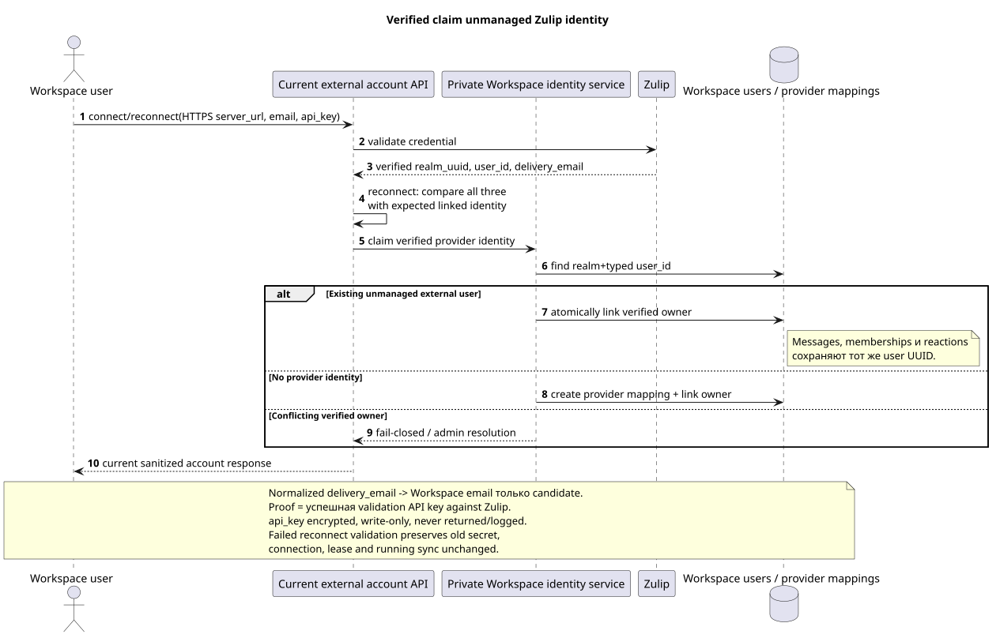

# Жизненный цикл аккаунта и identity Zulip

Статус: **proposal; current public API сохранён, target semantics уточнена**.

[← Главный индекс документации](../index.md) · [Индекс Zulip Bridge](README.md) · [Bootstrap и recovery](coordination_and_recovery.md) · [Provider mappings и content](provider_mappings_and_content.md)

Документ фиксирует lifecycle одного пользовательского Zulip account, verified
identity claim и multi-account canonical union. Он не добавляет routes, поля,
actions или error shapes. Действующий публичный контракт остаётся в
[`workspace_api.md`](../workspace_api.md) и
[`zulip_bridge_v1_product_and_api.md`](../zulip_bridge_v1_product_and_api.md).

## Неизменяемый публичный account API

Все пути ниже находятся под
`/api/workspace/v1/messenger`. Максимум один account с
`settings.kind="zulip"` разрешён для одного Workspace owner.

| Method | Current route | Сохраняемая semantics |
| --- | --- | --- |
| `GET` | `/external_accounts/` | Список sanitized accounts текущего owner. |
| `POST` | `/external_accounts/` | Создание и проверка Zulip account с client-generated `uuid` и write-only credential. |
| `GET` | `/external_accounts/{account_uuid}` | Sanitized snapshot только собственного account. |
| `PUT` | `/external_accounts/{account_uuid}` | Revision-safe изменение `selection_mode`, `history_depth`, `default_project_id`; `If-Match` сохраняется. |
| `POST` | `/external_accounts/{account_uuid}/actions/reconnect/invoke` | Проверить и заменить `server_url`/email/`api_key`, затем выполнить тот же bootstrap, что при connect. |
| `POST` | `/external_accounts/{account_uuid}/actions/disconnect/invoke` | Остановить sync, сохранив account/credential и frozen visible history. |
| `DELETE` | `/external_accounts/{account_uuid}` | Вернуть действующий empty `204`; target cleanup account-scoped и не удаляет shared canonical data. |

Zulip create/reconnect принимает HTTPS `server_url`, email и write-only
`api_key`. Workspace проверяет HTTPS, шифрует key до durable хранения и никогда
не возвращает credential или encrypted envelope, не пишет его в public event,
лог, trace или safe error. Reconnect валидирует новый credential против
ожидаемых verified `realm_uuid`, provider `user_id` и normalized
`delivery_email`. Только полное совпадение разрешает атомарную замену encrypted
secret и единый bootstrap. Любая validation/mismatch failure оставляет старый
credential, connection, lease и sync работающими без изменений.

Публичное поле `selection_mode` сохраняет exact literals `explicit` и `all`.
Согласованное пользователем слово «individual» означает существующий
`explicit`: owner выбирает отдельные chats. `all` остаётся dynamic — новые
доступные chats автоматически получают assignment в `default_project_id`.

`history_depth` принимает только `new`, `7_days`, `30_days`, `90_days`, `all`;
default — `30_days`. Filter действует отдельно для каждого connected account.
Каждый selected external chat в любой момент назначен ровно одному Workspace
project; действие
`/external_chats/{chat_uuid}/actions/move/invoke` сохраняет atomic reassignment
без промежуточного состояния «нигде» или «в двух projects».

## Connect и reconnect

Connect и reconnect используют один algorithm из
[`coordination_and_recovery.md`](coordination_and_recovery.md#единый-bootstrap-connect-reconnect-и-recovery):

1. Workspace валидирует credential через Zulip и получает verified
   `realm_uuid`, authenticated Zulip `user_id` и `delivery_email`.
2. Для reconnect сравнивает их с ожидаемой linked identity. Только после
   совпадения в одной Workspace transaction заменяет encrypted secret и
   связывает/подтверждает verified provider identity; mismatch fail-closed и не
   останавливает старое соединение.
3. Workspace sticky scheduler назначает account одному healthy compatible
   Bridge с минимальной normalized load `active_accounts / declared_capacity`
   и выдаёт lease/fencing generation. Realtime и history остаются у этого owner.
4. Bridge регистрирует новую Zulip event queue только для supported event types,
   получает boundary и немедленно запускает sequential realtime loop.
5. Только после успешной регистрации boundary Bridge идемпотентно создаёт в
   Workspace root history task с current selection/history settings.

Старый Zulip queue/cursor не является prerequisite reconnect. Local Bridge
cache может быть пустым; authoritative account, mappings, tasks, outbound
operations и lease generation находятся в Workspace.

## Disconnect

Disconnect атомарно переводит account в current `disconnected` lifecycle и
отзывает/увеличивает account lease generation. После commit:

- новые Zulip events и outbound provider calls для account не принимаются;
- credential/account остаются сохранёнными для current reconnect action;
- selected-chat assignments, user bindings и уже видимая history остаются
  frozen и читаемы по текущим правилам доступа;
- canonical/provider mappings не удаляются;
- pending work не исполняется до reconnect и не переносится на другой account.

Disconnect не является Delete и не скрывает уже доступную историю.

## Delete: accepted target semantics {#delete-accepted-target-semantics}

Публичный `DELETE` route и `204` сохраняются, но target cleanup отличается от
старого destructive product text. Это принятое изменение внутренней semantics,
а не изменение browser contract.

В одной account-scoped cleanup operation Workspace:

1. Останавливает sync, fencing-ом отзывает lease и запрещает новые provider
   calls.
2. Отвязывает verified Zulip identity от IAM/Workspace owner; external identity
   может остаться unmanaged author/member без session/credentials.
3. Удаляет encrypted account credential, account assignment/mappings и queued
   history/outbound work только этого account.
4. Удаляет только account-derived user bindings, access/projection rows и
   account provenance. Native access и access, подтверждённый другим connected
   account, сохраняются.
5. Не удаляет shared canonical `MESSAGE`, `TOPIC`, `STREAM`, user identity или
   file, пока они доступны/ссылаются через другой connected account либо native
   relation.
6. Удаляет physical file/blob только после доказанного zero remaining
   references; shared/deduplicated object никогда не удаляется по account flag.

Cleanup retry идемпотентен. Account deletion не переписывает author UUID,
message content, reactions или memberships оставшейся canonical union.
Если удаляемый account владеет provider routing общего same-project chat,
Workspace до account cleanup атомарно передаёт stream/topic/message/file
provenance первому оставшемуся selected alias. Поэтому публичный `DELETE 204`
сохраняется и не оставляет общий stream без outbound route.

## Verified user claim

Редактируемый исходник:
[`identity_claim.puml`](diagrams/identity_claim.puml).

Normalized Zulip `delivery_email` и normalized Workspace account email дают
только initial match candidate. Email не доказывает владение и не является
provider identity key.

Verified claim выполняется так:

1. Existing Workspace user явно вызывает current account create/reconnect с
   Zulip `api_key`.
2. Bridge валидирует credential у Zulip и получает authenticated
   `(realm_uuid,user_id,delivery_email)`.
3. Workspace под transaction lock на provider identity проверяет owner link.
4. Если stable identity unmanaged, Workspace привязывает её к IAM owner UUID,
   не создавая новый user UUID и не переписывая сообщения, memberships,
   reactions, URNs или provider mappings.
5. Если identity уже verified для другого owner, operation fail-closed и
   требует административного разрешения; email similarity ничего не меняет.

## Unmanaged external identities и bots

History/realtime `realm_user/add` создаёт или переиспользует один unmanaged
external Workspace user по stable provider identity, если подходящего Workspace
account нет. Такая identity:

- видима как author/member и участвует только там, где её импортировали;
- не имеет credential, login/session или права действовать от имени человека;
- может быть позже claimed verified connection без смены UUID/references;
- получает user updates/avatar/status по accepted event coverage.

`realm_bot/add` создаёт special bot user. `realm_bot/update` metadata остаётся
unsupported. Zulip deactivate/delete односторонне деактивирует/удаляет bot и
его account-derived access; shared message content не удаляется.

## Multi-account canonical union

Для одного verified Zulip realm canonical provider entities образуют union
всех connected accounts:

- provider user/channel/topic/message/file identity создаётся один раз и
  переиспользуется по stable realm-scoped mapping;
- history depth и selection применяются отдельно к каждому account;
- per-account provenance и per-user bindings/access различаются;
- более глубокий history одного account может добавить canonical topics,
  messages и files, которых не видел другой account;
- удаление одного account удаляет только его подтверждение доступа, а не
  shared row.

Если один provider chat одновременно selected несколькими accounts, target
обязан считать оставшиеся account-access sources до удаления binding/file и не
использовать «первый account» как вечного owner canonical row.

Принятое решение `2A` задаёт cross-account boundary однозначно: один
realm-global provider chat может быть выбран только в одном `project_id`.
Same-project accounts переиспользуют единый stream/topic graph, а выбор alias в
другом project получает `409 provider_scope_conflict`. Public
`provider.account_uuid` указывает на текущего routing owner; при его
deselect/delete ownership атомарно передаётся оставшемуся selected alias без
изменения canonical row или публичного browser-контракта. Полная фиксация
решения приведена в
[`workspace_server_v2_decisions.md`](../workspace_server_v2_decisions.md#2a--один-realm-global-provider-chat-принадлежит-одному-project).

[← Главный индекс документации](../index.md) · [Индекс Zulip Bridge](README.md) · [Bootstrap и recovery](coordination_and_recovery.md) · [Provider mappings и content](provider_mappings_and_content.md)
