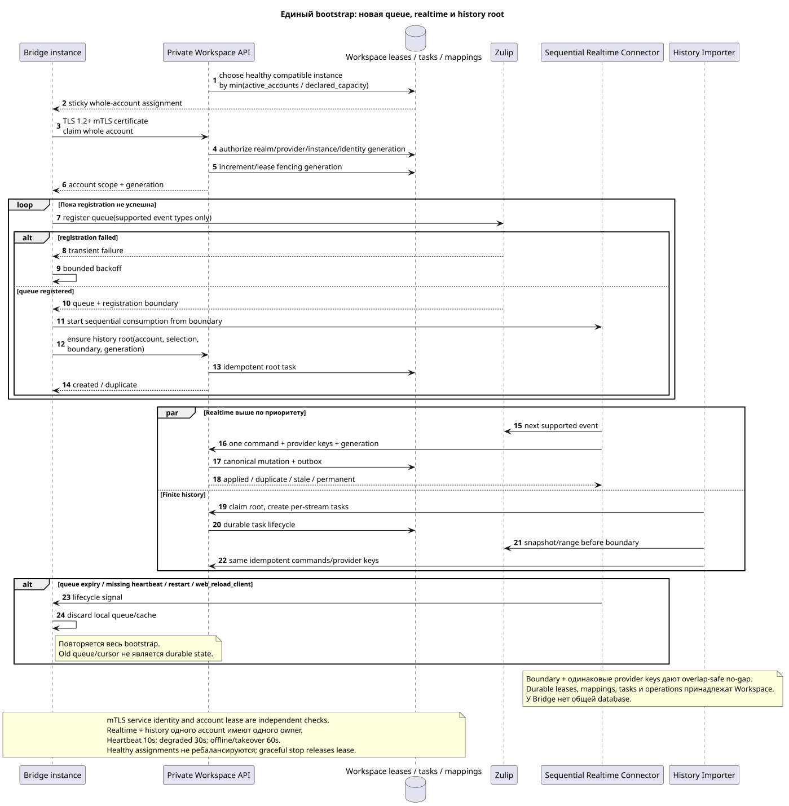

# Обзор целевой архитектуры Zulip Bridge

Статус: **proposal; docs-first, public Workspace API неизменен**.

[← Главный индекс документации](../index.md) · [Индекс Zulip Bridge](README.md) · [Матрица событий](event_coverage.md) · [Канонический инвентарь](../messenger_architecture_inventory.md)

Zulip Bridge — отдельный доверенный контур без прямого доступа к Workspace DB.
Он состоит из двух независимых процессов, использующих один private Workspace
API, одну service identity policy и одинаковые provider/idempotency keys.

## Компоненты и границы ответственности

| Компонент | Владеет | Не делает |
| --- | --- | --- |
| `Zulip Realtime Connector` | Whole-account lease, новая supported Zulip queue, строго последовательный inbound loop и durable Workspace-origin delivery | Не импортирует старый range, не делает recipient fan-out/projections |
| `Zulip History Importer` | Workspace-owned root/per-stream tasks и конечный импорт выбранного history range | Не владеет realtime queue, не хранит message checkpoint v1 |
| Private Workspace API | Действующая realm-bound mTLS service identity, server-owned scope, provider mappings, idempotent canonical mutation, account/task/outbound lifecycle | Не доверяет HTTP header/body, переданный Bridge `project_id`/user или account lease как замену authentication |
| Workspace workers | Fan-out, bindings/state, snapshots/counters, ready events | Не читают Zulip и не являются Bridge workers |
| WebSocket dispatcher | Replay/live delivery durable ready events | Не создаёт business event и не решает provider sync |

Все durable assignments, account lease generations, mappings, history tasks,
outbound operations, failures и audit evidence находятся в Workspace. У Bridge
нет общей БД; local cache/queue connection можно потерять и восстановить.

Bridge является protocol adapter, а не вторым доменным сервисом Workspace. Он
достоверно преобразует Zulip event в private command и Workspace outbound
operation обратно в Zulip, но не решает historical visibility, membership
bindings, archive/delete policy или notification eligibility.

Оба процесса переиспользуют действующую S2S boundary
`workspace-external-bridge-api`: TLS 1.2+ mutual TLS, realm control CA и
generation-bound client certificate с URI SAN, содержащим только
`realm_uuid`/`provider_kind`/`bridge_instance_uuid`/`identity_generation`.
Одноразовый enrollment и renewal/revoke lifecycle остаются теми же, что в
current control/file/Provider API. Whole-account lease/fencing проверяется
дополнительно для каждого account command и не является authentication.

## Account и identity boundary

Текущие public account/chat routes и payloads сохраняются. Connect/reconnect
валидирует Zulip `api_key`, получает verified realm/user/`delivery_email` и
только затем связывает identity. Email — candidate, не proof. Отсутствующий
Workspace account становится unmanaged external user без login/session; поздний
verified claim переиспользует identity. Подробно:
[`account_lifecycle_and_identity.md`](account_lifecycle_and_identity.md).

History depth и selected chat scope принадлежат конкретному account, но
canonical provider entities образуют realm-wide union. Удаление account удаляет
только его credential/work/access evidence; shared canonical rows остаются.

## Единый bootstrap и recovery

Редактируемый исходник:
[`bootstrap_to_realtime.puml`](diagrams/bootstrap_to_realtime.puml).

Connect, reconnect, queue expiry, missing heartbeat, `restart` и
`web_reload_client` запускают одинаковый алгоритм:

1. Workspace scheduler назначает весь account одному healthy compatible Bridge
   с минимальной normalized load `active_accounts / declared_capacity` и выдаёт
   lease/fencing generation. Assignment sticky.
2. Регистрирует новую Zulip queue только для supported event types и получает
   registration boundary. При ошибке повторяет с backoff; history не стартует.
3. Немедленно начинает строго последовательный realtime loop от boundary.
4. Идемпотентно создаёт Workspace history root task для snapshot/range до
   boundary с account selection/history settings.

Старый Zulip queue/cursor не является durable prerequisite. Boundary + единые
provider keys допускают overlap, но не gap: первая фактическая state mutation
создаёт outbox/event, повтор становится duplicate/no-op.

V1 может работать с одним Bridge, но схема поддерживает несколько instances.
Новый healthy instance не вызывает rebalance здоровых accounts: он получает
новые assignments; перенос происходит только для dead/draining owner. Graceful
shutdown освобождает leases, crash takeover разрешён после `60s` offline timeout
и всегда получает новую fencing generation. Heartbeat interval `10s`, status
`degraded` после `30s`, `offline` после `60s`.

## Общая доменная мутация сообщения

Inbound realtime и history используют одну команду. В одной короткой Workspace
transaction она:

1. разрешает realm-scoped provider mapping и canonical `MESSAGE`;
2. разрешает обязательный `TOPIC`, принадлежащий одному `STREAM`/`PROJECT`;
3. создаёт `MESSAGE_PLACEMENT`, author `USER_MESSAGE_BINDING` и
   placement-scoped `USER_MESSAGE_STATE`;
4. вычисляет public placement UUID как
   `UUIDv5(namespace=TOPIC.uuid, name=MESSAGE.uuid)`;
5. пишет immutable outbox event.

`2xx`/`201` означает commit canonical state/idempotency, не завершение fan-out.
Workspace workers асинхронно создают recipient state, counters/snapshots и ready
events. Bridge не заменяет эту подсистему.

## Structure, content и files

- Numeric users/channels/messages/attachments имеют realm-scoped UUIDv5 с exact
  ASCII name `<entity_type>:<decimal_provider_id>`; allowed types и decimal
  normalization зафиксированы в provider mapping document.
- Zulip topic имеет Workspace-owned durable mapping и alias history; UUID не
  выводится из mutable name. Direct/group direct получают private `STREAM` и
  mandatory synthetic default `TOPIC`.
- Whole-topic rename сохраняет topic UUID. Partial move сохраняет canonical
  `MESSAGE`, удаляет old placement, создаёт placement в target topic; old URL
  возвращает `404`, public events отражают delete+create/update.
- Один file соответствует `(realm_uuid,attachment_id)`; message links отдельны,
  physical blob удаляется только при zero references.
- Public content — только действующий canonical Markdown/URN. Latest raw Zulip
  payload/version/converter metadata скрыты private; revision history raw не
  хранится. Newest-first unresolved links чинятся deferred repair; reconversion
  выполняет только manual versioned batch tool.

Подробно: [`provider_mappings_and_content.md`](provider_mappings_and_content.md).

## Realtime, history и outbound

Realtime per account читает ровно одно событие, превращает его в одну internal
command, повторяет до applied/duplicate/stale или classified permanent failure,
и только затем читает следующее. History root создаёт per-stream tasks; разные
streams исполняются параллельно до configured limit, один stream — одним worker,
topics/messages внутри него последовательно newest-first. При restart текущая
stream task повторяет range целиком; provider keys делают уже импортированное
быстрым no-op.

Общий history pool одного Bridge имеет default `4`; upper limit/optimum остаются
до load tests. Между accounts используется fair round-robin, внутри account —
newest stream first. Workers account используют общий rate limiter. Zulip
`Retry-After` приостанавливает history account; realtime имеет приоритет и
возобновляется первым.

Workspace-origin mutation атомарно сохраняет canonical state, outbox и durable
outbound operation. Transient delivery retry переживает failover; internal
`permanent_failed` не создаёт новый public endpoint. Last confirmed mutation
wins, delete wins stale edit, echo suppresses reciprocal write. Подробно:
[`delivery_and_events.md`](delivery_and_events.md).

## Public events

Каждый фактический client-visible transition — live, backfill, deferred repair
или reconversion — атомарно создаёт ровно один ready public event. Duplicate/no-op
event не создаёт. Workspace worker commit-ит projection+event вместе, dispatcher
лишь доставляет/replay-ит его. `delivery_class` и notification metadata остаются
в current shape; Bridge не решает desktop/push policy.

## Event coverage и ограничения

Каноническая матрица направлений находится только в
[`event_coverage.md`](event_coverage.md). Unsupported families не получают
guessed fallback. Оставшиеся transport/serialization/limits/policy решения
перечислены только в
[каноническом OPEN-list](README.md#единый-список-open-решений-zulip-bridge).

[← Главный индекс документации](../index.md) · [Индекс Zulip Bridge](README.md) · [Матрица событий](event_coverage.md) · [Канонический инвентарь](../messenger_architecture_inventory.md)
