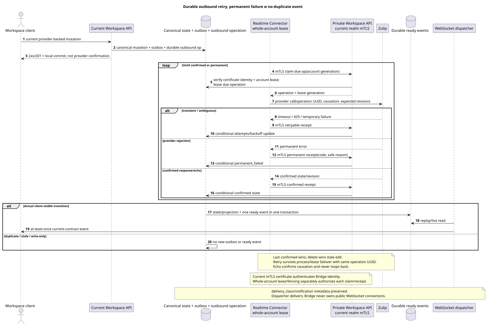

# Outbound delivery, conflicts и public events

Статус: **proposal; public routes/`delivery`/event shapes неизменны**.

[← Главный индекс документации](../index.md) · [Индекс Zulip Bridge](README.md) · [Realtime Connector](realtime_connector.md) · [Внутренний Workspace API](internal_workspace_api.md)

Документ задаёт durable outbound semantics и правило public WebSocket events.
Он не добавляет notification UI, conflict UI, retry route или новый public
status literal.

## Значение успешного Workspace response

Для provider-backed mutation public Workspace `2xx`/`201` означает, что одна
локальная transaction committed:

- canonical primary mutation и текущие author/placement/state rows;
- immutable domain outbox event;
- durable outbound provider operation с stable operation UUID,
  `causation_uuid`, provider target mapping и expected revision/state;
- существующая sanitized `delivery` projection в текущем contract shape.

Response не означает, что Zulip уже подтвердил mutation. Transient provider
failure не откатывает committed Workspace state и не теряет operation: retry
survives Connector process crash, account lease expiry и transfer к другому
Bridge instance.

Current public
`/external_operations/{operation_uuid}/actions/retry/invoke` и его errors не
меняются. Для internal inbound `permanent_failed` не создаётся новый UI/action:
это не новый public retry endpoint.

## Durable operation lifecycle

Редактируемый исходник:
[`outbound_delivery.puml`](diagrams/outbound_delivery.puml).

Internal operation хранит operation UUID, source outbox event UUID, account
lease generation, provider object identity, expected/confirmed provider
revision, causation, attempts/backoff и sanitized failure code/reason.

Минимальные internal outcomes:

| Outcome | Semantics |
| --- | --- |
| `pending` | Durable operation committed, provider call ещё не подтверждён. |
| `retryable` | Transient network/`429`/provider failure; same operation waits until `next_retry_at`. |
| `confirmed` | Provider response/state/echo confirms requested transition. |
| `permanent_failed` | Provider окончательно отклонил operation; endless retry запрещён. |
| `superseded` | Более новая confirmed/delete operation делает старую mutation неприменимой. |

Это internal model, не расширение current public `delivery.status`. Existing
`delivery`, `safe_error`, `can_retry`, `can_discard`, duplicate/reconciliation
fields сохраняют текущие значения и authorization. Internal
`permanent_failed` отображается только через уже допустимую sanitized failure
semantics; raw provider response/content не публикуется.

Future operator requeue может быть добавлен отдельным решением, но сейчас не
реализуется. Permanent failure хранится/алертится и доступен private
reconciliation; новый browser notification/retry action не создаётся.

## Retry и account failover

Bridge аутентифицирует private API request действующим realm-bound mTLS client
certificate и отдельно получает whole-account lease/fencing generation от
Workspace. Перед каждым provider call и receipt update Workspace проверяет и
certificate identity, и account generation. После expiry:

1. Старый owner больше не может подтвердить result.
2. Только после `60s` offline timeout scheduler назначает healthy compatible
   owner; новый Bridge claims весь account с новой fencing generation, выполняет
   обычный bootstrap и через private API получает due operations.
3. Retry использует тот же operation UUID/provider key/causation и сначала
   reconcile-ит ambiguous provider state.
4. Confirmation записывается conditional по lease generation и provider
   revision; stale response становится no-op.

Bridge-local retry queue не authoritative. Backoff/attempts/next retry и
terminal state находятся в Workspace.

Graceful draining/shutdown явно освобождает lease; healthy sticky account не
ребалансируется только из-за появления менее загруженного instance.

## Conflict semantics

- Last **confirmed** mutation wins; arrival time/job time не является version.
- Delete wins over concurrent или позже доставленный stale edit.
- Для bidirectional presence/status Bridge последовательно доставляет обе
  стороны и не выбирает winner: побеждает последнее confirmed state.
- `origin`/`causation_uuid` используются для echo suppression/idempotency, а не
  как приоритет Workspace или Zulip.
- Echo того же causation подтверждает operation и не порождает reciprocal
  outbound work.
- Нет text merge, hidden fork или conflict UI.
- Stale edit после delete получает internal no-op/superseded outcome; canonical
  deleted state и client events не откатываются.
- Same provider operation retry идемпотентен; ambiguous result разрешается по
  provider identity/revision/state, не по timestamp догадке.

## Ровно один ready event на фактический transition

Каждая transaction, которая фактически создаёт/изменяет/удаляет client-visible
state, атомарно создаёт ровно один соответствующий durable ready public event
для этой transition/audience. Это относится одинаково к `live`, history
backfill, deferred reference repair и manual reconversion.

- State/projection row и ready event commit together или rollback together.
- Idempotent duplicate/stale/no-op не создаёт новый public event.
- При history/realtime overlap первый committed transition создаёт event, второй
  с тем же provider key/version возвращает duplicate/no-op без event.
- Recipient fan-out создаёт ready event только в transaction, которая делает
  конкретную recipient projection видимой.
- Delete old placement + create/update target placement при partial move — две
  реальные public state transitions, каждая с current-contract event, но retry
  не повторяет их.

`delivery_class` (`live`/`backfill`) и существующая
`notification_eligible`/notification metadata сохраняются в public sanitized
projection. Bridge не решает desktop/push eligibility: client применяет
current contract. Backfill event существует, но metadata не превращает его в
desktop notification.

WebSocket dispatcher не создаёт business events: он читает durable event store,
делает replay/live delivery at-least-once, а client dedupe-ит по event UUID.

## Internal retention

- Successfully completed history tasks и confirmed/successful outbound delivery
  operations удаляются internal cleanup через `30 days`.
- `permanent_failed` operation вместе с safe code/reason хранится `90 days`,
  затем удаляется internal cleanup.
- Provider mappings и latest hidden raw payload/converter metadata не имеют
  task TTL: они живут столько же, сколько соответствующая Workspace/provider
  entity.

Retention не добавляет public fields/actions. Возможный future internal requeue
не реализован и не меняет существующий public external-operation retry route.

## Наблюдаемость

Обязательны account/operation-scoped metrics без content/credential:

- pending/retryable age, attempts, next retry и oldest operation;
- confirmed/permanent_failed/superseded counts by safe code;
- account lease owner/generation mismatch и stale receipt rejection;
- provider rate-limit/backoff и outbound lag;
- duplicate/no-op count и unexpected duplicate-ready-event guard;
- public projection→ready event transaction failures и dispatcher lag отдельно.

[← Главный индекс документации](../index.md) · [Индекс Zulip Bridge](README.md) · [Realtime Connector](realtime_connector.md) · [Внутренний Workspace API](internal_workspace_api.md)
