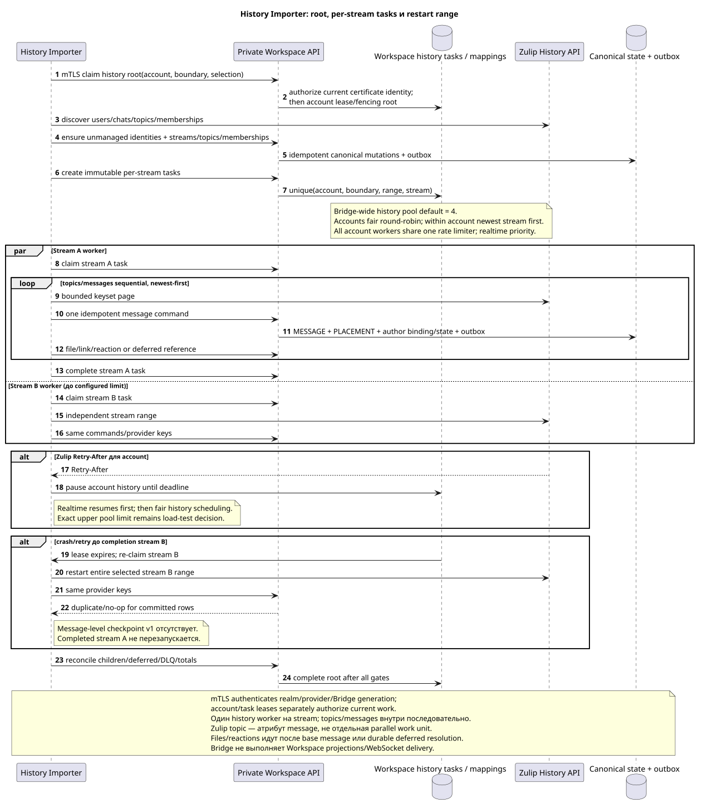

# Zulip History Importer

Статус: **proposal; конечный Workspace-task-driven import**.

[← Главный индекс документации](../index.md) · [Индекс Zulip Bridge](README.md) · [Матрица событий](event_coverage.md) · [Bootstrap и recovery](coordination_and_recovery.md) · [Provider mappings/content](provider_mappings_and_content.md)

`Zulip History Importer` выполняет finite import выбранного account history
range. Он не владеет realtime queue, не пишет Workspace DB и не хранит
message-level checkpoint. Durable root/child tasks и results принадлежат
Workspace private API.

## Предусловия

History root создаётся только после успешной регистрации новой supported-events
queue и старта realtime от registration boundary. Root фиксирует server-owned
account, verified realm, selection, `history_depth`, boundary, lease generation
и stable task identity. Без boundary history не запускается.

Importer вызывает current private API только под тем же realm-bound mTLS client
certificate, что Realtime Connector данного Bridge instance. Certificate
проверяет service identity; claim каждой root/stream task и active whole-account
lease/fencing отдельно доказывают право работать с конкретным account/range.

History depth (`new`, `7_days`, `30_days`, `90_days`, `all`) применяется per
account; default `30_days`. Canonical entities образуют union всех connected
accounts, поэтому deeper account может добавить topics/messages/files без
копирования provider identity.

## Root и per-stream tasks

Редактируемый исходник:
[`history_importer.puml`](diagrams/history_importer.puml).

Root task выполняет discovery и создаёт immutable child task на каждый selected
channel/direct/group-direct stream:

1. Проверяет/создаёт unmanaged external user identities и bot identities;
   verified connection claim — отдельная account operation.
2. Разрешает realm-scoped canonical channels/streams.
3. Для channel читает accessible-topic metadata и включает только topics, у
   которых есть messages внутри account history range.
4. Direct/group direct создаёт private stream с одним mandatory synthetic
   default topic.
5. Передаёт memberships/subscriptions и server-owned project assignment в
   Workspace; domain service сам решает historical visibility и bindings.
6. Создаёт per-stream tasks в порядке last activity descending.

Workspace idempotency/unique task key гарантирует, что retry root не создаёт
второй child для той же immutable stream range.

## Параллелизм и порядок

Один Bridge имеет общий configurable history worker pool, default `4`.
Точный safe upper limit и optimum остаются до load tests. Разные stream tasks
могут выполняться параллельно, но один stream одновременно claims ровно один
history worker. Topics и messages внутри stream обрабатываются последовательно,
поскольку Zulip topic — атрибут message; message priority — `created_at DESC`,
при равенстве stable provider message ID descending. `OFFSET` не используется;
каждый bounded request применяет keyset/provider pagination.

Scheduler выбирает accounts fair round-robin, а внутри выбранного account —
newest stream first по last activity. Все workers account разделяют один
account-level rate limiter. Zulip `Retry-After` приостанавливает history именно
этого account; realtime lane имеет приоритет и возобновляется первой.

Realtime loop независим и всегда выше по priority/admission. History worker не
удерживает account-wide lock на время provider request; lease generation
проверяется при claim и каждом private API commit.

## No message-level checkpoint v1

Child task не сохраняет last imported message. При process crash, lease expiry
или retryable failure unfinished stream task начинает весь selected range с
начала. Same realm/provider keys превращают ранее committed users/topics/
messages/files/reactions в duplicate/no-op, не создавая второй canonical row,
outbox или ready event. Completed stream tasks не перезапускаются.

Task lifecycle Workspace-owned: `pending` → `leased/running` → `completed` или
`failed`, с attempts/backoff, lease expiry/fencing, bounded retries и DLQ.
Default pool `4` принят. Только upper limit/optimum и измеряемые rate/batch
budgets остаются в canonical OPEN-list.

## Message и dependency order

Внутри stream importer сначала обеспечивает users, stream, mandatory topics и
memberships/bindings. Затем для каждого message newest-first:

1. вызывает общую idempotent `message.create`/`update`/`delete`/`move` command;
2. Workspace transaction создаёт/обновляет canonical `MESSAGE`, placement,
   author binding/state и outbox;
3. после base message импортирует files/attachment links и reactions;
4. unresolved older quote/message/file reference сохраняет как deferred, а не
   synthetic public object;
5. actual later repair создаёт ordinary outbox/ready event, no-op — ничего.

Один canonical file переиспользуется по `(realm_uuid,attachment_id)`. Topic
разрешается через Workspace-owned mapping/alias history. Whole-topic rename не
меняет UUID; partial move создаёт target placement и удаляет old placement.

## Current state, deletes и unsupported families

History восстанавливает доказуемое current state выбранного snapshot/range, а
не выдуманную revision history. Для raw message сохраняется только latest
payload/revision/hash/converter metadata. Persistent supported state включает
message flags, reactions, memberships, selected user fields/status, files and
links. Presence/typing/heartbeat/restart не backfill-ятся. Experimental
`submessage`, unsupported UI/personal/org families не импортируются;
`saved_snippets` остаётся OPEN.

## Completion и reconciliation

Stream task `completed` означает terminal processing всего immutable range и
durably classified deferred/permanent items. Root завершается после всех child
tasks и reconciliation:

- selected stream/topic/message ranges, provider identity uniqueness и gaps;
- memberships/access, attachment references, reactions и deferred refs;
- no duplicate canonical rows/outbox/events при overlap с realtime;
- Workspace task/DLQ/outbound failures and projection lag reported separately.

Backfill actual transition атомарно создаёт one ready public event через
обычный Workspace projection path с `delivery_class="backfill"`; duplicate/no-op
не создаёт event. Bridge не выбирает notification policy.
The message snapshot carries `read`; the final fence is `history.finalize`.

## Graceful restart и observability

Graceful stop прекращает новые stream claims, завершает/сдаёт current task и
явно освобождает account lease. Hard crash допускает takeover только после
`60s` offline timeout; новый fenced owner повторяет bootstrap, unfinished stream
task range, но не completed siblings.

Completed history tasks являются audit/retry evidence `30 days`, после чего
внутренний retention cleanup удаляет их. Provider mappings/raw entity metadata
не следуют этому task TTL и живут с соответствующей entity.

Метрики: root/child counts, stream ordering/age, full-range restarts,
messages/files/reactions scanned vs applied/duplicate, deferred/DLQ, provider
rate limits, history lag and reconciliation mismatch. Raw content/credential не
логируются.

[← Главный индекс документации](../index.md) · [Индекс Zulip Bridge](README.md) · [Матрица событий](event_coverage.md) · [Bootstrap и recovery](coordination_and_recovery.md) · [Provider mappings/content](provider_mappings_and_content.md)
