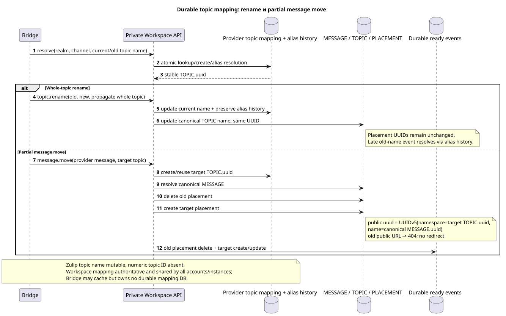
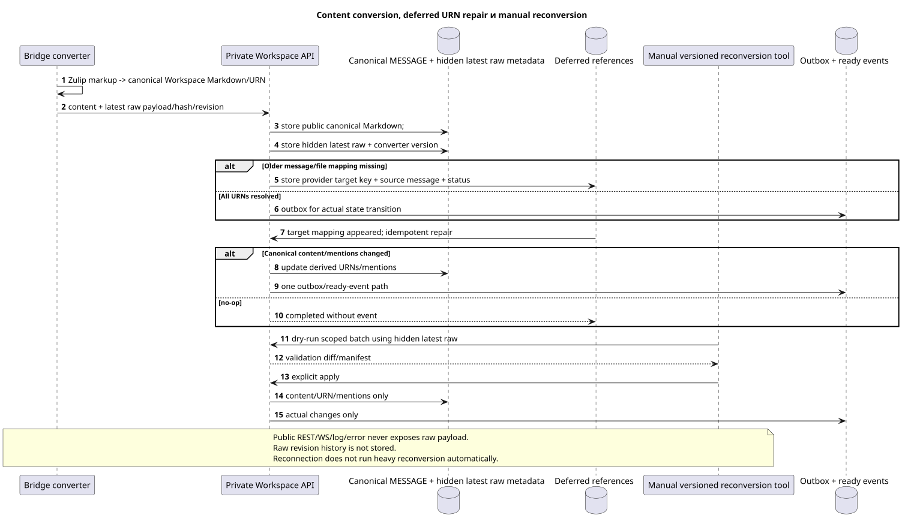

# Provider mappings, topics, files и content conversion

Статус: **proposal; internal design, public Markdown/URN contract неизменен**.

[← Главный индекс документации](../index.md) · [Индекс Zulip Bridge](README.md) · [Account lifecycle и identity](account_lifecycle_and_identity.md) · [Внутренний Workspace API](internal_workspace_api.md)

Документ фиксирует realm-global provider identity, durable topic mapping,
file/attachment reuse и Zulip↔Workspace content conversion. Bridge не хранит
authoritative mappings локально и не добавляет Bridge-specific public markup.

## Realm-scoped provider identity

Stable numeric Zulip IDs используют логический key
`(verified_realm_uuid, entity_kind, numeric_provider_id)`. `entity_kind`
обязателен и предотвращает collision одинакового числа между user/channel/
message/attachment domains.

| Provider kind | Stable logical key | Canonical result |
| --- | --- | --- |
| user | `(realm_uuid,"user",user_id)` | Одна managed или unmanaged `WorkspaceUser` identity. |
| channel | `(realm_uuid,"channel",channel_id)` | Один canonical channel `STREAM`. |
| message | `(realm_uuid,"message",message_id)` | Одна canonical `MESSAGE`, независимо от importing account. |
| attachment/file | `(realm_uuid,"attachment",attachment_id)` | Один canonical Workspace file; links к messages отдельны. |

Target UUID/provider mapping использует точный алгоритм:

1. Namespace — проверенный stable Zulip realm UUID. Его принимают только как
   canonical lowercase hyphenated UUID text, разбирают в UUID и передают в
   UUIDv5 как 16 RFC 4122/network-byte-order octets. Project/account UUID никогда
   не используются как namespace.
2. Разрешённый `entity_type` — ровно один из lowercase ASCII literals:
   `user`, `channel`, `message`, `attachment`.
3. Numeric provider ID сначала разбирается как целое без знака. Отрицательное,
   дробное или нечисловое значение отклоняется. Каноническая decimal form —
   shortest base-10 ASCII: `0` для нуля, иначе digits `0..9` без leading zeros,
   `+`, пробелов или locale formatting.
4. UUIDv5 name — точная ASCII-строка
   `<entity_type>:<decimal_provider_id>`, например `message:12345`.
5. Bytes name равны ASCII/UTF-8 bytes этой строки без NUL, BOM, newline,
   braces, prefix, project/account/server URL или дополнительных полей.

Результат — `UUIDv5(namespace=verified_realm_uuid, name_bytes)`. Одинаковый
numeric ID разных типов не пересекается благодаря обязательному prefix.
Mutable email/name/server URL и importing account не входят в identity.

Provider mapping и canonical row создаются/читаются атомарно через private
Workspace API. Multiple Bridge instances/accounts получают один результат;
local cache может быть отброшен без потери identity.

## Discovery и history scope

History depth применяется per account. Для channel stream root task читает
Zulip accessible-topic metadata и выбранный time boundary. Для этого account
проецируются только topics, у которых есть message в его `history_depth` range.
Другой account того же realm с более глубоким range может позже добавить новые
canonical topics/messages; это нормальное расширение union, а не duplicate.

Direct, self-direct и group direct отображаются в private Workspace `STREAM` с
одним mandatory synthetic default `TOPIC`. Nullable/sentinel topic для
placement запрещён. Exact stable conversation key берётся из provider mapping,
а не из display name.

## Durable topic mapping без numeric Zulip topic ID

Редактируемый исходник:
[`topic_mapping_and_move.puml`](diagrams/topic_mapping_and_move.puml).

Zulip topic не имеет stable numeric ID, поэтому `TOPIC.uuid` нельзя выводить
только из mutable topic name. Workspace владеет durable provider topic mapping,
доступным Bridge только через private API. Mapping логически хранит:

- `realm_uuid` и stable provider channel identity;
- current normalized provider topic identity/name;
- stable canonical `TOPIC.uuid`;
- rename/alias history, достаточную для late old-name event;
- immutable owning canonical stream/project association.

Создание/reuse выполняется под Workspace transaction lock. Все accounts и
Bridge instances одного realm используют mapping, а Bridge cache не является
source of truth.

### Whole-topic rename

Whole-topic rename обновляет canonical topic name и alias history, но сохраняет
тот же `TOPIC.uuid`. Late event со старым name разрешается через history в ту же
topic identity. Поскольку namespace placement UUID остаётся прежним, public
message placement URLs не меняются только из-за whole-topic rename.

### Partial message move

Partial move одного/части messages не является rename:

1. Workspace находит canonical source `MESSAGE` по realm/message mapping.
2. Target topic создаётся или переиспользуется через durable mapping.
3. Source `MESSAGE_PLACEMENT` удаляется; content `MESSAGE` не копируется.
4. В target topic создаётся новый placement с public UUID
   `UUIDv5(namespace=TOPIC.uuid, name=MESSAGE.uuid)`.
5. Старый public message URL после commit возвращает current `404`; redirect и
   hidden primary placement запрещены.
6. В той же state transition transaction создаются ready events: deletion
   старого placement и current-contract create/update snapshot нового
   placement. Duplicate retry не создаёт вторую пару events.

## Canonical files и attachments

Один canonical Workspace file соответствует
`(realm_uuid,attachment_id)`. Repeated history/realtime import и ссылки из
нескольких messages/accounts переиспользуют file row/blob. Нормализованные
message↔file links являются отдельными source-of-truth rows и имеют собственную
referential integrity.

Удаление account или одной attachment relation не удаляет file/blob, пока
остаётся native или provider reference. Physical object удаляется только после
zero-reference check. Provider file bytes/metadata и mapping account-independent;
access определяется актуальными message/stream/user bindings.

Workspace→Zulip upload выполняется только как часть provider-backed
message/action с verified account/mapping. Обычный unrelated Workspace file не
отправляется в Zulip автоматически.

Typed UUIDv5 serialization для users/channels/messages/attachments полностью
определена выше и не является OPEN. Business uniqueness file остаётся
`(realm_uuid,attachment_id)`.

## Канонический Markdown и URNs

Public `payload.kind="markdown"` и текущие URNs сохраняются без расширения:

- `[name](urn:user:<user-uuid>)`;
- `[message](urn:message:<placement-uuid>)`;
- `[stream](urn:stream:<stream-uuid>)`;
- `[topic](urn:topic:<topic-uuid>)`;
- `[file](urn:file:<file-uuid>?name=...)`;
- `` и `urn:video`;
- `[url](urn:url:https://...)`;
- действующие quote/reply Markdown rules из
  [`workspace_api.md`](../workspace_api.md#messages).

Inbound Zulip content converter создаёт только canonical Workspace Markdown.
Outbound converter разрешает URNs через durable provider mappings и формирует
Zulip markup. Неразрешённый UUID не заменяется display name/URL догадкой.

## Latest raw provider layer

Редактируемый исходник:
[`content_conversion_and_repair.puml`](diagrams/content_conversion_and_repair.puml).

Для одной canonical provider message хранится только latest raw Zulip message
payload, latest provider revision/hash, converter version и bounded conversion
result metadata. Revision history raw payloads не ведётся.

Raw layer скрыт полностью:

- не сериализуется в public REST list/get/search/action response;
- не входит в public WebSocket event;
- не пишется в log, trace, metric label или public/safe error;
- доступен только private authenticated Provider/Bridge API и versioned manual
  reconversion tooling с server-owned realm/account scope.

Provider mapping, latest hidden raw payload, provider revision/hash, converter
version и conversion metadata живут столько же, сколько соответствующая
Workspace/provider entity. Это internal lifecycle, не отдельное public поле и
не независимая raw revision archive.

Public content всегда canonical Markdown. `provider`/`delivery` остаются
существующими sanitized public projections; raw protocol fields не добавляются.

## Deferred references при newest-first import

Новый message может цитировать более старый ещё не импортированный message/file.
Converter сохраняет internal deferred reference с provider target key,
canonical source message UUID, converter version и repair status. Public
Markdown не получает synthetic entity.

Когда target mapping появляется, idempotent repair повторно разрешает только
affected references. Если canonical public content/mentions/derived URNs
фактически изменились, transaction обновляет message state, пишет outbox и
создаёт ровно один ready current-contract event. No-op repair не создаёт event.

## Manual reconversion

Heavy reconversion никогда не выполняется внутри schema migration или обычного
request path. Schema migration может только зарегистрировать новый converter
version/need. Отдельный versioned manual tool обязан поддерживать:

- `dry-run`/check-only и explicit apply;
- realm/account/project/range scope;
- bounded batches, restart/checkpoint и audit manifest;
- raw access только через private authenticated boundary;
- validation counts/diffs до apply и reconciliation после.

Reconversion может менять canonical Markdown, derived URNs и mentions. Она не
меняет author, canonical/placement UUID, stream/topic, public timestamps,
read/star/pin state, reactions или access. Каждое фактическое изменение следует
обычному outbox/projection/ready-event правилу; no-op не создаёт event.

[← Главный индекс документации](../index.md) · [Индекс Zulip Bridge](README.md) · [Account lifecycle и identity](account_lifecycle_and_identity.md) · [Внутренний Workspace API](internal_workspace_api.md)
