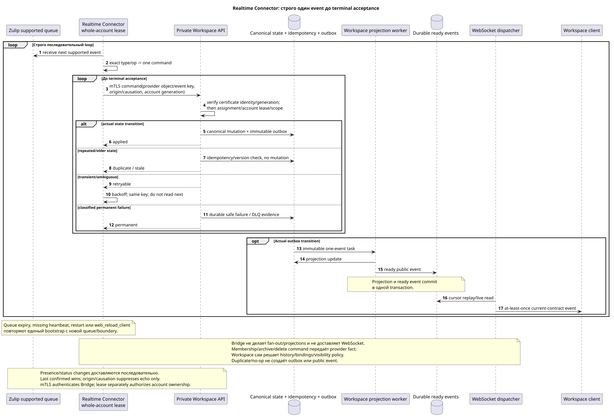

# Zulip Realtime Connector

Статус: **proposal; постоянный sequential process, public API неизменен**.

[← Главный индекс документации](../index.md) · [Индекс Zulip Bridge](README.md) · [Матрица событий](event_coverage.md) · [Bootstrap и recovery](coordination_and_recovery.md) · [Outbound delivery](delivery_and_events.md)

`Zulip Realtime Connector` обслуживает весь external account под одним
Workspace-issued lease. Он принимает только supported events, отправляет
durable Workspace-origin operations и никогда не пишет Workspace DB напрямую.
Он является protocol translator и не принимает Workspace domain-policy решения.

## Запуск

Редактируемый исходник:
[`realtime_connector.puml`](diagrams/realtime_connector.puml).

Connector всегда запускается через
[единый bootstrap](coordination_and_recovery.md#единый-bootstrap-connect-reconnect-и-recovery):

1. Аутентифицируется current realm-bound mTLS client certificate и затем claims
   весь account с отдельной fencing generation.
2. Регистрирует новую queue с allowlist supported event types.
3. Получает registration boundary.
4. Сразу начинает realtime consumption.
5. После успешного старта идемпотентно создаёт history root task.

Registration failure не допускает history без boundary. Queue expiry, missing
heartbeat, `restart` и `web_reload_client` освобождают текущую connection и
повторяют алгоритм целиком. Old queue/cursor не является durable state.

## Строго последовательный inbound loop

Per account одновременно обрабатывается ровно один inbound event:

1. Получить next supported event.
2. Отправить command через current mTLS private API; Workspace независимо
   проверяет certificate identity и account lease/fencing generation.
3. Классифицировать exact `type`/`op` по
   [`event_coverage.md`](event_coverage.md), без приблизительного fallback.
4. Сформировать одну private Workspace command с provider object/event key,
   origin/causation и provider revision/hash, если он существует.
5. Повторять command до terminal acceptance.
6. Только после applied/duplicate/stale/confirmed или classified permanent
   failure перейти к следующему event.

Transient timeout/`429`/temporary provider error оставляет тот же event в
работе. Missing dependency сохраняется как durable Workspace deferred reference
до terminal acceptance. Unsupported events не должны входить в subscription;
если provider всё же вернул их, Connector пишет bounded audit/metric и не
создаёт guessed mutation.

## Workspace transaction и async boundary

Private API получает service identity только из проверенного mTLS certificate,
а project/source/user/account scope — из Workspace assignments/mappings и
active lease. Для actual mutation он в одной transaction делает
idempotency check, canonical mutation, placement/binding/state при необходимости
и immutable outbox append. Duplicate/no-op не создаёт второй outbox/event.

Recipient fan-out, counters, reactions/file snapshots и ready public events
делают Workspace projection workers. Connector не ожидает их окончания и не
выполняет их сам. Ready event создаётся атомарно с фактической projection;
WebSocket dispatcher остаётся отдельным компонентом.

## Supported message/content paths

- Create/update/delete/move messages, reactions, files/attachments, read/unread,
  starred, mentions/links/render-related changes следуют bidirectional matrix.
- Inbound content преобразуется в canonical Workspace Markdown/URN; latest raw
  payload скрыт. Deferred older references repair-ятся через Workspace.
- Whole-topic rename сохраняет durable topic UUID. Partial move удаляет old
  placement, создаёт new placement в target topic; old public URL возвращает
  `404`, redirect не создаётся.
- Reactions адресуют public placement для access, но fact/snapshot остаются
  canonical-message-global по принятой semantics.
- File reuse определяется `(realm_uuid,attachment_id)`; unrelated native file
  не отправляется в Zulip.

## Structure, users и ephemeral events

- Zulip channel create создаёт mapped Workspace stream; native Workspace stream
  create не создаёт Zulip channel.
- Membership add/remove в group/private chat передаётся одной Workspace private
  command. Bridge не создаёт новый stream из-за изменения состава и не решает,
  какая history видима или какие message bindings создать/удалить: это делает
  Workspace domain service по stream settings.
- Channel archive/delete передаётся как provider command; Workspace решает
  archive/history/bindings/visibility. Bridge не дублирует policy.
- Остальные subscription/topic/user selected updates следуют exact matrix.
- Неизвестная ordinary identity становится unmanaged external user при import;
  verified existing user claim выполняется только explicit account connection.
- Bot add создаёт special user; bot metadata update unsupported;
  deactivate/delete идёт Zulip→Workspace.
- Presence/status/typing двусторонние; presence/typing TTL-based и не durable
  history, `user_status` persistent. Echo suppression не создаёт reciprocal op.

Для bidirectional presence/status Connector последовательно доставляет изменения
обеих сторон и сам не разрешает конфликт. Последнее подтверждённое изменение
побеждает. `origin`/`causation_uuid` используются только для echo suppression и
idempotency, не дают одной стороне приоритет.

## Workspace-origin outbound lane

Workspace `2xx` сохраняет local canonical mutation + outbox + durable outbound
operation. Connector получает due operation через private API под той же account
generation, вызывает Zulip и условно подтверждает receipt. Transient retries
переживают process/lease failover. Last confirmed wins; delete wins stale edit;
echo подтверждает causation без обратной command. Provider permanent rejection
становится internal `permanent_failed`, не новым public action/status.

Полная semantics:
[`delivery_and_events.md`](delivery_and_events.md).

## Backpressure, restart и observability

Realtime lane имеет приоритет над history. Поскольку inbound loop sequential,
его queue growth регулируется provider queue/backoff, а не параллельным reorder.
Все history workers account делят account-level limiter; `Retry-After`
приостанавливает history, тогда как realtime восстанавливается первой.
На graceful stop Connector не берёт next event/provider operation, завершает или
оставляет retryable current unit, conditional сдаёт lease. Hard crash безопасен:
новый owner запускает bootstrap, а replay/overlap дедуплицируется provider keys.

Метрики: queue registration/expiry, event processing age, terminal outcomes,
duplicate/no-op, retry/backoff, lease generation mismatch, echo match failure,
outbound pending/permanent failure и отдельно Workspace projection/WS lag. Raw
content, email и credential запрещены в labels/logs/errors.

[← Главный индекс документации](../index.md) · [Индекс Zulip Bridge](README.md) · [Матрица событий](event_coverage.md) · [Bootstrap и recovery](coordination_and_recovery.md) · [Outbound delivery](delivery_and_events.md)
