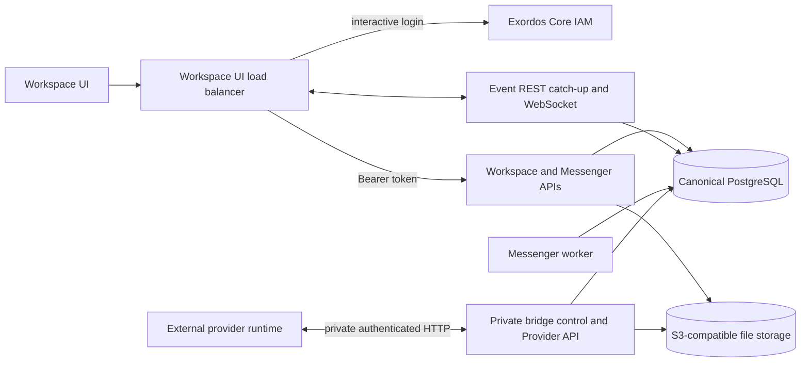

# Workspace Messenger 建筑

本文档定义了当前Workspace后端服务的边界和
浏览器合同仍然存在
[`workspace_api.md`](workspace_api.md)个人提供商数据平面是
定义为
[`workspace_provider_api_v1.yaml`](../workspace_provider_api_v1.yaml),以及
实时客户端行为记录在
[`workspace_ui_realtime_integration.md`](workspace_ui_realtime_integration.md).

## 建筑不变量

- WorkspaceUI只与IAM认证的Workspace通信,并且
  Messenger REST API 和常用Workspace事件网接口.
- PostgreSQL是 Messenger资源,会员,用户状态的规范,
  事件,提供商映射,外部帐户状态,命令和客户端
  设置
- Messenger 不读写SMTP,IMAP,Maildir,Exim或Dovecot.
- IAM是 Workspace用户,项目,持有人代币认证的来源,
  授权范围.
- 文件元数据和 ACL状态在 PostgreSQL 中表示.
  JSON侧车使用配置的S3兼容存储后端.
- 外部提供商运行时间是独立部署的服务.
  私人,桥接认证的提供者 HTTP API 和项目普通
  Messenger资源进入PostgreSQL;浏览器从来没有调用API.
- 公众 Messenger REST 和websocket形状是独立于
  持续性和提供者实现.
- 后端图像没有UI源或捆绑.
  版本 `workspace_ui` 元素拥有公共负载均衡器,服务于
  无变的Web文物,以及向导出后端节点的代理 `/api/`.

## 组件和信任界限

面向浏览器的 HTTP 和websocket接口构成公共应用程序
桥控制,提供者,和文件传输API使用一个单独的
提供者凭证,原始提供者
有效载荷,内部标志器,数据库行,文件分配细节都没有
通过浏览器界限.

## 公共和私人 API边界

部署显示了这些稳定的浏览器路径:

- 对于 Messenger REST 合同, `/api/workspace/v1/messenger/...`;
- `/api/workspace/v1/events/` 对于持续的事件追赶;
- `/api/workspace/v1/events/ws` 对于现场活动;
- `/api/workspace/v1/{users,services,me,epoch}/...` 对于普通
  具有 IAM 范围的 Workspace 资源;
- `/api/workspace/specifications/3.0.3` 对于公众来说 Workspace OpenAPI
  文件.

没有浏览器面向的提供商,日历或独立邮件 API.
独立部署的服务提供商运行时间使用私有
`/api/workspace-provider/v1`数据平面.私人控制和文件合同
也不会通过面向浏览器的 nginx 位置路由.

## 身份和授权

公开 REST 请求使用IAM持有人令牌. `user_uuid`来自IAM令牌
信息和`project_id`来自IAM内省. Messenger操作
应用结果的项目,用户,成员,所有权和行动检查
在读取或更改规范状态之前.

私有提供商界限验证注册桥实例,并
提供者事件批量和操作
结果与该身份和相应账户进行检查,
项目,聊天分配,能力和租状态之前他们改变
规范资源 Messenger.

## 数据所有权

| 数据 | 真理的来源 |
| --- | --- |
| 用户,项目,身份验证和 IAM 权限 | 美国的"外围核心"IAM |
| 消息,流,主题,绑定,文件,草稿,反应,阅读状态和事件 | PostgreSQL |
| 提供者帐户,政策,桥梁状态,映射,命令,结果和除重复 | PostgreSQL |
| 文件元数据和访问控制状态 | PostgreSQL 和正规的 JSON 侧车 |
| 文件字节和 JSON 侧车 | 兼容 S3 的存储 |

Workspace UUID 和类型 URN 仍然是通过
稳定的供应商识别符和转换元数据
存储在提供者投影后面,并且只通过消毒暴露
合同允许的公共 `provider` 和 `delivery` 字段.

## 实际流量 Messenger

对于本地写入,后端验证调用者使用IAM,验证
目前的 PostgreSQL 会员和权限,并承诺的规范
资源变化及其在请求交易中的实时副作用.
读取使用相同的规范表和用户/project可见性规则.

文件的有效负载保持在S3兼容的存储中. 消息只包含授权的
文件或媒体 URN; Messenger API从不将二进制附件放在一个
副信息传输.

## 供应商流量

Workspace提供者行动创造了持续的供应商业务
PostgreSQL. 一个注册的提供者运行时间租相容的操作
提供者 HTTP API 并报告终端结果与idempotent,
每项结果.提供者到Workspace的更改作为认证事件
一批验证并原子应用到普通的定制
Messenger资源;一个无效的项目滚回整个批量,所以
提供者可以重新尝试.

提供者预测通过相同的公共 Messenger终点返回
它们的清洁`provider`元数据识别出
外部源和有效能力,而`delivery`描述了
相关的外部运行状态. 供应商特定的控制数据仍然存在
没有人知道.

## 实时模型

REST 追赶和网络插座交付携带相同的平面 `schema_version: 1`
事件对象. PostgreSQL 保持生成和单调时代光标.
客户端持续 `(epoch_generation, epoch_version)`,由该光标删除重复,
并且通过一个调度员运输.

网络插件工作者合并PostgreSQL通知爆发和倒闭
连接的独立追赶任务.
让一个慢客户不能延迟向健康客户交付.
暂时存储读取故障保持已建立的插座准备并重新尝试
只有受影响的数据被关闭.
接口
通知只是一个警示;每位用户的持久指针仍然是
它们的运行方式,
恢复语义.

只有事件行受配置可保留策略的约束,
默认设置为72小时. 消息和其他正规资源不会被删除
当旧事件被剪切时. 留存后之外的光标接收到
输入 `epoch_pruned` 响应,客户端重新加载权威快照
在恢复实时更新之前.

## 持续性和恢复性

兼容 PostgreSQL 和 S3 的存储必须能够存活在服务和节点更换中.
恢复恢复数据库和对象存储,应用数据库迁移,
然后启动API,事件,工人和私人提供商服务.
索引和缓存可以从可规的 PostgreSQL 行中重新构建,而无需
改变公共资源的身份.

部署始终启动PostgreSQL支持的Messenger运行时间.
没有持续模式开关或二次 Messenger 记载.
