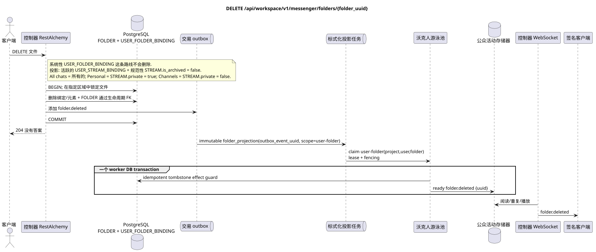

# `DELETE /api/workspace/v1/messenger/folders/{folder_uuid}`

[← 文件的主要索引](../../../../index.md) · [序列图表的索引](../../README.md) · [内容和用户分区 Workspace](../README.md)

状态:在文件中首先开发的操作目标规格. 现行公开合同
没有变化,是 [`workspace_api.md`](../../../../workspace_api.md).
这个文件描述了交易和投影的目标边界;它不是
产品代码,迁移 SQL 或新终点.



[可编辑的源 PlantUML](diagrams/delete_folder.puml)

## 任命和公开合同

删除当前用户文件.

认证:持有者IAM;`project_id`和当前`user_uuid`代币从文本中取出 IAM.

## 查询路径和参数

| 位置 | 姓名 | 类型 / 规则 |
| --- | --- | --- |
| 路径 | `folder_uuid` | UUID |

集合页面,如果它是,将保留当前的合同 `page_limit` 和 UUID
`page_marker` 返回 `X-Pagination-Limit`,以及
`X-Pagination-Marker` 只要下一个页面.

## 查询的本体

查询的本体不存在.

## 成功的答案

`204` 答案的空体.


## 错误和授权

不正确或未授权的输入数据由RESTAlchemy/IAM的错误界面处理; 给定的区域中的资源不会在用户/项目之外被披露.

验证错误时的答案的一般形式:

```json
{
  "type": "ValidationErrorException",
  "code": 400,
  "message": "Validation error occurred."
}
```

## 目标边界 RestAlchemy

```python
from restalchemy.api import controllers as ra_controllers
from restalchemy.api import resources as ra_resources
from restalchemy.dm import models
from restalchemy.dm import properties
from restalchemy.dm import types
from restalchemy.storage.sql import orm


class WorkspaceFolder(models.ModelWithUUID, models.ModelWithProject,
                      models.ModelWithTimestamp, orm.SQLStorableMixin):
    __tablename__ = "messenger_folders"
    title = properties.property(types.String(min_length=1, max_length=64), required=True)
    background_color_value = properties.property(types.AllowNone(types.Integer()))


class WorkspaceUserFolderBinding(models.ModelWithUUID, models.ModelWithProject,
                                 models.ModelWithTimestamp, orm.SQLStorableMixin):
    __tablename__ = "messenger_user_folder_bindings"
    # Public UUID links are scalar UUID properties, never URI relationships.
    user_uuid = properties.property(types.UUID(), required=True, read_only=True)
    folder_uuid = properties.property(types.UUID(), required=True, read_only=True)
    unread_count = properties.property(types.Integer(min_value=0), default=0, read_only=True)
    mention_count = properties.property(types.Integer(min_value=0), default=0, read_only=True)
    folder_items_snapshot = properties.property(types.List(), default=list, read_only=True)
    folder_items_snapshot_version = properties.property(types.Integer(min_value=0), default=0, read_only=True)
    folder_items_snapshot_updated_at = properties.property(types.AllowNone(types.UTCDateTimeZ()), read_only=True)
    BUSINESS_KEY = ("project_id", "user_uuid", "folder_uuid")


class WorkspaceUserFolder(models.ModelWithTimestamp, orm.SQLStorableMixin):
    __tablename__ = "messenger_api_user_folders_v1"
    binding_uuid = properties.property(types.UUID(), id_property=True, read_only=True)
    uuid = properties.property(types.UUID(), read_only=True)
    title = properties.property(types.String(min_length=1, max_length=64))
    background_color_value = properties.property(types.AllowNone(types.Integer()))
    unread_count = properties.property(types.Integer(min_value=0), read_only=True)
    system_type = properties.property(types.AllowNone(types.Enum(["all", "created"])), read_only=True)
    folder_items = properties.property(types.List(), read_only=True)


class FolderController(ra_controllers.BaseResourceControllerPaginated):
    __resource__ = ra_resources.ResourceByRAModel(
        model_class=WorkspaceUserFolder,
        hidden_fields=["binding_uuid", "project_id", "user_uuid"],
        convert_underscore=False,
        process_filters=True,
    )
```

每个公开引用的实体都被声明为 RestAlchemy 的标数UUID 属性,而不是 `relationship` (它会被串行为 URI).相应的物理列 `*_uuid` 一个具有明显选择的引用操作的索引外部密钥.因此公开JSON 保持UUID 没有变化.

在读时,公开`folder_items`直接从仅读JSONB`folder_items_snapshot`中获取;正常化`FOLDER_ITEM`仍然是真理的来源.删除文件不会在请求路径中收集数组;FK lifecycle删除根/绑定和依赖项.阅读不使用N+1,`json_agg`,`COUNT`和 custom SQL.

只有 `created` 规则/类型的用户文件才能被删除.
`USER_FOLDER_BINDING` 具有固定的规则,并且不会被删除
通过路由. 它的自动`FOLDER_ITEM`  支持的工人
恢复的投影从活跃`USER_STREAM_BINDING`和正规
`STREAM` 没有`is_archived = false`: `All chats`包括所有可用的
河流,`Personal`只有从 `STREAM.private = true`, `Channels` —
只有 `STREAM.private = false`.投影的生命周期由背景控制
任务,而不是手动删除系统文件.

## 同步路径 API

1. 在指定区域中找到文件和用户绑定.
2. 通过FK宣布的所有权删除文件的元素和绑定,然后根据其生命周期删除正规文件.
3. 添加一个不变的 `folder.deleted` 记录到公共 UUID 文件.
4. 记录交易并恢复 `204`.

## Outbox, 典型任务,工作和实时工作

删除请求不会计算未读的. 清除和删除标记事件是根据固定的密钥构建的.

固定事件输出 immutable `folder_projection` 没有 coalescing,
具有精确的范围 `user-folder:(project_id,user_uuid,folder_uuid)` 和独特的
`outbox_event_uuid`. 由于源行已经删除,worker 已经被删除.
固定了 ready `folder.deleted` tombstone 在outbox键上; worker DB
transaction 控制器将传递事件.
只有在 commit 之后. Retry/backoff,DLQ/reaper 是强制性的.

## 性,关键和比赛

同一个区域的竞争对手操作要么执行到删除,要么得到"未找到"的回复. 依赖清理由 FK 操作执行;手写链接 SQL - 删除不输入.

## 客户端可见时刻

答案 REST 反映了文件的同步变化.其他客户端将在有限的投影延迟后看到相关的现成事件,最终一致.

[← 文件的主要索引](../../../../index.md) · [序列图表的索引](../../README.md) · [内容和用户分区 Workspace](../README.md)
