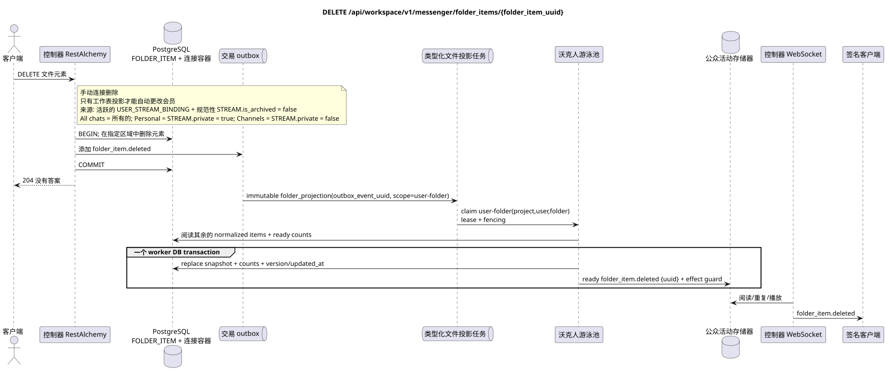

# `DELETE /api/workspace/v1/messenger/folder_items/{folder_item_uuid}`

[← 文件的主要索引](../../../../index.md) · [序列图表的索引](../../README.md) · [内容和用户分区 Workspace](../README.md)

状态:在文件中首先开发的操作目标规格. 现行公开合同
没有变化,是 [`workspace_api.md`](../../../../workspace_api.md).
这个文件描述了交易和投影的目标边界;它不是
产品代码,迁移 SQL 或新终点.



[可编辑的源 PlantUML](diagrams/delete_folder_item.puml)

## 任命和公开合同

从当前用户文件中删除流.

认证:持有者IAM;`project_id`和当前`user_uuid`代币从文本中取出 IAM.

## 查询路径和参数

| 位置 | 姓名 | 类型 / 规则 |
| --- | --- | --- |
| 路径 | `folder_item_uuid` | UUID |

集合页面,如果它是,将保留当前的合同 `page_limit` 和 UUID
`page_marker` 返回 `X-Pagination-Limit`,以及
`X-Pagination-Marker` 只要下一个页面.

## 查询的本体

查询的本体不存在.

## 成功的答案

`204` 答案的空体.


## 错误和授权

不正确或未授权的输入数据由RESTAlchemy/IAM的错误界面处理; 给定的区域中的资源不会在用户/项目之外被披露.

验证错误时的答案的一般形式:

```json
{
  "type": "ValidationErrorException",
  "code": 400,
  "message": "Validation error occurred."
}
```

## 目标边界 RestAlchemy

```python
from restalchemy.api import controllers as ra_controllers
from restalchemy.api import resources as ra_resources
from restalchemy.dm import models
from restalchemy.dm import properties
from restalchemy.dm import types
from restalchemy.storage.sql import orm


class WorkspaceFolderItem(models.ModelWithUUID, models.ModelWithProject,
                          models.ModelWithTimestamp, orm.SQLStorableMixin):
    __tablename__ = "messenger_folder_items"
    user_uuid = properties.property(types.UUID(), required=True, read_only=True)
    folder_uuid = properties.property(types.UUID(), required=True)
    stream_uuid = properties.property(types.UUID(), required=True)
    chat_type = properties.property(types.Enum(["stream", "group", "private"]), required=True)
    order_index = properties.property(types.AllowNone(types.Integer()))
    pinned_at = properties.property(types.AllowNone(types.UTCDateTimeZ()), read_only=True)


class WorkspaceUserFolderItem(models.ModelWithTimestamp, orm.SQLStorableMixin):
    __tablename__ = "messenger_api_user_folder_items_v1"
    uuid = properties.property(types.UUID(), id_property=True, read_only=True)
    project_id = properties.property(types.UUID(), read_only=True)
    user_uuid = properties.property(types.UUID(), read_only=True)
    folder_uuid = properties.property(types.UUID(), read_only=True)
    stream_uuid = properties.property(types.UUID(), read_only=True)
    chat_type = properties.property(
        types.Enum(["stream", "group", "private"]), read_only=True,
    )
    order_index = properties.property(types.AllowNone(types.Integer()))
    pinned_at = properties.property(types.AllowNone(types.UTCDateTimeZ()), read_only=True)
    # Ready fields are joined from unique USER_STREAM_BINDING. They are not
    # stored on WorkspaceFolderItem and are never calculated on API reads.
    unread_count = properties.property(types.Integer(min_value=0), read_only=True)
    active_unread_count = properties.property(types.Integer(min_value=0), read_only=True)
    passive_unread_count = properties.property(types.Integer(min_value=0), read_only=True)


class FolderItemController(ra_controllers.BaseResourceControllerPaginated):
    __resource__ = ra_resources.ResourceByRAModel(
        model_class=WorkspaceUserFolderItem,
        convert_underscore=False,
        process_filters=True,
    )
    # Writes use WorkspaceFolderItem; reads use the calculation-free view.
```

每个公开引用的实体都被声明为 RestAlchemy 的标数UUID 属性,而不是 `relationship` (它会被串行为 URI).相应的物理列 `*_uuid` 一个具有明显选择的引用操作的索引外部密钥.因此公开JSON 保持UUID 没有变化.

物理元素具有索引FK`folder_uuid`, `stream_uuid`没有`user_uuid`没有`ON DELETE CASCADE`他们的公开.UUID单独的链接是唯一的链接.`USER_STREAM_BINDING`通过`(project_id,user_uuid,stream_uuid)`它们从来没有被保存在消息链接中,也没有被计算在这个查询中..

路由器将手动删除用户文件中的连接.
系统文件中的自动`FOLDER_ITEM`不会手动删除:
维克尔的重建物质化投影,
支持一个活跃的 `USER_STREAM_BINDING` 和一个正规的 `STREAM`
`is_archived = false`. `All chats` 包括所有可用的流,
`Personal` — 只有流量从 `STREAM.private = true`, `Channels` 只有从
`STREAM.private = false`. 通过交易来更改源
outbox 和一个单独的 immutable task `outbox_event_uuid`.

## 同步路径 API

1. 在指定区域中查找和锁定元素.
2. 删除该元素的行.
3. 添加一个不变的记录到Outbox `folder_item.deleted`.
4. 记录交易并恢复 `204`.

## Outbox, 典型任务,工作和实时工作

请求无法启动计数器恢复;删除标记异步实现.

Outbox event 输出 immutable`folder_projection`没有结合和 exact scope
`user-folder:(project_id,user_uuid,folder_uuid)`. 房租租的业主读
剩下的正常化项目和准备流数,然后在一个 worker DB
transaction 取代了决定性 `folder_items_snapshot`,计数器,
version/updated_at 并且准备 `folder_item.deleted`. 管理器只读取事件
在 commit 之后; retry/backoff,DLQ/reaper 和 effect guard 是强制性的.

## 性,关键和比赛

UUID 单独确定删除. 竞争删除/收取是通过交易的顺序允许的;没有外来流或文件被删除.

## 客户端可见时刻

REST `204` 答案立即反映了 normalized item 的删除. 插入的仅读快照文件,计数器和 WebSocket tombstone 可能会滞后到完成 `folder_projection`.

[← 文件的主要索引](../../../../index.md) · [序列图表的索引](../../README.md) · [内容和用户分区 Workspace](../README.md)
