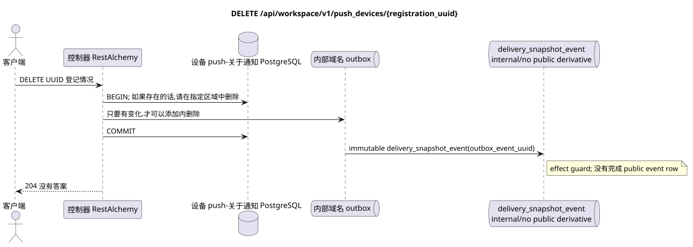

# `DELETE /api/workspace/v1/push_devices/{registration_uuid}`


总目标可靠性变量:每个 immutable outbox 事件都会产生一个唯一的 immutable typed task `outbox_event_uuid`;并无 coalescing. Task 存储实际的 exact scope key,使用 lease/fencing, retry/backoff, max attempts/DLQ, reaper 和 idempotent effect guard. Topic scope 仅适用于 placement/message-binding work; shared rows 不会在 topic.

[← 文件的主要索引](../../../../index.md) · [序列图表的索引](../../README.md) · [内容和用户分区 Workspace](../README.md)

状态:在文件中首先开发的操作目标规格. 现行公开合同
没有变化,是 [`workspace_api.md`](../../../../workspace_api.md).
这个文件描述了交易和投影的目标边界;它不是
产品代码,迁移 SQL 或新终点.



[可编辑的源 PlantUML](diagrams/delete_push_device.puml)

## 任命和公开合同

能够删除当前用户的安装注册.

认证:持有者IAM;`project_id`和当前`user_uuid`代币从文本中取出 IAM.

## 查询路径和参数

| 位置 | 姓名 | 类型 / 规则 |
| --- | --- | --- |
| 路径 | `registration_uuid` | UUID |

集合页面,如果它是,将保留当前的合同 `page_limit` 和 UUID
`page_marker` 返回 `X-Pagination-Limit`,以及
`X-Pagination-Marker` 只要下一个页面.

## 查询的本体

查询的本体不存在.

## 成功的答案

`204` 答案的空体.


## 错误和授权

操作返回`204`既当注册在指定区域删除,又当它已经不存在. 错误的背景UUID/IAM被验证的总边界处理.

验证错误时的答案的一般形式:

```json
{
  "type": "ValidationErrorException",
  "code": 400,
  "message": "Validation error occurred."
}
```

## 目标边界 RestAlchemy

```python
from restalchemy.api import controllers as ra_controllers
from restalchemy.api import resources as ra_resources
from restalchemy.dm import models
from restalchemy.dm import properties
from restalchemy.dm import types
from restalchemy.storage.sql import orm


class PushDevice(models.ModelWithUUID, models.ModelWithProject,
                 models.ModelWithTimestamp, orm.SQLStorableMixin):
    __tablename__ = "m_workspace_push_devices"
    user_uuid = properties.property(types.UUID(), required=True, read_only=True)
    transport = properties.property(types.Enum(["fcm"]), required=True)
    platform = properties.property(types.Enum(["android", "ios"]), required=True)
    registration_token = properties.property(types.String(max_length=4096), required=True)
    encryption = properties.property(types.Dict(), required=True)


class PushDeviceController(ra_controllers.BaseResourceController):
    __resource__ = ra_resources.ResourceByRAModel(model_class=PushDevice)
    # Narrow PUT upsert and idempotent DELETE overrides preserve owner scope.
```

每个对实体的公共引用都被声明为 RestAlchemy 的标数 UUID 属性,而不是 `relationship` (它将被串行为 URI).相应的物理列 `*_uuid` 一个具有明显选择的引用操作的索引外部密钥.因此,公共 JSON 保持UUID 不变.

控制推送通知的注册是对Messenger实体进行处理的. UUID设置资源密钥. `user_uuid`和`project_id` 服务器的标数UUID字段,支持区域索引列;加密使用现有模型 `kind` HPKE.

## 同步路径 API

1. 指定所有者区域.
2. 只要 UUID,项目和用户一致时删除行.
3. 如果行已更改,将内置未更改的记录添加到Outbox中,而不会公开导数.
4. 在两种情况下,记录交易并返回 `204`.

## Outbox, 典型任务,工作和实时工作

没有创建公共任务/事件或推送通知的有效负载.

现在的合同只管理注册. immutable
outbox-事件产生一个 `delivery_snapshot_event`,它是dimpotent的
记录了公开的衍生词的缺失,并完成; Workspace event row
没有WebSocket发送无法创建.
在这个终点之外.

## 性,关键和比赛

删除是无效的,不显示其它域的登录.UUID登记情况.

## 客户端可见时刻

登录变更可以看到到返回 HTTP 时. 没有公开 WebSocket 事件.

[← 文件的主要索引](../../../../index.md) · [序列图表的索引](../../README.md) · [内容和用户分区 Workspace](../README.md)
