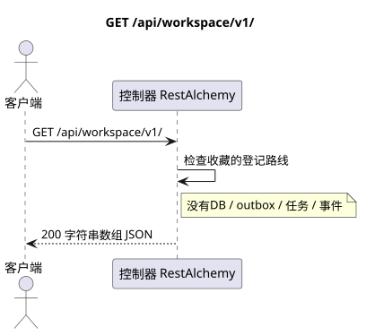

# `GET /api/workspace/v1/`

[← 文件的主要索引](../../../../index.md) · [序列图表的索引](../../README.md) · [内容和用户分区 Workspace](../README.md)

状态:在文件中首先开发的操作目标规格. 现行公开合同
没有变化,是 [`workspace_api.md`](../../../../workspace_api.md).
这个文件描述了交易和投影的目标边界;它不是
产品代码,迁移 SQL 或新终点.



[可编辑的源 PlantUML](diagrams/get_api_routes_index.puml)

## 任命和公开合同

在根下列出当前的集合路由名 Workspace v1.

认证:持有者IAM;`project_id`和当前`user_uuid`代币从文本中取出 IAM.

## 查询路径和参数

路径和查询参数不接受.

集合页面,如果它是,将保留当前的合同 `page_limit` 和 UUID
`page_marker` 返回 `X-Pagination-Limit`,以及
`X-Pagination-Marker` 只要下一个页面.

## 查询的本体

查询的本体不存在.

## 成功的答案

`200`

```json
[
  "epoch",
  "events",
  "me",
  "messenger",
  "push_devices",
  "services",
  "users"
]
```


## 错误和授权

验证错误IAM由总错误边界Workspace处理.对于此执行时间路线列表,没有资源未找到的情况,并且它不接受功能过器.

验证错误时的答案的一般形式:

```json
{
  "type": "ValidationErrorException",
  "code": 400,
  "message": "Validation error occurred."
}
```

## 目标边界 RestAlchemy

```python
from restalchemy.api import controllers as ra_controllers


class WorkspaceApiEndpointController(ra_controllers.RoutesListController):
    __TARGET_PATH__ = "/v1/"


class MessengerApiEndpointController(ra_controllers.RoutesListController):
    __TARGET_PATH__ = "/v1/messenger/"
```

对于此路由/中间软件的答案,没有域名模型或物理外部密钥.

`RoutesListController` 检查静态路线树;它的执行时间表是路线索引的公共边界,而不是域资源模型.

## 同步路径 API

1. 验证查询.
2. 检查已注册的路线树.
3. 返回收藏路径的顺序名称..

## Outbox, 典型任务,工作和实时工作

这种读取不会记录域事件或Outbox记录,不会创建典型的投影任务,也不会发布公开事件.基于DB的资源是通过无计算的索引读取的.所有计数器都已经实现;请求不执行`COUNT`,`GROUP BY`,相关子查询,也不扫描消息绑定.

管理员 WebSocket 没有参与.

## 性,关键和比赛

操作是安全的,因为它不会改变状态. 在DB交易期间,资源和过域的相同性是稳定的.

## 客户端可见时刻

客户端获得读取交易执行时可用的固定的状态;请求没有计划新的延期工作.

[← 文件的主要索引](../../../../index.md) · [序列图表的索引](../../README.md) · [内容和用户分区 Workspace](../README.md)
