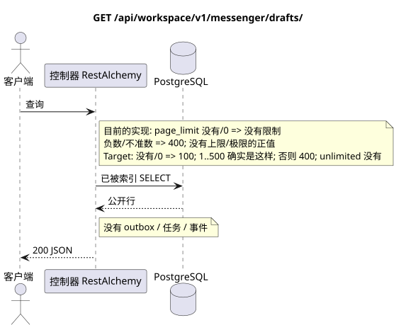

# `GET /api/workspace/v1/messenger/drafts/`

[← 文件的主要索引](../../../../index.md) · [序列图表的索引](../../README.md) · [内容和用户分区 Workspace](../README.md)

状态:在文件中首先开发的操作目标规格. 现行公开合同
没有变化,是 [`workspace_api.md`](../../../../workspace_api.md).
这个文件描述了交易和投影的目标边界;它不是
产品代码,迁移 SQL 或新终点.



[可编辑的源 PlantUML](diagrams/get_drafts_list.puml)

## 任命和公开合同

列出当前用户的原稿,以稳定的光标页面 `(updated_at, uuid)`.

认证:持有者IAM;`project_id`和当前`user_uuid`代币从文本中取出 IAM.

## 查询路径和参数

| 位置 | 姓名 | 类型 / 规则 |
| --- | --- | --- |
| 查询 | `page_limit` | current: 没有/`0`意味着无限; target:没有/`0` => `100`, `1..500`确切,负/不目标/`>500` => `400`没有 clamp |
| 查询 | `page_marker` | UUID 在同一区域的所有者和过器 |
| 查询 | `sort_key` | 只有 `updated_at` |
| 查询 | `sort_dir` | `asc` 或 `desc` |
| 查询 | `stream_uuid` | 没有义务 UUID |
| 查询 | `topic_uuid` | 没有义务 UUID |

集合页面,如果它是,将保留当前的合同 `page_limit` 和 UUID
`page_marker` 返回 `X-Pagination-Limit`,以及
`X-Pagination-Marker` 只要下一个页面.

Target default — `100`, hard maximum — `500`; `0` 也表示`100`,unbounded mode不存在.参数名称和公共JSON形式不变;全输出客户端读到下一个不存在 marker.

## 查询的本体

查询的本体不存在.

## 成功的答案

`200`

```json
[
  {
    "uuid": "ca14d274-0057-4a9a-a34b-fb1174be6a17",
    "project_id": "22222222-2222-2222-2222-222222222222",
    "user_uuid": "11111111-1111-1111-1111-111111111111",
    "stream_uuid": "75309057-419c-4b12-a7c1-3932429ec4a6",
    "topic_uuid": "4ec0b996-b778-45f8-8ef4-ef863be0c047",
    "payload": {
      "kind": "markdown",
      "content": "Draft message"
    },
    "revision": 1,
    "created_at": "2026-07-17T08:00:00Z",
    "updated_at": "2026-07-17T08:00:00Z"
  }
]
```


## 错误和授权

错误的排序/过参数返回`400`.标记器在所有者/项目/过器的确切区域之外返回`404`.错误IAM由通用边界处理.

验证错误时的答案的一般形式:

```json
{
  "type": "ValidationErrorException",
  "code": 400,
  "message": "Validation error occurred."
}
```

## 目标边界 RestAlchemy

```python
from restalchemy.api import controllers as ra_controllers
from restalchemy.api import resources as ra_resources
from restalchemy.dm import models
from restalchemy.dm import properties
from restalchemy.dm import types
from restalchemy.storage.sql import orm


class WorkspaceDraft(models.ModelWithUUID, models.ModelWithProject,
                     models.ModelWithTimestamp, orm.SQLStorableMixin):
    # Contract boundary only; target physical naming/decomposition is not selected.
    __tablename__ = "m_workspace_drafts"
    user_uuid = properties.property(types.UUID(), required=True, read_only=True)
    stream_uuid = properties.property(types.UUID(), required=True, read_only=True)
    topic_uuid = properties.property(types.UUID(), required=True, read_only=True)
    payload = properties.property(types.Dict(), required=True)
    revision = properties.property(types.Integer(min_value=1), read_only=True)


class WorkspaceDraftController(ra_controllers.BaseResourceControllerPaginated):
    __resource__ = ra_resources.ResourceByRAModel(
        model_class=WorkspaceDraft,
        convert_underscore=False,
        process_filters=True,
    )
    # Narrow overrides preserve owner scope, keyset marker, ETag and If-Match.
```

每个对实体的公共引用都被声明为 RestAlchemy 的标数 UUID 属性,而不是 `relationship` (它将被串行为 URI).相应的物理列 `*_uuid` 一个具有明显选择的引用操作的索引外部密钥.因此,公共 JSON 保持UUID 不变.

目标内部模型的草稿是故意不被处理的. 广告固定了不变的尺度边界UUID/ETag. 物理UUID用户/流/主题列仍然是FK的索引,与当前合同的 Cascading行为;关系RestAlchemy不应该改变公开的 UUID JSON.

## 同步路径 API

1. 检查区域 IAM.
2. 执行索引资源读取.
3. 串行未更改的公共 JSON.

## Outbox, 典型任务,工作和实时工作

这种读取不会记录域事件或Outbox记录,不会创建典型的投影任务,也不会发布公开事件.基于DB的资源是通过无计算的索引读取的.所有计数器都已经实现;请求不执行`COUNT`,`GROUP BY`,相关子查询,也不扫描消息绑定.

管理员 WebSocket 没有参与.

## 性,关键和比赛

操作是安全的,因为它不会改变状态. 在DB交易期间,资源和过域的相同性是稳定的.

## 客户端可见时刻

客户端获得读取交易执行时可用的固定的状态;请求没有计划新的延期工作.

[← 文件的主要索引](../../../../index.md) · [序列图表的索引](../../README.md) · [内容和用户分区 Workspace](../README.md)
