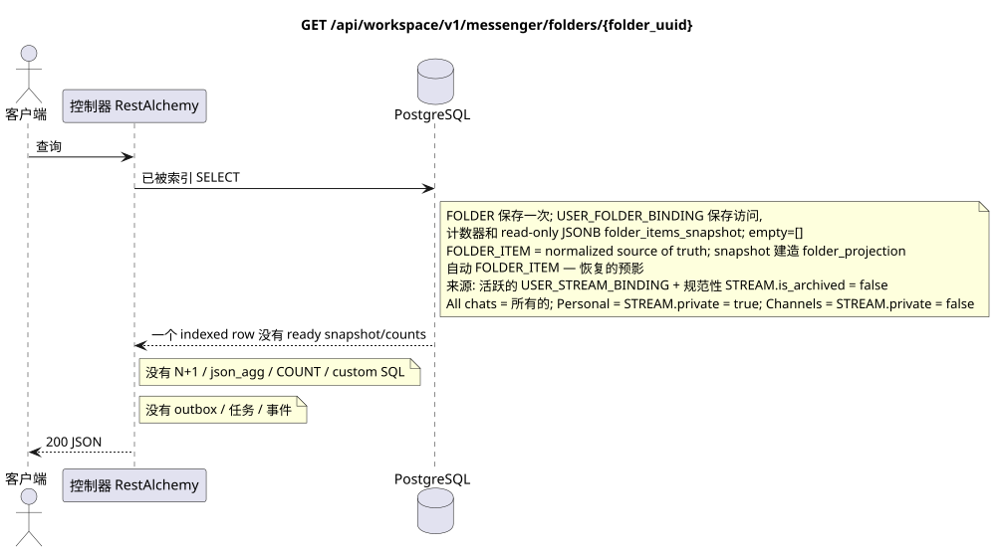

# `GET /api/workspace/v1/messenger/folders/{folder_uuid}`

[← 文件的主要索引](../../../../index.md) · [序列图表的索引](../../README.md) · [内容和用户分区 Workspace](../README.md)

状态:在文件中首先开发的操作目标规格. 现行公开合同
没有变化,是 [`workspace_api.md`](../../../../workspace_api.md).
这个文件描述了交易和投影的目标边界;它不是
产品代码,迁移 SQL 或新终点.



[可编辑的源 PlantUML](diagrams/get_folder.puml)

## 任命和公开合同

获取当前用户的一个文件.

认证:持有者IAM;`project_id`和当前`user_uuid`代币从文本中取出 IAM.

## 查询路径和参数

| 位置 | 姓名 | 类型 / 规则 |
| --- | --- | --- |
| 路径 | `folder_uuid` | UUID |

集合页面,如果它是,将保留当前的合同 `page_limit` 和 UUID
`page_marker` 返回 `X-Pagination-Limit`,以及
`X-Pagination-Marker` 只要下一个页面.

## 查询的本体

查询的本体不存在.

## 成功的答案

`200`

```json
{
  "uuid": "50ecadd0-9823-4d97-b54c-806cc672c210",
  "title": "Inbox",
  "background_color_value": 4280391411,
  "unread_count": 3,
  "system_type": "created",
  "folder_items": [
    {
      "uuid": "9f41b1a7-77f9-4c12-bdc6-d3cebc5dbf50",
      "project_id": "22222222-2222-2222-2222-222222222222",
      "folder_uuid": "50ecadd0-9823-4d97-b54c-806cc672c210",
      "user_uuid": "11111111-1111-1111-1111-111111111111",
      "stream_uuid": "75309057-419c-4b12-a7c1-3932429ec4a6",
      "chat_type": "stream",
      "order_index": 10,
      "pinned_at": null,
      "unread_count": 3,
      "active_unread_count": 3,
      "passive_unread_count": 0,
      "created_at": "2026-06-22T09:30:00Z",
      "updated_at": "2026-06-22T09:30:00Z"
    }
  ],
  "created_at": "2026-06-22T09:30:00Z",
  "updated_at": "2026-06-22T09:30:00Z"
}
```


## 错误和授权

不正的过器返回HTTP`400`;无法访问的单个资源返回未找到.错误IAM通过了通用身份验证错误界限 Workspace.

验证错误时的答案的一般形式:

```json
{
  "type": "ValidationErrorException",
  "code": 400,
  "message": "Validation error occurred."
}
```

## 目标边界 RestAlchemy

```python
from restalchemy.api import controllers as ra_controllers
from restalchemy.api import resources as ra_resources
from restalchemy.dm import models
from restalchemy.dm import properties
from restalchemy.dm import types
from restalchemy.storage.sql import orm


class WorkspaceFolder(models.ModelWithUUID, models.ModelWithProject,
                      models.ModelWithTimestamp, orm.SQLStorableMixin):
    __tablename__ = "messenger_folders"
    title = properties.property(types.String(min_length=1, max_length=64), required=True)
    background_color_value = properties.property(types.AllowNone(types.Integer()))


class WorkspaceUserFolderBinding(models.ModelWithUUID, models.ModelWithProject,
                                 models.ModelWithTimestamp, orm.SQLStorableMixin):
    __tablename__ = "messenger_user_folder_bindings"
    # Public UUID links are scalar UUID properties, never URI relationships.
    user_uuid = properties.property(types.UUID(), required=True, read_only=True)
    folder_uuid = properties.property(types.UUID(), required=True, read_only=True)
    unread_count = properties.property(types.Integer(min_value=0), default=0, read_only=True)
    mention_count = properties.property(types.Integer(min_value=0), default=0, read_only=True)
    folder_items_snapshot = properties.property(types.List(), default=list, read_only=True)
    folder_items_snapshot_version = properties.property(types.Integer(min_value=0), default=0, read_only=True)
    folder_items_snapshot_updated_at = properties.property(types.AllowNone(types.UTCDateTimeZ()), read_only=True)
    BUSINESS_KEY = ("project_id", "user_uuid", "folder_uuid")


class WorkspaceUserFolder(models.ModelWithTimestamp, orm.SQLStorableMixin):
    __tablename__ = "messenger_api_user_folders_v1"
    binding_uuid = properties.property(types.UUID(), id_property=True, read_only=True)
    uuid = properties.property(types.UUID(), read_only=True)
    title = properties.property(types.String(min_length=1, max_length=64))
    background_color_value = properties.property(types.AllowNone(types.Integer()))
    unread_count = properties.property(types.Integer(min_value=0), read_only=True)
    system_type = properties.property(types.AllowNone(types.Enum(["all", "created"])), read_only=True)
    folder_items = properties.property(types.List(), read_only=True)


class FolderController(ra_controllers.BaseResourceControllerPaginated):
    __resource__ = ra_resources.ResourceByRAModel(
        model_class=WorkspaceUserFolder,
        hidden_fields=["binding_uuid", "project_id", "user_uuid"],
        convert_underscore=False,
        process_filters=True,
    )
```

每个对实体的公共引用都被声明为 RestAlchemy 的标数 UUID 属性,而不是 `relationship` (它将被串行为 URI).相应的物理列 `*_uuid` 一个具有明显选择的引用操作的索引外部密钥.因此,公共 JSON 保持UUID 不变.

阅读模型返回一个索引`WorkspaceUserFolderBinding`和一个定制`WorkspaceFolder`.公共`folder_items`直接从仅读JSONB`folder_items_snapshot` (空文件`[]`) 中获取. GET不执行N+1,`json_agg`,`COUNT`,子查询或 custom SQL.规范`FOLDER_ITEM`仍然是真理的来源;图像和准备计数器将实现`folder_projection`. `folder_uuid`和`user_uuid` 索引FK与 `ON DELETE CASCADE`.

系统文件  是 `USER_FOLDER_BINDING` 固定规则/类型:
您不能删除或手动转换到另一个规则.
`FOLDER_ITEM` — 它们是可恢复的物质化投影.
并且可以支持它从活跃的`USER_STREAM_BINDING`和定制的`USER_STREAM_BINDING`中
`STREAM` 没有`is_archived = false`: `All chats`包含所有这样的
提供流量,`Personal`只有来自
`STREAM.private = true`, `Channels` («道) 只有
`STREAM.private = false`. API 阅读它们只用简单的索引
合同和行动组件不变.

## 同步路径 API

1. 检查区域 IAM.
2. 执行索引资源读取.
3. 串行未更改的公共 JSON.

## Outbox, 典型任务,工作和实时工作

这种读取不会写到outbox,也不会创建任务. RestAlchemy
resource 阅读一个indexed binding row;计数器和 read-only JSONB
`folder_items_snapshot` 已经准备好了.请求未执行. N+1, `json_agg`, `COUNT`,
`GROUP BY`, 相关的子查询或 custom SQL; 它不能修复 snapshot.

管理员 WebSocket 没有参与.

## 性,关键和比赛

操作是安全的,因为它不会改变状态. 在DB交易期间,资源和过域的相同性是稳定的.

## 客户端可见时刻

客户端获得读取交易执行时可用的固定的状态;请求没有计划新的延期工作.

[← 文件的主要索引](../../../../index.md) · [序列图表的索引](../../README.md) · [内容和用户分区 Workspace](../README.md)
