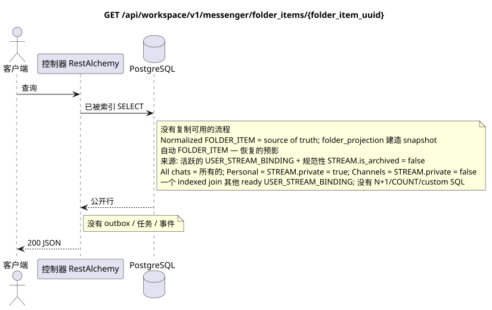

# `GET /api/workspace/v1/messenger/folder_items/{folder_item_uuid}`

[← 文件的主要索引](../../../../index.md) · [序列图表的索引](../../README.md) · [内容和用户分区 Workspace](../README.md)

状态:在文件中首先开发的操作目标规格. 现行公开合同
没有变化,是 [`workspace_api.md`](../../../../workspace_api.md).
这个文件描述了交易和投影的目标边界;它不是
产品代码,迁移 SQL 或新终点.



[可编辑的源 PlantUML](diagrams/get_folder_item.puml)

## 任命和公开合同

获取当前用户文件中的一个元素.

认证:持有者IAM;`project_id`和当前`user_uuid`代币从文本中取出 IAM.

## 查询路径和参数

| 位置 | 姓名 | 类型 / 规则 |
| --- | --- | --- |
| 路径 | `folder_item_uuid` | UUID |

集合页面,如果它是,将保留当前的合同 `page_limit` 和 UUID
`page_marker` 返回 `X-Pagination-Limit`,以及
`X-Pagination-Marker` 只要下一个页面.

## 查询的本体

查询的本体不存在.

## 成功的答案

`200`

```json
{
  "uuid": "9f41b1a7-77f9-4c12-bdc6-d3cebc5dbf50",
  "project_id": "22222222-2222-2222-2222-222222222222",
  "folder_uuid": "50ecadd0-9823-4d97-b54c-806cc672c210",
  "user_uuid": "11111111-1111-1111-1111-111111111111",
  "stream_uuid": "75309057-419c-4b12-a7c1-3932429ec4a6",
  "chat_type": "stream",
  "order_index": 10,
  "pinned_at": null,
  "unread_count": 3,
  "active_unread_count": 3,
  "passive_unread_count": 0,
  "created_at": "2026-06-22T09:30:00Z",
  "updated_at": "2026-06-22T09:30:00Z"
}
```


## 错误和授权

不正的过器返回HTTP`400`;无法访问的单个资源返回未找到.错误IAM通过了通用身份验证错误界限 Workspace.

验证错误时的答案的一般形式:

```json
{
  "type": "ValidationErrorException",
  "code": 400,
  "message": "Validation error occurred."
}
```

## 目标边界 RestAlchemy

```python
from restalchemy.api import controllers as ra_controllers
from restalchemy.api import resources as ra_resources
from restalchemy.dm import models
from restalchemy.dm import properties
from restalchemy.dm import types
from restalchemy.storage.sql import orm


class WorkspaceFolderItem(models.ModelWithUUID, models.ModelWithProject,
                          models.ModelWithTimestamp, orm.SQLStorableMixin):
    __tablename__ = "messenger_folder_items"
    user_uuid = properties.property(types.UUID(), required=True, read_only=True)
    folder_uuid = properties.property(types.UUID(), required=True)
    stream_uuid = properties.property(types.UUID(), required=True)
    chat_type = properties.property(types.Enum(["stream", "group", "private"]), required=True)
    order_index = properties.property(types.AllowNone(types.Integer()))
    pinned_at = properties.property(types.AllowNone(types.UTCDateTimeZ()), read_only=True)


class WorkspaceUserFolderItem(models.ModelWithTimestamp, orm.SQLStorableMixin):
    __tablename__ = "messenger_api_user_folder_items_v1"
    uuid = properties.property(types.UUID(), id_property=True, read_only=True)
    project_id = properties.property(types.UUID(), read_only=True)
    user_uuid = properties.property(types.UUID(), read_only=True)
    folder_uuid = properties.property(types.UUID(), read_only=True)
    stream_uuid = properties.property(types.UUID(), read_only=True)
    chat_type = properties.property(
        types.Enum(["stream", "group", "private"]), read_only=True,
    )
    order_index = properties.property(types.AllowNone(types.Integer()))
    pinned_at = properties.property(types.AllowNone(types.UTCDateTimeZ()), read_only=True)
    # Ready fields are joined from unique USER_STREAM_BINDING. They are not
    # stored on WorkspaceFolderItem and are never calculated on API reads.
    unread_count = properties.property(types.Integer(min_value=0), read_only=True)
    active_unread_count = properties.property(types.Integer(min_value=0), read_only=True)
    passive_unread_count = properties.property(types.Integer(min_value=0), read_only=True)


class FolderItemController(ra_controllers.BaseResourceControllerPaginated):
    __resource__ = ra_resources.ResourceByRAModel(
        model_class=WorkspaceUserFolderItem,
        convert_underscore=False,
        process_filters=True,
    )
    # Writes use WorkspaceFolderItem; reads use the calculation-free view.
```

每个对实体的公共引用都被声明为 RestAlchemy 的标数 UUID 属性,而不是 `relationship` (它将被串行为 URI).相应的物理列 `*_uuid` 一个具有明显选择的引用操作的索引外部密钥.因此,公共 JSON 保持UUID 不变.

物理元素具有索引FK`folder_uuid`, `stream_uuid`没有`user_uuid`没有`ON DELETE CASCADE`他们的公开.UUID单独的链接是唯一的链接.`USER_STREAM_BINDING`通过`(project_id,user_uuid,stream_uuid)`它们从来没有被保存在消息链接中,也没有被计算在这个查询中..

规范 `FOLDER_ITEM` 连接`FOLDER` 支持的规范
没有复制的对象 (当前合约中的流).
系统文件 可恢复的物质化投影,
支持从活跃`USER_STREAM_BINDING`和正规的
`STREAM` 没有`is_archived = false`. `All chats`包括所有可用的
河流,`Personal`只有从 `STREAM.private = true`, `Channels` —
只有`STREAM.private = false`这是一个GET仅连接索引
字符串; `COUNT` 在查询和绕行消息时禁止.

## 同步路径 API

1. 检查区域 IAM.
2. 执行索引资源读取.
3. 串行未更改的公共 JSON.

## Outbox, 典型任务,工作和实时工作

这种读取不会记录域事件或Outbox记录,不会创建典型的投影任务,也不会发布公开事件.基于DB的资源是通过无计算的索引读取的.所有计数器都已经实现;请求不执行`COUNT`,`GROUP BY`,相关子查询,也不扫描消息绑定.
公众项读取一个正常化`FOLDER_ITEM`和一个准备
`USER_STREAM_BINDING` 根据索引,这是同一个真理的来源,
`folder_projection` 建造 read-only `USER_FOLDER_BINDING.folder_items_snapshot`.
这 GET 不是修复或重建 snapshot.

管理员 WebSocket 没有参与.

## 性,关键和比赛

操作是安全的,因为它不会改变状态. 在DB交易期间,资源和过域的相同性是稳定的.

## 客户端可见时刻

客户端获得读取交易执行时可用的固定的状态;请求没有计划新的延期工作.

[← 文件的主要索引](../../../../index.md) · [序列图表的索引](../../README.md) · [内容和用户分区 Workspace](../README.md)
