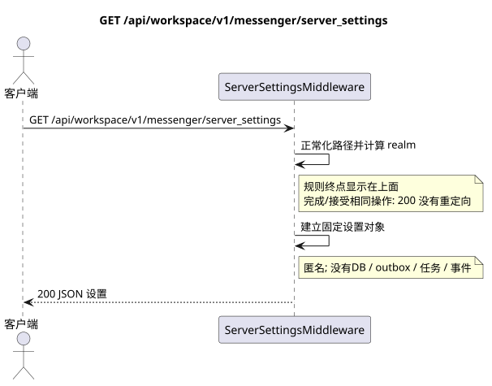

# `GET /api/workspace/v1/messenger/server_settings`

[← 文件的主要索引](../../../../index.md) · [序列图表的索引](../../README.md) · [内容和用户分区 Workspace](../README.md)

状态:在文件中首先开发的操作目标规格. 现行公开合同
没有变化,是 [`workspace_api.md`](../../../../workspace_api.md).
这个文件描述了交易和投影的目标边界;它不是
产品代码,迁移 SQL 或新终点.



[可编辑的源 PlantUML](diagrams/get_server_settings.puml)

## 任命和公开合同

返回匿名的 Zulip 兼容服务器发现对象 (server discovery).
规范操作 — `GET /api/workspace/v1/messenger/server_settings`.
查询到相同的路径,完成 `/` 接收相同的中间软件,并返回
这就是`200`没有转向,这是一种操作行为,而不是第二个路线..

无需认证;这是唯一一个无认证的 Workspace 终点,它使用 UI.

## 查询路径和参数

| 位置 | 姓名 | 类型 / 规则 |
| --- | --- | --- |
| 查询 | `any unsupported name` | 它们被接受,但被忽略; `ignored_parameters_unsupported` |

## 查询的本体

查询的本体不存在.

## 成功的答案

`200`

```json
{
  "result": "success",
  "msg": "Welcome to Exordos Workspace",
  "authentication_methods": {
    "password": true,
    "dev": false,
    "email": true,
    "ldap": false,
    "remoteuser": false,
    "github": false,
    "azuread": false,
    "gitlab": false,
    "google": false,
    "apple": false,
    "saml": false,
    "openid connect": false
  },
  "push_notifications_enabled": true,
  "email_auth_enabled": true,
  "require_email_format_usernames": true,
  "realm_url": "https://workspace.example.com",
  "realm_name": "Exordos Workspace",
  "realm_icon": "urn:url:https://workspace.example.com/logo-512x512.png",
  "realm_description": "<p>Exordos Workspace messenger.</p>",
  "realm_web_public_access_enabled": false,
  "meet_url": "https://meet.genesis-core.tech",
  "external_authentication_methods": [],
  "realm_uri": "https://workspace.example.com"
}
```


## 错误和授权

间接软件返回`200`既是正规的路,也是完结的路.`/`没有转向:两种选择都通过`rstrip("/")`并且通过一个操作处理. 没有支持的请求参数不会导致错误;它们的名字在响应中返回.`Host`和代理遵循了反代理的记录边界.

验证错误时的答案的一般形式:

```json
{
  "type": "ValidationErrorException",
  "code": 400,
  "message": "Validation error occurred."
}
```

## 目标边界 RestAlchemy

```python
# Middleware endpoint: it deliberately has no RestAlchemy resource/model.
class ServerSettingsMiddleware:
    PATH = "/v1/server_settings"

    def process_request(self, request):
        # Returns the fixed public discovery object for both slash forms.
        ...
```

对于此路由/中间软件的答案,没有域名模型或物理外部密钥.

URL realm 由 `Host` 和信任 `X-Forwarded-Proto` 组成; 这个中间软件必须保持资源路由器之外 RestAlchemy.

## 同步路径 API

1. 正常化完成的删除.
2. 计算公开 URL 领域的信任查询标题.
3. 创建和恢复固定的发现对象..

## Outbox, 典型任务,工作和实时工作

这种读取不会记录域事件或Outbox记录,不会创建典型的投影任务,也不会发布公共事件.基于DB的资源是通过无计算的索引读取的.所有计数器都已经实现了;请求不执行`COUNT`,`GROUP BY`,相关子查询,也不扫描消息绑定.

管理员 WebSocket 没有参与.

## 性,关键和比赛

操作是安全的,因为它不会改变状态. 在DB交易期间,资源和过域的相同性是稳定的.

## 客户端可见时刻

客户端获得读取交易执行时可用的固定的状态;请求没有计划新的延期工作.

[← 文件的主要索引](../../../../index.md) · [序列图表的索引](../../README.md) · [内容和用户分区 Workspace](../README.md)
