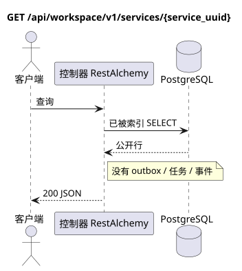

# `GET /api/workspace/v1/services/{service_uuid}`

[← 文件的主要索引](../../../../index.md) · [序列图表的索引](../../README.md) · [内容和用户分区 Workspace](../README.md)

状态:在文件中首先开发的操作目标规格. 现行公开合同
没有变化,是 [`workspace_api.md`](../../../../workspace_api.md).
这个文件描述了交易和投影的目标边界;它不是
产品代码,迁移 SQL 或新终点.



[可编辑的源 PlantUML](diagrams/get_service.puml)

## 任命和公开合同

获取一个可用服务 Workspace.

认证:持有者IAM;`project_id`和当前`user_uuid`代币从文本中取出 IAM.

## 查询路径和参数

| 位置 | 姓名 | 类型 / 规则 |
| --- | --- | --- |
| 路径 | `service_uuid` | UUID |

集合页面,如果它是,将保留当前的合同 `page_limit` 和 UUID
`page_marker` 返回 `X-Pagination-Limit`,以及
`X-Pagination-Marker` 只要下一个页面.

## 查询的本体

查询的本体不存在.

## 成功的答案

`200`

```json
{
  "uuid": "608919f5-ae0f-44fb-85bf-f1bf56534238",
  "name": "Messenger",
  "description": "Workspace Messenger",
  "service_url": "https://workspace.example.com/",
  "icon": "https://workspace.example.com/icon.svg",
  "created_at": "2026-07-17T08:00:00Z",
  "updated_at": "2026-07-17T08:00:00Z"
}
```


## 错误和授权

不正的过器返回HTTP`400`;无法访问的单个资源返回未找到.错误IAM通过了通用身份验证错误界限 Workspace.

验证错误时的答案的一般形式:

```json
{
  "type": "ValidationErrorException",
  "code": 400,
  "message": "Validation error occurred."
}
```

## 目标边界 RestAlchemy

```python
from restalchemy.api import controllers as ra_controllers
from restalchemy.api import resources as ra_resources
from restalchemy.dm import models
from restalchemy.dm import properties
from restalchemy.dm import types


class Service(models.ModelWithUUID, models.ModelWithTimestamp):
    name = properties.property(types.String(max_length=255), required=True)
    description = properties.property(types.String(max_length=255), default="")
    service_url = properties.property(types.Url(), required=True)
    icon = properties.property(types.AllowNone(types.Url()))


class ServiceController(ra_controllers.BaseResourceControllerPaginated):
    __resource__ = ra_resources.ResourceByRAModel(model_class=Service)
```

每个公开引用的实体都被声明为 RestAlchemy 的标数UUID 属性,而不是 `relationship` (它会被串行为 URI).相应的物理列 `*_uuid` 一个具有明显选择的引用操作的索引外部密钥.因此公开JSON 保持UUID 没有变化.

服务目录仅可读,并且在 Messenger 域处理之外. UUID  资源的公开标识符;公开URI 关系不被输入..

## 同步路径 API

1. 检查区域 IAM.
2. 执行索引资源读取.
3. 串行未更改的公共 JSON.

## Outbox, 典型任务,工作和实时工作

这种读取不会记录域事件或Outbox记录,不会创建典型的投影任务,也不会发布公共事件.基于DB的资源是通过无计算的索引读取的.所有计数器都已经实现了;请求不执行`COUNT`,`GROUP BY`,相关子查询,也不扫描消息绑定.

管理员 WebSocket 没有参与.

## 性,关键和比赛

操作是安全的,因为它不会改变状态. 在DB交易期间,资源和过域的相同性是稳定的.

## 客户端可见时刻

客户端获得读取交易执行时可用的固定的状态;请求没有计划新的延期工作.

[← 文件的主要索引](../../../../index.md) · [序列图表的索引](../../README.md) · [内容和用户分区 Workspace](../README.md)
