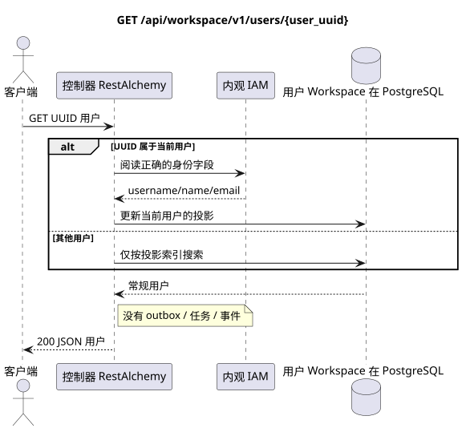

# `GET /api/workspace/v1/users/{user_uuid}`

[← 文件的主要索引](../../../../index.md) · [序列图表的索引](../../README.md) · [内容和用户分区 Workspace](../README.md)

状态:在文件中首先开发的操作目标规格. 现行公开合同
没有变化,是 [`workspace_api.md`](../../../../workspace_api.md).
这个文件描述了交易和投影的目标边界;它不是
产品代码,迁移 SQL 或新终点.



[可编辑的源 PlantUML](diagrams/get_user.puml)

## 任命和公开合同

获取一个物质化的用户 Workspace; 自己的用户请求首先更新从 IAM.

认证:持有者IAM;`project_id`和当前`user_uuid`代币从文本中取出 IAM.

## 查询路径和参数

| 位置 | 姓名 | 类型 / 规则 |
| --- | --- | --- |
| 路径 | `user_uuid` | UUID |

集合页面,如果它是,将保留当前的合同 `page_limit` 和 UUID
`page_marker` 返回 `X-Pagination-Limit`,以及
`X-Pagination-Marker` 只要下一个页面.

## 查询的本体

查询的本体不存在.

## 成功的答案

`200`

```json
{
  "uuid": "11111111-1111-1111-1111-111111111111",
  "username": "admin",
  "source": "iam",
  "status": "active",
  "status_emoji": "coffee",
  "status_text": "Focusing",
  "first_name": "Workspace",
  "last_name": "Administrator",
  "email": "admin@example.com",
  "avatar": "urn:gravatar:0123456789abcdef0123456789abcdef",
  "last_ping_at": "2026-07-17T08:00:00Z",
  "created_at": "2026-07-01T08:00:00Z",
  "updated_at": "2026-07-17T08:00:00Z"
}
```


## 错误和授权

UUID 另一个未被他自己活动实现的用户,返回为未找到. 不正确的 UUID 或状态 IAM 处理为总错误边界.

验证错误时的答案的一般形式:

```json
{
  "type": "ValidationErrorException",
  "code": 400,
  "message": "Validation error occurred."
}
```

## 目标边界 RestAlchemy

```python
from restalchemy.api import controllers as ra_controllers
from restalchemy.api import resources as ra_resources
from restalchemy.dm import models
from restalchemy.dm import properties
from restalchemy.dm import types
from restalchemy.storage.sql import orm


class WorkspaceUser(models.ModelWithUUID, models.ModelWithTimestamp,
                    orm.SQLStorableMixin):
    __tablename__ = "messenger_users"
    username = properties.property(types.String(min_length=1, max_length=128), required=True)
    source = properties.property(types.Enum(["iam", "zulip"]), default="iam")
    status = properties.property(types.Enum(["active", "idle", "offline", "do_not_disturb"]))
    status_emoji = properties.property(types.AllowNone(types.String(max_length=64)))
    status_text = properties.property(types.AllowNone(types.String(max_length=256)))
    avatar = properties.property(types.String(max_length=2048), required=True)


class WorkspaceUserController(ra_controllers.BaseResourceControllerPaginated):
    __resource__ = ra_resources.ResourceByRAModel(
        model_class=WorkspaceUser,
        convert_underscore=False,
        process_filters=True,
    )
    # Narrow own-user IAM refresh and presence/avatar actions preserve the API.
```

每个公开引用的实体都被声明为 RestAlchemy 的标数UUID 属性,而不是 `relationship` (它会被串行为 URI).相应的物理列 `*_uuid` 一个具有明显选择的引用操作的索引外部密钥.因此公开JSON 保持UUID 没有变化.

`WorkspaceUser` — 唯一的实体. 提供商公开的 UUID 类链接仍然是提供商清理容器中的标字段; 物理链接是 FK 索引. 属于 IAM 的身份字段仅可用于浏览器查询.

## 同步路径 API

1. 执行验证.
2. 如果 UUID 是当前用户的,请同步更新 IAM 的身份字段;否则只执行投影搜索.
3. 阅读和清理用户的正规行.
4. 返回它. GET 不创建公共的Outbox,任务或事件记录.

## Outbox, 典型任务,工作和实时工作

这种读取不会记录域事件或Outbox记录,不会创建典型的投影任务,也不会发布公共事件.基于DB的资源是通过无计算的索引读取的.所有计数器都已经实现了;请求不执行`COUNT`,`GROUP BY`,相关子查询,也不扫描消息绑定.

管理员 WebSocket 没有参与.

## 性,关键和比赛

操作是安全的,因为它不会改变状态. 在DB交易期间,资源和过域的相同性是稳定的.

## 客户端可见时刻

客户端获得读取交易执行时可用的固定的状态;请求没有计划新的延期工作.

[← 文件的主要索引](../../../../index.md) · [序列图表的索引](../../README.md) · [内容和用户分区 Workspace](../README.md)
