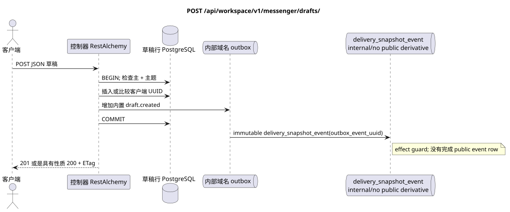

# `POST /api/workspace/v1/messenger/drafts/`


总目标可靠性变量:每个 immutable outbox 事件都会产生一个唯一的 immutable typed task `outbox_event_uuid`;并无 coalescing. Task 存储实际的 exact scope key,使用 lease/fencing, retry/backoff, max attempts/DLQ, reaper 和 idempotent effect guard. Topic scope 仅适用于 placement/message-binding work; shared rows 不会在 topic.

[← 文件的主要索引](../../../../index.md) · [序列图表的索引](../../README.md) · [内容和用户分区 Workspace](../README.md)

状态:在文件中首先开发的操作目标规格. 现行公开合同
没有变化,是 [`workspace_api.md`](../../../../workspace_api.md).
这个文件描述了交易和投影的目标边界;它不是
产品代码,迁移 SQL 或新终点.



[可编辑的源 PlantUML](diagrams/post_drafts_create.puml)

## 任命和公开合同

创建一个拥有者草稿,使用客户端创建的 UUID 作为impotency 密钥.

认证:持有者IAM;`project_id`和当前`user_uuid`代币从文本中取出 IAM.

## 查询路径和参数

路径和查询参数不接受.

集合页面,如果它是,将保留当前的合同 `page_limit` 和 UUID
`page_marker` 返回 `X-Pagination-Limit`,以及
`X-Pagination-Marker` 只要下一个页面.

## 查询的本体

```json
{
  "uuid": "ca14d274-0057-4a9a-a34b-fb1174be6a17",
  "stream_uuid": "75309057-419c-4b12-a7c1-3932429ec4a6",
  "topic_uuid": "4ec0b996-b778-45f8-8ef4-ef863be0c047",
  "payload": {
    "kind": "markdown",
    "content": "Draft message"
  }
}
```

## 成功的答案

`201` 对于新行或 `200`

```json
{
  "uuid": "ca14d274-0057-4a9a-a34b-fb1174be6a17",
  "project_id": "22222222-2222-2222-2222-222222222222",
  "user_uuid": "11111111-1111-1111-1111-111111111111",
  "stream_uuid": "75309057-419c-4b12-a7c1-3932429ec4a6",
  "topic_uuid": "4ec0b996-b778-45f8-8ef4-ef863be0c047",
  "payload": {
    "kind": "markdown",
    "content": "Draft message"
  },
  "revision": 1,
  "created_at": "2026-07-17T08:00:00Z",
  "updated_at": "2026-07-17T08:00:00Z"
}
```

答案标题: `ETag: "1"`.

## 错误和授权

错误的 Markup 返回 `400`. 复用 UUID 与其他创建定律字段返回 `409`; 确切的错误体包含 `message` 字符串. 无法访问的流域/主题未被揭示.

验证错误时的答案的一般形式:

```json
{
  "type": "ValidationErrorException",
  "code": 400,
  "message": "Validation error occurred."
}
```

## 目标边界 RestAlchemy

```python
from restalchemy.api import controllers as ra_controllers
from restalchemy.api import resources as ra_resources
from restalchemy.dm import models
from restalchemy.dm import properties
from restalchemy.dm import types
from restalchemy.storage.sql import orm


class WorkspaceDraft(models.ModelWithUUID, models.ModelWithProject,
                     models.ModelWithTimestamp, orm.SQLStorableMixin):
    # Contract boundary only; target physical naming/decomposition is not selected.
    __tablename__ = "m_workspace_drafts"
    user_uuid = properties.property(types.UUID(), required=True, read_only=True)
    stream_uuid = properties.property(types.UUID(), required=True, read_only=True)
    topic_uuid = properties.property(types.UUID(), required=True, read_only=True)
    payload = properties.property(types.Dict(), required=True)
    revision = properties.property(types.Integer(min_value=1), read_only=True)


class WorkspaceDraftController(ra_controllers.BaseResourceControllerPaginated):
    __resource__ = ra_resources.ResourceByRAModel(
        model_class=WorkspaceDraft,
        convert_underscore=False,
        process_filters=True,
    )
    # Narrow overrides preserve owner scope, keyset marker, ETag and If-Match.
```

每个公开引用的实体都被声明为 RestAlchemy 的标数UUID 属性,而不是 `relationship` (它会被串行为 URI).相应的物理列 `*_uuid` 一个具有明显选择的引用操作的索引外部密钥.因此公开JSON 保持UUID 没有变化.

目标内部模型的草稿是故意不被处理的. 广告固定了不变的尺度边界UUID/ETag. 物理UUID用户/流/主题列仍然是FK的索引,与当前合同的 Cascading行为;关系RestAlchemy不应该改变公开的 UUID JSON.

## 同步路径 API

1. 检查到创建字段和长度为40,000个字符的 Markdown.
2. 检查主持人成员身份和流主题属性.
3. 按客户端 UUID 插入或比较现有的所有者行,以确定正确的进因重复.
4. 在Outbox中添加一个内置的不变域名条目.
5. 记录交易并返回严格的行 ETag.

## Outbox, 典型任务,工作和实时工作

创建草稿不会影响消息,反应,未读数或文件链接.

内部 immutable 输出箱事件输出一个 `delivery_snapshot_event`,
并且完成了;
已准备的 Workspace事件行和 WebSocket 交付未创建.

## 性,关键和比赛

客户端UUID  进电源密钥:相同的重复返回现有草稿 (`200`),不同重复使用 `409`. 独特的UUID与业主/项目区域一起防止重复行.

## 客户端可见时刻

发起客户端立即看到固定的草稿.其他客户端只会在重新启动或明显再次请求草稿后看到;最终没有一致的更新.

[← 文件的主要索引](../../../../index.md) · [序列图表的索引](../../README.md) · [内容和用户分区 Workspace](../README.md)
