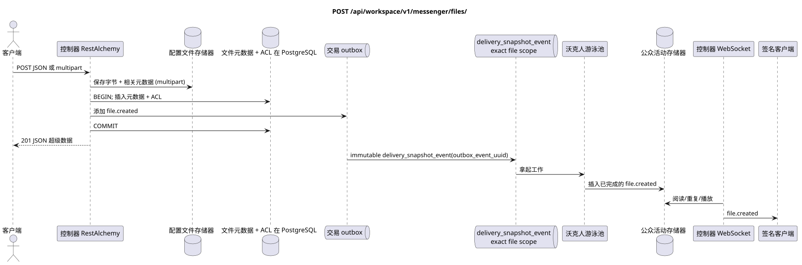

# `POST /api/workspace/v1/messenger/files/`


总目标可靠性变量:每个 immutable outbox 事件都会产生一个唯一的 immutable typed task `outbox_event_uuid`;并无 coalescing. Task 存储实际的 exact scope key,使用 lease/fencing, retry/backoff, max attempts/DLQ, reaper 和 idempotent effect guard. Topic scope 仅适用于 placement/message-binding work; shared rows 不会在 topic.

[← 文件的主要索引](../../../../index.md) · [序列图表的索引](../../README.md) · [内容和用户分区 Workspace](../README.md)

状态:在文件中首先开发的操作目标规格. 现行公开合同
没有变化,是 [`workspace_api.md`](../../../../workspace_api.md).
这个文件描述了交易和投影的目标边界;它不是
产品代码,迁移 SQL 或新终点.



[可编辑的源 PlantUML](diagrams/post_files_create.puml)

## 任命和公开合同

创建来自JSON的元数据或通过 multipart form data.

认证:持有者IAM;`project_id`和当前`user_uuid`代币从文本中取出 IAM.

## 查询路径和参数

路径和查询参数不接受.

集合页面,如果它是,将保留当前的合同 `page_limit` 和 UUID
`page_marker` 返回 `X-Pagination-Limit`,以及
`X-Pagination-Marker` 只要下一个页面.

## 查询的本体

这个操作是使用 `multipart/form-data`,而不是身体 JSON.

接收到的请求模式有两种.JSON它们的数据:

```json
{
  "stream_uuid": "75309057-419c-4b12-a7c1-3932429ec4a6",
  "name": "example.txt",
  "description": "Example",
  "content_type": "text/plain",
  "size_bytes": 12,
  "hash": "abc"
}
```

多部分模式需要 `file` 和一个区域: `stream_uuid` 或 `acl={"mode":"public"}` 没有流. 默认选择 `name` 是下载文件的名字; `description`  空行.

## 成功的答案

`201`

```json
{
  "uuid": "f11353e0-712d-4b99-a716-5cdba848cc05",
  "user_uuid": "11111111-1111-1111-1111-111111111111",
  "stream_uuid": "75309057-419c-4b12-a7c1-3932429ec4a6",
  "name": "example.txt",
  "description": "Example",
  "content_type": "text/plain",
  "size_bytes": 12,
  "hash": "abc",
  "created_at": "2026-07-17T08:00:00Z",
  "updated_at": "2026-07-17T08:00:00Z"
}
```


## 错误和授权

通过JSON创建需要`stream_uuid`,`name`,`content_type`,`size_bytes`和`hash`.多分数拒绝缺少`file`,同时两个或没有一个区域,公共ACL以及流量和请求超过 nginx 50 MiB限制.访问错误和IAM由共同边界处理.

验证错误时的答案的一般形式:

```json
{
  "type": "ValidationErrorException",
  "code": 400,
  "message": "Validation error occurred."
}
```

## 目标边界 RestAlchemy

```python
from restalchemy.api import controllers as ra_controllers
from restalchemy.api import resources as ra_resources
from restalchemy.dm import models
from restalchemy.dm import properties
from restalchemy.dm import types
from restalchemy.storage.sql import orm


class WorkspaceFile(models.ModelWithUUID, models.ModelWithProject,
                    models.ModelWithTimestamp, orm.SQLStorableMixin):
    # Contract boundary only; target storage decomposition is not selected.
    __tablename__ = "m_workspace_files"
    user_uuid = properties.property(types.UUID(), required=True, read_only=True)
    stream_uuid = properties.property(types.AllowNone(types.UUID()))
    name = properties.property(types.String(max_length=255), required=True)
    description = properties.property(types.String(max_length=255), default="")
    content_type = properties.property(types.String(max_length=255), required=True)
    size_bytes = properties.property(types.Integer(min_value=0), required=True)
    hash = properties.property(types.String(max_length=255), required=True)


class WorkspaceFileController(ra_controllers.BaseResourceControllerPaginated):
    __resource__ = ra_resources.ResourceByRAModel(
        model_class=WorkspaceFile,
        hidden_fields=["project_id"],
        convert_underscore=False,
        process_filters=True,
    )
    # Narrow multipart/storage/download overrides preserve the current contract.
```

每个公开引用的实体都被声明为 RestAlchemy 的标数UUID 属性,而不是 `relationship` (它会被串行为 URI).相应的物理列 `*_uuid` 一个具有明显选择的引用操作的索引外部密钥.因此公开JSON 保持UUID 没有变化.

现行元数据/存储器/ACL合约保留;目标物理分解不选. `project_id`保持隐藏. 尺度`user_uuid`和允许`null` `stream_uuid`仍然是公开UUID值,支持FK索引. 动态访问通过流成员身份通过流的正规绑定进行检查.

## 同步路径 API

1. 检查查询模式和域.
2. 为了多部分,写二进制数据和相关元数据,然后计算 SHA-256.
3. 在DB交易中插入可规性元数据/ACL,并添加一个不可变的条目到outbox中 `file.created`.
4. 记录交易;如果交易记录之前的操作是错误的,则补偿存储器.
5. 恢复清理后的元数据.

## Outbox, 典型任务,工作和实时工作

字节和文件元数据不是消息投影. 只有在元数据固定后才会形成公共创建事件.

固定的域名将创建一个单独的文件 immutable
`delivery_snapshot_event` 文件的scopes和唯一的
`outbox_event_uuid`. 工作者可以写出已完成的 `file.created`,
管理员发送,重复或播放.

## 性,关键和比赛

生成的 UUID 文件定义了不可改变的字节. 存储了一个ACL 区域. 处理相关文件和数据库的错误应该排除公开的指向缺失字节的元数据行; 存储器的具体目标交易力学仍然不受此处理.

## 客户端可见时刻

发起客户端立即获得固定元数据.其他客户端在投影延迟后获得文件的已完成事件. 固定的删除后清理存储器可能在稍后完成,而不会恢复访问元数据.

[← 文件的主要索引](../../../../index.md) · [序列图表的索引](../../README.md) · [内容和用户分区 Workspace](../README.md)
