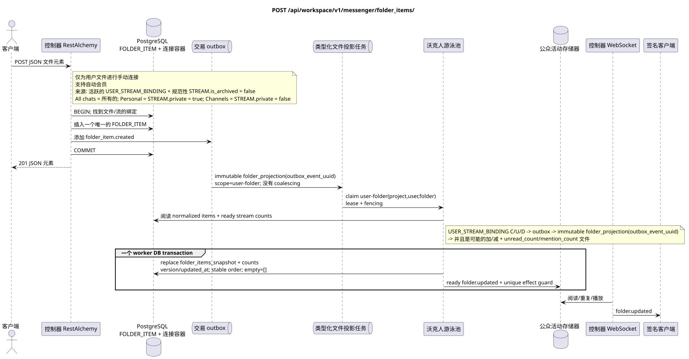

# `POST /api/workspace/v1/messenger/folder_items/`

[← 文件的主要索引](../../../../index.md) · [序列图表的索引](../../README.md) · [内容和用户分区 Workspace](../README.md)

状态:在文件中首先开发的操作目标规格. 现行公开合同
没有变化,是 [`workspace_api.md`](../../../../workspace_api.md).
这个文件描述了交易和投影的目标边界;它不是
产品代码,迁移 SQL 或新终点.



[可编辑的源 PlantUML](diagrams/post_folder_items_create.puml)

## 任命和公开合同

将流添加到当前用户文件中.

认证:持有者IAM;`project_id`和当前`user_uuid`代币从文本中取出 IAM.

## 查询路径和参数

路径和查询参数不接受.

集合页面,如果它是,将保留当前的合同 `page_limit` 和 UUID
`page_marker` 返回 `X-Pagination-Limit`,以及
`X-Pagination-Marker` 只要下一个页面.

## 查询的本体

```json
{
  "folder_uuid": "50ecadd0-9823-4d97-b54c-806cc672c210",
  "stream_uuid": "75309057-419c-4b12-a7c1-3932429ec4a6",
  "chat_type": "stream",
  "order_index": 10
}
```

## 成功的答案

`201`

```json
{
  "uuid": "9f41b1a7-77f9-4c12-bdc6-d3cebc5dbf50",
  "project_id": "22222222-2222-2222-2222-222222222222",
  "folder_uuid": "50ecadd0-9823-4d97-b54c-806cc672c210",
  "user_uuid": "11111111-1111-1111-1111-111111111111",
  "stream_uuid": "75309057-419c-4b12-a7c1-3932429ec4a6",
  "chat_type": "stream",
  "order_index": 10,
  "pinned_at": null,
  "unread_count": 0,
  "active_unread_count": 0,
  "passive_unread_count": 0,
  "created_at": "2026-06-22T09:30:00Z",
  "updated_at": "2026-06-22T09:30:00Z"
}
```


## 错误和授权

不正确或未授权的输入数据由RESTAlchemy/IAM的错误界面处理; 给定的区域中的资源不会在用户/项目之外被披露.

验证错误时的答案的一般形式:

```json
{
  "type": "ValidationErrorException",
  "code": 400,
  "message": "Validation error occurred."
}
```

## 目标边界 RestAlchemy

```python
from restalchemy.api import controllers as ra_controllers
from restalchemy.api import resources as ra_resources
from restalchemy.dm import models
from restalchemy.dm import properties
from restalchemy.dm import types
from restalchemy.storage.sql import orm


class WorkspaceFolderItem(models.ModelWithUUID, models.ModelWithProject,
                          models.ModelWithTimestamp, orm.SQLStorableMixin):
    __tablename__ = "messenger_folder_items"
    user_uuid = properties.property(types.UUID(), required=True, read_only=True)
    folder_uuid = properties.property(types.UUID(), required=True)
    stream_uuid = properties.property(types.UUID(), required=True)
    chat_type = properties.property(types.Enum(["stream", "group", "private"]), required=True)
    order_index = properties.property(types.AllowNone(types.Integer()))
    pinned_at = properties.property(types.AllowNone(types.UTCDateTimeZ()), read_only=True)


class WorkspaceUserFolderItem(models.ModelWithTimestamp, orm.SQLStorableMixin):
    __tablename__ = "messenger_api_user_folder_items_v1"
    uuid = properties.property(types.UUID(), id_property=True, read_only=True)
    project_id = properties.property(types.UUID(), read_only=True)
    user_uuid = properties.property(types.UUID(), read_only=True)
    folder_uuid = properties.property(types.UUID(), read_only=True)
    stream_uuid = properties.property(types.UUID(), read_only=True)
    chat_type = properties.property(
        types.Enum(["stream", "group", "private"]), read_only=True,
    )
    order_index = properties.property(types.AllowNone(types.Integer()))
    pinned_at = properties.property(types.AllowNone(types.UTCDateTimeZ()), read_only=True)
    # Ready fields are joined from unique USER_STREAM_BINDING. They are not
    # stored on WorkspaceFolderItem and are never calculated on API reads.
    unread_count = properties.property(types.Integer(min_value=0), read_only=True)
    active_unread_count = properties.property(types.Integer(min_value=0), read_only=True)
    passive_unread_count = properties.property(types.Integer(min_value=0), read_only=True)


class FolderItemController(ra_controllers.BaseResourceControllerPaginated):
    __resource__ = ra_resources.ResourceByRAModel(
        model_class=WorkspaceUserFolderItem,
        convert_underscore=False,
        process_filters=True,
    )
    # Writes use WorkspaceFolderItem; reads use the calculation-free view.
```

每个对实体的公共引用都被声明为 RestAlchemy 的标数 UUID 属性,而不是 `relationship` (它将被串行为 URI).相应的物理列 `*_uuid` 一个具有明显选择的引用操作的索引外部密钥.因此,公共 JSON 保持UUID 不变.

物理元素具有索引FK`folder_uuid`, `stream_uuid`没有`user_uuid`没有`ON DELETE CASCADE`他们的公开.UUID单独的链接是唯一的链接.`USER_STREAM_BINDING`通过`(project_id,user_uuid,stream_uuid)`它们从来没有被保存在消息链接中,也没有被计算在这个查询中..

这个操作将自定义文件与支持的文件手动连接.
规范对象 (根据当前合同 流量).自动会员
在系统文件中手动创建不了: 变更 `USER_STREAM_BINDING`
写一个交易的Outbox,一个单独的Immutable任务与独特的 `outbox_event_uuid` 启动
并且它可以增加/删除自动`FOLDER_ITEM`和
更新了已准备的集成器件`unread_count`/`mention_count`
`USER_FOLDER_BINDING`. 投影源是活跃的`USER_STREAM_BINDING`和
规范 `STREAM` 的 `is_archived = false`: `All chats` 包括所有这样的
提供流量,`Personal`只有从 `STREAM.private = true`,
`Channels` — 只有 `STREAM.private = false`.

## 同步路径 API

1. 找到当前用户的文件和流.
2. 检查 `chat_type` 和可选顺序.
3. 插入一个单独的文件元素行.
4. 添加一个不变的记录到Outbox `folder_item.created`.
5. 记录交易并返回与现成流量计器连接的元素.

## Outbox, 典型任务,工作和实时工作

查询不会计算文件或流的集. `USER_STREAM_BINDING`.

Outbox event 输出不可变的 `folder_projection` 没有凝聚, exact
scope `user-folder:(project_id,user_uuid,folder_uuid)` 并且是独特的
`outbox_event_uuid`. 房租租的业主读 normalized `FOLDER_ITEM` source of
truth 并且准备好了 `USER_STREAM_BINDING` 计数器,
确切的公共数组和一个 worker DB 交易取代
`folder_items_snapshot`, 计数器,版本/updated_at 和 ready `folder.updated`.
管理器只读取 commit 之后的 event; retry/backoff,DLQ/reaper 和
强大的效果保护是必需的.

## 性,关键和比赛

商业密钥`(project_id,user_uuid,folder_uuid,stream_uuid)`防止重复会员. 竞争的创作被限制允许; 输家获得标准冲突/错误边界.

## 客户端可见时刻

答案 REST 立即显示了正常的项目. 嵌入的仅读 `folder_items_snapshot` 父母文件,它的准备计时器和 WebSocket 事件可能会滞后到 `folder_projection` 完成;这是计划的 eventual consistency.

[← 文件的主要索引](../../../../index.md) · [序列图表的索引](../../README.md) · [内容和用户分区 Workspace](../README.md)
