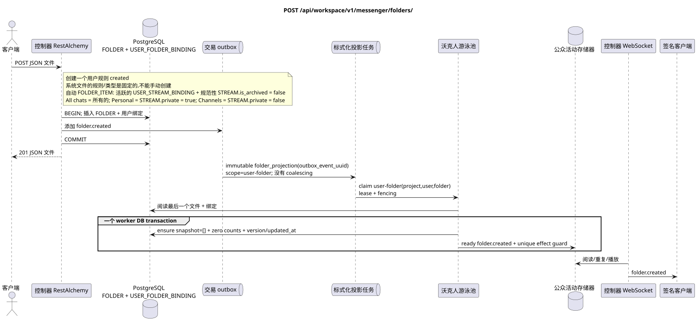

# `POST /api/workspace/v1/messenger/folders/`

[← 文件的主要索引](../../../../index.md) · [序列图表的索引](../../README.md) · [内容和用户分区 Workspace](../README.md)

状态:在文件中首先开发的操作目标规格. 现行公开合同
没有变化,是 [`workspace_api.md`](../../../../workspace_api.md).
这个文件描述了交易和投影的目标边界;它不是
产品代码,迁移 SQL 或新终点.



[可编辑的源 PlantUML](diagrams/post_folders_create.puml)

## 任命和公开合同

创建当前用户的文件.

认证:持有者IAM;`project_id`和当前`user_uuid`代币从文本中取出 IAM.

## 查询路径和参数

路径和查询参数不接受.

集合页面,如果它是,将保留当前的合同 `page_limit` 和 UUID
`page_marker` 返回 `X-Pagination-Limit`,以及
`X-Pagination-Marker` 只要下一个页面.

## 查询的本体

```json
{
  "title": "Inbox",
  "background_color_value": 4280391411
}
```

## 成功的答案

`201`

```json
{
  "uuid": "50ecadd0-9823-4d97-b54c-806cc672c210",
  "title": "Inbox",
  "background_color_value": 4280391411,
  "unread_count": 0,
  "system_type": "created",
  "folder_items": [],
  "created_at": "2026-06-22T09:30:00Z",
  "updated_at": "2026-06-22T09:30:00Z"
}
```


## 错误和授权

不正确或未授权的输入数据由RESTAlchemy/IAM的错误界面处理; 给定的区域中的资源不会在用户/项目之外被披露.

验证错误时的答案的一般形式:

```json
{
  "type": "ValidationErrorException",
  "code": 400,
  "message": "Validation error occurred."
}
```

## 目标边界 RestAlchemy

```python
from restalchemy.api import controllers as ra_controllers
from restalchemy.api import resources as ra_resources
from restalchemy.dm import models
from restalchemy.dm import properties
from restalchemy.dm import types
from restalchemy.storage.sql import orm


class WorkspaceFolder(models.ModelWithUUID, models.ModelWithProject,
                      models.ModelWithTimestamp, orm.SQLStorableMixin):
    __tablename__ = "messenger_folders"
    title = properties.property(types.String(min_length=1, max_length=64), required=True)
    background_color_value = properties.property(types.AllowNone(types.Integer()))


class WorkspaceUserFolderBinding(models.ModelWithUUID, models.ModelWithProject,
                                 models.ModelWithTimestamp, orm.SQLStorableMixin):
    __tablename__ = "messenger_user_folder_bindings"
    # Public UUID links are scalar UUID properties, never URI relationships.
    user_uuid = properties.property(types.UUID(), required=True, read_only=True)
    folder_uuid = properties.property(types.UUID(), required=True, read_only=True)
    unread_count = properties.property(types.Integer(min_value=0), default=0, read_only=True)
    mention_count = properties.property(types.Integer(min_value=0), default=0, read_only=True)
    folder_items_snapshot = properties.property(types.List(), default=list, read_only=True)
    folder_items_snapshot_version = properties.property(types.Integer(min_value=0), default=0, read_only=True)
    folder_items_snapshot_updated_at = properties.property(types.AllowNone(types.UTCDateTimeZ()), read_only=True)
    BUSINESS_KEY = ("project_id", "user_uuid", "folder_uuid")


class WorkspaceUserFolder(models.ModelWithTimestamp, orm.SQLStorableMixin):
    __tablename__ = "messenger_api_user_folders_v1"
    binding_uuid = properties.property(types.UUID(), id_property=True, read_only=True)
    uuid = properties.property(types.UUID(), read_only=True)
    title = properties.property(types.String(min_length=1, max_length=64))
    background_color_value = properties.property(types.AllowNone(types.Integer()))
    unread_count = properties.property(types.Integer(min_value=0), read_only=True)
    system_type = properties.property(types.AllowNone(types.Enum(["all", "created"])), read_only=True)
    folder_items = properties.property(types.List(), read_only=True)


class FolderController(ra_controllers.BaseResourceControllerPaginated):
    __resource__ = ra_resources.ResourceByRAModel(
        model_class=WorkspaceUserFolder,
        hidden_fields=["binding_uuid", "project_id", "user_uuid"],
        convert_underscore=False,
        process_filters=True,
    )
```

每个对实体的公共引用都被声明为 RestAlchemy 的标数 UUID 属性,而不是 `relationship` (它将被串行为 URI).相应的物理列 `*_uuid` 一个具有明显选择的引用操作的索引外部密钥.因此,公共 JSON 保持UUID 不变.

创建一个 `WorkspaceUserFolderBinding` 已准备的零计数器和 `folder_items_snapshot=[]`;公共 `folder_items` 直接显示这个仅读 JSONB. 阅读一个行不执行 N+1, `json_agg`, `COUNT` 或 custom SQL. 未来的正常化 `FOLDER_ITEM` 修改只会通过 `folder_projection`.

这项操作创建了一个规则/类型的用户文件.`created`没有
它们是系统规则.`USER_FOLDER_BINDING`有固定
规则/类型,而他们的自动`FOLDER_ITEM`走势是支持worker的
活跃的 `USER_STREAM_BINDING` 和正规的 `STREAM`
`is_archived = false`. `All chats` («所有聊天) 包括所有可用的聊天
流程, `Personal` (个人)  只有流程
`STREAM.private = true`, `Channels` («道) 只有
`STREAM.private = false`. 没有引入新的公开操作.

## 同步路径 API

1. 检查 `title` (1..64) 和非必要值 ARGB.
2. 插入一个正规的 `FOLDER`.
3. 插入一个独特的 `USER_FOLDER_BINDING` 现有用户,随着 `unread_count` 的集和提及.
4. 在同一个交易中添加一个不变域名记录 `folder.created` outbox.
5. 记录交易并阅读用户文件的平面视图.

## Outbox, 典型任务,工作和实时工作

API 没有扫描消息,也没有计算文件计时器..

固定事件输出 immutable `folder_projection` 没有 coalescing,
具有精确的范围 `user-folder:(project_id,user_uuid,folder_uuid)` 和独特的
`outbox_event_uuid`. 房租房东阅读的最后一个真理的来源和
一个 worker DB 交易固定 `folder_items_snapshot=[]`,零
计时器,版本/updated_at和准备 `folder.created`. 管理员提供
事件仅在 commit 之后; retry/backoff,DLQ/reaper 是强制性的.

## 性,关键和比赛

唯一`(project_id,user_uuid,folder_uuid)`防止出现线条重复. 没有客户端ID的客户端重复 创建新请求; 转移交易不会留下文件或记录 outbox.

## 客户端可见时刻

答案 REST 反映了文件的同步变化.其他客户端将在有限的投影延迟后看到相关的现成事件,最终一致.

[← 文件的主要索引](../../../../index.md) · [序列图表的索引](../../README.md) · [内容和用户分区 Workspace](../README.md)
