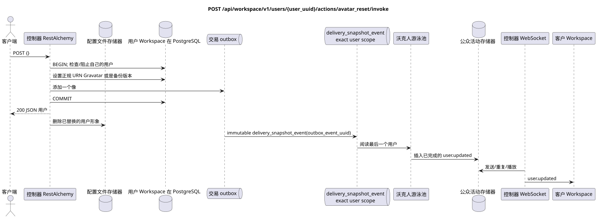

# `POST /api/workspace/v1/users/{user_uuid}/actions/avatar_reset/invoke`


总目标可靠性变量:每个 immutable outbox 事件都会产生一个唯一的 immutable typed task `outbox_event_uuid`;并无 coalescing. Task 存储实际的 exact scope key,使用 lease/fencing, retry/backoff, max attempts/DLQ, reaper 和 idempotent effect guard. Topic scope 仅适用于 placement/message-binding work; shared rows 不会在 topic.

[← 文件的主要索引](../../../../index.md) · [序列图表的索引](../../README.md) · [内容和用户分区 Workspace](../README.md)

状态:在文件中首先开发的操作目标规格. 现行公开合同
没有变化,是 [`workspace_api.md`](../../../../workspace_api.md).
这个文件描述了交易和投影的目标边界;它不是
产品代码,迁移 SQL 或新终点.



[可编辑的源 PlantUML](diagrams/post_user_avatar_reset.puml)

## 任命和公开合同

将认证用户的冒充转移到可靠的 URN Gravatar 或备份.

认证:持有者IAM;`project_id`和当前`user_uuid`代币从文本中取出 IAM.

## 查询路径和参数

| 位置 | 姓名 | 类型 / 规则 |
| --- | --- | --- |
| 路径 | `user_uuid` | 必须与 UUID 认证用户相匹配 |

集合页面,如果它是,将保留当前的合同 `page_limit` 和 UUID
`page_marker` 返回 `X-Pagination-Limit`,以及
`X-Pagination-Marker` 只要下一个页面.

## 查询的本体

```json
{}
```

## 成功的答案

`200`

```json
{
  "uuid": "11111111-1111-1111-1111-111111111111",
  "username": "admin",
  "source": "iam",
  "status": "active",
  "status_emoji": "coffee",
  "status_text": "Focusing",
  "first_name": "Workspace",
  "last_name": "Administrator",
  "email": "admin@example.com",
  "avatar": "urn:gravatar:0123456789abcdef0123456789abcdef",
  "last_ping_at": "2026-07-17T08:00:00Z",
  "created_at": "2026-07-01T08:00:00Z",
  "updated_at": "2026-07-17T08:01:00Z"
}
```


## 错误和授权

仅接受自己的UUID. 体是空的JSON对象; IAM/验证错误由共同边界处理.

验证错误时的答案的一般形式:

```json
{
  "type": "ValidationErrorException",
  "code": 400,
  "message": "Validation error occurred."
}
```

## 目标边界 RestAlchemy

```python
from restalchemy.api import controllers as ra_controllers
from restalchemy.api import resources as ra_resources
from restalchemy.dm import models
from restalchemy.dm import properties
from restalchemy.dm import types
from restalchemy.storage.sql import orm


class WorkspaceUser(models.ModelWithUUID, models.ModelWithTimestamp,
                    orm.SQLStorableMixin):
    __tablename__ = "messenger_users"
    username = properties.property(types.String(min_length=1, max_length=128), required=True)
    source = properties.property(types.Enum(["iam", "zulip"]), default="iam")
    status = properties.property(types.Enum(["active", "idle", "offline", "do_not_disturb"]))
    status_emoji = properties.property(types.AllowNone(types.String(max_length=64)))
    status_text = properties.property(types.AllowNone(types.String(max_length=256)))
    avatar = properties.property(types.String(max_length=2048), required=True)


class WorkspaceUserController(ra_controllers.BaseResourceControllerPaginated):
    __resource__ = ra_resources.ResourceByRAModel(
        model_class=WorkspaceUser,
        convert_underscore=False,
        process_filters=True,
    )
    # Narrow own-user IAM refresh and presence/avatar actions preserve the API.
```

每个对实体的公共引用都被声明为 RestAlchemy 的标数 UUID 属性,而不是 `relationship` (它将被串行为 URI).相应的物理列 `*_uuid` 一个具有明显选择的引用操作的索引外部密钥.因此,公共 JSON 保持UUID 不变.

`WorkspaceUser` — 唯一的实体. 提供商公开的 UUID 类链接仍然是提供商清理容器中的标字段; 物理链接是 FK 索引. 属于 IAM 的身份字段仅可用于浏览器查询..

## 同步路径 API

1. 检查自己的UUID并计算可规的URN Gravatar或备份.
2. 仅关闭用户并更新 `avatar`.
3. 添加一个不变的转载记录到Outbox.
4. 记录交易并返回用户.
5. 更新链接后将更换的用户形象从存储器中删除.

## Outbox, 典型任务,工作和实时工作

用户完成的截图遵循固定的定制状态;旧字节可以稍后清除,但公众访问它们立即消失.

单独的 immutable `delivery_snapshot_event` 读到
并且以原子式方式创建已准备的记录.
`user.updated` 通过 `outbox_event_uuid` 进行效果保护.
管理员发送,重复或播放它们; WebSocket-
没有连接.

## 性,关键和比赛

重复转载的方法是相同的可规性URN.用户行被封锁,无法让转载/下载比赛创建混合链接;最终的像决定了交易的顺序.

## 客户端可见时刻

现有客户端立即获得更新的正规用户.其他客户端在接受投影/管理延迟后获得全图`user.updated`..

[← 文件的主要索引](../../../../index.md) · [序列图表的索引](../../README.md) · [内容和用户分区 Workspace](../README.md)
