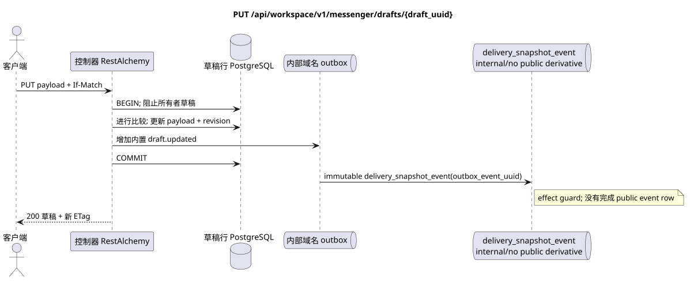

# `PUT /api/workspace/v1/messenger/drafts/{draft_uuid}`


总目标可靠性变量:每个 immutable outbox 事件都会产生一个唯一的 immutable typed task `outbox_event_uuid`;并无 coalescing. Task 存储实际的 exact scope key,使用 lease/fencing, retry/backoff, max attempts/DLQ, reaper 和 idempotent effect guard. Topic scope 仅适用于 placement/message-binding work; shared rows 不会在 topic.

[← 文件的主要索引](../../../../index.md) · [序列图表的索引](../../README.md) · [内容和用户分区 Workspace](../README.md)

状态:在文件中首先开发的操作目标规格. 现行公开合同
没有变化,是 [`workspace_api.md`](../../../../workspace_api.md).
这个文件描述了交易和投影的目标边界;它不是
产品代码,迁移 SQL 或新终点.



[可编辑的源 PlantUML](diagrams/put_draft_update.puml)

## 任命和公开合同

仅用优化竞争取代所有者稿的Markdown值.

认证:持有者IAM;`project_id`和当前`user_uuid`代币从文本中取出 IAM.

## 查询路径和参数

| 位置 | 姓名 | 类型 / 规则 |
| --- | --- | --- |
| 路径 | `draft_uuid` | UUID |
| 标题 | `If-Match` | 必须进行严格的审核,例如 `"1"` |

集合页面,如果它是,将保留当前的合同 `page_limit` 和 UUID
`page_marker` 返回 `X-Pagination-Limit`,以及
`X-Pagination-Marker` 只要下一个页面.

## 查询的本体

```json
{
  "payload": {
    "kind": "markdown",
    "content": "Updated draft message"
  }
}
```

## 成功的答案

`200`

```json
{
  "uuid": "ca14d274-0057-4a9a-a34b-fb1174be6a17",
  "project_id": "22222222-2222-2222-2222-222222222222",
  "user_uuid": "11111111-1111-1111-1111-111111111111",
  "stream_uuid": "75309057-419c-4b12-a7c1-3932429ec4a6",
  "topic_uuid": "4ec0b996-b778-45f8-8ef4-ef863be0c047",
  "payload": {
    "kind": "markdown",
    "content": "Updated draft message"
  },
  "revision": 2,
  "created_at": "2026-07-17T08:00:00Z",
  "updated_at": "2026-07-17T08:01:00Z"
}
```

答案标题: `ETag: "2"`.

## 错误和授权

仅接受`payload`.缺少`If-Match`返回`428`.错误/过时的修改返回`412`,当前的草图图片和ETag.错误的实用负载`payload`返回`400`;无法找到的草图返回.

验证错误时的答案的一般形式:

```json
{
  "type": "ValidationErrorException",
  "code": 400,
  "message": "Validation error occurred."
}
```

## 目标边界 RestAlchemy

```python
from restalchemy.api import controllers as ra_controllers
from restalchemy.api import resources as ra_resources
from restalchemy.dm import models
from restalchemy.dm import properties
from restalchemy.dm import types
from restalchemy.storage.sql import orm


class WorkspaceDraft(models.ModelWithUUID, models.ModelWithProject,
                     models.ModelWithTimestamp, orm.SQLStorableMixin):
    # Contract boundary only; target physical naming/decomposition is not selected.
    __tablename__ = "m_workspace_drafts"
    user_uuid = properties.property(types.UUID(), required=True, read_only=True)
    stream_uuid = properties.property(types.UUID(), required=True, read_only=True)
    topic_uuid = properties.property(types.UUID(), required=True, read_only=True)
    payload = properties.property(types.Dict(), required=True)
    revision = properties.property(types.Integer(min_value=1), read_only=True)


class WorkspaceDraftController(ra_controllers.BaseResourceControllerPaginated):
    __resource__ = ra_resources.ResourceByRAModel(
        model_class=WorkspaceDraft,
        convert_underscore=False,
        process_filters=True,
    )
    # Narrow overrides preserve owner scope, keyset marker, ETag and If-Match.
```

每个对实体的公共引用都被声明为 RestAlchemy 的标数 UUID 属性,而不是 `relationship` (它将被串行为 URI).相应的物理列 `*_uuid` 一个具有明显选择的引用操作的索引外部密钥.因此,公共 JSON 保持UUID 不变.

目标内部模型的草稿是故意不被处理的. 广告固定了不变的尺度边界UUID/ETag. 物理UUID用户/流/主题列仍然是FK的索引,与当前合同的 Cascading行为;关系RestAlchemy不应该改变公开的 UUID JSON.

## 同步路径 API

1. 查找精确的值 `If-Match`.
2. 封锁所有者稿件并进行比较 `revision`.
3. 仅替换`payload`,放大`revision`,更新时间标签.
4. 在Outbox中添加一个内置的不变域名条目.
5. 记录交易并返回新行/ETag.

## Outbox, 典型任务,工作和实时工作

没有计划投放消息或计时器.

内部 immutable 输出箱事件输出一个 `delivery_snapshot_event`,
并且完成了;
已准备的 Workspace事件行和 WebSocket 交付未创建.

## 性,关键和比赛

修改的比较和更新防止更新丢失.重复老旧的 ETag 得到 `412`,不能重写更新的内容.

## 客户端可见时刻

发起客户端立即看到固定的草稿.其他客户端只会在重新启动或明显再次请求草稿后看到;最终没有一致的更新.

[← 文件的主要索引](../../../../index.md) · [序列图表的索引](../../README.md) · [内容和用户分区 Workspace](../README.md)
