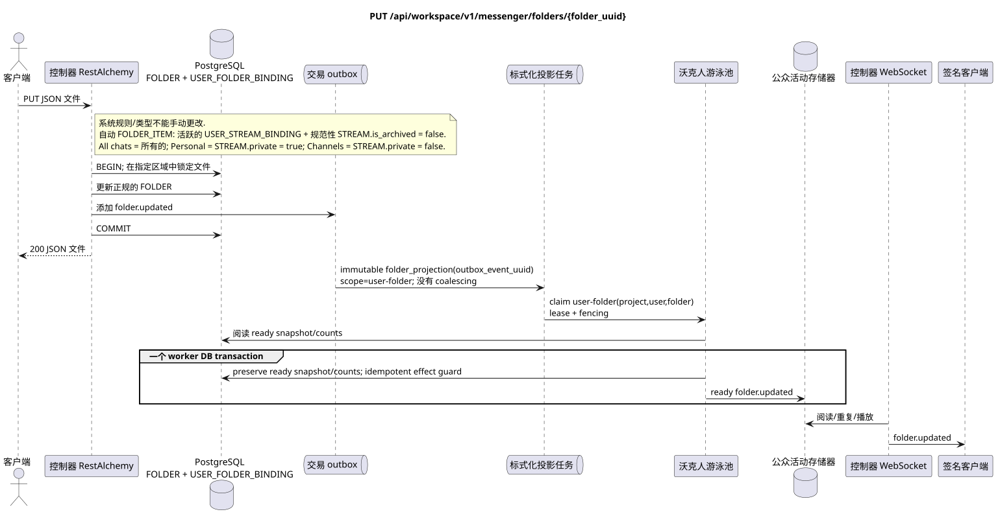

# `PUT /api/workspace/v1/messenger/folders/{folder_uuid}`

[← 文件的主要索引](../../../../index.md) · [序列图表的索引](../../README.md) · [内容和用户分区 Workspace](../README.md)

状态:在文件中首先开发的操作目标规格. 现行公开合同
没有变化,是 [`workspace_api.md`](../../../../workspace_api.md).
这个文件描述了交易和投影的目标边界;它不是
产品代码,迁移 SQL 或新终点.



[可编辑的源 PlantUML](diagrams/put_folder_update.puml)

## 任命和公开合同

更新当前用户的 `title` 和 `color` 文件.

认证:持有者IAM;`project_id`和当前`user_uuid`代币从文本中取出 IAM.

## 查询路径和参数

| 位置 | 姓名 | 类型 / 规则 |
| --- | --- | --- |
| 路径 | `folder_uuid` | UUID |

集合页面,如果它是,将保留当前的合同 `page_limit` 和 UUID
`page_marker` 返回 `X-Pagination-Limit`,以及
`X-Pagination-Marker` 只要下一个页面.

## 查询的本体

```json
{
  "title": "Archive",
  "background_color_value": 4289352960
}
```

## 成功的答案

`200`

```json
{
  "uuid": "50ecadd0-9823-4d97-b54c-806cc672c210",
  "title": "Archive",
  "background_color_value": 4289352960,
  "unread_count": 3,
  "system_type": "created",
  "folder_items": [
    {
      "uuid": "9f41b1a7-77f9-4c12-bdc6-d3cebc5dbf50",
      "project_id": "22222222-2222-2222-2222-222222222222",
      "folder_uuid": "50ecadd0-9823-4d97-b54c-806cc672c210",
      "user_uuid": "11111111-1111-1111-1111-111111111111",
      "stream_uuid": "75309057-419c-4b12-a7c1-3932429ec4a6",
      "chat_type": "stream",
      "order_index": 10,
      "pinned_at": null,
      "unread_count": 3,
      "active_unread_count": 3,
      "passive_unread_count": 0,
      "created_at": "2026-06-22T09:30:00Z",
      "updated_at": "2026-06-22T09:30:00Z"
    }
  ],
  "created_at": "2026-06-22T09:30:00Z",
  "updated_at": "2026-06-22T09:31:00Z"
}
```


## 错误和授权

不正确或未授权的输入数据由RESTAlchemy/IAM的错误界面处理; 给定的区域中的资源不会在用户/项目之外被披露.

验证错误时的答案的一般形式:

```json
{
  "type": "ValidationErrorException",
  "code": 400,
  "message": "Validation error occurred."
}
```

## 目标边界 RestAlchemy

```python
from restalchemy.api import controllers as ra_controllers
from restalchemy.api import resources as ra_resources
from restalchemy.dm import models
from restalchemy.dm import properties
from restalchemy.dm import types
from restalchemy.storage.sql import orm


class WorkspaceFolder(models.ModelWithUUID, models.ModelWithProject,
                      models.ModelWithTimestamp, orm.SQLStorableMixin):
    __tablename__ = "messenger_folders"
    title = properties.property(types.String(min_length=1, max_length=64), required=True)
    background_color_value = properties.property(types.AllowNone(types.Integer()))


class WorkspaceUserFolderBinding(models.ModelWithUUID, models.ModelWithProject,
                                 models.ModelWithTimestamp, orm.SQLStorableMixin):
    __tablename__ = "messenger_user_folder_bindings"
    # Public UUID links are scalar UUID properties, never URI relationships.
    user_uuid = properties.property(types.UUID(), required=True, read_only=True)
    folder_uuid = properties.property(types.UUID(), required=True, read_only=True)
    unread_count = properties.property(types.Integer(min_value=0), default=0, read_only=True)
    mention_count = properties.property(types.Integer(min_value=0), default=0, read_only=True)
    folder_items_snapshot = properties.property(types.List(), default=list, read_only=True)
    folder_items_snapshot_version = properties.property(types.Integer(min_value=0), default=0, read_only=True)
    folder_items_snapshot_updated_at = properties.property(types.AllowNone(types.UTCDateTimeZ()), read_only=True)
    BUSINESS_KEY = ("project_id", "user_uuid", "folder_uuid")


class WorkspaceUserFolder(models.ModelWithTimestamp, orm.SQLStorableMixin):
    __tablename__ = "messenger_api_user_folders_v1"
    binding_uuid = properties.property(types.UUID(), id_property=True, read_only=True)
    uuid = properties.property(types.UUID(), read_only=True)
    title = properties.property(types.String(min_length=1, max_length=64))
    background_color_value = properties.property(types.AllowNone(types.Integer()))
    unread_count = properties.property(types.Integer(min_value=0), read_only=True)
    system_type = properties.property(types.AllowNone(types.Enum(["all", "created"])), read_only=True)
    folder_items = properties.property(types.List(), read_only=True)


class FolderController(ra_controllers.BaseResourceControllerPaginated):
    __resource__ = ra_resources.ResourceByRAModel(
        model_class=WorkspaceUserFolder,
        hidden_fields=["binding_uuid", "project_id", "user_uuid"],
        convert_underscore=False,
        process_filters=True,
    )
```

每个对实体的公共引用都被声明为 RestAlchemy 的标数 UUID 属性,而不是 `relationship` (它将被串行为 URI).相应的物理列 `*_uuid` 一个具有明显选择的引用操作的索引外部密钥.因此,公共 JSON 保持UUID 不变.

公共 `folder_items` 直接显示仅读 JSONB `WorkspaceUserFolderBinding.folder_items_snapshot`;它不会被 canonical `FOLDER` 更新请求改变.资源读取一个索引行,没有N+1,`json_agg`,`COUNT`和 custom SQL;正常化的 `FOLDER_ITEM` 仍然存在 source of truth.

变更 `title`/`color` 属于用户规范 `FOLDER`.
规则/系统类型`USER_FOLDER_BINDING` 已固定的,不能改变
它们是手动的,是自动的.`FOLDER_ITEM`仍然是维克支持的
恢复的投影从活跃`USER_STREAM_BINDING`和正规
`STREAM` 没有`is_archived = false`: `All chats`包含所有这样的
提供流量,`Personal`只有来自
`STREAM.private = true`, `Channels` («道) 只有
`STREAM.private = false`. 这项操作不改变这些规则,也不增加
公共行为.

## 同步路径 API

1. 通过当前用户文件的唯一绑定找到`folder_uuid`.
2. 检查可更改的字段.
3. 更新规范 `FOLDER`.
4. 添加一个不可更改的域名到Outbox `folder.updated`.
5. 记录交易并将读取视图返回给定的区域.

## Outbox, 典型任务,工作和实时工作

没有一个未读数器会同时计算. 已准备的绑定值会被保存..

固定事件输出 immutable `folder_projection` 没有 coalescing,
具有精确的范围 `user-folder:(project_id,user_uuid,folder_uuid)` 和独特的
`outbox_event_uuid`. 收购者没有重新组装,但阅读了
图片/计数器,并且在一个 worker DB 交易只记录 ready
`folder.updated` 控制器只能在 commit;
retry/backoff, DLQ/reaper 必须.

## 性,关键和比赛

用户/项目区域防止用户之间更新.竞争更新将在文件的正规行上进行序列化;返回最近固定的可更改值.

## 客户端可见时刻

答案 REST 反映了文件的同步变化.其他客户端将在有限的投影延迟后看到相关的现成事件,最终一致.

[← 文件的主要索引](../../../../index.md) · [序列图表的索引](../../README.md) · [内容和用户分区 Workspace](../README.md)
