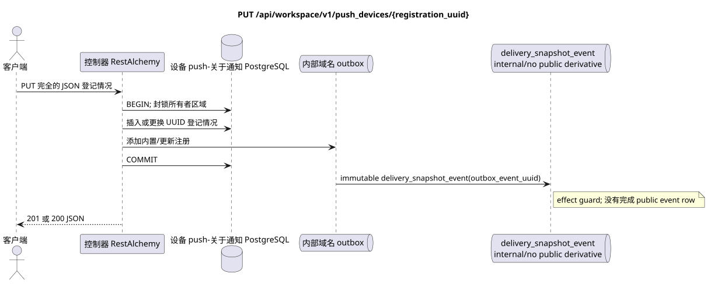

# `PUT /api/workspace/v1/push_devices/{registration_uuid}`


总目标可靠性变量:每个 immutable outbox 事件都会产生一个唯一的 immutable typed task `outbox_event_uuid`;并无 coalescing. Task 存储实际的 exact scope key,使用 lease/fencing, retry/backoff, max attempts/DLQ, reaper 和 idempotent effect guard. Topic scope 仅适用于 placement/message-binding work; shared rows 不会在 topic.

[← 文件的主要索引](../../../../index.md) · [序列图表的索引](../../README.md) · [内容和用户分区 Workspace](../README.md)

状态:在文件中首先开发的操作目标规格. 现行公开合同
没有变化,是 [`workspace_api.md`](../../../../workspace_api.md).
这个文件描述了交易和投影的目标边界;它不是
产品代码,迁移 SQL 或新终点.



[可编辑的源 PlantUML](diagrams/put_push_device.puml)

## 任命和公开合同

能够注册或更换新安装 token/encryption key.

认证:持有者IAM;`project_id`和当前`user_uuid`代币从文本中取出 IAM.

## 查询路径和参数

| 位置 | 姓名 | 类型 / 规则 |
| --- | --- | --- |
| 路径 | `registration_uuid` | 客户端创建的稳定的 UUID 安装 |

集合页面,如果它是,将保留当前的合同 `page_limit` 和 UUID
`page_marker` 返回 `X-Pagination-Limit`,以及
`X-Pagination-Marker` 只要下一个页面.

## 查询的本体

```json
{
  "transport": "fcm",
  "platform": "ios",
  "registration_token": "<FCM registration token>",
  "encryption": {
    "kind": "HPKE",
    "algorithm": "HPKE-v1-BASE-X25519-HKDF-SHA256-AES-256-GCM",
    "key_uuid": "248305f4-ecdf-4206-8e93-95f830ea8ad6",
    "public_key": "<unpadded base64url X25519 public key>"
  }
}
```

## 成功的答案

`201` 在第一次登记时, `200` 在更换时`

```json
{
  "uuid": "7c1af344-95e1-487e-8b51-d1af0370cdb5",
  "transport": "fcm",
  "platform": "ios",
  "encryption": {
    "kind": "HPKE",
    "algorithm": "HPKE-v1-BASE-X25519-HKDF-SHA256-AES-256-GCM",
    "key_uuid": "248305f4-ecdf-4206-8e93-95f830ea8ad6",
    "public_key": "<unpadded base64url X25519 public key>"
  },
  "user_uuid": "11111111-1111-1111-1111-111111111111",
  "project_id": "22222222-2222-2222-2222-222222222222",
  "registration_token": "<FCM registration token>",
  "created_at": "2026-07-26T05:30:00Z",
  "updated_at": "2026-07-26T05:40:00Z"
}
```


## 错误和授权

仅接受`fcm`,平台`android|ios`,固定的算法HPKE和可规的43符公开密钥X25519在base64url中,没有补充. UUID其他用户/项目返回未找到.

验证错误时的答案的一般形式:

```json
{
  "type": "ValidationErrorException",
  "code": 400,
  "message": "Validation error occurred."
}
```

## 目标边界 RestAlchemy

```python
from restalchemy.api import controllers as ra_controllers
from restalchemy.api import resources as ra_resources
from restalchemy.dm import models
from restalchemy.dm import properties
from restalchemy.dm import types
from restalchemy.storage.sql import orm


class PushDevice(models.ModelWithUUID, models.ModelWithProject,
                 models.ModelWithTimestamp, orm.SQLStorableMixin):
    __tablename__ = "m_workspace_push_devices"
    user_uuid = properties.property(types.UUID(), required=True, read_only=True)
    transport = properties.property(types.Enum(["fcm"]), required=True)
    platform = properties.property(types.Enum(["android", "ios"]), required=True)
    registration_token = properties.property(types.String(max_length=4096), required=True)
    encryption = properties.property(types.Dict(), required=True)


class PushDeviceController(ra_controllers.BaseResourceController):
    __resource__ = ra_resources.ResourceByRAModel(model_class=PushDevice)
    # Narrow PUT upsert and idempotent DELETE overrides preserve owner scope.
```

每个对实体的公共引用都被声明为 RestAlchemy 的标数 UUID 属性,而不是 `relationship` (它将被串行为 URI).相应的物理列 `*_uuid` 一个具有明显选择的引用操作的索引外部密钥.因此,公共 JSON 保持UUID 不变.

控制推送通知的注册是对Messenger实体进行处理的. UUID设置资源密钥. `user_uuid`和`project_id` 服务器的标数UUID字段,支持区域索引列;加密使用现有模型 `kind` HPKE.

## 同步路径 API

1. 定义用户和项目在 IAM 并锁定用户区域.
2. 检查更换的全部体.
3. 如果没有,则插入 UUID;否则要求匹配所有者区域并替换 `token`/`platform`/`encryption`.
4. 在Outbox中添加一个内置的不变域名注册条目,没有公开的衍生.
5. 记录交易并返回 `201` 或 `200`.

## Outbox, 典型任务,工作和实时工作

投影 Messenger 和事件 WebSocket 不会被创建.

现在的合同只管理注册. immutable
outbox-事件产生一个 `delivery_snapshot_event`,它是dimpotent的
记录了公开的衍生词的缺失,并完成; Workspace event row
没有WebSocket发送无法创建.
在这个终点之外.

## 性,关键和比赛

`registration_uuid` — 复制同一个物体,就会产生同样的存储记录,.

## 客户端可见时刻

登录变更可以看到到返回 HTTP 时. 没有公开 WebSocket 事件.

[← 文件的主要索引](../../../../index.md) · [序列图表的索引](../../README.md) · [内容和用户分区 Workspace](../README.md)
