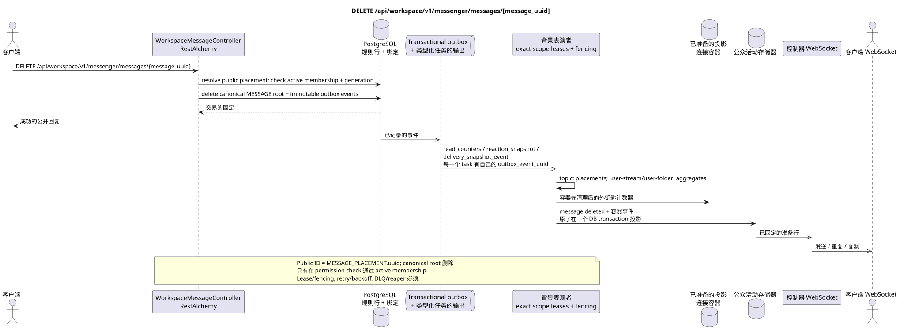

# DELETE /api/workspace/v1/messenger/messages/{message_uuid}

[← 文件的主要索引](../../../../index.md) · [序列图表的索引](../../README.md) · [部分 Core Messenger](../README.md)

## 现有合同的地位和边界

目标规范是docs-first. 方法,路径,公开JSON和授权遵循当前的合同 [`workspace_api.md`](../../../../workspace_api.md); bounded pagination 并且异步可视性是单独的 target compatibility ADR.



可编辑的源: [`delete_message.puml`](diagrams/delete_message.puml).

## 操作

**方法和方式:** `DELETE /api/workspace/v1/messenger/messages/{message_uuid}`

**目的:** 永久删除规范信息和相关行.

## 公开查询

没有身体 JSON.

## 成功的公众回应

HTTP `204`; 没有一个.

## 公众错误

需要 bearer-token IAM 和项目域. 错误的 UUID 或请求体返回 HTTP `400`;该区域缺少或无法访问的资源 `404`. 标准的文档化验证错误体:

```json
{
  "type": "ValidationErrorException",
  "code": 400,
  "message": "Validation error occurred."
}
```

## 目标边界 RestAlchemy

```python
from restalchemy.api import controllers
from restalchemy.api import resources
from restalchemy.dm import models
from restalchemy.dm import properties
from restalchemy.dm import types
from restalchemy.storage.sql import orm


class WorkspaceUserMessage(models.ModelWithProject, orm.SQLStorableMixin):
    __tablename__ = "messenger_api_user_messages_v1"

    binding_uuid = properties.property(types.UUID(), id_property=True)
    uuid = properties.property(types.UUID(), read_only=True)
    stream_uuid = properties.property(types.UUID(), read_only=True)
    topic_uuid = properties.property(types.UUID(), read_only=True)
    author_uuid = properties.property(types.UUID(), read_only=True)
    user_uuid = properties.property(types.UUID(), read_only=True)


class WorkspaceMessageController(controllers.BaseResourceControllerPaginated):
    __resource__ = resources.ResourceByRAModel(
        WorkspaceUserMessage, convert_underscore=False, process_filters=True,
    )
```

公开 `uuid` 和路由标识符等于 `MESSAGE_PLACEMENT.uuid = UUIDv5(namespace=TOPIC.uuid, name=MESSAGE.uuid)`;名字   标签加 UUID. 规范 `MESSAGE.uuid` 内置; `binding_uuid` 隐藏. 控制器允许放置并同步检查 active membership 加上 generation canonical delete.

## 同步交易

1. 允许访问和验证作者权限.
2. 删除根 MESSAGE;外部键可以清除依赖.
3. 在具有公开ID的交易输出箱中添加不可更改的墓碑.

影响状态: MESSAGE,位置,用户绑定/状态,反应和 transactional outbox.

## 类型化任务和后台执行器

任务: `read_counters`, `reaction_snapshot` 和 `delivery_snapshot_event`.

Topic-scoped workers 处理删除的投放, fenced owners
`user-stream`/`user-topic`/`user-folder` 更新了所有共享计数器.
outbox event 有一个独立的 immutable task; topic worker 不会 unsafe
read-modify-write shared rows. Lease/retry/DLQ/reaper 并且是对
`outbox_event_uuid` 必须.

## 公共活动和 WebSocket

`message.deleted` 并且受影响的主题/流程行,.

## 具有能力,种族和可见的时间特征

清理是原子式的,重复的墓碑记录是无效的..

[← 文件的主要索引](../../../../index.md) · [序列图表的索引](../../README.md) · [部分 Core Messenger](../README.md)
