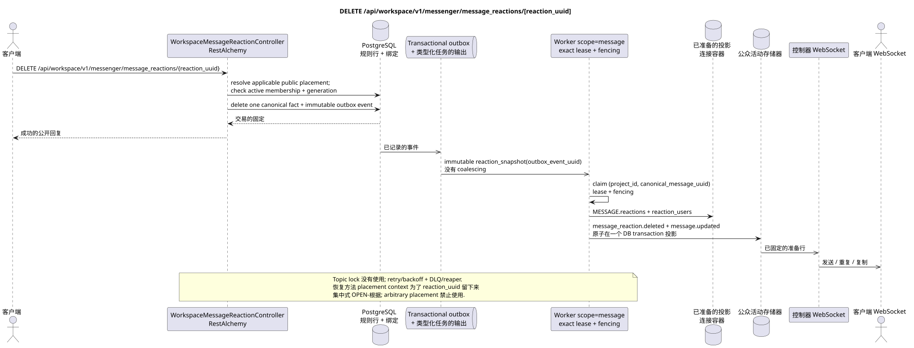

# DELETE /api/workspace/v1/messenger/message_reactions/{reaction_uuid}

[← 文件的主要索引](../../../../index.md) · [序列图表的索引](../../README.md) · [部分 Core Messenger](../README.md)

## 现有合同的地位和边界

目标规范是docs-first. 方法,路径,公开JSON和授权遵循当前的合同 [`workspace_api.md`](../../../../workspace_api.md); bounded pagination 并且异步可视性是单独的 target compatibility ADR.



可编辑的源: [`delete_message_reaction.puml`](diagrams/delete_message_reaction.puml).

## 操作

**方法和方式:** `DELETE /api/workspace/v1/messenger/message_reactions/{reaction_uuid}`

**目的:** 删除当前用户的反应.

## 公开查询

没有身体 JSON.

## 成功的公众回应

HTTP `204`; 没有一个.

## 公众错误

需要 bearer-token IAM 和项目域. 错误的 UUID 或请求体返回 HTTP `400`;该区域缺少或无法访问的资源 `404`. 标准的文档化验证错误体:

```json
{
  "type": "ValidationErrorException",
  "code": 400,
  "message": "Validation error occurred."
}
```

## 目标边界 RestAlchemy

```python
from restalchemy.api import controllers
from restalchemy.api import resources
from restalchemy.dm import models
from restalchemy.dm import properties
from restalchemy.dm import types
from restalchemy.storage.sql import orm


class WorkspaceMessageReactionView(
    models.ModelWithUUID,
    models.ModelWithProject,
    orm.SQLStorableMixin,
):
    __tablename__ = "messenger_api_message_reactions_v1"

    message_uuid = properties.property(types.UUID(), read_only=True)
    canonical_message_uuid = properties.property(types.UUID(), read_only=True)
    user_uuid = properties.property(types.UUID(), read_only=True)


class WorkspaceMessageReactionController(controllers.BaseResourceControllerPaginated):
    __resource__ = resources.ResourceByRAModel(
        WorkspaceMessageReactionView, convert_underscore=False, process_filters=True,
    )
```

公众 `message_uuid`  标杆式 UUID 放置;内部
`canonical_message_uuid` 隐藏了域权限.UUID根据第2条
物理链接仍然是FK索引,而
提供商/交付的原始元数据已关闭.

## 同步交易

1. 恢复用户所属的实例,适用公开 placement
   检查 active stream membership + matching generation.
2. 删除一个事实.
3. 在此程序中添加 immutable 删除事件 transactional outbox; derived task
   唯一的 `outbox_event_uuid`.

影响状态:反应的事实和 transactional outbox.

## 类型化任务和后台执行器

任务:单独的 immutable `reaction_snapshot`;并发没有.

Fenced owner scope `message` 通过其他数据重建图像; topic
lock 租到期,重试/backoff,DLQ和收获器提供
故障后恢复.

## 公共活动和 WebSocket

对于发起者来说, `message_reaction.deleted`,对于观察者来说, `message.updated`; 管理员提供了固定的行.

## 具有能力,种族和可见的时间特征

删除一个事实是原子的,需要积极的成员,
聚合的消息卡可能会在源事件 UUID 之后出现.
路径仅包含`reaction_uuid`:恢复它的方式是公开的
placement context 只有几个可见的位置,
OPEN-选择后, 任何一个人都被禁止. access check
事实和图片是故意的 canonical-message-global 并可在所有人看到 placements,
隐私权交易被认为是 Critic risk #8.

[← 文件的主要索引](../../../../index.md) · [序列图表的索引](../../README.md) · [部分 Core Messenger](../README.md)
