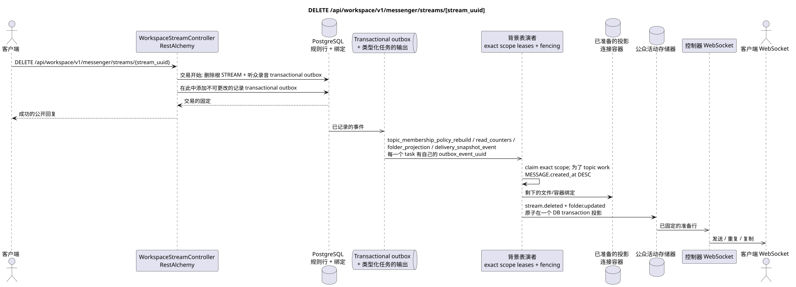

# DELETE /api/workspace/v1/messenger/streams/{stream_uuid}


总目标可靠性变量:每个 immutable outbox 事件都会产生一个唯一的 immutable typed task `outbox_event_uuid`;并无 coalescing. Task 存储实际的 exact scope key,使用 lease/fencing, retry/backoff, max attempts/DLQ, reaper 和 idempotent effect guard. Topic scope 仅适用于 placement/message-binding work; shared rows 不会在 topic.

[← 文件的主要索引](../../../../index.md) · [序列图表的索引](../../README.md) · [部分 Core Messenger](../README.md)

## 现有合同的地位和边界

目标规范是docs-first. 方法,路径,公开JSON和授权遵循当前的合同 [`workspace_api.md`](../../../../workspace_api.md); bounded pagination 并且异步可视性是单独的 target compatibility ADR.



可编辑的源: [`delete_stream.puml`](diagrams/delete_stream.puml).

## 操作

**方法和方式:** `DELETE /api/workspace/v1/messenger/streams/{stream_uuid}`

**目的:** 删除所有用户的正规流.

## 公开查询

没有身体 JSON.

## 成功的公众回应

HTTP `204`; 没有一个.

## 公众错误

需要 bearer-token IAM 和项目域. 错误的 UUID 或请求体返回 HTTP `400`;该区域缺少或无法访问的资源 `404`. 标准的文档化验证错误体:

```json
{
  "type": "ValidationErrorException",
  "code": 400,
  "message": "Validation error occurred."
}
```

删除流量本身会产生 `400`.

## 目标边界 RestAlchemy

```python
from restalchemy.api import controllers
from restalchemy.api import resources
from restalchemy.dm import models
from restalchemy.dm import properties
from restalchemy.dm import types
from restalchemy.storage.sql import orm


class WorkspaceUserStream(
    models.ModelWithUUID,
    models.ModelWithProject,
    orm.SQLStorableMixin,
):
    __tablename__ = "messenger_api_user_streams_v1"

    owner = properties.property(types.UUID(), read_only=True)
    user_uuid = properties.property(types.UUID(), read_only=True)
    direct_user_uuid = properties.property(
        types.AllowNone(types.UUID()), default=None, read_only=True,
    )
    last_message_uuid = properties.property(types.UUID(), read_only=True)
    default_topic_uuid = properties.property(types.UUID(), read_only=True)


class WorkspaceStreamController(controllers.BaseResourceControllerPaginated):
    __resource__ = resources.ResourceByRAModel(
        WorkspaceUserStream, convert_underscore=False, process_filters=True,
    )
```

公开的实体引用是以 `types.UUID()` 标量属性,而不是以 RestAlchemy 关系为序列,它们是以 URI 序列的.物理列 `*_uuid` 仍然是具有明显选择的引用完整性操作的索引外部键.公开字段 `owner` 是 UUID 属性;物理字段 `owner_uuid`  是用户的索引外部键. USER_STREAM_BINDING 存储了已备用的流量级计数器..

## 同步交易

1. 允许和检查权限.
2. 删除 STREAM 选择的外部键清理.
3. 添加每个独立的immutable transactional outbox事件
   引出的 `topic_membership_policy_rebuild`, `read_counters`,
   `folder_projection` 其他 `delivery_snapshot_event` task.

影响状态:根 STREAM,主题,位置,容器绑定和 transactional outbox.

## 类型化任务和后台执行器

任务: 单独 `topic_membership_policy_rebuild`, `read_counters`,
`folder_projection` 和 `delivery_snapshot_event`,每个为自己的 source
outbox event.

背景执行器更新文件/容器状态和准备删除,而不需要搜索缺失的绑定.不同主题可以在可定制的限制范围内并行处理;在一个繁忙的主题内,可靠的消息以`MESSAGE.created_at DESC`优先,而较旧的工作也随着时间的推移而得到优先..

## 公共活动和 WebSocket

`stream.deleted` 受到影响的 `folder.updated`.

## 具有能力,种族和可见的时间特征

通过外部密钥进行清理是原子式的;重复处理观众的墓碑记录是安全的..

[← 文件的主要索引](../../../../index.md) · [序列图表的索引](../../README.md) · [部分 Core Messenger](../README.md)
