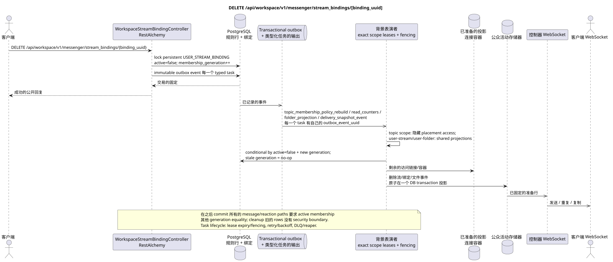

# DELETE /api/workspace/v1/messenger/stream_bindings/{binding_uuid}

[← 文件的主要索引](../../../../index.md) · [序列图表的索引](../../README.md) · [部分 Core Messenger](../README.md)

## 现有合同的地位和边界

目标规范是docs-first. 方法,路径,公开JSON和授权遵循当前的合同 [`workspace_api.md`](../../../../workspace_api.md); bounded pagination 并且异步可视性是单独的 target compatibility ADR.



可编辑的源: [`delete_stream_binding.puml`](diagrams/delete_stream_binding.puml).

## 操作

**方法和方式:** `DELETE /api/workspace/v1/messenger/stream_bindings/{binding_uuid}`

**目的:** 删除普通用户的流访问权限.

## 公开查询

没有身体 JSON.

## 成功的公众回应

HTTP `204`; 没有一个.

## 公众错误

需要 bearer-token IAM 和项目域. 错误的 UUID 或请求体返回 HTTP `400`;该区域缺少或无法访问的资源 `404`. 标准的文档化验证错误体:

```json
{
  "type": "ValidationErrorException",
  "code": 400,
  "message": "Validation error occurred."
}
```

删除直接流或流与自身的绑定, `400`.

## 目标边界 RestAlchemy

```python
from restalchemy.api import controllers
from restalchemy.api import resources
from restalchemy.dm import models
from restalchemy.dm import properties
from restalchemy.dm import types
from restalchemy.storage.sql import orm


class WorkspaceStreamBindingView(
    models.ModelWithUUID,
    models.ModelWithProject,
    orm.SQLStorableMixin,
):
    __tablename__ = "messenger_api_stream_bindings_v1"

    stream_uuid = properties.property(types.UUID(), read_only=True)
    user_uuid = properties.property(types.UUID(), read_only=True)
    who_uuid = properties.property(types.UUID(), read_only=True)


class WorkspaceStreamBindingController(controllers.BaseResourceControllerPaginated):
    __resource__ = resources.ResourceByRAModel(
        WorkspaceStreamBindingView, convert_underscore=False, process_filters=True,
    )
```

公开的实体引用是以 `types.UUID()` 标量属性,而不是以 RestAlchemy 关系为序列,这些关系在 URI 中进行序列化.物理列 `*_uuid` 仍然是具有明显选择的引用完整性操作的索引外部键. USER_STREAM_BINDING 独特于 `(project_id, stream_uuid, user_uuid)`,并且可以物理存储已完成的计数器,但其当前的公开 JSON 绑定没有改变.

## 同步交易

1. 通过锁定恢复和授权 persistent `USER_STREAM_BINDING`
   现在的行 membership lifecycle.
2. 没有删除字符串,原子设置`active = false`并增加
   一调一调 `membership_generation`.
3. 添加一个可变的交易Outbox事件与旧的观众和新的
   generation; 每个事件都应有一个单独的 typed task.

影响状态:访问流,主题和消息的绑定,以及交易式的出箱;可规的实体保留.

## 类型化任务和后台执行器

任务: 单独 immutable `topic_membership_policy_rebuild`,
`read_counters`, `folder_projection` 和 `delivery_snapshot_event`,每个是
自己的源 `outbox_event_uuid` 和 exact scope key.

在 commit 之后,每个 message GET/list/action/reaction 立即检查
`USER_STREAM_BINDING.active` 并且是这一代人,所以 stale message bindings/state
没有允许访问. Topic-scoped worker 可以异步隐藏/重组
placement bindings; user-stream/user-folder scope workers 更新 shared
没有使用 topic lock.
它们的安全边界是安全边界. lease/fencing,
retry/backoff, DLQ/reaper 并且通过 `outbox_event_uuid`.

## 公共活动和 WebSocket

删除被删除的用户的流,删除剩余用户的绑定和更新文件.

## 具有能力,种族和可见的时间特征

规范内容保留. `204`意味着会员已经
已关闭,提交后访问禁止;投影和事件异步. Stale
fan-out/history task 之前的世代做了无选择,不能复活
访问. Re-add 使用新一代和 fresh placement-scoped state.

[← 文件的主要索引](../../../../index.md) · [序列图表的索引](../../README.md) · [部分 Core Messenger](../README.md)
